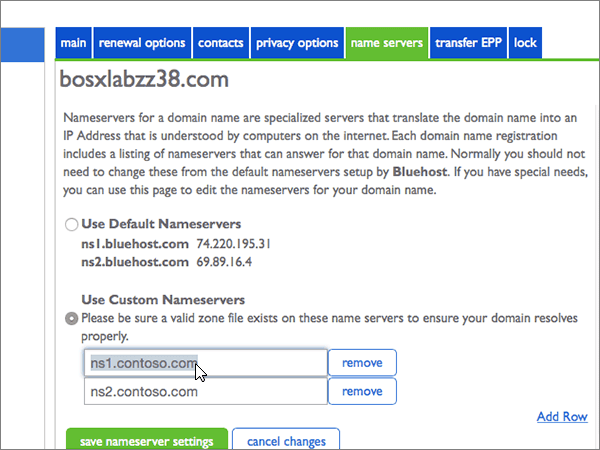

# Ändra namnservrar för att konfigurera Microsoft med Bluehost

 **[Läs frågor och svar om domäner](../setup/domains-faq.md)** om du inte hittar det du letar efter. 
  
Följ dessa instruktioner om du vill att Microsoft ska hantera dina DNS-poster åt dig. (Om du vill kan du [hantera alla DNS-poster på Bluehost](create-dns-records-at-bluehost.md).)
  
## Lägga till en TXT-post för verifiering

Innan du använder din domän med Microsoft, vill vi vara säkra på att det är du som äger den. Att du kan logga in på ditt konto hos domänregistratorn och skapa DNS-posten bevisar för Microsoft att du äger domänen.
  
> [!NOTE]
> Den här posten används endast för att verifiera att du äger domänen. Den påverkar ingenting annat. Du kan ta bort den senare om du vill. 
  
1. Kom igång genom att gå till domänsidan på Bluehost genom att klicka på [den här länken](https://my.bluehost.com/cgi/dm). Du uppmanas att logga in först.
    
2. Gå till sidan **domains** och området **domain**. Leta reda på raden för den domän du ändrar och markera kryssrutan för den domänen. 
    
    (Du kan behöva rulla nedåt.) 
    
3. Välj **Hantera DNS-poster**på raden **DNS Zone Editor** i området **domain_name** .
    
4. Gå till sidan **DNS Zone Editor** och området Add DNS Record. I den nya postens rutor skriver du in, eller kopierar och klistrar in värdena från följande tabell. 
    
    (Välj värdet för **Type** i listrutan.) 
    
|||||
|:-----|:-----|:-----|:-----|
|**Host Record**   |**TTL**   |**Type**   |**TXT Value**   |
|@    |14400    |TXT    |MS=ms *XXXXXXXX*   **Obs!** Det här är ett exempel. Använd ditt specifika **Mål eller pekar på adress ** värde här, från tabellen. [Hur hittar jag det här?](../get-help-with-domains/information-for-dns-records.md)   |

   
5. Välj **lägg till post**.
    
6. Vänta några minuter innan du fortsätter, så att den post som du nyss skapade kan uppdateras på Internet.
    
Nu när du har lagt till posten på domänregistratorerns webbplats går du tillbaka till Microsoft och begär en sökning efter posten.
  
När Microsoft hittar rätt TXT-post är din domän verifierad.
  
1. I Microsoft-administrationscentret går du till **Inställningar** \> <a href="https://go.microsoft.com/fwlink/p/?linkid=834818" target="_blank">Domäner</a>.

    
2. På sidan **Domains** väljer du den domän du verifierar. 
    
3. På sidan **Setup** väljer du **Start setup**.
    
4. På sidan **Verify domain** väljer du **Verify**.
    
> [!NOTE]
> Det brukar ta omkring 15 minuter för DNS-ändringarna att gå igenom. Ibland kan det dock ta längre tid att uppdatera DNS-systemet på Internet för en ändring som du har gjort. Om du stöter på problem med e-postflödet eller får andra problem när du har lagt till DNS-posterna, går du till [Hitta och åtgärda problem när du har lagt till din domän eller DNS-poster i Microsoft](../get-help-with-domains/find-and-fix-issues.md). 
  
## Ändra domänens namnserverposter (NS)

Om du vill slutföra inrättandet av domänen med Microsoft ändrar du domänens NS-poster på domänregistraren så att de pekar på de primära och sekundära namnservrarna. Detta ställer in Microsoft för att uppdatera domänens DNS-poster åt dig. Vi lägger till alla poster så att e-post, Skype för företag - Online och den offentliga webbplatsen fungerar med domänen så att du kan börja.
  
> [!CAUTION]
> När du ändrar domänens NS-poster så att de pekar på Microsofts namnservrar påverkas alla tjänster som för närvarande är associerade med domänen. Till exempel börjar all e-post som skickas till din domän (t.ex. *rob@ your_domain* .com) komma till Microsoft när du har gjort den här ändringen. 
  
> [!IMPORTANT]
>  Följande procedur visar hur du tar bort andra, oönskade namnservrar från listan, och hur du lägger till korrekta namnservrar om de inte redan finns i listan. >  När du har utfört stegen i det här avsnittet är de enda namnservrarna som bör finnas i listan dessa fyra: >  ns1.bdm.microsoftonline.com >  ns2.bdm.microsoftonline.com >  ns3.bdm.microsoftonline.com >  ns4.bdm.microsoftonline.com 
  
1. Kom igång genom att gå till domänsidan på Bluehost genom att klicka på [den här länken](https://my.bluehost.com/cgi/dm). Du uppmanas att logga in först.
    
2. Markera kryssrutan för domänen i **området domain_name** på **domänsidan** och välj sedan **namnservrar**.
    
    
  
3. Välj **Använd anpassade namnservrar**i området **domain_name** .
    
    
  
4. Beroende på om det redan finns namnservrar listade på sidan som visas nu, fortsätter du till en av följande procedurer:
    
  - Om **INGA** namnservrar visas [Om INGA namnservrar visas](#if-there-are-no-nameservers-already-listed).
    
  - Om det redan **FINNS** namnservrar listade [Om det redan FINNS namnservrar listade](#if-there-are-nameservers-already-listed).
    
### Om INGA namnservrar visas

1. I avsnittet **Use Custom Nameservers** skriver eller kopierar och klistrar du in värdena från följande tabell. 
    
|||
|:-----|:-----|
|**Första tomma raden**   |ns1.bdm.microsoftonline.com    |
|**Andra tomma raden**   |ns2.bdm.microsoftonline.com    |
   
   
  
2. Välj **Lägg till rad**.
    
    
  
3. I avsnittet **Use Custom Nameservers** skriver eller kopierar och klistrar du in värdena från den första raden i följande tabell på den nya, tomma raden. 
    
|||
|:-----|:-----|
|**Tredje tomma raden**   |ns3.bdm.microsoftonline.com    |
|**Fjärde tomma raden**   |ns4.bdm.microsoftonline.com    |
  
4. Om du vill lägga till den fjärde namnserverposten väljer du **Lägg till rad** igen och skapar en post med värdena från den sista raden i tabellen ovan. 
    
5. Välj **spara namnserverinställningar**.
    
    
  
> [!NOTE]
> Det kan ta flera timmar innan ändringarna har uppdaterats genom hela DNS-systemet på Internet. Då kommer din Microsoft-e-post och andra tjänster att vara inställda på att fungera med din domän. 
  
### Om det redan FINNS namnservrar listade

> [!CAUTION]
> Följ bara dessa steg om du har andra befintliga namnservrar än de fyra korrekta namnservrarna. (Det vill an, ta bara bort alla aktuella namnservrar som *inte* namnges **ns1.bdm.microsoftonline.com**, **ns2.bdm.microsoftonline.com**, **ns3.bdm.microsoftonline.com**eller **ns4.bdm.microsoftonline.com**.) 
  
1. Om det finns andra namnservrar tar du bort var och en av dem genom att markera den och sedan trycka på **Delete**-tangenten. 
    
    
  
2. I avsnittet **Use Custom Nameservers** skriver eller kopierar och klistrar du in värdena från följande tabell. 
    
|||
|:-----|:-----|
|**Första tomma raden**   |ns1.bdm.microsoftonline.com    |
|**Andra tomma raden**   |ns2.bdm.microsoftonline.com    |
   
   
  
3. Välj **Lägg till rad**.
    
    
  
4. I avsnittet **Use Custom Nameservers** skriver eller kopierar och klistrar du in värdena från den första raden i följande tabell på den nya, tomma raden. 
    
|||
|:-----|:-----|
|**Tredje tomma raden**   |ns3.bdm.microsoftonline.com    |
|**Fjärde tomma raden**   |ns4.bdm.microsoftonline.com    |
   
   
  
5. Om du vill lägga till den fjärde namnserverposten väljer du **Lägg till rad** igen och skapar en post med värdena från den sista raden i tabellen ovan. 
    
6. Välj **spara namnserverinställningar**.
    
    
  
> [!NOTE]
> Det kan ta flera timmar innan ändringarna har uppdaterats genom hela DNS-systemet på Internet. Då kommer din Microsoft-e-post och andra tjänster att vara inställda på att fungera med din domän. 
  
