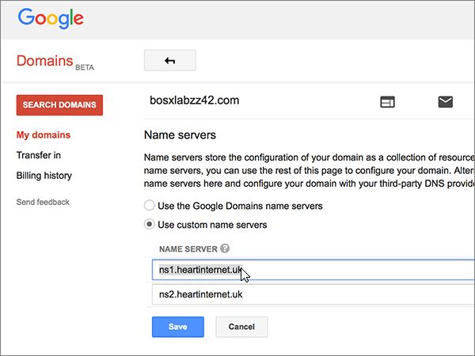

# Ändra namnservrar för att konfigurera Microsoft med Google DomainsChange nameservers to set up Microsoft with Google Domains

 **[Läs frågor och svar om domäner](../setup/domains-faq.yml)** om du inte hittar det du letar efter.**[Check the Domains FAQ](../setup/domains-faq.yml)** if you don't find what you're looking for. 
  
Följ de här anvisningarna om du vill att Microsoft ska hantera dina DNS-poster åt dig.Follow these instructions if you want Microsoft to manage your DNS records for you. (Om du vill kan du [hantera alla dina DNS-poster på Google Domains](create-dns-records-at-google-domains.md).)(If you prefer, you can [manage all your DNS records at Google Domains](create-dns-records-at-google-domains.md).)
  
    
## Lägga till en TXT-post för verifieringAdd a TXT record for verification

Innan du använder din domän med Microsoft, vill vi vara säkra på att det är du som äger den. Att du kan logga in på ditt konto hos domänregistratorn och skapa DNS-posten bevisar för Microsoft att du äger domänen.Before you use your domain with Microsoft, we have to make sure that you own it. Your ability to log in to your account at your domain registrar and create the DNS record proves to Microsoft that you own the domain.
  
> [!NOTE]
>  Den här posten används endast för att verifiera att du äger domänen. Den påverkar ingenting annat. Du kan ta bort den senare om du vill.This record is used only to verify that you own your domain; it doesn't affect anything else. You can delete it later, if you like. 
  
1. Gå till sidan Domains på Google Domains via [den här länken](https://domains.google.com/registrar)för att komma igång.To get started, go to your domains page at Google Domains via [this link](https://domains.google.com/registrar). Du uppmanas att logga in.You'll be prompted to sign in. Gör så här:To do so:
    
1. Välj **Logga in**.Select **Sign In**.
    
2. Ange dina inloggnings uppgifter och välj **Logga** in igen.Enter your login credentials and again select **Sign In**.
    
2. Välj **Konfigurera DNS** för den domän som du vill redigera i avsnittet **Domain** **på sidan** domains.On the **Domains** page, in the **Domain** section, select **Configure DNS** for the domain that you want to edit. 
    
3. Gå till avsnittet **Custom resource records**. I den nya postens rutor skriver du in, eller kopierar och klistrar in, värdena från följande tabell.In the **Custom resource records** section, in the boxes for the new record, type or copy and paste the values from the following table. 
    
    (Du kan behöva rulla nedåt.)(You may have to scroll down.)
    
    (Välj värdet för **Type** i listrutan.)(Choose the **Type** value from the drop-down list.) 
    
|||||
|:-----|:-----|:-----|:-----|
|**Name****Name**   |**Type (typ)****Type**   |**TTL****TTL**   |**Data****Data**   |
|@    |TXTTXT    |1H1H    |MS=ms *XXXXXXXX*MS=ms *XXXXXXXX*   **Obs!** Det här är ett exempel.**Note:** This is an example. Använd ditt specifika **Mål eller pekar på adress** värde här, från tabellen.Use your specific **Destination or Points to Address** value here, from the table. [Hur hittar jag det här?How do I find this?](../get-help-with-domains/information-for-dns-records.md)          |
   
4. Välj **Lägg till**.Select **Add**.
    
5. Vänta några minuter innan du fortsätter, så att den post som du nyss skapade kan uppdateras på Internet.Wait a few minutes before you continue, so that the record you just created can update across the Internet.
    
Nu när du har lagt till posten på domän registratorns webbplats kan du gå tillbaka till Microsoft och begära en sökning efter posten.Now that you've added the record at your domain registrar's site, you'll go back to Microsoft and request a search for the record.
  
När Microsoft hittar rätt TXT-post är din domän verifierad.When Microsoft finds the correct TXT record, your domain is verified.
  
1. I Microsoft-administrationscentret går du till **Inställningar** \> <a href="https://go.microsoft.com/fwlink/p/?linkid=834818" target="_blank">Domäner</a>.In the Microsoft admin center, go to the **Settings** \> <a href="https://go.microsoft.com/fwlink/p/?linkid=834818" target="_blank">Domains</a> page.

    
2. På sidan **Domains** väljer du den domän du verifierar.On the **Domains** page, select the domain that you are verifying. 
    
3. På sidan **Setup** väljer du **Start setup**.On the **Setup** page, select **Start setup**.
    
4. På sidan **Verify domain** väljer du **Verify**.On the **Verify domain** page, select **Verify**.
    
> [!NOTE]
> Det brukar ta omkring 15 minuter för DNS-ändringarna att gå igenom. Ibland kan det dock ta längre tid att uppdatera DNS-systemet på Internet för en ändring som du har gjort. Om du stöter på problem med e-postflödet eller får andra problem när du har lagt till DNS-posterna, går du till [Hitta och åtgärda problem när du har lagt till din domän eller DNS-poster i Microsoft](../get-help-with-domains/find-and-fix-issues.md).Typically it takes about 15 minutes for DNS changes to take effect. However, it can occasionally take longer for a change you've made to update across the Internet's DNS system. If you're having trouble with mail flow or other issues after adding DNS records, see [Find and fix issues after adding your domain or DNS records](../get-help-with-domains/find-and-fix-issues.md). 
  
## Ändra domänens namnserverposter (NS)Change your domain's nameserver (NS) records

För att slutföra konfigurationen av din domän med Microsoft ändrar du domänens NS-poster hos domän registratorn så att de pekar på Microsofts primära och sekundära namnservrar.To complete setting up your domain with Microsoft, you change your domain's NS records at your domain registrar to point to the Microsoft primary and secondary name servers. Detta konfigurerar Microsoft för att uppdatera domänens DNS-poster åt dig.This sets up Microsoft to update the domain's DNS records for you. Vi lägger till alla poster så att e-post, Skype för företag - Online och den offentliga webbplatsen fungerar med domänen så att du kan börja.We'll add all records so that email, Skype for Business Online, and your public website work with your domain, and you'll be all set.
  
> [!CAUTION]
> När du ändrar domänens NS-poster så att de pekar på Microsoft Name Server påverkas alla tjänster som är associerade till din domän.When you change your domain's NS records to point to the Microsoft name servers, all the services that are currently associated with your domain are affected. Till exempel, alla e-postmeddelanden som skickas till din domän (som rob@ *your_domain.*For example, all email sent to your domain (like rob@ *your_domain.*  com) kommer att komma till Microsoft när du har gjort den här ändringen.com) will start coming to Microsoft after you make this change. 
  
> [!IMPORTANT]
> Följande procedur visar hur du tar bort andra, oönskade namnservrar från listan, och hur du lägger till korrekta namnservrar om de inte redan finns i listan. > När du har utfört stegen i det här avsnittet är de enda namnservrarna som bör finnas i listan dessa fyra:The following procedure will show you how to delete any other, unwanted nameservers from the list, and also how to add the correct nameservers if they are not already in the list. > When you have completed the steps in this section, the only nameservers that should be listed are these four: 
  
1. Börja med att gå till domänsidan på Google Domains genom att klicka på [den här länken](https://domains.google.com/registrar). Du uppmanas att logga in. Gör så här:To get started, go to your domains page at Google Domains by using [this link](https://domains.google.com/registrar). You'll be prompted to sign in. To do so:
    
1. Välj **Logga in**.Select **Sign In**.
    
2. Ange dina inloggnings uppgifter och välj sedan **Logga** in igen.Enter your login credentials, and then again select **Sign In**.
    
2. Välj **Konfigurera DNS** för den domän som du vill redigera i avsnittet **Domain** **på sidan** domains.On the **Domains** page, in the **Domain** section, select **Configure DNS** for the domain that you want to edit. 
    
3. Välj **Use custom name servers** (använd anpassade namnservrar) i området **Name servers** (namnservrar) på sidan **Domains** (domäner).On the **Domains** page, in the **Name servers** section, select **Use custom name servers**.
    
    
  
4. Beroende på om det redan finns namnservrar listade på sidan som visas nu, fortsätter du till en av följande procedurer:Depending on whether or not there are already nameservers listed on the page that is displayed now, continue to one of the two following procedures:
    
  - Om **INGA** namnservrar visas [Om INGA namnservrar visas](#if-there-are-no-nameservers-already-listed).If there are **NO** nameservers already listed, [If there are NO nameservers already listed](#if-there-are-no-nameservers-already-listed).
    
  - Om det redan **FINNS** namnservrar listade [Om det redan FINNS namnservrar listade](#if-there-are-nameservers-already-listed).If there **ARE** nameservers already listed, [If there ARE nameservers already listed](#if-there-are-nameservers-already-listed).
    
### Om INGA namnservrar visasIf there are NO nameservers already listed

1. Lägg till den första namnservern.Add the first nameserver.
    
    I rutan **NAME SERVER** (namnserver) i avsnittet **Name servers** (namnservrar) skriver du in, eller kopierar och klistrar in, det första värdet från tabellen nedan.In the **Name servers** section, in the **NAME SERVER** box, type or copy and paste the first value from the following table. 
    
|||
|:-----|:-----|
|**Första namnservern****First name server**   |ns1.bdm.microsoftonline.comns1.bdm.microsoftonline.com    |
|**Andra namnservern****Second name server**   |ns2.bdm.microsoftonline.comns2.bdm.microsoftonline.com    |
|**Tredje namnservern****Third name server**   |ns3.bdm.microsoftonline.comns3.bdm.microsoftonline.com    |
|**Fjärde namnservern****Fourth name server**   |ns4.bdm.microsoftonline.comns4.bdm.microsoftonline.com    |
   
   
  
2. Välj **+ (Lägg till)** för att skapa en tom rad.Select the **+ (add)** control to create an empty row. 
    
    
  
3. Lägg till de andra tre namnserverposterna.Add the other three Nameserver records.
    
    I avsnittet **Använd anpassade namnservrar** skapar du en post med värdena från nästa rad i tabellen och väljer sedan **+ (Lägg till)** för att lägga till ytterligare en rad.In the **Use custom name servers** section, create a record by using the values from the next row in the table, and then select the **+ (add)** control to add another row. 
    
    Upprepa proceduren tills du har skapat alla fyra namnserverposterna.Repeat this process until you have created all four Nameserver records.
    
4. Välj **Spara**.Select **Save**.
    
    
  
> [!NOTE]
> Det kan ta flera timmar innan ändringarna har uppdaterats genom hela DNS-systemet på Internet.Your nameserver record updates may take up to several hours to update across the Internet's DNS system. Sedan är din Microsoft-e-post och andra tjänster inställda för att fungera med din domän.Then your Microsoft email and other services will be all set to work with your domain. 
  
### Om det redan FINNS namnservrar listadeIf there ARE nameservers already listed

1. Om det finns andra namnservrar i listan väljer du **Redigera**.If there are any other nameservers listed, select **Edit**.
    
    > [!CAUTION]
    > Följ de här stegen endast om du har andra befintliga namnservrar än de fyra korrekta namnservrar.Follow these steps only if you have existing nameservers other than the four correct nameservers. (Det är bara att ta bort alla aktuella namnservrar som  *inte*  heter **ns1.bdm.microsoftonline.com**, **ns2.bdm.microsoftonline.com**, **NS3.bdm.microsoftonline.com** eller **NS4.bdm.microsoftonline.com**.)(That is, delete only any current nameservers that are  *not*  named **ns1.bdm.microsoftonline.com**, **ns2.bdm.microsoftonline.com**, **ns3.bdm.microsoftonline.com**, or **ns4.bdm.microsoftonline.com**.) 
  
    
  
2. Ta bort var och en genom att markera den och sedan trycka på **Del**-tangenten.Delete each one by selecting it, and then pressing the **Delete** key on your keyboard. 
    
    
  
3. På **NAME SERVER**-raderna i avsnittet **Name servers** (namnservrar) skriver du in, eller kopierar och klistrar in, värdena från tabellen nedan.Still in the **Name servers** section, in the **NAME SERVER** rows, type or copy and paste the values from the following table. 
    
|||
|:-----|:-----|
|**Första namnservern****First name server**   |ns1.bdm.microsoftonline.comns1.bdm.microsoftonline.com    |
|**Andra namnservern****Second name server**   |ns2.bdm.microsoftonline.comns2.bdm.microsoftonline.com    |
|**Tredje namnservern****Third name server**   |ns3.bdm.microsoftonline.comns3.bdm.microsoftonline.com    |
|**Fjärde namnservern****Fourth name server**   |ns4.bdm.microsoftonline.comns4.bdm.microsoftonline.com    |
   
   
  
4. Välj **+ (Lägg till)** för att skapa en tom rad.Select the **+(add)** control to create an empty row. 
    
    
  
5. Lägg till de andra två namnserverposterna.Add the other two Nameserver records.
    
    I avsnittet **Använd anpassade namnservrar** skapar du en post med värdena från nästa rad i tabellen och väljer sedan **+ (Lägg till)** för att lägga till ytterligare en rad.In the **Use custom name servers** section, create a record by using the values from the next row in the table, and then select the **+(add)** control to add another row. 
    
    Upprepa proceduren tills du har skapat alla fyra namnserverposterna.Repeat this process until you have created all four Nameserver records.
    
6. Välj **Spara**.Select **Save**.
    
    
  
> [!NOTE]
> Det kan ta flera timmar innan ändringarna har uppdaterats genom hela DNS-systemet på Internet.Your nameserver record updates may take up to several hours to update across the Internet's DNS system. Sedan är din Microsoft-e-post och andra tjänster inställda för att fungera med din domän.Then your Microsoft email and other services will be all set to work with your domain. 
  
