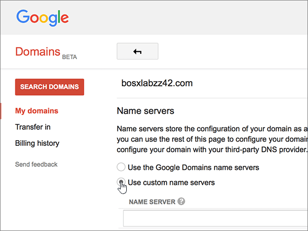
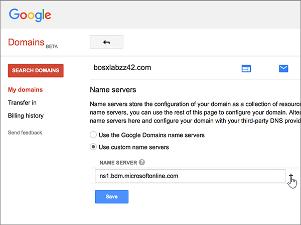
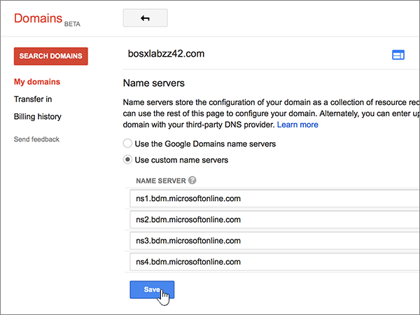

# Ändra namnservrar för att konfigurera Office 365 med Google Domains

 **[Läs frågor och svar om domäner](../setup/domains-faq.md)** om du inte hittar det du letar efter. 
  
Följ instruktionerna nedan om du vill att Office 365-DNS-posterna ska hanteras i Office 365. (Om du föredrar det kan du [ hantera alla DNS-poster för Office 365 hos Google Domains ](create-dns-records-at-google-domains.md).)
  
    
## Lägga till en TXT-post för verifiering

Innan du använder din domän med Office 365 vill vi vara säkra på att det är du som äger den. Att du kan logga in på kontot hos domänregistratorn och skapa en DNS-post bevisar för Office 365 att du äger domänen.
  
> [!NOTE]
>  Den här posten används endast för att verifiera att du äger domänen. Den påverkar ingenting annat. Du kan ta bort den senare om du vill. 
  
1. För att komma igång går du till din domänsida på Google Domains via [den här länken](https://domains.google.com/registrar). Du uppmanas att logga in. Gör så här:
    
1. Välj **Logga in**.
    
2. Ange dina inloggningsuppgifter och välj **logga in**igen .
    
2. På sidan **Domäner** väljer du Konfigurera **DNS** för den domän som du vill redigera i avsnittet **Domän.** 
    
3. Gå till avsnittet **Custom resource records**. I den nya postens rutor skriver du in, eller kopierar och klistrar in, värdena från följande tabell. 
    
    (Du kan behöva rulla nedåt.)
    
    (Välj värdet för **Type** i listrutan.) 
    
|||||
|:-----|:-----|:-----|:-----|
|**Name**   |**Type (typ)**   |**TTL**   |**Data**   |
|@    |TXT    |1H (1H)    |MS=ms *XXXXXXXX*   **Obs:** Detta är ett exempel. Använd ditt specifika **Mål eller pekar på adress**-värde här, från tabellen i Office 365. [Hur hittar jag det?](../get-help-with-domains/information-for-dns-records.md)          |
   
4. Välj **Lägg till**.
    
5. Vänta några minuter innan du fortsätter, så att den post som du nyss skapade kan uppdateras på Internet.
    
Nu när du har lagt till posten på domänregistratorns webbplats kan du gå tillbaka till Office 365 och begära att Office 365 letar efter posten.
  
När Office 365 hittar rätt TXT-post är din domän verifierad.
  
1. Gå till sidan **Inställningar** \> domäner i <a href="https://go.microsoft.com/fwlink/p/?linkid=834818" target="_blank">administrationscentret.</a>

    
2. På sidan **Domäner** väljer du den domän som du verifierar. 
    
3. På **sidan Inställningar** väljer du **Starta installationsprogrammet**.
    
4. Välj **Verifiera**på **sidan Verifiera domän.**
    
> [!NOTE]
> Det brukar ta omkring 15 minuter för DNS-ändringarna att gå igenom. Ibland kan det dock ta längre tid att uppdatera DNS-systemet på Internet för en ändring som du har gjort. Om du stöter på problem med e-postflödet eller får andra problem när du har lagt till DNS-posterna, går du till [Hitta och åtgärda problem när du har lagt till din domän eller DNS-poster i Office 365](../get-help-with-domains/find-and-fix-issues.md). 
  
## Ändra domänens namnserverposter (NS)

Om du vill slutföra konfigurationen av domänen med Office 365 kan du ändra domänens NS-poster hos domänregistratorn så att de pekar på de primära och sekundära namnservrarna i Office 365. Då ställs Office 365 in så att domänens DNS-poster uppdateras. Vi lägger till alla poster så att e-post, Skype för företag - Online och den offentliga webbplatsen fungerar med domänen så att du kan börja.
  
> [!CAUTION]
> Om du ändrar domänens NS-poster så att de pekar på Office 365-namnservrarna påverkas alla tjänster som är kopplade till domänen. Till exempel alla e-postmeddelanden som skickas till din domän (som rob@ *your_domain.*  com) börjar komma till Office 365 när du har gjort den här ändringen. 
  
> [!IMPORTANT]
> Följande procedur visar hur du tar bort andra, oönskade namnservrar från listan, och hur du lägger till korrekta namnservrar om de inte redan finns i listan. > När du har utfört stegen i det här avsnittet är de enda namnservrarna som bör finnas i listan dessa fyra: 
  
1. Börja med att gå till domänsidan på Google Domains genom att klicka på [den här länken](https://domains.google.com/registrar). Du uppmanas att logga in. Gör så här:
    
1. Välj **Logga in**.
    
2. Ange dina inloggningsuppgifter och välj sedan **logga in**igen .
    
2. På sidan **Domäner** väljer du Konfigurera **DNS** för den domän som du vill redigera i avsnittet **Domän.** 
    
3. Välj **Use custom name servers** (använd anpassade namnservrar) i området **Name servers** (namnservrar) på sidan **Domains** (domäner).
    
    
  
4. Beroende på om det redan finns namnservrar listade på sidan som visas nu, fortsätter du till en av följande procedurer:
    
  - Om **INGA** namnservrar visas [Om INGA namnservrar visas](#if-there-are-no-nameservers-already-listed).
    
  - Om det redan **FINNS** namnservrar listade [Om det redan FINNS namnservrar listade](#if-there-are-nameservers-already-listed).
    
### Om INGA namnservrar visas

1. Lägg till den första namnservern.
    
    I rutan **NAME SERVER** (namnserver) i avsnittet **Name servers** (namnservrar) skriver du in, eller kopierar och klistrar in, det första värdet från tabellen nedan. 
    
|||
|:-----|:-----|
|**Första namnservern**   |ns1.bdm.microsoftonline.com    |
|**Andra namnservern**   |ns2.bdm.microsoftonline.com    |
|**Tredje namnservern**   |ns3.bdm.microsoftonline.com    |
|**Fjärde namnservern**   |ns4.bdm.microsoftonline.com    |
   
   
  
2. Markera **+ (lägg till)** kontroll för att skapa en tom rad. 
    
    
  
3. Lägg till de andra tre namnserverposterna.
    
    Skapa en post i avsnittet **Använd anpassade namnservrar** med hjälp av värdena från nästa rad i tabellen och markera sedan **+(lägg till)** för att lägga till en annan rad. 
    
    Upprepa proceduren tills du har skapat alla fyra namnserverposterna.
    
4. Välj **Spara**.
    
    
  
> [!NOTE]
> Det kan ta flera timmar innan ändringarna har uppdaterats genom hela DNS-systemet på Internet. Sedan är din Office 365 e-post och andra tjänster klara att fungera med din domän. 
  
### Om det redan FINNS namnservrar listade

1. Om det finns några andra namnservrar i listan väljer du **Redigera**.
    
    > [!CAUTION]
    > Följ bara dessa steg om du har andra befintliga namnservrar än de fyra korrekta namnservrarna. (Det vill vill et, ta bara bort alla aktuella namnservrar som *inte* har namnet **ns1.bdm.microsoftonline.com,** **ns2.bdm.microsoftonline.com,** **ns3.bdm.microsoftonline.com**eller **ns4.bdm.microsoftonline.com**.) 
  
    
  
2. Ta bort var och en genom att markera den och sedan trycka på **Del**-tangenten. 
    
    
  
3. På **NAME SERVER**-raderna i avsnittet **Name servers** (namnservrar) skriver du in, eller kopierar och klistrar in, värdena från tabellen nedan. 
    
|||
|:-----|:-----|
|**Första namnservern**   |ns1.bdm.microsoftonline.com    |
|**Andra namnservern**   |ns2.bdm.microsoftonline.com    |
|**Tredje namnservern**   |ns3.bdm.microsoftonline.com    |
|**Fjärde namnservern**   |ns4.bdm.microsoftonline.com    |
   
   
  
4. Markera **+(lägg till)** kontroll för att skapa en tom rad. 
    
    
  
5. Lägg till de andra två namnserverposterna.
    
    Skapa en post med värdena från nästa rad i tabellen i avsnittet **Använd anpassade namnservrar** och markera sedan **+(lägg till)** för att lägga till en annan rad. 
    
    Upprepa proceduren tills du har skapat alla fyra namnserverposterna.
    
6. Välj **Spara**.
    
    
  
> [!NOTE]
> Det kan ta flera timmar innan ändringarna har uppdaterats genom hela DNS-systemet på Internet. Sedan är din Office 365 e-post och andra tjänster klara att fungera med din domän. 
  
