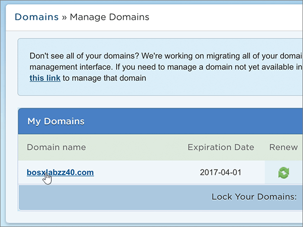
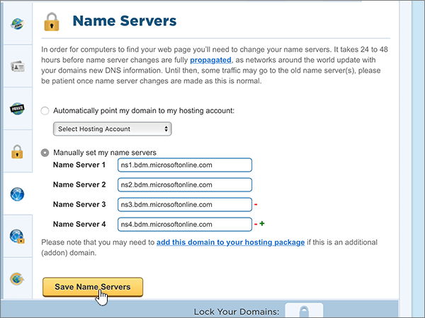

# Ändra namnservrar för att konfigurera Microsoft 365 med HostgatorChange nameservers to set up Microsoft 365 with Hostgator

 **[Läs frågor och svar om domäner](../setup/domains-faq.md)** om du inte hittar det du letar efter.**[Check the Domains FAQ](../setup/domains-faq.md)** if you don't find what you're looking for.
  
Följ dessa instruktioner om du vill att Microsoft ska hantera dina DNS-poster åt dig.Follow these instructions if you want Microsoft to manage your DNS records for you. (Om du vill kan du [hantera alla Dina Microsoft DNS-poster hos Hostgator](create-dns-records-at-hostgator.md).)(If you prefer, you can [manage all your Microsoft DNS records at Hostgator](create-dns-records-at-hostgator.md).)
  
    
## Ange att domänen ska peka på värdkontot.Point your domain to your hosting account.

> [!IMPORTANT]
> Du måste utföra den här proceduren innan du utför proceduren i följande avsnitt, **Lägga till en TXT-post för verifiering**.You must perform this procedure before you perform the procedure in the following section, **Add a TXT record for verification**.
  
Följ dessa steg för att associera domänen med värdkontona.Follow these steps to associate your domain and hosting accounts.
  
1. Kom igång genom att gå till kundportalen på Hostgator genom att klicka på [den här länken](https://portal.hostgator.com/domain/manage). Du uppmanas att logga in.To get started, go to your customer portal page at Hostgator by using [this link](https://portal.hostgator.com/domain/manage). You'll be prompted to log in.
    
    
  
2. Välj fliken **Domäner.**Select the **Domains** tab.
    
    
  
3. Välj den domän som du vill uppdatera i området **Mina domäner** på sidan Hantera **domäner.**On the **Manage Domains** page, in the **My Domains** area, select the domain you want to update.
    
    
  
4. Välj **Ändra**i området **Namnservrar** på sidan **Domains Overview** .On the **Domains Overview** page, in the **Name Servers** area, select **Change**.
    
    
  
5. På sidan **Namnservrar** för din domän väljer du det värdkonto som är kopplat till domänen i listrutan **Välj värdkonto.** **hosting account**On the **Name Servers** page for your domain, in the **Select Hosting Account** drop-down list, choose the **hosting account** that is associated with your domain.
    
    
  
6. Välj **Spara namnservrar**.Select **Save Name Servers**.
    
    
  
## Lägga till en TXT-post för verifieringAdd a TXT record for verification

> [!IMPORTANT]
> Innan du utför den här proceduren måste du först utföra proceduren i det första avsnittet i den här artikeln, [Peka din domän till ditt värdkonto.](#point-your-domain-to-your-hosting-account).Before you perform this procedure, you must first perform the procedure in the first section of this article, [Point your domain to your hosting account.](#point-your-domain-to-your-hosting-account).
  
Innan du använder din domän med Microsoft, vill vi vara säkra på att det är du som äger den. Att du kan logga in på ditt konto hos domänregistratorn och skapa DNS-posten bevisar för Microsoft att du äger domänen.Before you use your domain with Microsoft, we have to make sure that you own it. Your ability to log in to your account at your domain registrar and create the DNS record proves to Microsoft that you own the domain.
  
> [!NOTE]
> Den här posten används endast för att verifiera att du äger domänen. Den påverkar ingenting annat. Du kan ta bort den senare om du vill.This record is used only to verify that you own your domain; it doesn't affect anything else. You can delete it later, if you like.
  
1. Kom igång genom att gå till sidan cPanel på Hostgator Du uppmanas att logga in först.To get started, go to your cPanel page at Hostgator. You'll be prompted to log in first.
    
    (Varje konto på Hostgator har tilldelats en unik cPanel-adress. cPanel-adressen bör se ut ungefär så här: https://YourSiteAddress:secure-port-number. E-postmeddelandet du fick från Hostgator vid registreringen anger adressen.)(Each hosted account at Hostgator is assigned a unique cPanel address. Your cPanel address should look like this: https://YourSiteAddress:secure-port-number. The sign-up email you received from Hostgator will specify that address.)
    
    > [!IMPORTANT]
    > Du måste ha ett konto på Hostgator för att associera en cPanel med domänen.To have a cPanel associated with your domain, you need a hosting account with Hostgator. För att komma igång kan du antingen köpa ett värdkonto från Hostgator eller [ändra domänens namnserverposter (NS)](#change-your-domains-nameserver-ns-records) så att de pekar på Microsoft.To get started, you can either purchase a hosting account from Hostgator or [change your domain's nameserver (NS) records](#change-your-domains-nameserver-ns-records) to point to Microsoft. 
  
2. Välj **Avancerad DNS Zone Editor**i området **Domäner** på sidan **Kontrollpanelen** .On the **Control Panel** page, in the **Domains** area, select **Advanced DNS Zone Editor**.
    
    (Du kan behöva rulla nedåt.)(You may have to scroll down.) 
    
3. Gå till sidan **Advanced DNS Zone Editor** och området **Add a Record**. I den nya postens rutor skriver du in, eller kopierar och klistrar in värdena från följande tabell.On the **Advanced DNS Zone Editor** page, in the **Add a Record** area, in the boxes for the new record, type or copy and paste the values from the following table. 
    
    (Välj värdet för **Type** i listrutan.)(Choose the **Type** value from the drop-down list.) 
    
|||||
|:-----|:-----|:-----|:-----|
|**Name****Name**   |**TTL****TTL**   |**Type****Type**   |**TXT Data****TXT Data**   |
|Använd ditt  *domännamn*  . (Till exempel fourthcoffee.com.)  Use your  *domain_name*  . (for example, fourthcoffee.com.)    **Värdet MÅSTE sluta med en punkt (.)****This value MUST end with a period (.)**   |11    |TXTTXT    |MS=ms *XXXXXXXX*MS=ms *XXXXXXXX*    **Obs!** Det här är ett exempel.**Note:** This is an example. Använd ditt specifika \*\*Mål eller pekar på adress \*\* värde här, från tabellen.Use your specific **Destination or Points to Address** value here, from the table. [Hur hittar jag det här?How do I find this?](../get-help-with-domains/information-for-dns-records.md)        |
   
4. Välj **Lägg till post**.Select **Add Record**.
    
5. Vänta några minuter innan du fortsätter, så att den post som du nyss skapade kan uppdateras på Internet.Wait a few minutes before you continue, so that the record you just created can update across the Internet.
    
Nu när du har lagt till posten på domänregistratorerns webbplats går du tillbaka till Microsoft och begär en sökning efter posten.Now that you've added the record at your domain registrar's site, you'll go back to Microsoft and request a search for the record.
  
När Microsoft hittar rätt TXT-post är din domän verifierad.When Microsoft finds the correct TXT record, your domain is verified.
  
1. I administrationscentret går du till **Inställningar** \> <a href="https://go.microsoft.com/fwlink/p/?linkid=834818" target="_blank">Domains</a>.In the admin center, go to the **Settings** \> <a href="https://go.microsoft.com/fwlink/p/?linkid=834818" target="_blank">Domains</a> page.

    
2. På sidan **Domains** väljer du den domän du verifierar.On the **Domains** page, select the domain that you are verifying. 
    
3. På sidan **Setup** väljer du **Start setup**.On the **Setup** page, select **Start setup**.
    
4. På sidan **Verify domain** väljer du **Verify**.On the **Verify domain** page, select **Verify**.
    
> [!NOTE]
> Det brukar ta omkring 15 minuter för DNS-ändringarna att gå igenom. Ibland kan det dock ta längre tid att uppdatera DNS-systemet på Internet för en ändring som du har gjort. Om du stöter på problem med e-postflödet eller får andra problem när du har lagt till DNS-posterna, går du till [Hitta och åtgärda problem när du har lagt till din domän eller DNS-poster i Microsoft](../get-help-with-domains/find-and-fix-issues.md).Typically it takes about 15 minutes for DNS changes to take effect. However, it can occasionally take longer for a change you've made to update across the Internet's DNS system. If you're having trouble with mail flow or other issues after adding DNS records, see [Find and fix issues after adding your domain or DNS records](../get-help-with-domains/find-and-fix-issues.md). 
  
## Ändra domänens namnserverposter (NS)Change your domain's nameserver (NS) records

Om du vill slutföra inrättandet av domänen med Microsoft ändrar du domänens NS-poster på domänregistraren så att de pekar på Microsofts primära och sekundära namnservrar.To complete setting up your domain with Microsoft, you change your domain's NS records at your domain registrar to point to the Microsoft primary and secondary name servers. Detta ställer in Microsoft för att uppdatera domänens DNS-poster åt dig.This sets up Microsoft to update the domain's DNS records for you. Vi lägger till alla poster så att e-post, Skype för företag - Online och den offentliga webbplatsen fungerar med domänen så att du kan börja.We'll add all records so that email, Skype for Business Online, and your public website work with your domain, and you'll be all set.
  
> [!CAUTION]
> När du ändrar domänens NS-poster så att de pekar på Microsofts namnservrar påverkas alla tjänster som för närvarande är associerade med domänen.When you change your domain's NS records to point to the Microsoft name servers, all the services that are currently associated with your domain are affected. Till exempel börjar all e-post som skickas till din domän (t.ex. *rob@ your_domain* .com) komma till Microsoft när du har gjort den här ändringen.For example, all email sent to your domain (like rob@ *your_domain*  .com) will start coming to Microsoft after you make this change.
  
> [!IMPORTANT]
> Följande procedur visar hur du tar bort andra, oönskade namnservrar från listan, och hur du lägger till korrekta namnservrar om de inte redan finns i listan.The following procedure will show you how to delete any other, unwanted nameservers from the list, and also how to add the correct nameservers if they are not already listed. När du har slutfört stegen i det här avsnittet är de enda namnservrarna som ska visas dessa fyra: **ns1.bdm.microsoftonline.com**, **ns2.bdm.microsoftonline.com**, **ns3.bdm.microsoftonline.com**och **ns4.bdm.microsoftonline.com**.When you have completed the steps in this section, the only nameservers that should be listed are these four:  **ns1.bdm.microsoftonline.com**, **ns2.bdm.microsoftonline.com**, **ns3.bdm.microsoftonline.com**, and **ns4.bdm.microsoftonline.com**.
  
1. Kom igång genom att gå till kundportalen på Hostgator genom att klicka på [den här länken](https://portal.hostgator.com/domain/manage). Du uppmanas att logga in.To get started, go to your customer portal page at Hostgator by using [this link](https://portal.hostgator.com/domain/manage). You'll be prompted to log in.
    
    
  
2. Välj fliken **Domäner.**Select the **Domains** tab. 
    
    
  
3. Välj den domän som du vill uppdatera i området **Mina domäner** på sidan Hantera **domäner.**On the **Manage Domains** page, in the **My Domains** area, select the domain you want to update. 
    
    
  
4. Välj **Ändra**i området **Namnservrar** på sidan **Domain Overview** .On the **Domain Overview** page, in the **Name Servers** area, select **Change**.
    
    
  
5. På sidan **Namnservrar** för din domän väljer du det värdkonto som är kopplat till domänen i listrutan **Välj värdkonto.** **hosting account**On the **Name Servers** page for your domain, in the **Select Hosting Account** drop-down list, choose the **hosting account** that is associated with your domain. 
    
    
  
6. Välj **Ange manuellt mina namnservrar**.Select **Manually set my name servers**.
    
    
  
7.   **VARNING**: Följ bara dessa steg om du har andra befintliga namnservrar än de fyra korrekta namnservrarna.**CAUTION**: Follow these steps only if you have existing nameservers other than the four correct nameservers. (Det vill an, ta bara bort alla aktuella namnservrar som *inte* namnges **ns1.bdm.microsoftonline.com**, **ns2.bdm.microsoftonline.com**, **ns3.bdm.microsoftonline.com**eller **ns4.bdm.microsoftonline.com**.)(That is, delete only any current nameservers that are  *not*  named **ns1.bdm.microsoftonline.com**, **ns2.bdm.microsoftonline.com**, **ns3.bdm.microsoftonline.com**, or **ns4.bdm.microsoftonline.com**.)
  
        Fortfarande på sidan **Name Servers** för din domän tar du bort varje namnserver i listan genom att markera den och sedan trycka på **Delete** på tangentbordet.Still on the **Name Servers** page for your domain, in the list of nameservers, delete each nameserver in the list by selecting it and then pressing the **Delete** key on your keyboard. 
    
   
  
8. I listan med namnservrar skriver du in, eller kopierar och klistrar in, de första två värdena från följande tabell.Still in the list of nameservers, type or copy and paste the first two values from the following table.
    
|||
|:-----|:-----|
|**Name Server 1:****Name Server 1:**   |ns1.bdm.microsoftonline.comns1.bdm.microsoftonline.com    |
|**Name Server 2:****Name Server 2:**   |ns2.bdm.microsoftonline.comns2.bdm.microsoftonline.com    |
|**Name Server 3:****Name Server 3:**   |ns3.bdm.microsoftonline.comns3.bdm.microsoftonline.com    |
|**Name Server 4:****Name Server 4:**   |ns4.bdm.microsoftonline.comns4.bdm.microsoftonline.com    |
   
   
  
9. Lägg till de andra namnservervärdena.Add the other nameserver values.
    
    Markera **(+)** lägg till och skriv eller kopiera och klistra in värdet från nästa rad i tabellen i rutan för posten.Select **(+)** add, and then type or copy and paste the value from the next row of the table into the box for the record. 
    
    Upprepa proceduren tills du har skapat alla fyra namnserverposterna.Repeat this process until you have created all four nameserver records.
    
    
  
10. Välj **Spara namnservrar**.Select **Save Name Servers**.
    
    
  
> [!NOTE]
> Det kan ta flera timmar innan ändringarna har uppdaterats genom hela DNS-systemet på Internet.Your nameserver record updates may take up to several hours to update across the Internet's DNS system. Då kommer din Microsoft-e-post och andra tjänster att vara inställda på att fungera med din domän.Then your Microsoft email and other services will be all set to work with your domain.
