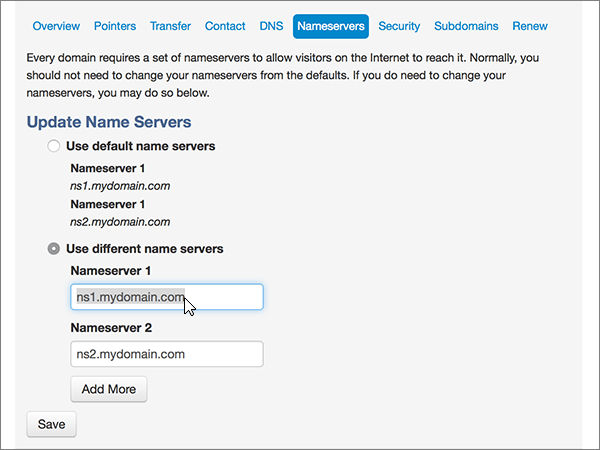

# Ändra namnservrar för att konfigurera Microsoft med MyDomainChange nameservers to set up Microsoft with MyDomain

 **[Läs frågor och svar om domäner](../setup/domains-faq.md)** om du inte hittar det du letar efter.**[Check the Domains FAQ](../setup/domains-faq.md)** if you don't find what you're looking for.
  
Följ dessa instruktioner om du vill att Microsoft ska hantera dina DNS-poster åt dig.Follow these instructions if you want Microsoft to manage your DNS records for you. (Om du vill kan du [hantera alla dina Microsoft DNS-poster på MyDomain](create-dns-records-at-mydomain.md).)(If you prefer, you can [manage all your Microsoft DNS records at MyDomain](create-dns-records-at-mydomain.md).)
  
## Lägga till en TXT-post för verifieringAdd a TXT record for verification

Innan du använder domänen med Microsoft måste vi se till att du äger den.Before you use your domain with Microsoft, we have to make sure that you own it. Din förmåga att logga in på ditt konto hos domänregistratorer och skapa DNS-posten bevisar för Microsoft att du äger domänen.Your ability to log in to your account at your domain registrar and create the DNS record proves to Microsoft that you own the domain.
  
> [!NOTE]
> Den här posten används endast för att verifiera att du äger domänen. Den påverkar ingenting annat. Du kan ta bort den senare om du vill.This record is used only to verify that you own your domain; it doesn't affect anything else. You can delete it later, if you like. 
  
1. Kom igång genom att gå till domänsidan på MyDomain genom att klicka på [den här länken](https://www.mydomain.com/controlpanel). Du uppmanas att logga in först.To get started, go to your domains page at MyDomain by using [this link](https://www.mydomain.com/controlpanel). You'll be prompted to log in first.
    
2. Välj **Domain Central** under **My Favorites**.In the **My Favorites** section, select **Domain Central**.
    
3. Under **Domain** väljer du namnet på den domän som du vill redigera.Under **Domain**, select the name of the domain that you want to edit.
    
4. På raden **Overview** väljer du **DNS**.In the **Overview** row, select **DNS**.
    
5. I listrutan **Modify** väljer du **TXT/SPF Record**.From the **Modify** drop-down list, choose **TXT/SPF Record**.
    
6. Under **Content**, i rutan för den nya posten, skriver du in, eller kopierar och klistrar in, värdet från följande tabell.Under **Content**, in the box for the new record, type or copy and paste the value from the following table.
    
||
|:-----|
|**Content****Content**   |
|MS=ms *XXXXXXXX*MS=ms *XXXXXXXX*    **Obs:** Detta är ett exempel.**Note**: This is an example. Använd ditt specifika **mål- eller poäng till-adress-värde** här, från bordet.Use your specific **Destination or Points to Address** value here, from the table. [Hur hittar jag det här?How do I find this?](../get-help-with-domains/information-for-dns-records.md)          |
   
7. Välj **Lägg till**.Select **Add**.
    
8. Vänta några minuter innan du fortsätter, så att den post som du nyss skapade kan uppdateras på Internet.Wait a few minutes before you continue, so that the record you just created can update across the Internet.
    
Nu när du har lagt till posten på domänregistratorerns webbplats går du tillbaka till Microsoft 365 och begär att Microsoft 365 ska söka efter posten.Now that you've added the record at your domain registrar's site, you'll go back to Microsoft 365 and request Microsoft 365 to look for the record.
  
När Microsoft hittar rätt TXT-post verifieras domänen.When Microsoft finds the correct TXT record, your domain is verified.
  
1. Gå till sidan **Inställningar** \> domäner i <a href="https://go.microsoft.com/fwlink/p/?linkid=834818" target="_blank">Microsofts administrationscenter.</a>In the Microsoft admin center, go to the **Settings** \> <a href="https://go.microsoft.com/fwlink/p/?linkid=834818" target="_blank">Domains</a> page.

    
2. På sidan **Domains** väljer du den domän du verifierar.On the **Domains** page, select the domain that you are verifying. 
    
3. På sidan **Setup** väljer du **Start setup**.On the **Setup** page, select **Start setup**.
    
4. På sidan **Verify domain** väljer du **Verify**.On the **Verify domain** page, select **Verify**.
    
> [!NOTE]
> Det brukar ta ungefär 15 minuter för DNS-ändringarna att gå igenom.Typically it takes about 15 minutes for DNS changes to take effect. Ibland kan det dock ta längre tid att uppdatera DNS-systemet på Internet för en ändring som du har gjort.However, it can occasionally take longer for a change you've made to update across the Internet's DNS system. Om du har problem med e-postflödet eller andra problem när du har lagt till DNS-poster läser du [Hitta och åtgärda problem när du har lagt till domänen eller DNS-posterna](../get-help-with-domains/find-and-fix-issues.md).If you're having trouble with mail flow or other issues after adding DNS records, see [Find and fix issues after adding your domain or DNS records](../get-help-with-domains/find-and-fix-issues.md). 
  
## Ändra domänens namnserverposter (NS)Change your domain's nameserver (NS) records

Om du vill slutföra inrättandet av domänen med Microsoft ändrar du domänens NS-poster på domänregistraren så att de pekar på Microsofts primära och sekundära namnservrar.To complete setting up your domain with Microsoft, you change your domain's NS records at your domain registrar to point to the Microsoft primary and secondary name servers. Detta ställer in Microsoft för att uppdatera domänens DNS-poster åt dig.This sets up Microsoft to update the domain's DNS records for you. Vi lägger till alla poster så att e-post, Skype för företag - Online och den offentliga webbplatsen fungerar med domänen så att du kan börja.We'll add all records so that email, Skype for Business Online, and your public website work with your domain, and you'll be all set.
  
> [!CAUTION]
> När du ändrar domänens NS-poster så att de pekar på Microsofts namnservrar påverkas alla tjänster som för närvarande är associerade med domänen.When you change your domain's NS records to point to the Microsoft name servers, all the services that are currently associated with your domain are affected. Till exempel alla e-postmeddelanden som skickas till din domän (t.ex. *rob@ your_domain.*For example, all email sent to your domain (like rob@ *your_domain.* com) börjar komma till Microsoft när du har gjort den här ändringen.com) will start coming to Microsoft after you make this change. 
  
> [!IMPORTANT]
> Följande procedur visar hur du tar bort andra, oönskade namnservrar från listan, och hur du lägger till korrekta namnservrar om de inte redan finns i listan.The following procedure will show you how to delete any other, unwanted nameservers from the list, and also how to add the correct nameservers if they are not already in the list.   När du har slutfört stegen i det här avsnittet är de enda namnservrarna som ska visas dessa fyra:When you have completed the steps in this section, the only nameservers that should be listed are these four:
  
1. Kom igång genom att gå till domänsidan på MyDomain genom att klicka på [den här länken](https://www.mydomain.com/controlpanel). Du uppmanas att logga in först.To get started, go to your domains page at MyDomain by using [this link](https://www.mydomain.com/controlpanel). You'll be prompted to log in first.
    
2. Välj **Domain Central** under **My Favorites**.In the **My Favorites** section, select **Domain Central**.
    
3. Under **Domain** väljer du namnet på den domän som du vill redigera.Under **Domain**, select the name of the domain that you want to edit.
    
4. Välj **Namnservrar**på raden **Översikt** .In the **Overview** row, select **Nameservers**.
    
    
  
5. Välj **Use different name servers** i avsnittet **Update Name Servers**.In the **Update Name Servers** section, select **Use different name servers**.
    
    
  
6. Beroende på om det redan finns namnservrar listade på sidan som visas nu fortsätter du till någon av följande två procedurer.Depending on whether or not there are already nameservers listed on the page that is displayed now, continue to one of the two following procedures.
    
### Om rätt namnservrar REDAN LISTASIf the correct nameservers ARE already listed

- Om rätt namnservrar redan listas, kan du hoppa över detta steg.If the correct nameservers are already listed, you can skip this step.
    
    
  
### Om rätt namnservrar INTE LISTASIf the correct nameservers are NOT already listed

> [!CAUTION]
> Följ bara dessa steg om du har andra befintliga namnservrar än de fyra korrekta namnservrarna.Follow these steps only if you have existing nameservers other than the four correct nameservers. (Det vill an, ta bara bort alla aktuella namnservrar som *inte* namnges **ns1.bdm.microsoftonline.com**, **ns2.bdm.microsoftonline.com**, **ns3.bdm.microsoftonline.com**eller **ns4.bdm.microsoftonline.com**.)(That is, delete only any current nameservers that are  *not*  named **ns1.bdm.microsoftonline.com**, **ns2.bdm.microsoftonline.com**, **ns3.bdm.microsoftonline.com**, or **ns4.bdm.microsoftonline.com**.) 
  
1. Ta bort befintliga namnservrar genom att markera varje post i fältet **Namnserver:** och sedan tryck på **Delete** på tangentbordet.Delete the existing nameservers by selecting each entry in the **Nameserver:** field, and then pressing the **Delete** key on your keyboard. 
    
    
  
2. Välj **Lägg till fler** två gånger om du vill lägga till två nya namnserverrader.Select **Add More** twice to add two new Nameserver rows. 
    
    
  
3. I rutorna för posterna skriver eller klipper och klistrar du in namnservervärdena från följande tabell.In the boxes for the records, type or copy and paste the nameserver values from the following table.
    
|||
|:-----|:-----|
|**Namnserver 1****Nameserver 1**   |ns1.bdm.microsoftonline.comns1.bdm.microsoftonline.com    |
|**Namnserver 2****Nameserver 2**   |ns2.bdm.microsoftonline.comns2.bdm.microsoftonline.com    |
|**Namnserver 3****Nameserver 3**   |ns3.bdm.microsoftonline.comns3.bdm.microsoftonline.com    |
|**Namnserver 4****Nameserver 4**   |ns4.bdm.microsoftonline.comns4.bdm.microsoftonline.com    |
   
   
  
4. Välj **Spara**.Select **Save**.
    
    
  
> [!NOTE]
> Det kan ta flera timmar innan ändringarna har uppdaterats genom hela DNS-systemet på Internet.Your nameserver record updates may take up to several hours to update across the Internet's DNS system. Då kommer din Microsoft-e-post och andra tjänster att vara inställda på att fungera med din domän.Then your Microsoft email and other services will be all set to work with your domain. 
