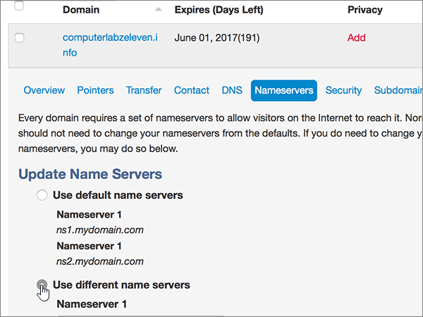

# Ändra namnservrar för att konfigurera Office 365 med MyDomainChange nameservers to set up Office 365 with MyDomain

 **[Läs frågor och svar om domäner](../setup/domains-faq.md)** om du inte hittar det du letar efter.**[Check the Domains FAQ](../setup/domains-faq.md)** if you don't find what you're looking for.
  
Följ instruktionerna nedan om du vill att Office 365-DNS-posterna ska hanteras i Office 365. (Om du föredrar det kan du [ hantera alla DNS-poster för Office 365 hos MyDomain ](create-dns-records-at-mydomain.md).)Follow these instructions if you want Office 365 to manage your Office 365 DNS records for you. (If you prefer, you can [manage all your Office 365 DNS records at MyDomain](create-dns-records-at-mydomain.md).)
  
## Lägga till en TXT-post för verifieringAdd a TXT record for verification

Innan du använder din domän med Office 365 vill vi vara säkra på att det är du som äger den. Att du kan logga in på kontot hos domänregistratorn och skapa en DNS-post bevisar för Office 365 att du äger domänen.Before you use your domain with Office 365, we have to make sure that you own it. Your ability to log in to your account at your domain registrar and create the DNS record proves to Office 365 that you own the domain.
  
> [!NOTE]
> Den här posten används endast för att verifiera att du äger domänen. Den påverkar ingenting annat. Du kan ta bort den senare om du vill.This record is used only to verify that you own your domain; it doesn't affect anything else. You can delete it later, if you like. 
  
1. Kom igång genom att gå till domänsidan på MyDomain genom att klicka på [den här länken](https://www.mydomain.com/controlpanel). Du uppmanas att logga in först.To get started, go to your domains page at MyDomain by using [this link](https://www.mydomain.com/controlpanel). You'll be prompted to log in first.
    
2. Välj **Domain Central**i avsnittet **Mina favoriter** .In the **My Favorites** section, select **Domain Central**.
    
3. Under **Domän**väljer du namnet på den domän som du vill redigera.Under **Domain**, select the name of the domain that you want to edit.
    
4. Välj **DNS**på raden **Översikt.**In the **Overview** row, select **DNS**.
    
5. I listrutan **Modify** väljer du **TXT/SPF Record**.From the **Modify** drop-down list, choose **TXT/SPF Record**.
    
6. Under **Content**, i rutan för den nya posten, skriver du in eller kopierar och klistrar in värdet från följande tabell.Under **Content**, in the box for the new record, type or copy and paste the value from the following table.
    
||
|:-----|
|**Innehåll****Content**   |
|MS=ms *XXXXXXXX*MS=ms *XXXXXXXX*    **Obs:** Detta är ett exempel.**Note**: This is an example. Använd ditt specifika **Mål eller pekar på adress**-värde här, från tabellen i Office 365.Use your specific **Destination or Points to Address** value here, from the table in Office 365. [Hur hittar jag det?How do I find this?](../get-help-with-domains/information-for-dns-records.md)          |
   
7. Välj **Lägg till**.Select **Add**.
    
8. Vänta några minuter innan du fortsätter, så att den post som du nyss skapade kan uppdateras på Internet.Wait a few minutes before you continue, so that the record you just created can update across the Internet.
    
Nu när du har lagt till posten på domänregistratorns webbplats kan du gå tillbaka till Office 365 och begära att Office 365 letar efter posten.Now that you've added the record at your domain registrar's site, you'll go back to Office 365 and request Office 365 to look for the record.
  
När Office 365 hittar rätt TXT-post är din domän verifierad.When Office 365 finds the correct TXT record, your domain is verified.
  
1. Gå till sidan **Inställningar** \> domäner i <a href="https://go.microsoft.com/fwlink/p/?linkid=834818" target="_blank">administrationscentret.</a>In the admin center, go to the **Settings** \> <a href="https://go.microsoft.com/fwlink/p/?linkid=834818" target="_blank">Domains</a> page.

    
2. På sidan **Domäner** väljer du den domän som du verifierar.On the **Domains** page, select the domain that you are verifying. 
    
3. På **sidan Inställningar** väljer du **Starta installationsprogrammet**.On the **Setup** page, select **Start setup**.
    
4. Välj **Verifiera**på **sidan Verifiera domän.**On the **Verify domain** page, select **Verify**.
    
> [!NOTE]
> Det brukar ta omkring 15 minuter för DNS-ändringarna att gå igenom. Ibland kan det dock ta längre tid att uppdatera DNS-systemet på Internet för en ändring som du har gjort. Om du stöter på problem med e-postflödet eller får andra problem när du har lagt till DNS-posterna, går du till [Hitta och åtgärda problem när du har lagt till din domän eller DNS-poster i Office 365](../get-help-with-domains/find-and-fix-issues.md).Typically it takes about 15 minutes for DNS changes to take effect. However, it can occasionally take longer for a change you've made to update across the Internet's DNS system. If you're having trouble with mail flow or other issues after adding DNS records, see [Find and fix issues after adding your domain or DNS records in Office 365](../get-help-with-domains/find-and-fix-issues.md). 
  
## Ändra domänens namnserverposter (NS)Change your domain's nameserver (NS) records

Om du vill slutföra konfigurationen av domänen med Office 365 kan du ändra domänens NS-poster hos domänregistratorn så att de pekar på de primära och sekundära namnservrarna i Office 365. Då ställs Office 365 in så att domänens DNS-poster uppdateras. Vi lägger till alla poster så att e-post, Skype för företag - Online och den offentliga webbplatsen fungerar med domänen så att du kan börja.To complete setting up your domain with Office 365, you change your domain's NS records at your domain registrar to point to the Office 365 primary and secondary name servers. This sets up Office 365 to update the domain's DNS records for you. We'll add all records so that email, Skype for Business Online, and your public website work with your domain, and you'll be all set.
  
> [!CAUTION]
> Om du ändrar domänens NS-poster så att de pekar på Office 365-namnservrarna påverkas alla tjänster som är kopplade till domänen.When you change your domain's NS records to point to the Office 365 name servers, all the services that are currently associated with your domain are affected. Till exempel alla e-postmeddelanden som skickas till din domän (som rob@ *your_domain.*For example, all email sent to your domain (like rob@ *your_domain.* com) börjar komma till Office 365 när du har gjort den här ändringen.com) will start coming to Office 365 after you make this change. 
  
> [!IMPORTANT]
> Följande procedur visar hur du tar bort andra, oönskade namnservrar från listan, och hur du lägger till korrekta namnservrar om de inte redan finns i listan.The following procedure will show you how to delete any other, unwanted nameservers from the list, and also how to add the correct nameservers if they are not already in the list.   När du har slutfört stegen i det här avsnittet är de enda namnservrar na som ska visas dessa fyra:When you have completed the steps in this section, the only nameservers that should be listed are these four:
  
1. Kom igång genom att gå till domänsidan på MyDomain genom att klicka på [den här länken](https://www.mydomain.com/controlpanel).To get started, go to your domains page at MyDomain by using [this link](https://www.mydomain.com/controlpanel). Du uppmanas att logga in först.You'll be prompted to log in first.
    
2. Välj **Domain Central**i avsnittet **Mina favoriter** .In the **My Favorites** section, select **Domain Central**.
    
3. Under **Domän**väljer du namnet på den domän som du vill redigera.Under **Domain**, select the name of the domain that you want to edit.
    
4. Välj **Namnservrar**på raden **Översikt** .In the **Overview** row, select **Nameservers**.
    
    
  
5. Välj **Use different name servers** i avsnittet **Update Name Servers**.In the **Update Name Servers** section, select **Use different name servers**.
    
    
  
6. Beroende på om det redan finns namnservrar som visas på sidan som visas nu, fortsätter du till något av följande två procedurer.Depending on whether or not there are already nameservers listed on the page that is displayed now, continue to one of the two following procedures.
    
### Om rätt namnservrar REDAN LISTASIf the correct nameservers ARE already listed

- Om rätt namnservrar redan listas, kan du hoppa över detta steg.If the correct nameservers are already listed, you can skip this step.
    
    
  
### Om rätt namnservrar INTE LISTASIf the correct nameservers are NOT already listed

> [!CAUTION]
> Följ bara dessa steg om du har andra befintliga namnservrar än de fyra korrekta namnservrarna.Follow these steps only if you have existing nameservers other than the four correct nameservers. (Det vill vill et, ta bara bort alla aktuella namnservrar som *inte* har namnet **ns1.bdm.microsoftonline.com,** **ns2.bdm.microsoftonline.com,** **ns3.bdm.microsoftonline.com**eller **ns4.bdm.microsoftonline.com**.)(That is, delete only any current nameservers that are  *not*  named **ns1.bdm.microsoftonline.com**, **ns2.bdm.microsoftonline.com**, **ns3.bdm.microsoftonline.com**, or **ns4.bdm.microsoftonline.com**.) 
  
1. Ta bort befintliga namnservrar genom att markera varje post i fältet **Namnserver:** och sedan tryck på **Delete** på tangentbordet.Delete the existing nameservers by selecting each entry in the **Nameserver:** field, and then pressing the **Delete** key on your keyboard. 
    
    
  
2. Välj **Lägg till fler** två gånger om du vill lägga till två nya Nameserver-rader.Select **Add More** twice to add two new Nameserver rows. 
    
    
  
3. I rutorna för posterna skriver eller klipper och klistrar du in namnservervärdena från följande tabell.In the boxes for the records, type or copy and paste the nameserver values from the following table.
    
|||
|:-----|:-----|
|**Namnserver 1****Nameserver 1**   |ns1.bdm.microsoftonline.comns1.bdm.microsoftonline.com    |
|**Namnserver 2****Nameserver 2**   |ns2.bdm.microsoftonline.comns2.bdm.microsoftonline.com    |
|**Namnserver 3****Nameserver 3**   |ns3.bdm.microsoftonline.comns3.bdm.microsoftonline.com    |
|**Namnserver 4****Nameserver 4**   |ns4.bdm.microsoftonline.comns4.bdm.microsoftonline.com    |
   
   
  
4. Välj **Spara**.Select **Save**.
    
    
  
> [!NOTE]
> Det kan ta flera timmar innan ändringarna har uppdaterats genom hela DNS-systemet på Internet. Sedan är din Office 365 e-post och andra tjänster klara att fungera med din domän.Your nameserver record updates may take up to several hours to update across the Internet's DNS system. Then your Office 365 email and other services will be all set to work with your domain. 
