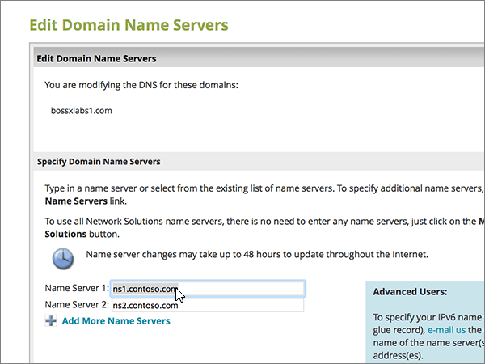

# Ändra namnservrar för att konfigurera Microsoft med NätverkslösningarChange nameservers to set up Microsoft with Network Solutions

 **[Läs frågor och svar om domäner](../setup/domains-faq.md)** om du inte hittar det du letar efter.**[Check the Domains FAQ](../setup/domains-faq.md)** if you don't find what you're looking for.
  
Följ dessa instruktioner om du vill att Microsoft ska hantera dina DNS-poster åt dig.Follow these instructions if you want Microsoft to manage your DNS records for you. (Om du vill kan du [hantera alla Microsoft DNS-poster på Network Solutions](create-dns-records-at-network-solutions.md).)(If you prefer, you can [manage all your Microsoft DNS records at Network Solutions](create-dns-records-at-network-solutions.md).)
  
    
## Lägga till en TXT-post på Network Solutions för att verifiera att det är din domänAdd a TXT record at Network Solutions to verify that you own the domain

Before you use your domain with Microsoft, we have to make sure that you own it.Before you use your domain with Microsoft, we have to make sure that you own it. Your ability to log in to your account at your domain registrar and create the DNS record proves to Microsoft that you own the domain.Your ability to log in to your account at your domain registrar and create the DNS record proves to Microsoft that you own the domain.
  
> [!NOTE]
> This record is used only to verify that you own your domain; it doesn't affect anything else.This record is used only to verify that you own your domain; it doesn't affect anything else. You can delete it later, if you like.You can delete it later, if you like. 
  
Följ stegen nedan eller [titta på videon (börja vid 0:47)](https://support.microsoft.com/office/69b092e3-c026-4d19-a7d0-16cdb2d8b261).Follow the steps below or [watch the video (start at 0:47)](https://support.microsoft.com/office/69b092e3-c026-4d19-a7d0-16cdb2d8b261).
  
1. To get started, go to your domains page at Network Solutions by using [this link](https://www.networksolutions.com/manage-it).To get started, go to your domains page at Network Solutions by using [this link](https://www.networksolutions.com/manage-it). You'll be prompted to log in.You'll be prompted to log in.
    
    > [!IMPORTANT]
    > Innan du väljer **knappen Logga in** väljer du först Hantera mina **domännamn** i **listrutan Logga in på:** .Before you select the **Login** button, first choose **Manage My Domain Names** in the **Log In to:** drop-down list.
  
    
  
2. Markera kryssrutan bredvid namnet på den domän som du uppdaterar.Select the check box next to the name of the domain that you are modifying.
    
    
  
3. Välj **Redigera DNS**.Select **Edit DNS**.
    
    
  
4. Välj **Hantera avancerade DNS-poster**.Select **Manage Advanced DNS Records**.
    
    (Du kan behöva rulla nedåt.)(You may have to scroll down.)
    
    
  
5. Bläddra ned till avsnittet **Text (TXT Records)** och välj sedan **Redigera TXT-poster**.Scroll down to the **Text (TXT Records)** section, and then select **Edit TXT Records**.
    
    
  
6. I rutorna för den nya posten skriver du in, eller kopierar och klistrar in, värdena i följande tabell.In the boxes for the new record, type or copy and paste the values in the following table.
    
|**Host****Host**|**TTL****TTL**|**Text****Text**|
|:-----|:-----|:-----|
|@    (Värdet ändras till **@ (None)** när du sparar posten.)(The system will change this value to **@ (None)** when you save the record.)    |36003600    |MS=ms *XXXXXXXX*MS=ms *XXXXXXXX*    **Obs:** Detta är ett exempel.**Note**: This is an example. Använd det specifika värdet för **Mål eller pekar på-adress** här, från tabellen i Microsoft 365.Use your specific **Destination or Points to Address** value here, from the table in Microsoft 365.           [Hur hittar jag det här?How do I find this?](../get-help-with-domains/information-for-dns-records.md)
   
    
   
  
7. Välj **Fortsätt**.Select **Continue**.
    
    
  
8. Välj **Spara ändringar**.Select **Save Changes**.
    
    
  
9. Vänta några minuter innan du fortsätter, så att den post som du nyss skapade kan uppdateras på Internet.Wait a few minutes before you continue, so that the record you just created can update across the Internet.
    
Nu när du har lagt till posten på domänregistratorns webbplats går du tillbaka till Microsoft 365 och begär att Microsoft 365 letar efter posten.Now that you've added the record at your domain registrar's site, you'll go back to Microsoft 365 and request Microsoft 365 to look for the record.
  
När Microsoft hittar rätt TXT-post är din domän verifierad.When Microsoft finds the correct TXT record, your domain is verified.
  
1. I Microsoft-administrationscentret går du till **Inställningar** \> <a href="https://go.microsoft.com/fwlink/p/?linkid=834818" target="_blank">Domäner</a>.In the Microsoft admin center, go to the **Settings** \> <a href="https://go.microsoft.com/fwlink/p/?linkid=834818" target="_blank">Domains</a> page.

    
2. På sidan **Domains** väljer du den domän du verifierar.On the **Domains** page, select the domain that you are verifying. 
    
    
  
3. På sidan **Setup** väljer du **Start setup**.On the **Setup** page, select **Start setup**.
    
    
  
4. På sidan **Verify domain** väljer du **Verify**.On the **Verify domain** page, select **Verify**.
    
    
  
> [!NOTE]
>  Typically it takes about 15 minutes for DNS changes to take effect.Typically it takes about 15 minutes for DNS changes to take effect. However, it can occasionally take longer for a change you've made to update across the Internet's DNS system.However, it can occasionally take longer for a change you've made to update across the Internet's DNS system. If you're having trouble with mail flow or other issues after adding DNS records, see [Troubleshoot issues after changing your domain name or DNS records](../get-help-with-domains/find-and-fix-issues.md).If you're having trouble with mail flow or other issues after adding DNS records, see [Troubleshoot issues after changing your domain name or DNS records](../get-help-with-domains/find-and-fix-issues.md). 
  
## Ändra domänens namnserverposter (NS)Change your domain's nameserver (NS) records

Om du vill slutföra inrättandet av domänen med Microsoft ändrar du domänens NS-poster på domänregistraren så att de pekar på Microsofts primära och sekundära namnservrar.To complete setting up your domain with Microsoft, you change your domain's NS records at your domain registrar to point to the Microsoft primary and secondary name servers. Detta konfigurerar Microsoft för att uppdatera domänens DNS-poster åt dig.This sets up Microsoft to update the domain's DNS records for you. Vi lägger till alla poster så att e-post, Skype för företag - Online och den offentliga webbplatsen fungerar med domänen så att du kan börja.We'll add all records so that email, Skype for Business Online, and your public website work with your domain, and you'll be all set.
  
> [!CAUTION]
> När du ändrar domänens NS-poster så att de pekar på Microsofts namnservrar påverkas alla tjänster som för närvarande är associerade med domänen.When you change your domain's NS records to point to the Microsoft name servers, all the services that are currently associated with your domain are affected. Till exempel börjar all e-post som skickas till din domän (t.ex. *rob@ your_domain* .com) till Microsoft när du har gjort den här ändringen.For example, all email sent to your domain (like rob@ *your_domain*  .com) will start coming to Microsoft after you make this change.
  
Är du redo att ändra dina NS-poster så att Microsoft kan konfigurera din domän?Ready to change your NS records so Microsoft can set up your domain? Följ stegen nedan eller [titta på videon (börja vid 2:23)](https://support.microsoft.com/office/69b092e3-c026-4d19-a7d0-16cdb2d8b261).Follow the steps below or [watch the video (start at 2:23)](https://support.microsoft.com/office/69b092e3-c026-4d19-a7d0-16cdb2d8b261).
  
> [!IMPORTANT]
>  När du har slutfört stegen i det här avsnittet visas de *enda* namnservrarna som ska visas dessa fyra: **ns1.bdm.microsoftonline.com**, **ns2.bdm.microsoftonline.com**, **ns3.bdm.microsoftonline.com**och **ns4.bdm.microsoftonline.com**.When you have completed the steps in this section, the  *only*  nameservers that should be listed are these four: **ns1.bdm.microsoftonline.com**, **ns2.bdm.microsoftonline.com**, **ns3.bdm.microsoftonline.com**, and **ns4.bdm.microsoftonline.com**. Följande procedur visar hur du tar bort andra, oönskade namnservrar från listan, och hur du lägger till  *korrekta*  namnservrar om de inte redan finns i listan.The following procedure will show you how to delete any other, unwanted nameservers from the list, and also how to add the  *correct*  nameservers if they are not already in the list. 
  
1. Kom igång genom att gå till domänsidan på Network Solutions med [den här länken](https://www.networksolutions.com/manage-it).To get started, go to your domains page at Network Solutions by using [this link](https://www.networksolutions.com/manage-it). Du uppmanas att logga in.You'll be prompted to log in.
    
    > [!IMPORTANT]
    > Innan du väljer **knappen Logga in** väljer du först Hantera mina **domännamn** i **listrutan Logga in på:** .Before you select the **Login** button, first choose **Manage My Domain Names** in the **Log In to:** drop-down list. 
  
    
  
2. Markera kryssrutan bredvid namnet på den domän som du uppdaterar.Select the check box next to the name of the domain that you are modifying.
    
    
  
3. Välj **Redigera DNS**.Select **Edit DNS**.
    
    
  
4. Välj **Flytta DNS**.Select **Move DNS**.
    
    
  
5. Beroende på om det redan finns namnservrar listade på sidan som visas nu, fortsätter du till en av följande procedurer:Depending on whether or not there are already nameservers listed on the page that is displayed now, continue to one of the two following procedures:
    
  - Om **INGA** namnservrar visas [Om INGA namnservrar visas](#if-there-are-no-nameservers-already-listed).If there are **NO** nameservers already listed, [If there are NO nameservers already listed](#if-there-are-no-nameservers-already-listed).
    
  - Om det redan **FINNS** namnservrar listade [Om det redan FINNS namnservrar listade](#if-there-are-nameservers-already-listed).If there **ARE** nameservers already listed, [If there ARE nameservers already listed](#if-there-are-nameservers-already-listed).
    
### Om INGA namnservrar visasIf there are NO nameservers already listed

1. Välj **Lägg till fler namnservrar**i avsnittet Ange **domännamnsservrar** på sidan **Domäner** .On the **Domains** page, in the **Specify Domain Name Servers** section, select **Add More Name Servers**.
    
    
  
2. På sidan **Domain Names** skriver eller kopierar och klistrar du in namnservervärdena från följande tabell.On the **Domain Names** page, type or copy and paste the nameserver values from the following table. 
    
|||
|:-----|:-----|
|**Name Server 1****Name Server 1**   |ns1.bdm.microsoftonline.comns1.bdm.microsoftonline.com    |
|**Name Server 2****Name Server 2**   |ns2.bdm.microsoftonline.comns2.bdm.microsoftonline.com    |
|**Name Server 2****Name Server 2**   |ns3.bdm.microsoftonline.comns3.bdm.microsoftonline.com    |
|**Name Server 2****Name Server 2**   |ns4.bdm.microsoftonline.comns4.bdm.microsoftonline.com    |
   
    

  
3. Välj **Flytta DNS**.Select **Move DNS**.
    
    
  
4. Välj **Spara ändringar**.Select **Save Changes**.
    
    
  
> [!NOTE]
> Det kan ta flera timmar innan ändringarna har uppdaterats genom hela DNS-systemet på Internet.Your nameserver record updates may take up to several hours to update across the Internet's DNS system. Då kommer din Microsoft-e-post och andra tjänster att vara inställda på att fungera med din domän.Then your Microsoft email and other services will be all set to work with your domain. 
  
### Om det redan FINNS namnservrar listadeIf there ARE nameservers already listed

> [!CAUTION]
> Follow these steps  *only*  if you have existing nameservers other than the four  *correct*  nameservers.Follow these steps  *only*  if you have existing nameservers other than the four  *correct*  nameservers. (That is, delete  *only*  any current nameservers that are  *not*  named **ns1.bdm.microsoftonline.com**, **ns2.bdm.microsoftonline.com**, **ns3.bdm.microsoftonline.com**, or **ns4.bdm.microsoftonline.com**.)(That is, delete  *only*  any current nameservers that are  *not*  named **ns1.bdm.microsoftonline.com**, **ns2.bdm.microsoftonline.com**, **ns3.bdm.microsoftonline.com**, or **ns4.bdm.microsoftonline.com**.)
  
1. Om det finns andra namnservrar tar du bort var och en av dem genom att markera den och sedan trycka på **Delete**-tangenten.If there are any other nameservers listed, delete each one by selecting it and then pressing the **Delete** key on your keyboard.
    
    
  
2. Välj **Lägg till fler namnservrar**.Select **Add More Name Servers**.
    
    
  
3. På sidan **Domain Names** skriver eller kopierar och klistrar du in namnservervärdena från följande tabell.On the **Domain Names** page, type or copy and paste the nameserver values from the following table.
 
    
|||
|:-----|:-----|
|**Name Server 1****Name Server 1**   |ns1.bdm.microsoftonline.comns1.bdm.microsoftonline.com    |
|**Name Server 2****Name Server 2**   |ns2.bdm.microsoftonline.comns2.bdm.microsoftonline.com    |
|**Name Server 3****Name Server 3**   |ns3.bdm.microsoftonline.comns3.bdm.microsoftonline.com    |
|**Name Server 4****Name Server 4**   |ns4.bdm.microsoftonline.comns4.bdm.microsoftonline.com    |
   
    

  
4. Välj **Flytta DNS**.Select **Move DNS**.
    
    
  
5. Välj **Spara ändringar.**Select **Save Changes.**
    
    
  
> [!NOTE]
> Det kan ta flera timmar innan ändringarna har uppdaterats genom hela DNS-systemet på Internet.Your nameserver record updates may take up to several hours to update across the Internet's DNS system. Då kommer din Microsoft-e-post och andra tjänster att vara inställda på att fungera med din domän.Then your Microsoft email and other services will be all set to work with your domain.
