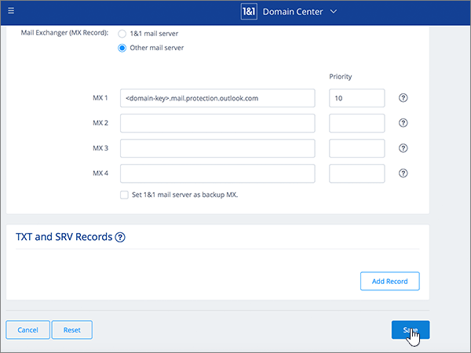
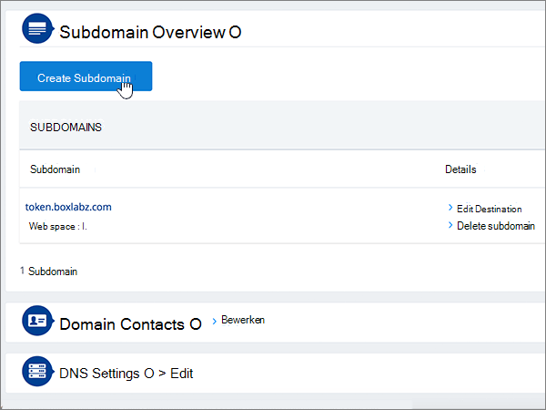
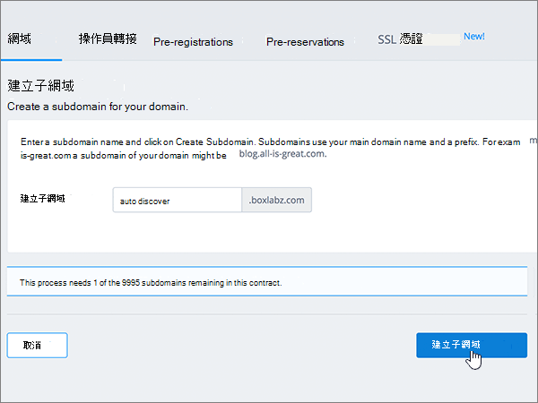
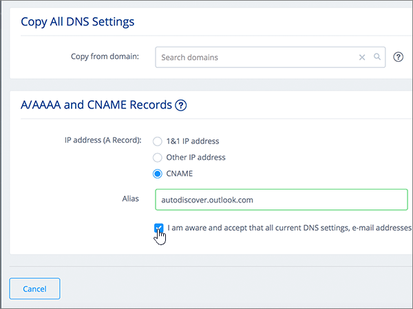
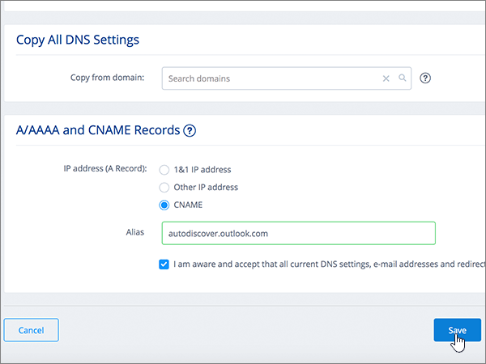

# Skapa DNS-poster med 1&1 IONOS för MicrosoftCreate DNS records at 1&1 IONOS for Microsoft

 **[Läs frågor och svar om domäner](../setup/domains-faq.md)** om du inte hittar det du letar efter.**[Check the Domains FAQ](../setup/domains-faq.md)** if you don't find what you're looking for. 
  
> [!CAUTION]
> Observera att 1&1 IONOS inte tillåter att en domän har både en MX-post och en CNAME-post på den högsta nivån.Note that 1&1 IONOS doesn't allow a domain to have both an MX record and a top-level Autodiscover CNAME record. Detta begränsar hur du kan konfigurera Exchange Online för Microsoft.This limits the ways in which you can configure Exchange Online for Microsoft. Det finns en lösning, men vi rekommenderar att du använder den **endast** om du redan har erfarenhet av att skapa underdomäner vid 1&1 IONOS.There is a workaround, but we recommend employing it **only** if you already have experience with creating subdomains at 1&1 IONOS. > Om du trots den här [tjänstbegränsningen](https://support.office.com/article/7ae9a655-041d-4724-aa92-60392ee390c2.aspx) väljer att hantera dina egna Microsoft DNS-poster med 1&1 IONOS följer du stegen i den här artikeln för att verifiera din domän och konfigurera DNS-poster för e-post, Skype för företag – Online och så vidare.> If despite this [service limitation](https://support.office.com/article/7ae9a655-041d-4724-aa92-60392ee390c2.aspx) you choose to manage your own Microsoft DNS records at 1&1 IONOS, follow the steps in this article to verify your domain and to set up DNS records for email, Skype for Business Online, and so on. 
  
När du har lagt till dessa poster vid 1&1 IONOS konfigureras domänen så att den fungerar med Microsoft-tjänster.After you add these records at 1&1 IONOS, your domain will be set up to work with Microsoft services.
  
Mer information om webbhotell och DNS för webbplatser med Microsoft finns i [Använda en offentlig webbplats med Microsoft](https://support.office.com/article/choose-a-public-website-3325d50e-d131-403c-a278-7f3296fe33a9).To learn about webhosting and DNS for websites with Microsoft, see [Use a public website with Microsoft](https://support.office.com/article/choose-a-public-website-3325d50e-d131-403c-a278-7f3296fe33a9).
  
> [!NOTE]
> Det brukar ta ungefär 15 minuter för DNS-ändringarna att gå igenom.Typically it takes about 15 minutes for DNS changes to take effect. Ibland kan det dock ta längre tid att uppdatera DNS-systemet på Internet för en ändring som du har gjort.However, it can occasionally take longer for a change you've made to update across the Internet's DNS system. Om du har problem med e-postflödet eller andra problem när du har lagt till DNS-poster läser du [Hitta och åtgärda problem när du har lagt till domänen eller DNS-posterna](../get-help-with-domains/find-and-fix-issues.md).If you're having trouble with mail flow or other issues after adding DNS records, see [Find and fix issues after adding your domain or DNS records](../get-help-with-domains/find-and-fix-issues.md). 
  
## Lägga till en TXT-post för verifieringAdd a TXT record for verification

Innan du använder domänen med Microsoft måste vi se till att du äger den.Before you use your domain with Microsoft, we have to make sure that you own it. Din förmåga att logga in på ditt konto hos domänregistratorer och skapa DNS-posten bevisar för Microsoft att du äger domänen.Your ability to log in to your account at your domain registrar and create the DNS record proves to Microsoft that you own the domain.
  
> [!NOTE]
> Den här posten används endast för att verifiera att du äger domänen. Den påverkar ingenting annat. Du kan ta bort den senare om du vill.This record is used only to verify that you own your domain; it doesn't affect anything else. You can delete it later, if you like. 
  
Följ stegen nedan eller [titta på videon (börja vid 0:42)](https://support.office.com/article/Video-Create-DNS-records-at-1-1-Internet-for-Office-365-543fb112-ecf5-47ae-b096-07f3f942a089?ui=en-US&amp;rs=en-US&amp;ad=US).Follow the steps below or [watch the video (start at 0:42)](https://support.office.com/article/Video-Create-DNS-records-at-1-1-Internet-for-Office-365-543fb112-ecf5-47ae-b096-07f3f942a089?ui=en-US&amp;rs=en-US&amp;ad=US).
  
1. För att komma igång, gå till din domänsida på 1&1 IONOS med hjälp av [denna länk](https://my.1and1.com/).To get started, go to your domains page at 1&1 IONOS by using [this link](https://my.1and1.com/). Du uppmanas att logga in.You'll be prompted to log in.
    
2. Välj **Hantera domäner**.Select **Manage domains**.
    
3. Leta reda på den domän som du vill uppdatera på sidan **Domain Center** och välj sedan kontrollen **Panel** **(v)** för den domänen.On the **Domain Center** page, find the domain that you want to update, and then select the **Panel** ( **v**) control for that domain.
    
4. Välj **Redigera DNS-inställningar**i området **Domäninställningar** .In the **Domain Settings** area, select **Edit DNS Settings**.
    
5. I avsnittet **TXT- och SRV-poster** väljer du **Lägg till post**.In the **TXT and SRV Records** section, select **Add Record**.
    
6. Gå till **Add Record**. I den nya postens rutor skriver du in, eller kopierar och klistrar in, värdena från följande tabell.In the **Add Record** area, in the boxes for the new record, type or copy and paste the values from the following table. 
    
    (Välj värdet för **Type** i listrutan.)(Choose the **Type** value from the drop-down list.) 
    
    ||||
    |:-----|:-----|:-----|
    |**Typ****Type**   |**Prefix****Prefix**   |**Name Value****Name Value**   |
    |TXTTXT    |(Lämna det här fältet tomt)(Leave this field blank)    |MS=ms *XXXXXXXX*MS=ms *XXXXXXXX*    Obs: Detta är ett exempel.NOTE: This is an example. Använd ditt specifika **mål- eller poäng till-adress-värde** här, från bordet.Use your specific **Destination or Points to Address** value here, from the table. [Hur hittar jag det här?How do I find this?](../get-help-with-domains/information-for-dns-records.md)          |
   
7. Välj **Spara**.Select **Save**.
    
8. Välj **Spara** igen.Select **Save** again. 
    
9. Välj **Ja**i dialogrutan **Redigera DNS-inställningar** .In the **Edit DNS Settings** dialog box, select **Yes**.
    
10. Vänta några minuter innan du fortsätter, så att den post som du nyss skapade kan uppdateras på Internet.Wait a few minutes before you continue, so that the record you just created can update across the Internet.
    
Nu när du har lagt till posten på domänregistratorerns webbplats går du tillbaka till Microsoft 365 och begär att Microsoft 365 ska söka efter posten.Now that you've added the record at your domain registrar's site, you'll go back to Microsoft 365 and request Microsoft 365 to look for the record.
  
När Microsoft hittar rätt TXT-post verifieras domänen.When Microsoft finds the correct TXT record, your domain is verified.
  
1. Gå till sidan **Inställningar** \> domäner i <a href="https://go.microsoft.com/fwlink/p/?linkid=834818" target="_blank">Microsofts administrationscenter.</a>In the Microsoft admin center, go to the **Settings** \> <a href="https://go.microsoft.com/fwlink/p/?linkid=834818" target="_blank">Domains</a> page.

    
2. På sidan **Domains** väljer du den domän du verifierar.On the **Domains** page, select the domain that you are verifying. 
    
3. På sidan **Setup** väljer du **Start setup**.On the **Setup** page, select **Start setup**.
    
4. På sidan **Verify domain** väljer du **Verify**.On the **Verify domain** page, select **Verify**.
    
> [!NOTE]
> Det brukar ta ungefär 15 minuter för DNS-ändringarna att gå igenom.Typically it takes about 15 minutes for DNS changes to take effect. Ibland kan det dock ta längre tid att uppdatera DNS-systemet på Internet för en ändring som du har gjort.However, it can occasionally take longer for a change you've made to update across the Internet's DNS system. Om du har problem med e-postflödet eller andra problem när du har lagt till DNS-poster läser du [Hitta och åtgärda problem när du har lagt till domänen eller DNS-posterna](../get-help-with-domains/find-and-fix-issues.md).If you're having trouble with mail flow or other issues after adding DNS records, see [Find and fix issues after adding your domain or DNS records](../get-help-with-domains/find-and-fix-issues.md). 
  
## Lägg till en MX-post så att e-post för din domän kommer till MicrosoftAdd an MX record so email for your domain will come to Microsoft

Följ stegen nedan eller [titta på videon (börja vid 3:22)](https://support.office.com/article/Video-Create-DNS-records-at-1-1-Internet-for-Office-365-543fb112-ecf5-47ae-b096-07f3f942a089?ui=en-US&amp;rs=en-US&amp;ad=US).Follow the steps below or [watch the video (start at 3:22)](https://support.office.com/article/Video-Create-DNS-records-at-1-1-Internet-for-Office-365-543fb112-ecf5-47ae-b096-07f3f942a089?ui=en-US&amp;rs=en-US&amp;ad=US).
  
> [!NOTE]
> Om du har registrerat dig hos 1und1.de [loggar du in här](https://go.microsoft.com/fwlink/?linkid=859152).If you've registered with 1und1.de, [sign in here](https://go.microsoft.com/fwlink/?linkid=859152). 
  
1. För att komma igång, gå till din domänsida på 1&1 IONOS med hjälp av [denna länk](https://my.1and1.com/).To get started, go to your domains page at 1&1 IONOS by using [this link](https://my.1and1.com/). Du uppmanas att logga in.You'll be prompted to log in.
    
2. Välj **Hantera domäner**.Select **Manage domains**.
    
3. Leta reda på den domän som du vill uppdatera på sidan **Domain Center** och välj sedan kontrollen **Panel** **(v)** för den domänen.On the **Domain Center** page, find the domain that you want to update, and then select the **Panel** ( **v**) control for that domain.
    
4. Välj **Redigera DNS-inställningar**i området **Domäninställningar** .In the **Domain Settings** area, select **Edit DNS Settings**.
    
5. In the **MX Records** section, in the \*\* Mail Exchanger (MX Record) \*\* area, select **Other mail server**.In the **MX Records** section, in the \*\* Mail Exchanger (MX Record) \*\* area, select **Other mail server**. (Du kan behöva rulla nedåt.)(You may have to scroll down.)   
  
6. Om det förekommer några MX-poster sen tidigare tar du bort var och en genom att markera posten och sedan trycka på **Del**-tangenten.If there are any MX records already listed, delete each of them by selecting the record and then pressing the **Delete** key on your keyboard. (Om det inte finns några MX-poster sen tidigare fortsätter du till nästa steg.)(If there are no MX records already listed, continue to the next step.)  
  
7. I rutorna för **MX 1**-posten skriver du in, eller kopierar och klistrar in, värdena från följande tabell.In the boxes for the **MX 1** record, type or copy and paste the values from the following table. 
    
    |**MX 1****MX 1**|**Priority (prioritet)****Priority**|
    |:-----|:-----|
    | *\<domännyckel\>*  .mail.protection.outlook.com*\<domain-key\>*  .mail.protection.outlook.com     Skaffa domännyckeln \<\> från ditt Microsoft-konto.NOTE: Get your \<domain-key\> from your Microsoft account. [Hur hittar jag det?How do I find this?](../get-help-with-domains/information-for-dns-records.md)          |1010    Mer information om prioritet finns i [Vad är MX-prioritet?](https://support.office.com/article/2784cc4d-95be-443d-b5f7-bb5dd867ba83.aspx)For more information about priority, see [What is MX priority?](https://support.office.com/article/2784cc4d-95be-443d-b5f7-bb5dd867ba83.aspx)   | 
    
     
  
8. Välj **Spara**.Select **Save**. (Du kan behöva rulla nedåt.)(You may have to scroll down.) 
  
9. Välj **Ja**i dialogrutan **Redigera DNS-inställningar** .In the **Edit DNS Settings** dialog box, select **Yes**. 
  
## Lägga till de sex CNAME-poster som krävs för MicrosoftAdd the six CNAME records that are required for Microsoft

1&1 IONOS kräver en lösning så att du kan använda en MX-post tillsammans med CNAME-posterna som krävs för Microsofts e-posttjänster.1&1 IONOS requires a workaround so that you can use an MX record together with the CNAME records that are required for Microsoft email services. Den här lösningen kräver att du skapar en uppsättning underdomäner vid 1&1 IONOS och tilldela dem till CNAME-poster.This workaround requires you to create a set of subdomains at 1&1 IONOS, and to assign them to CNAME records.
  
> [!IMPORTANT]
> Kontrollera att du har minst två tillgängliga underdomäner innan du startar den här proceduren.Make sure that you have at least two available subdomains before starting this procedure. Vi rekommenderar den här lösningen endast om du redan har erfarenhet av att skapa underdomäner vid 1&1 IONOS.We recommend this solution only if you already have experience with creating subdomains at 1&1 IONOS. 
  
### Grundläggande CNAME-posterBasic CNAME records

Följ stegen nedan eller [titta på videon (börja vid 3:57)](https://support.office.com/article/Video-Create-DNS-records-at-1-1-Internet-for-Office-365-543fb112-ecf5-47ae-b096-07f3f942a089?ui=en-US&amp;rs=en-US&amp;ad=US).Follow the steps below or [watch the video (start at 3:57)](https://support.office.com/article/Video-Create-DNS-records-at-1-1-Internet-for-Office-365-543fb112-ecf5-47ae-b096-07f3f942a089?ui=en-US&amp;rs=en-US&amp;ad=US).
  
> [!NOTE]
> Om du har registrerat dig hos 1und1.de [loggar du in här](https://go.microsoft.com/fwlink/?linkid=859152).If you've registered with 1und1.de, [sign in here](https://go.microsoft.com/fwlink/?linkid=859152). 
  
1. För att komma igång, gå till din domänsida på 1&1 IONOS med hjälp av [denna länk](https://my.1and1.com/).To get started, go to your domains page at 1&1 IONOS by using [this link](https://my.1and1.com/). Du uppmanas att logga in.You'll be prompted to log in.
    
2. Välj **Hantera domäner**.Select **Manage domains**.
    
3. Leta reda på den domän som du vill uppdatera på sidan **Domain Center** och välj sedan **Hantera underdomäner**.On the **Domain Center** page, find the domain that you want to update, and then select **Manage Subdomains**.   Nu ska du skapa du två underdomäner och ange ett värde för **Alias** för var och en av dem.Now you'll create two subdomains and set an **Alias** value for each. (Detta krävs eftersom 1&1 IONOS stöder endast en CNAME-post på den högsta nivån, men Microsoft kräver flera CNAME-poster.)(This is required because 1&1 IONOS supports only one top-level CNAME record, but Microsoft requires several CNAME records.) Först måste du skapa Autodiscover-underdomänen.First, you'll create the Autodiscover subdomain.
    
4. I avsnittet **Underdomänöversikt** väljer du **Skapa underdomän .**In the **Subdomain Overview** section, select **Create Subdomain**.
    
    
  
5. I rutan **Create Subdomain** (skapa underdomän) för den nya underdomänen skriver du in, eller kopierar och klistrar in, endast värdet i **Skapa underdomän** från tabellen nedan. (Du kommer att lägga till värdet för **Alias** i ett senare steg.)In the **Create Subdomain** box for the new subdomain, type or copy and paste only the **Create Subdomain** value from the following table. (You'll add the **Alias** value in a later step.)

    |**Skapa underdomän****Create Subdomain**|**Alias****Alias**|
    |:-----|:-----|
    |autodiscoverautodiscover    |autodiscover.outlook.comautodiscover.outlook.com   | 

    
  
6. Välj **Skapa underdomän**.Select **Create Subdomain**. 
  
7. Leta reda på underdomänen **autodiscover** i **underdomänen i översikten** och välj sedan **panelkontrollen (v)** för underdomänen.In the **Subdomain Overview** section, locate the **autodiscover** subdomain that you just created, and then select the **Panel (v)** control for that subdomain.  
  
8. I området **Inställningar för underdomäner** väljer du **Redigera DNS-inställningar**.In the **Subdomain Settings** area, select **Edit DNS Settings**.  
  
9. Välj **CNAME i området IP-adress (AAAA Records)** i området **IP-adress (A Record).** **CNAME**In the **A/AAAA Records (IP Addresses)** section, in the **IP address (A Record)** area, select **CNAME**. 
  
10. I rutan **Alias:** skriver du in, eller kopierar och klistrar in, värdet i **Alias** från tabellen nedan.In the **Alias:** box, type or copy and paste only the **Alias** value from the following table.  
    
    |**Skapa underdomän****Create Subdomain**|**Alias****Alias**|
    |:-----|:-----|
    |autodiscoverautodiscover    |autodiscover.outlook.comautodiscover.outlook.com   |

    
  
11. Markera kryssrutan för ansvarsfriskrivningen **I am aware** (jag är medveten om).Select the check box for the **I am aware** disclaimer. 
  
12. Välj **Spara**.Select **Save**. 
  
  
### Ytterligare CNAME-posterAdditional CNAME records

De ytterligare CNAME-poster som skapas i följande proceduren aktiverar Skype för företag - Online-tjänster. Du kan utföra samma steg som du använde för att skapa de två CNAME-poster som du redan har skapat.The additional CNAME records created in the following procedure enable Skype for Business Online services. You will employ the same steps that you used to create the two CNAME records you have already created.
  
1. Skapa den tredje underdomänen (Lyncdiscover).Create the third subdomain (Lyncdiscover). I avsnittet **Underdomänöversikt** väljer du **Skapa underdomän .**On the **Subdomain Overview** section, select **Create Subdomain**.
    
2. I rutan **Create Subdomain** (skapa underdomän) för den nya underdomänen skriver du in, eller kopierar och klistrar in, endast värdet i **Skapa underdomän** från tabellen nedan. (Du kommer att lägga till värdet för **Alias** i ett senare steg.)In the **Create Subdomain** box for the new subdomain, type or copy and paste only the **Create Subdomain** value from the following table. (You'll add the **Alias** value in a later step.)  
    
    |**Skapa underdomän****Create Subdomain**|**Alias****Alias**|
    |:-----|:-----|
    |lyncdiscoverlyncdiscover   |webdir.online.lync.comwebdir.online.lync.com  |
   
3. Välj **Skapa underdomän**.Select **Create Subdomain**.
    
4. På sidan **Domain Center** väljer du **Hantera underdomäner**.On the **Domain Center** page, select **Manage Subdomains**.
    
5. Leta reda på **lyncdiscover** underdomänunderdomänen som du just skapade i avsnittet **Underdomänöver** och välj sedan **panelkontrollen (v)** för underdomänen.In the **Subdomain Overview** section, find the **lyncdiscover** subdomain that you just created, and then select the **Panel (v)** control for that subdomain.  I området **Inställningar för underdomäner** väljer du **Redigera DNS-inställningar**.In the **Subdomain Settings** area, select **Edit DNS Settings**.
    
6. In the **A/AAAA Records (IP Addresses)** section, in the \*\* IP address (A Record) \*\* area, select **CNAME**.In the **A/AAAA Records (IP Addresses)** section, in the \*\* IP address (A Record) \*\* area, select **CNAME**.
    
7. I rutan **Alias:** skriver du in, eller kopierar och klistrar in, värdet i **Alias** från tabellen nedan.In the **Alias:** box, type or copy and paste only the **Alias** value from the following table.  
    
    |**Skapa underdomän****Create Subdomain**|**Alias****Alias**|
    |:-----|:-----|
    |lyncdiscoverlyncdiscover    |webdir.online.lync.comwebdir.online.lync.com    |
   
8. Markera kryssrutan för **ansvarsfriskrivningen Jag är medveten** om och välj sedan **Spara**.Select the check box for the **I am aware** disclaimer, and then select **Save**.
    
9. Välj **Ja**i dialogrutan **Redigera DNS-inställningar** .In the **Edit DNS Settings** dialog box, select **Yes**.
    
10. Skapa den fjärde underdomänen (SIP):Create the fourth subdomain (SIP):  I avsnittet **Underdomänöversikt** väljer du **Skapa underdomän .**In the **Subdomain Overview** section, select **Create Subdomain**.
    
11. I rutan **Create Subdomain** (skapa underdomän) för den nya underdomänen skriver du in, eller kopierar och klistrar in, endast värdet i **Skapa underdomän** från tabellen nedan. (Du kommer att lägga till värdet för **Alias** i ett senare steg.)In the **Create Subdomain** box for the new subdomain, type or copy and paste only the **Create Subdomain** value from the following table. (You'll add the **Alias** value in a later step.)  
    
    |**Skapa underdomän****Create Subdomain**|**Alias****Alias**|
    |:-----|:-----|
    |sipsip    |sipdir.online.lync.comsipdir.online.lync.com    |
   
12. Välj **Skapa underdomän**.Select **Create Subdomain**.
    
13. På sidan **Domain Center** väljer du **Hantera underdomäner**.On the **Domain Center** page, select **Manage Subdomains**.
    
14. Leta reda på den **sip-underdomän** som du just skapade i avsnittet **Underdomänöversikt** och välj sedan **panelkontrollen (v)** för underdomänen.In the **Subdomain Overview** section, find the **sip** subdomain that you just created, and then select the **Panel (v)** control for that subdomain.  I området **Inställningar för underdomäner** väljer du **Redigera DNS-inställningar**.In the **Subdomain Settings** area, select **Edit DNS Settings**.
    
15. In the **A/AAAA Records (IP Addresses)** section, in the \*\* IP address (A Record) \*\* area, select **CNAME**.In the **A/AAAA Records (IP Addresses)** section, in the \*\* IP address (A Record) \*\* area, select **CNAME**.
    
16. I rutan **Alias:** skriver du in, eller kopierar och klistrar in, värdet i **Alias** från tabellen nedan.In the **Alias:** box, type or copy and paste only the **Alias** value from the following table. 
    
    |**Skapa underdomän****Create Subdomain**|**Alias****Alias**|
    |:-----|:-----|
    |sipsip    |sipdir.online.lync.comsipdir.online.lync.com    |
   
17. Markera kryssrutan för **ansvarsfriskrivningen Jag är medveten** om och välj sedan **Spara**.Select the check box for the **I am aware** disclaimer, and then select **Save**.
    
18. Välj **Ja**i dialogrutan **Redigera DNS-inställningar** .In the **Edit DNS Settings** dialog box, select **Yes**.
    
### CNAME-poster som krävs för MDMCNAME records needed for MDM

> [!IMPORTANT]
> Följ proceduren som används för de andra fyra CNAME-posterna, men använd värdena från följande tabell.Follow the procedure that you used for the other four CNAME records, but supply the values from the following table. 
  
|**Skapa underdomän****Create Subdomain**|**Alias****Alias**|
|:-----|:-----|
|enterpriseregistrationenterpriseregistration    |enterpriseregistration.windows.netenterpriseregistration.windows.net    |
|enterpriseenrollmententerpriseenrollment    |enterpriseenrollment-s.manage.microsoft.comenterpriseenrollment-s.manage.microsoft.com    |
   
## Lägga till en TXT-post för SPF för att förhindra skräppostAdd a TXT record for SPF to help prevent email spam

> [!IMPORTANT]
> Du kan inte ha fler än en TXT-post för SPF för en domän.You cannot have more than one TXT record for SPF for a domain. Om din domän har fler än en SPF-post får du e-postfel och problem med leveranser och skräppostklassificering.If your domain has more than one SPF record, you'll get email errors, as well as delivery and spam classification issues. Om du redan har en SPF-post för domänen ska du inte skapa en ny för Microsoft.If you already have an SPF record for your domain, don't create a new one for Microsoft. Lägg i stället till de nödvändiga Microsoft-värdena i den aktuella posten så att du har en *enda* SPF-post som innehåller båda uppsättningarna värden.Instead, add the required Microsoft values to the current record so that you have a  *single*  SPF record that includes both sets of values. Behöver du exempel?Need examples? Kolla in dessa [externa domännamnssystemposter för Microsoft](https://support.office.com/article/c0531a6f-9e25-4f2d-ad0e-a70bfef09ac0).Check out these [External Domain Name System records for Microsoft](https://support.office.com/article/c0531a6f-9e25-4f2d-ad0e-a70bfef09ac0). Om du vill validera SPF-posten kan du använda något av dessa[SPF-valideringsverktyg](../setup/domains-faq.md).To validate your SPF record, you can use one of these[SPF validation tools](../setup/domains-faq.md). 
  
Följ stegen nedan eller [titta på videon (börja vid 5:09)](https://support.office.com/article/Video-Create-DNS-records-at-1-1-Internet-for-Office-365-543fb112-ecf5-47ae-b096-07f3f942a089?ui=en-US&amp;rs=en-US&amp;ad=US).Follow the steps below or [watch the video (start at 5:09)](https://support.office.com/article/Video-Create-DNS-records-at-1-1-Internet-for-Office-365-543fb112-ecf5-47ae-b096-07f3f942a089?ui=en-US&amp;rs=en-US&amp;ad=US).
  
> [!NOTE]
> Om du har registrerat dig hos 1und1.de [loggar du in här](https://go.microsoft.com/fwlink/?linkid=859152).If you've registered with 1und1.de, [sign in here](https://go.microsoft.com/fwlink/?linkid=859152). 
  
1. För att komma igång, gå till din domänsida på 1&1 IONOS med hjälp av [denna länk](https://my.1and1.com/).To get started, go to your domains page at 1&1 IONOS by using [this link](https://my.1and1.com/). Du uppmanas att logga in.You'll be prompted to log in.
    
2. Välj **Hantera domäner**.Select **Manage domains**.
    
3. Leta reda på den domän som du vill uppdatera på sidan **Domain Center** och välj sedan kontrollen **Panel** **(v)** för den domänen.On the **Domain Center** page, find the domain that you want to update, and then select the **Panel** (**v**) control for that domain.
    
4. Välj **Redigera DNS-inställningar**i området **Domäninställningar** .In the **Domain Settings** area, select **Edit DNS Settings**.
    
5. I avsnittet **TXT- och SRV-poster** väljer du **Lägg till post**.In the **TXT and SRV Records** section, select **Add Record**.  (Du kan behöva rulla nedåt.)(You may have to scroll down.)
    
6. Gå till **Add Record**. I den nya postens rutor skriver du in, eller kopierar och klistrar in, värdena från följande tabell.In the **Add Record** area, in the boxes for the new record, type or copy and paste the values from the following table.  (Välj värdet för **Type** i listrutan.)(Choose the **Type** value from the drop-down list.)  
    
    |**Typ****Type**|**Prefix****Prefix**|**Name Value****Name Value**|
    |:-----|:-----|:-----|
    |TXTTXT    |(Lämna det här fältet tomt.)(Leave this field empty.)    |v=spf1 include:spf.protection.outlook.com -allv=spf1 include:spf.protection.outlook.com -all    **Obs!** Vi rekommenderar att du kopierar och klistrar in den här posten så att alla avstånd förblir korrekta.    **Note:** We recommend copying and pasting this entry, so that all of the spacing stays correct.           | 
    
    
  
7. Välj **Spara**.Select **Save**. 
  
8. Välj **Spara**.Select **Save**. 
  
9. Välj **Ja**i dialogrutan **Redigera DNS-inställningar** .In the **Edit DNS Settings** dialog box, select **Yes**. 
  
## Lägg till de två SRV-poster som krävs för MicrosoftAdd the two SRV records that are required for Microsoft

Följ stegen nedan eller [titta på videon (börja vid 5:51)](https://support.office.com/article/Video-Create-DNS-records-at-1-1-Internet-for-Office-365-543fb112-ecf5-47ae-b096-07f3f942a089?ui=en-US&amp;rs=en-US&amp;ad=US).Follow the steps below or [watch the video (start at 5:51)](https://support.office.com/article/Video-Create-DNS-records-at-1-1-Internet-for-Office-365-543fb112-ecf5-47ae-b096-07f3f942a089?ui=en-US&amp;rs=en-US&amp;ad=US).
  
> [!NOTE]
> Om du har registrerat dig hos 1und1.de [loggar du in här](https://go.microsoft.com/fwlink/?linkid=859152).If you've registered with 1und1.de, [sign in here](https://go.microsoft.com/fwlink/?linkid=859152). 
  
1. För att komma igång, gå till din domänsida på 1&1 IONOS med hjälp av [denna länk](https://my.1and1.com/).To get started, go to your domains page at 1&1 IONOS by using [this link](https://my.1and1.com/). Du uppmanas att logga in.You'll be prompted to log in.
    
2. Välj **Hantera domäner**.Select **Manage domains**.
    
3. Leta reda på den domän som du vill uppdatera på sidan **Domain Center** och välj sedan kontrollen **Panel** **(v)** för den domänen.On the **Domain Center** page, find the domain that you want to update, and then select the **Panel** ( **v**) control for that domain.
    
4. Välj **Redigera DNS-inställningar**i området **Domäninställningar** .In the **Domain Settings** area, select **Edit DNS Settings**.
    
5. I avsnittet **TXT- och SRV-poster** väljer du **Lägg till post**.In the **TXT and SRV Records** section, select **Add Record**.
    
6. Lägg till den första av de två SRV-posterna.Add the first of the two SRV records. I den nya postens rutor i området **Add Record** (lägg till post) skriver du in, eller kopierar och klistrar in, värdena från den första raden i tabellen nedan.In the **Add Record** area, in the boxes for the new record, type or copy and paste the values from the first row in the following table.  (Välj **typ-** och **TTL-värden** i listrutan.)(Choose the **Type** and **TTL** values from the drop-down list.) 
    
    |**Type (typ)****Type**|**Service (tjänst)****Service**|**Protocol (protokoll)****Protocol**|**Name (namn)****Name**|**Host (värd)****Host**|**Prioritet****Priority**|**Vikt****Weight**|**Port****Port**|**TTL****TTL**|
    |:-----|:-----|:-----|:-----|:-----|:-----|:-----|:-----|:-----|
    |SRVSRV    |sipsip    |tlstls    |(Lämna det här fältet tomt.)(Leave this field empty.)    |sipdir.online.lync.comsipdir.online.lync.com    |100100    |11    |443443    |3600 (1 h)3600 (1 h)    |
    |SRVSRV    |sipfederationtlssipfederationtls    |tcptcp    |(Lämna det här fältet tomt.)(Leave this field empty.)    |sipfed.online.lync.comsipfed.online.lync.com    |100100    |11    |50615061    |3600 (1 h)3600 (1 h)    |  
    
    
  
7. Välj **Spara**.Select **Save**.  
  
8. Välj **Spara**.Select **Save**.  
  
9. Välj **Ja**i dialogrutan **Redigera DNS-inställningar** .In the **Edit DNS Settings** dialog box, select **Yes**.  
  
10. Lägg till den andra SRV-posten.Add the other SRV record.  I avsnittet **TXT- och SRV-poster** väljer du **Lägg till post**.In the **TXT and SRV Records** section, select **Add Record**.  Skapa en post med värdena från den andra raden i tabellen i området **Lägg till post** och välj sedan Lägg **till**, **Spara**och **Ja** igen för att slutföra posten.In the **Add Record** area, create a record using the values from the other row in the table, and then again select **Add**, **Save**, and **Yes** to complete the record. 
    
> [!NOTE]
> Det brukar ta ungefär 15 minuter för DNS-ändringarna att gå igenom.Typically it takes about 15 minutes for DNS changes to take effect. Ibland kan det dock ta längre tid att uppdatera DNS-systemet på Internet för en ändring som du har gjort.However, it can occasionally take longer for a change you've made to update across the Internet's DNS system. Om du har problem med e-postflödet eller andra problem när du har lagt till DNS-poster läser du [Hitta och åtgärda problem när du har lagt till domänen eller DNS-posterna](../get-help-with-domains/find-and-fix-issues.md).If you're having trouble with mail flow or other issues after adding DNS records, see [Find and fix issues after adding your domain or DNS records](../get-help-with-domains/find-and-fix-issues.md). 
  
