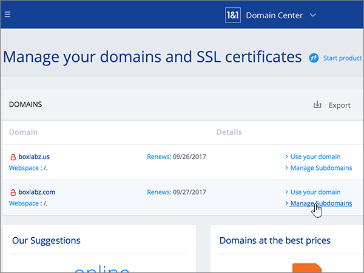

# Skapa DNS-poster på 1&1 IONOS för Microsoft

 **[Läs frågor och svar om domäner](../setup/domains-faq.yml)** om du inte hittar det du letar efter. 
  
> [!CAUTION]
> Observera att 1&1 IONOS inte tillåter en domän att ha både en MX-post och en automatisk identifiering av CNAME-poster. Detta begränsar hur du kan konfigurera Exchange Online för Microsoft. Det finns en lösning, men vi rekommenderar att du **bara** använder den om du redan har erfarenhet av att skapa under domäner vid 1&1 IONOS. > om trots den här [tjänst begränsningen](https://docs.microsoft.com/microsoft-365/admin/setup/domains-faq) du väljer att hantera dina egna Microsoft DNS-poster vid 1&1 IONOS, följer du stegen i den här artikeln för att verifiera din domän och konfigurera DNS-poster för e-post, Skype för företag – Online och så vidare. 
  
När du har lagt till dessa poster på 1&1 IONOS är domänen konfigurerad för att fungera med Microsoft-tjänster.
  
  
> [!NOTE]
> Det brukar ta omkring 15 minuter för DNS-ändringarna att gå igenom. Ibland kan det dock ta längre tid att uppdatera DNS-systemet på Internet för en ändring som du har gjort. Om du stöter på problem med e-postflödet eller får andra problem när du har lagt till DNS-posterna, går du till [Hitta och åtgärda problem när du har lagt till din domän eller DNS-poster i Microsoft](../get-help-with-domains/find-and-fix-issues.md). 
  
## Lägga till en TXT-post för verifiering

Innan du använder din domän med Microsoft, vill vi vara säkra på att det är du som äger den. Att du kan logga in på ditt konto hos domänregistratorn och skapa DNS-posten bevisar för Microsoft att du äger domänen.
  
> [!NOTE]
> Den här posten används endast för att verifiera att du äger domänen. Den påverkar ingenting annat. Du kan ta bort den senare om du vill. 
  
Följ stegen nedan eller [titta på videon (börja vid 0:42)](https://docs.microsoft.com/microsoft-365/admin/dns/create-dns-records-at-1-1-internet).
  
1. Kom igång genom att gå till sidan Domains på 1&1 IONOS med hjälp av [den här länken](https://my.1and1.com/). Du uppmanas att logga in.
    
2. Välj **Manage Domains**.
    
3. Leta reda på den domän som du vill uppdatera på sidan **Domain Center** och välj sedan **panel** kontrollen ( **v**) för den domänen.
    
4. Välj **Edit DNS Settings** i området **Domain Settings** .
    
5. Välj **Add Record** i avsnittet **txt and SRV Records** .
    
6. Gå till **Add Record**. I den nya postens rutor skriver du in, eller kopierar och klistrar in, värdena från följande tabell. 
    
    (Välj värdet för **Type** i listrutan.) 
    
    ||||
    |:-----|:-----|:-----|
    |**Typ**   |**Prefix**   |**Name Value**   |
    |TXT    |(Lämna det här fältet tomt)    |MS=ms *XXXXXXXX*    Obs! det här är ett exempel. Använd ditt specifika **Mål eller pekar på adress** värde här, från tabellen. [Hur hittar jag det här?](../get-help-with-domains/information-for-dns-records.md)          |
   
7. Välj **Spara**.
    
8. Välj **Spara** igen. 
    
9. Välj **Ja** i dialog rutan **Edit DNS Settings** .
    
10. Vänta några minuter innan du fortsätter, så att den post som du nyss skapade kan uppdateras på Internet.
    
Nu när du har lagt till posten på domänregistratorns webbplats går du tillbaka till Microsoft 365 och begär att Microsoft 365 letar efter posten.
  
När Microsoft hittar rätt TXT-post är din domän verifierad.
  
1. I Microsoft-administrationscentret går du till **Inställningar** \> <a href="https://go.microsoft.com/fwlink/p/?linkid=834818" target="_blank">Domäner</a>.

    
2. På sidan **Domains** väljer du den domän du verifierar. 
    
3. På sidan **Setup** väljer du **Start setup**.
    
4. På sidan **Verify domain** väljer du **Verify**.
    
> [!NOTE]
> Det brukar ta omkring 15 minuter för DNS-ändringarna att gå igenom. Ibland kan det dock ta längre tid att uppdatera DNS-systemet på Internet för en ändring som du har gjort. Om du stöter på problem med e-postflödet eller får andra problem när du har lagt till DNS-posterna, går du till [Hitta och åtgärda problem när du har lagt till din domän eller DNS-poster i Microsoft](../get-help-with-domains/find-and-fix-issues.md). 
  
## Lägga till en MX-post så att e-post för din domän kommer till Microsoft.

Följ stegen nedan eller [titta på videon (börja vid 3:22)](https://docs.microsoft.com/microsoft-365/admin/dns/create-dns-records-at-1-1-internet).
  
> [!NOTE]
> Om du har registrerat dig hos 1und1.de [loggar](https://go.microsoft.com/fwlink/?linkid=859152)du in här. 
  
1. Kom igång genom att gå till sidan Domains på 1&1 IONOS med hjälp av [den här länken](https://my.1and1.com/). Du uppmanas att logga in.
    
2. Välj **Manage Domains**.
    
3. Leta reda på den domän som du vill uppdatera på sidan **Domain Center** och välj sedan **panel** kontrollen ( **v**) för den domänen.
    
4. Välj **Edit DNS Settings** i området **Domain Settings** .
    
5. I avsnittet **MX Records** i området **Mail Exchanger (MX Record)** väljer du **other Mail Server**. (Du kan behöva rulla nedåt.)   
  
6. Om det förekommer några MX-poster sen tidigare tar du bort var och en genom att markera posten och sedan trycka på **Del**-tangenten. (Om det inte finns några MX-poster sen tidigare fortsätter du till nästa steg.)  
  
7. I rutorna för **MX 1**-posten skriver du in, eller kopierar och klistrar in, värdena från följande tabell. 
    
    |**MX 1**|**Priority (prioritet)**|
    |:-----|:-----|
    | *\<domain-key\>*  .mail.protection.outlook.com     Obs! hämta din \<domain-key\> från ditt Microsoft-konto. [Hur hittar jag det?](../get-help-with-domains/information-for-dns-records.md)          |10.3    Mer information om prioritet finns i [Vad är MX-prioritet?](https://docs.microsoft.com/microsoft-365/admin/setup/domains-faq)   | 
    
     
  
8. Välj **Spara**. (Du kan behöva rulla nedåt.) 
  
9. Välj **Ja** i dialog rutan **Edit DNS Settings** . 
  
## Lägga till de sex CNAME-posterna som krävs för Microsoft

1&1 IONOS kräver en lösning så att du kan använda en MX-post tillsammans med de CNAME-poster som krävs för Microsoft e-posttjänster. Denna lösning kräver att du skapar en uppsättning under domäner vid 1&1 IONOS och tilldelar dem till CNAME-poster.
  
> [!IMPORTANT]
> Kontrollera att du har minst två tillgängliga underdomäner innan du startar den här proceduren. Vi rekommenderar den här lösningen bara om du redan har erfarenhet av att skapa under domäner vid 1&1 IONOS. 
  
### Grundläggande CNAME-poster

Följ stegen nedan eller [titta på videon (börja vid 3:57)](https://docs.microsoft.com/microsoft-365/admin/dns/create-dns-records-at-1-1-internet).
  
> [!NOTE]
> Om du har registrerat dig hos 1und1.de [loggar](https://go.microsoft.com/fwlink/?linkid=859152)du in här. 
  
1. Kom igång genom att gå till sidan Domains på 1&1 IONOS med hjälp av [den här länken](https://my.1and1.com/). Du uppmanas att logga in.
    
2. Välj **Manage Domains**.
    
3. Leta reda på den domän som du vill uppdatera på sidan **domän Center** och välj sedan hantera under **domäner**.   Nu ska du skapa du två underdomäner och ange ett värde för **Alias** för var och en av dem. (Det här krävs eftersom 1&1 IONOS endast stöder en CNAME-post på toppnivå, men Microsoft kräver flera CNAME-poster.) Först måste du skapa Autodiscover-underdomänen.
    
4. I avsnittet under **domän översikt** väljer du **skapa under domän**.
    
    
  
5. I rutan **Create Subdomain** (skapa underdomän) för den nya underdomänen skriver du in, eller kopierar och klistrar in, endast värdet i **Skapa underdomän** från tabellen nedan. (Du kommer att lägga till värdet för **Alias** i ett senare steg.)

    |**Skapa underdomän**|**Alias**|
    |:-----|:-----|
    |autodiscover    |autodiscover.outlook.com   | 

    
  
6. Välj **skapa under domän**. 
  
7. Leta reda på den **Autodiscover** -underdomän som du just skapade i avsnittet **subdomain Overview** **(** under domän översikt).  
  
8. I området under **domän inställningar** väljer du **Edit DNS Settings**.  
  
9. Välj **CNAME** i området **IP Address (a Record)** i avsnittet **A/AAAA Records (IP-adresser)** . 
  
10. I rutan **Alias:** skriver du in, eller kopierar och klistrar in, värdet i **Alias** från tabellen nedan.  
    
    |**Skapa underdomän**|**Alias**|
    |:-----|:-----|
    |autodiscover    |autodiscover.outlook.com   |

    
  
11. Markera kryssrutan för ansvarsfriskrivningen **I am aware** (jag är medveten om). 
  
12. Välj **Spara**. 
  
  
### Ytterligare CNAME-poster

De ytterligare CNAME-poster som skapas i följande proceduren aktiverar Skype för företag - Online-tjänster. Du kan utföra samma steg som du använde för att skapa de två CNAME-poster som du redan har skapat.
  
1. Skapa den tredje underdomänen (Lyncdiscover). I avsnittet under **domän översikt** väljer du **skapa under domän**.
    
2. I rutan **Create Subdomain** (skapa underdomän) för den nya underdomänen skriver du in, eller kopierar och klistrar in, endast värdet i **Skapa underdomän** från tabellen nedan. (Du kommer att lägga till värdet för **Alias** i ett senare steg.)  
    
    |**Skapa underdomän**|**Alias**|
    |:-----|:-----|
    |lyncdiscover   |webdir.online.lync.com  |
   
3. Välj **skapa under domän**.
    
4. Välj **Hantera under domäner** på sidan **domän Center** .
    
5. Leta upp under domänen **Lyncdiscover** som du just skapade i avsnittet under **domän översikt** och välj sedan **panelen (v)** för den under domänen.  I området under **domän inställningar** väljer du **Edit DNS Settings**.
    
6. Välj **CNAME** i området **IP Address (a Record)** i avsnittet **A/AAAA Records (IP-adresser)** .
    
7. I rutan **Alias:** skriver du in, eller kopierar och klistrar in, värdet i **Alias** från tabellen nedan.  
    
    |**Skapa underdomän**|**Alias**|
    |:-----|:-----|
    |lyncdiscover    |webdir.online.lync.com    |
   
8. Markera kryss rutan för den **jag känner** till fri skrivning och välj sedan **Spara**.
    
9. Välj **Ja** i dialog rutan **Edit DNS Settings** .
    
10. Skapa den fjärde underdomänen (SIP):  I avsnittet under **domän översikt** väljer du **skapa under domän**.
    
11. I rutan **Create Subdomain** (skapa underdomän) för den nya underdomänen skriver du in, eller kopierar och klistrar in, endast värdet i **Skapa underdomän** från tabellen nedan. (Du kommer att lägga till värdet för **Alias** i ett senare steg.) 
    
    |**Skapa underdomän**|**Alias**|
    |:-----|:-----|
    |sip    |sipdir.online.lync.com    |
   
12. Välj **skapa under domän**.
    
13. Välj **Hantera under domäner** på sidan **domän Center** .
    
14. Leta upp den **SIP** -underdomän som du just skapade i avsnittet under **domän översikt** och välj sedan **panelen (v)** för den under domänen.  I området under **domän inställningar** väljer du **Edit DNS Settings**.
    
15. Välj **CNAME** i området **IP Address (a Record)** i avsnittet **A/AAAA Records (IP-adresser)** .
    
16. I rutan **Alias:** skriver du in, eller kopierar och klistrar in, värdet i **Alias** från tabellen nedan. 
    
    |**Skapa underdomän**|**Alias**|
    |:-----|:-----|
    |sip    |sipdir.online.lync.com    |
   
17. Markera kryss rutan för den **jag känner** till fri skrivning och välj sedan **Spara**.
    
18. Välj **Ja** i dialog rutan **Edit DNS Settings** .
    
### CNAME-poster som krävs för MDM

> [!IMPORTANT]
> Följ proceduren som används för de andra fyra CNAME-posterna, men använd värdena från följande tabell. 
  
|**Skapa underdomän**|**Alias**|
|:-----|:-----|
|enterpriseregistration    |enterpriseregistration.windows.net    |
|enterpriseenrollment    |enterpriseenrollment-s.manage.microsoft.com    |
   
## Lägga till en TXT-post för SPF för att förhindra skräppost

> [!IMPORTANT]
> Du kan inte ha fler än en TXT-post för SPF för en domän. Om din domän har fler än en SPF-post får du e-postfel och problem med leveranser och skräppostklassificering. Om du redan har en SPF-post för domänen ska du inte skapa en ny för Microsoft. I stället kan du lägga till de Microsoft-värden som krävs i den aktuella posten så att du har en  *enda*  SPF-post som innehåller båda uppsättningar med värden. Behöver du exempel? Ta en titt på dessa [externa DNS-poster för Microsoft](https://docs.microsoft.com/microsoft-365/enterprise/external-domain-name-system-records). Du kan validera SPF-posten genom att använda någon av dessa[SPF-verifierings verktyg](../setup/domains-faq.yml). 
  
Följ stegen nedan eller [titta på videon (börja vid 5:09)](https://docs.microsoft.com/microsoft-365/admin/dns/create-dns-records-at-1-1-internet).
  
> [!NOTE]
> Om du har registrerat dig hos 1und1.de [loggar](https://go.microsoft.com/fwlink/?linkid=859152)du in här. 
  
1. Kom igång genom att gå till sidan Domains på 1&1 IONOS med hjälp av [den här länken](https://my.1and1.com/). Du uppmanas att logga in.
    
2. Välj **Manage Domains**.
    
3. Leta reda på den domän som du vill uppdatera på sidan **Domain Center** och välj sedan **panel** kontrollen (**v**) för den domänen.
    
4. Välj **Edit DNS Settings** i området **Domain Settings** .
    
5. Välj **Add Record** i avsnittet **txt and SRV Records** .  (Du kan behöva rulla nedåt.)
    
6. Gå till **Add Record**. I den nya postens rutor skriver du in, eller kopierar och klistrar in, värdena från följande tabell.  (Välj värdet för **Type** i listrutan.)  
    
    |**Typ**|**Prefix**|**Name Value**|
    |:-----|:-----|:-----|
    |TXT    |(Lämna det här fältet tomt.)    |v=spf1 include:spf.protection.outlook.com -all    **Obs!** Vi rekommenderar att du kopierar och klistrar in den här posten så att alla avstånd förblir korrekta.               | 
    
    
  
7. Välj **Spara**. 
  
8. Välj **Spara**. 
  
9. Välj **Ja** i dialog rutan **Edit DNS Settings** . 
  
## Lägga till de två SRV-posterna som krävs för Microsoft

Följ stegen nedan eller [titta på videon (börja vid 5:51)](https://docs.microsoft.com/microsoft-365/admin/dns/create-dns-records-at-1-1-internet).
  
> [!NOTE]
> Om du har registrerat dig hos 1und1.de [loggar](https://go.microsoft.com/fwlink/?linkid=859152)du in här. 
  
1. Kom igång genom att gå till sidan Domains på 1&1 IONOS med hjälp av [den här länken](https://my.1and1.com/). Du uppmanas att logga in.
    
2. Välj **Manage Domains**.
    
3. Leta reda på den domän som du vill uppdatera på sidan **Domain Center** och välj sedan **panel** kontrollen ( **v**) för den domänen.
    
4. Välj **Edit DNS Settings** i området **Domain Settings** .
    
5. Välj **Add Record** i avsnittet **txt and SRV Records** .
    
6. Lägg till den första av de två SRV-posterna. I den nya postens rutor i området **Add Record** (lägg till post) skriver du in, eller kopierar och klistrar in, värdena från den första raden i tabellen nedan.  (Välj värdena **Type** och **TTL** i list rutan.) 
    
    |**Type (typ)**|**Service (tjänst)**|**Protocol (protokoll)**|**Name (namn)**|**Host (värd)**|**Prioritet**|**Vikt**|**Port**|**TTL**|
    |:-----|:-----|:-----|:-----|:-----|:-----|:-----|:-----|:-----|
    |SRV    |sip    |tls    |(Lämna det här fältet tomt.)    |sipdir.online.lync.com    |100    |9.1    |443    |3600 (1 h)    |
    |SRV    |sipfederationtls    |tcp    |(Lämna det här fältet tomt.)    |sipfed.online.lync.com    |100    |9.1    |5061    |3600 (1 h)    |  
    
    
  
7. Välj **Spara**.  
  
8. Välj **Spara**.  
  
9. Välj **Ja** i dialog rutan **Edit DNS Settings** .  
  
10. Lägg till den andra SRV-posten.  Välj **Add Record** i avsnittet **txt and SRV Records** .  I området **Add Record** skapar du en post med värdena från den andra raden i tabellen och väljer sedan **Lägg till**, **Spara** och **Ja** för att slutföra posten. 
    
> [!NOTE]
> Det brukar ta omkring 15 minuter för DNS-ändringarna att gå igenom. Ibland kan det dock ta längre tid att uppdatera DNS-systemet på Internet för en ändring som du har gjort. Om du stöter på problem med e-postflödet eller får andra problem när du har lagt till DNS-posterna, går du till [Hitta och åtgärda problem när du har lagt till din domän eller DNS-poster i Microsoft](../get-help-with-domains/find-and-fix-issues.md). 
  
