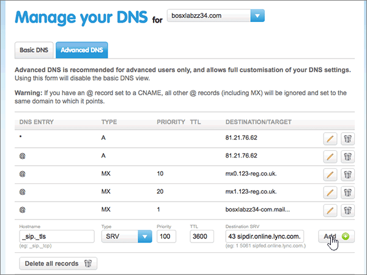

# Skapa DNS-poster på 123-reg.co.uk för MicrosoftCreate DNS records at 123-reg.co.uk for Microsoft

 **[Läs frågor och svar om domäner](../setup/domains-faq.md)** om du inte hittar det du letar efter.**[Check the Domains FAQ](../setup/domains-faq.md)** if you don't find what you're looking for. 
  
Om 123-reg.co.uk är din DNS-värd följer du stegen i den här artikeln för att verifiera din domän och konfigurera DNS-poster för e-post, Skype för företag – Online och så vidare.If 123-reg.co.uk is your DNS hosting provider, follow the steps in this article to verify your domain and set up DNS records for email, Skype for Business Online, and so on.
  
När du har lagt till dessa poster i 123-reg.co.uk konfigureras domänen så att den fungerar med Microsoft-tjänster.After you add these records at 123-reg.co.uk, your domain will be set up to work with Microsoft services.
  
Mer information om webbhotell och DNS för webbplatser med Microsoft finns i [Använda en offentlig webbplats med Microsoft](https://support.office.com/article/choose-a-public-website-3325d50e-d131-403c-a278-7f3296fe33a9).To learn about webhosting and DNS for websites with Microsoft, see [Use a public website with Microsoft](https://support.office.com/article/choose-a-public-website-3325d50e-d131-403c-a278-7f3296fe33a9).
  
> [!NOTE]
> Det brukar ta ungefär 15 minuter för DNS-ändringarna att gå igenom.Typically it takes about 15 minutes for DNS changes to take effect. Ibland kan det dock ta längre tid att uppdatera DNS-systemet på Internet för en ändring som du har gjort.However, it can occasionally take longer for a change you've made to update across the Internet's DNS system. Om du har problem med e-postflödet eller andra problem när du har lagt till DNS-poster läser du [Hitta och åtgärda problem när du har lagt till domänen eller DNS-posterna](../get-help-with-domains/find-and-fix-issues.md).If you're having trouble with mail flow or other issues after adding DNS records, see [Find and fix issues after adding your domain or DNS records](../get-help-with-domains/find-and-fix-issues.md). 
  
## Lägga till en TXT-post för verifieringAdd a TXT record for verification

Innan du använder domänen med Microsoft måste vi se till att du äger den.Before you use your domain with Microsoft, we have to make sure that you own it. Din förmåga att logga in på ditt konto hos domänregistratorer och skapa DNS-posten bevisar för Microsoft att du äger domänen.Your ability to log in to your account at your domain registrar and create the DNS record proves to Microsoft that you own the domain.
  
> [!NOTE]
> Den här posten används endast för att verifiera att du äger domänen. Den påverkar ingenting annat. Du kan ta bort den senare om du vill.This record is used only to verify that you own your domain; it doesn't affect anything else. You can delete it later, if you like. 
  
1. Kom igång genom att gå till domänsidan på 123-reg.co.uk genom att klicka på [den här länken](https://www.123-reg.co.uk/secure/cpanel/domain/overview). Du uppmanas att logga in först.To get started, go to your domains page at 123-reg.co.uk by using [this link](https://www.123-reg.co.uk/secure/cpanel/domain/overview). You'll be prompted to log in first.
    
2. På sidan **Domännamnsöversikt** markerar du namnet på den domän du vill redigera.On the **Domain name overview** page, select the name of the domain that you want to edit. 
    
3. Välj **DNS** i listrutan **Välj åtgärd**.Choose **DNS** from the **Select action** drop-down list. 
    
4. Välj fliken **Avancerat DNS** på sidan **Hantera DNS.**On the **Manage your DNS** page, select the **Advanced DNS** tab. 
    
5. Gå till avsnittet **Advanced DNS**. I den nya postens rutor skriver du in, eller kopierar och klistrar in, värdena från följande tabell.In the **Advanced DNS** section, in the boxes for the new record, type or copy and paste the values from the following table. 
    
    (Välj värdet för **Type** i listrutan.)(Choose the **Type** value from the drop-down list.) 
    
    ||||
    |:-----|:-----|:-----|
    |**Hostname****Hostname**   |**Type****Type**   |**Destination TXT/SPF****Destination TXT/SPF**   |
    |@    |TXT/SPFTXT/SPF    |MS=ms *XXXXXXXX*MS=ms *XXXXXXXX*    **Obs!** Det här är ett exempel.**Note:** This is an example. Använd ditt specifika **mål- eller poäng till-adress-värde** här, från bordet.Use your specific **Destination or Points to Address** value here, from the table. [Hur hittar jag det här?How do I find this?](../get-help-with-domains/information-for-dns-records.md)          |
   
6. Välj **Lägg till**.Select **Add**.
    
7. Vänta några minuter innan du fortsätter, så att den post som du nyss skapade kan uppdateras på Internet.Wait a few minutes before you continue, so that the record you just created can update across the Internet.
    
Nu när du har lagt till posten på domänregistratorerns webbplats går du tillbaka till Microsoft och begär en sökning efter posten.Now that you've added the record at your domain registrar's site, you'll go back to Microsoft and request a search for the record.
  
När Microsoft hittar rätt TXT-post verifieras domänen.When Microsoft finds the correct TXT record, your domain is verified.
  
1. Gå till sidan **Inställningar** \> domäner i <a href="https://go.microsoft.com/fwlink/p/?linkid=834818" target="_blank">Microsofts administrationscenter.</a>In the Microsoft admin center, go to the **Settings** \> <a href="https://go.microsoft.com/fwlink/p/?linkid=834818" target="_blank">Domains</a> page.

    
2. På sidan **Domains** väljer du den domän du verifierar.On the **Domains** page, select the domain that you are verifying. 
    
3. På sidan **Setup** väljer du **Start setup**.On the **Setup** page, select **Start setup**.
    
4. På sidan **Verify domain** väljer du **Verify**.On the **Verify domain** page, select **Verify**.
    
> [!NOTE]
> Det brukar ta ungefär 15 minuter för DNS-ändringarna att gå igenom.Typically it takes about 15 minutes for DNS changes to take effect. Ibland kan det dock ta längre tid att uppdatera DNS-systemet på Internet för en ändring som du har gjort.However, it can occasionally take longer for a change you've made to update across the Internet's DNS system. Om du har problem med e-postflödet eller andra problem när du har lagt till DNS-poster läser du [Hitta och åtgärda problem när du har lagt till domänen eller DNS-posterna](../get-help-with-domains/find-and-fix-issues.md).If you're having trouble with mail flow or other issues after adding DNS records, see [Find and fix issues after adding your domain or DNS records](../get-help-with-domains/find-and-fix-issues.md). 
  
## Lägg till en MX-post så att e-post för din domän kommer till MicrosoftAdd an MX record so email for your domain will come to Microsoft

1. Kom igång genom att gå till domänsidan på 123-reg.co.uk genom att klicka på [den här länken](https://www.123-reg.co.uk/secure/cpanel/domain/overview).To get started, go to your domains page at 123-reg.co.uk by using [this link](https://www.123-reg.co.uk/secure/cpanel/domain/overview). Du uppmanas att logga in först.You'll be prompted to log in first.
    
2. På sidan **Domännamnsöversikt** markerar du namnet på den domän du vill redigera.On the **Domain name overview** page, select the name of the domain that you want to edit. 
    
3. Välj **DNS** i listrutan **Välj åtgärd**.Choose **DNS** from the **Select action** drop-down list. 
    
4. Välj fliken **Avancerat DNS** på sidan **Hantera DNS.**On the **Manage your DNS** page, select the **Advanced DNS** tab. 
    
5. Gå till avsnittet **Advanced DNS**. I den nya postens rutor skriver du in, eller kopierar och klistrar in, värdena från följande tabell.In the **Advanced DNS** section, in the boxes for the new record, type or copy and paste the values from the following table. 
    
    (Välj värdet för **Type** i listrutan.)(Choose the **Type** value from the drop-down list.) 
    
    |**Hostname****Hostname**|**Type****Type**|**Priority****Priority**|**Destination MX****Destination MX**|
    |:-----|:-----|:-----|:-----|
    |@    |MXMX    |11    Mer information om prioritet finns i [Vad är MX-prioritet?](https://support.office.com/article/2784cc4d-95be-443d-b5f7-bb5dd867ba83.aspx)For more information about priority, see [What is MX priority?](https://support.office.com/article/2784cc4d-95be-443d-b5f7-bb5dd867ba83.aspx)   | *\<domännyckel\>*  .mail.protection.outlook.com.*\<domain-key\>*  .mail.protection.outlook.com.    **Värdet MÅSTE sluta med en punkt (.)****This value MUST end with a period (.)**   **Anm.:** Hämta \<domännyckeln\> från ditt Microsoft-konto.**Note:** Get your \<domain-key\> from your Microsoft account. [Hur hittar jag det här?How do I find this?](../get-help-with-domains/information-for-dns-records.md)          |
   
    
  
6. Välj **Lägg till**.Select **Add**.
    
    
  
7. Om det finns några andra MX-poster tar du bort var och en genom att välja ikonen **Ta bort (papperskorgen)** för den posten.If there are any other MX records, remove each one by choosing the **Delete (trash can)** icon for that record. 
    
    
  
## Lägga till de sex CNAME-poster som krävs för MicrosoftAdd the six CNAME records that are required for Microsoft

1. Kom igång genom att gå till domänsidan på 123-reg.co.uk genom att klicka på [den här länken](https://www.123-reg.co.uk/secure/cpanel/domain/overview).To get started, go to your domains page at 123-reg.co.uk by using [this link](https://www.123-reg.co.uk/secure/cpanel/domain/overview). Du uppmanas att logga in först.You'll be prompted to log in first.
    
2. På sidan **Domännamnsöversikt** markerar du namnet på den domän du vill redigera.On the **Domain name overview** page, select the name of the domain that you want to edit. 
    
3. Välj **DNS** i listrutan **Välj åtgärd**.Choose **DNS** from the **Select action** drop-down list. 
    
4. Välj fliken **Avancerat DNS** på sidan **Hantera DNS.**On the **Manage your DNS** page, select the **Advanced DNS** tab. 
    
5. Lägg till den första av de sex CNAME-posterna.Add the first of the six CNAME records.
    
    Gå till avsnittet **Advanced DNS**. I den nya postens rutor skriver du in, eller kopierar och klistrar in, värdena från följande tabell.In the **Advanced DNS** section, in the boxes for the new record, type or copy and paste the values from the following table. 
    
    (Välj värdet för **Type** i listrutan.)(Choose the **Type** value from the drop-down list.) 
    
    |**Hostname****Hostname**|**Type****Type**|**Mål CNAME****Destination CNAME**|
    |:-----|:-----|:-----|
    |autodiscoverautodiscover    |CNAMECNAME    |autodiscover.outlook.com.autodiscover.outlook.com.    **Värdet MÅSTE sluta med en punkt (.)****This value MUST end with a period (.)**   |
    |sipsip    |CNAMECNAME    |sipdir.online.lync.com.sipdir.online.lync.com.    **Värdet MÅSTE sluta med en punkt (.)****This value MUST end with a period (.)**   |
    |lyncdiscoverlyncdiscover    |CNAMECNAME    |webdir.online.lync.com.webdir.online.lync.com.    **Värdet MÅSTE sluta med en punkt (.)****This value MUST end with a period (.)**   |
    |enterpriseregistrationenterpriseregistration    |CNAMECNAME    |enterpriseregistration.windows.net.enterpriseregistration.windows.net.    **Värdet MÅSTE sluta med en punkt (.)****This value MUST end with a period (.)**   |
    |enterpriseenrollmententerpriseenrollment    |CNAMECNAME    |enterpriseenrollment-s.manage.microsoft.com.enterpriseenrollment-s.manage.microsoft.com.    **Värdet MÅSTE sluta med en punkt (.)****This value MUST end with a period (.)**   |
   
    
  
6. Välj **Lägg till**.Select **Add**.
    
    
  
7. Lägg till de andra fem CNAME-posterna.Add the other five CNAME records.
    
    Skapa en post med värdena från nästa rad i tabellen i avsnittet **Avancerad DNS** och välj sedan **Lägg** till igen för att slutföra posten.In the **Advanced DNS** section, create a record using the values from the next row in the table, and then again select **Add** to complete that record. 
    
    Upprepa proceduren tills du har skapat alla sex CNAME-posterna.Repeat this process until you have created all six CNAME records.
    
## Lägga till en TXT-post för SPF för att förhindra skräppostAdd a TXT record for SPF to help prevent email spam

> [!IMPORTANT]
> Du kan inte ha fler än en TXT-post för SPF för en domän.You cannot have more than one TXT record for SPF for a domain. Om din domän har fler än en SPF-post får du e-postfel och problem med leveranser och skräppostklassificering.If your domain has more than one SPF record, you'll get email errors, as well as delivery and spam classification issues. Om du redan har en SPF-post för din domän ska du inte skapa en ny för Microsfot.If you already have an SPF record for your domain, don't create a new one for Microsfot. Lägg i stället till de nödvändiga Microsoft-värdena i den aktuella posten så att du har en *enda* SPF-post som innehåller båda uppsättningarna värden.Instead, add the required Microsoft values to the current record so that you have a  *single*  SPF record that includes both sets of values. Behöver du exempel?Need examples? Kolla in dessa [externa domännamnssystemposter för Microsoft](https://support.office.com/article/c0531a6f-9e25-4f2d-ad0e-a70bfef09ac0#bkmk_spfrecords).Check out these [External Domain Name System records for Microsoft](https://support.office.com/article/c0531a6f-9e25-4f2d-ad0e-a70bfef09ac0#bkmk_spfrecords). Om du vill validera SPF-posten kan du använda något av dessa [SPF-valideringsverktyg](../setup/domains-faq.md).To validate your SPF record, you can use one of these [SPF validation tools](../setup/domains-faq.md). 
  
1. Kom igång genom att gå till domänsidan på 123-reg.co.uk genom att klicka på [den här länken](https://www.123-reg.co.uk/secure/cpanel/domain/overview).To get started, go to your domains page at 123-reg.co.uk by using [this link](https://www.123-reg.co.uk/secure/cpanel/domain/overview). Du uppmanas att logga in först.You'll be prompted to log in first.
    
2. På sidan **Domännamnsöversikt** markerar du namnet på den domän du vill redigera.On the **Domain name overview** page, select the name of the domain that you want to edit. 
    
3. Välj **DNS** i listrutan **Välj åtgärd**.Choose **DNS** from the **Select action** drop-down list. 
    
4. Välj fliken **Avancerat DNS** på sidan **Hantera DNS.**On the **Manage your DNS** page, select the **Advanced DNS** tab. 
    
5. Gå till avsnittet **Advanced DNS**. I den nya postens rutor skriver du in, eller kopierar och klistrar in, värdena från följande tabell.In the **Advanced DNS** section, in the boxes for the new record, type or copy and paste the values from the following table. 
    
    (Välj värdet för **Type** i listrutan.)(Choose the **Type** value from the drop-down list.) 
    
    |**Hostname****Hostname**|**Type****Type**|**Destination TXT/SPF****Destination TXT/SPF**|
    |:-----|:-----|:-----|
    |@    |TXT/SPFTXT/SPF    |v=spf1 include:spf.protection.outlook.com -allv=spf1 include:spf.protection.outlook.com -all    **Obs!** Vi rekommenderar att du kopierar och klistrar in den här posten så att alla avstånd förblir korrekta.    **Note:** We recommend copying and pasting this entry, so that all of the spacing stays correct.           |
   
    
  
6. Välj **Lägg till**.Select **Add**.
    
    
  
## Lägg till de två SRV-poster som krävs för MicrosoftAdd the two SRV records that are required for Microsoft

1. Kom igång genom att gå till domänsidan på 123-reg.co.uk genom att klicka på [den här länken](https://www.123-reg.co.uk/secure/cpanel/domain/overview).To get started, go to your domains page at 123-reg.co.uk by using [this link](https://www.123-reg.co.uk/secure/cpanel/domain/overview). Du uppmanas att logga in först.You'll be prompted to log in first.
    
2. På sidan **Domännamnsöversikt** markerar du namnet på den domän du vill redigera.On the **Domain name overview** page, select the name of the domain that you want to edit. 
    
3. Välj **DNS** i listrutan **Välj åtgärd**.Choose **DNS** from the **Select action** drop-down list. 
    
4. Välj fliken **Avancerat DNS** på sidan **Hantera DNS.**On the **Manage your DNS** page, select the **Advanced DNS** tab. 
    
5. Lägg till den första av de två SRV-posterna:Add the first of the two SRV records:
    
    Gå till avsnittet **Advanced DNS**. I den nya postens rutor skriver du in, eller kopierar och klistrar in, värdena från följande tabell.In the **Advanced DNS** section, in the boxes for the new record, type or copy and paste the values from the following table. 
    
    (Välj värdet för **Type** i listrutan.)(Choose the **Type** value from the drop-down list.) 
    
    ||||||
    |:-----|:-----|:-----|:-----|:-----|
    |HostnameHostname|Type (Typ)Type|PriorityPriority|TTLTTL|Destination SRVDestination SRV|
    |_sip._tls_sip._tls|SRVSRV|100100|36003600|1 443 sipdir.online.lync.com.1 443 sipdir.online.lync.com. **Värdet MÅSTE sluta med en punkt (.)****This value MUST end with a period (.)**  **Obs!** Vi rekommenderar att du kopierar och klistrar in den här posten så att alla avstånd förblir korrekta.    **Note:** We recommend copying and pasting this entry, so that all of the spacing stays correct.           |
    |_sipfederationtls._tcp_sipfederationtls._tcp|SRVSRV|100100|36003600|1 5061 sipfed.online.lync.com.1 5061 sipfed.online.lync.com. **Värdet MÅSTE sluta med en punkt (.)****This value MUST end with a period (.)**   **Obs!** Vi rekommenderar att du kopierar och klistrar in den här posten så att alla avstånd förblir korrekta.    **Note:** We recommend copying and pasting this entry, so that all of the spacing stays correct.           |
   
    
  
6. Välj **Lägg till**.Select **Add**.
    
    
  
7. Lägg till den andra SRV-posten:To add the other SRV record:
    
    Skapa en post i avsnittet **Avancerad DNS** med hjälp av värdena från den andra raden i tabellen och välj sedan **Lägg** till igen för att slutföra posten.In the **Advanced DNS** section, create a record by using the values from the second row in the table, and then again select **Add** to complete that record. 
    
> [!NOTE]
> Det brukar ta ungefär 15 minuter för DNS-ändringarna att gå igenom.Typically it takes about 15 minutes for DNS changes to take effect. Ibland kan det dock ta längre tid att uppdatera DNS-systemet på Internet för en ändring som du har gjort.However, it can occasionally take longer for a change you've made to update across the Internet's DNS system. Om du har problem med e-postflödet eller andra problem när du har lagt till DNS-poster läser du [Hitta och åtgärda problem när du har lagt till domänen eller DNS-posterna](../get-help-with-domains/find-and-fix-issues.md).If you're having trouble with mail flow or other issues after adding DNS records, see [Find and fix issues after adding your domain or DNS records](../get-help-with-domains/find-and-fix-issues.md). 
  
