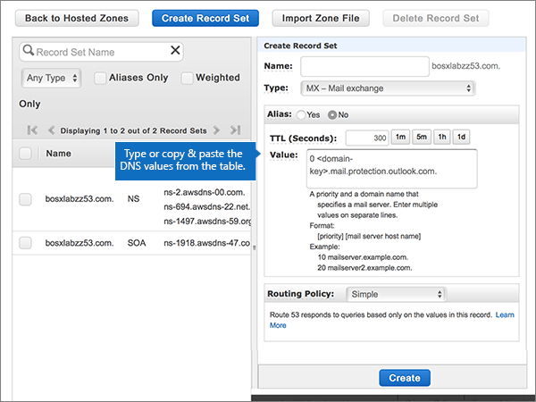

# Skapa DNS-poster på Amazon Web Services (AWS) för Microsoft

 **[Läs frågor och svar om domäner](../setup/domains-faq.md)** om du inte hittar det du letar efter. 
  
Om AWS är din DNS-värd följer du stegen i den här artikeln för att verifiera din domän och konfigurera DNS-poster för e-post, Skype Online för företag och så vidare.
  
När du har lagt till dessa poster på AWS konfigureras domänen så att den fungerar med Microsoft-tjänster.
  
Mer information om webbhotell och DNS för webbplatser med Microsfot finns i [Använda en offentlig webbplats med Microsoft](https://support.office.com/article/choose-a-public-website-3325d50e-d131-403c-a278-7f3296fe33a9).
  
> [!NOTE]
> Det brukar ta ungefär 15 minuter för DNS-ändringarna att gå igenom. Ibland kan det dock ta längre tid att uppdatera DNS-systemet på Internet för en ändring som du har gjort. Om du har problem med e-postflödet eller andra problem när du har lagt till DNS-poster läser du [Hitta och åtgärda problem när du har lagt till domänen eller DNS-posterna](../get-help-with-domains/find-and-fix-issues.md). 
  
## Lägga till en TXT-post för verifiering

Innan du använder domänen med Microsoft måste vi se till att du äger den. Din förmåga att logga in på ditt konto hos domänregistratorer och skapa DNS-posten bevisar för Microsoft att du äger domänen.
  
> [!NOTE]
> Den här posten används endast för att verifiera att du äger domänen. Den påverkar ingenting annat. Du kan ta bort den senare om du vill. 
  
1. Kom igång genom att gå till domänsidan på AWS genom att klicka på [den här länken](https://console.aws.amazon.com/route53/home). Du uppmanas att logga in först.
    
2. På sidan **Resurser** väljer du **Värdzoner**.
    
3. Välj namnet på den domän som du vill redigera i kolumnen Domännamn på sidan ** Värdbaserade zoner ** i kolumnen **Domännamn.** 
    
4. Välj **Skapa postuppsättning**.
    
5. I **Create Record Set** skriver du in, eller kopierar och klistrar in, värdena från följande tabell i fälten för den nya posten. 
    
    (Välj värdena för **Type** och **Routing Policy** i listrutorna.) 
    
    > [!TIP]
    > Citattecken som krävs enligt anvisningarna på skärmen anges automatiskt. Du behöver inte skriva in dem manuellt. 
  
    |||||||
    |:-----|:-----|:-----|:-----|:-----|:-----|
    |**Name**   |**Type (Typ)**   |**Alias**   |**TTL (sekunder)**   |**Värde**   |**Routing Policy (Routningsprincip)**   |
    |(Lämna det här fältet tomt.)    |TXT - text    |Nej    |300    |MS=ms *XXXXXXXX*   **Obs!** Det här är ett exempel. Använd ditt specifika **mål- eller poäng till-adress-värde** här, från tabellen i Microsoft 365. [Hur hittar jag det?](../get-help-with-domains/information-for-dns-records.md)          |Enkelt    |
   
6. Välj **Skapa**.
    
7. Vänta några minuter innan du fortsätter, så att den post som du nyss skapade kan uppdateras på Internet.
    
Nu när du har lagt till posten på domänregistratorerns webbplats går du tillbaka till Microsoft och begär en sökning efter posten.
  
När Microsoft hittar rätt TXT-post verifieras domänen.
  
1. Gå till sidan **Inställningar** \> domäner i <a href="https://go.microsoft.com/fwlink/p/?linkid=834818" target="_blank">Microsofts administrationscenter.</a>

    
2. På sidan **Domains** väljer du den domän du verifierar. 
    
3. På sidan **Setup** väljer du **Start setup**.
    
4. På sidan **Verify domain** väljer du **Verify**.
    
> [!NOTE]
> Det brukar ta ungefär 15 minuter för DNS-ändringarna att gå igenom. Ibland kan det dock ta längre tid att uppdatera DNS-systemet på Internet för en ändring som du har gjort. Om du har problem med e-postflödet eller andra problem när du har lagt till DNS-poster läser du [Hitta och åtgärda problem när du har lagt till domänen eller DNS-posterna](../get-help-with-domains/find-and-fix-issues.md). 
  
## Lägg till en MX-post så att e-post för din domän kommer till Microsoft 365

1. Kom igång genom att gå till domänsidan på AWS genom att klicka på [den här länken](https://console.aws.amazon.com/route53/home). Du uppmanas att logga in först.
    
2. På sidan **Resurser** väljer du **Värdzoner**.
    
3. Välj namnet på den domän som du vill redigera i kolumnen **Domännamn** på sidan **Värdzoner.** 
    
4. Välj **Skapa postuppsättning**.
    
5. I **Create Record Set** skriver du in, eller kopierar och klistrar in, värdena från följande tabell i fälten för den nya posten. 
    
    (Välj värdena för **Type** och **Routing Policy** i listrutorna.) 
    
    |**Name (Namn)**|**Type (Typ)**|**Alias**|**TTL (sekunder)**|**Värde**|**Routing Policy (Routningsprincip)**|
    |:-----|:-----|:-----|:-----|:-----|:-----|
    |(Lämna det här fältet tomt.)    |MX - Mail exchange    |Nej    |300    |0  *\<domain-key\>*  .mail.protection.outlook.com.    0 motsvarar MX-prioritetsvärdet. Skriv 0 i början av MX-värdet och infoga ett blanksteg före resten av värdet.    **Värdet MÅSTE sluta med en punkt (.)**   **Anm.:** Hämta \< *domännyckeln* \> från ditt Microsoft 365-konto. [Hur hittar jag det?](../get-help-with-domains/information-for-dns-records.md)          |Enkelt    |
       
    
  
6. Välj **Skapa**.
    
    
  
7. Om det finns andra MX-poster tar du bort dem.
    
    > [!IMPORTANT]
    > AWS lagrar MX-poster som en uppsättning som kan innehålla flera poster. Välj **INTE** **Ta bort postuppsättning,** eftersom det kommer att ta bort alla dina MX-poster, inklusive den du just lagt till. Använd följande instruktioner i stället. 
  
    Välj först MX-postuppsättningen.
    
    
  
    I **Edit Record Set** tar du sedan bort inaktuella MX-poster genom att markera respektive post i rutan **Value** och sedan trycka på **Delete** på tangentbordet. 
    
    
  
8. Välj **Spara postuppsättning**.
    
    
  
## Lägga till de fem CNAME-poster som krävs för Microsoft 365

1. Kom igång genom att gå till domänsidan på AWS genom att klicka på [den här länken](https://console.aws.amazon.com/route53/home). Du uppmanas att logga in först.
    
2. På sidan **Resurser** väljer du **Värdzoner**.
    
3. Välj namnet på den domän som du vill redigera i kolumnen **Domännamn** på sidan **Värdzoner.** 
    
4. Välj **Skapa postuppsättning**.
    
5. Lägg till den första CNAME-posten.
    
    I **Create Record Set** skriver du in, eller kopierar och klistrar in, värdena från den första raden i följande tabell i fälten för den nya posten. 
    
    (Välj värdena för **Type** och **Routing Policy** i listrutorna.) 
    
    |**Name (Namn)**|**Type (Typ)**|**Alias**|**TTL (sekunder)**|**Värde**|**Routing Policy (Routningsprincip)**|
    |:-----|:-----|:-----|:-----|:-----|:-----|
    |autodiscover    |CNAME - Canonical name    |No    |300    |autodiscover.outlook.com.    **Värdet MÅSTE sluta med en punkt (.)**   |Simple    |
    |sip    |CNAME - Canonical name    |No    |300    |sipdir.online.lync.com.    **Värdet MÅSTE sluta med en punkt (.)**   |Enkelt    |
    |lyncdiscover    |CNAME - Canonical name    |Nej    |300    |webdir.online.lync.com.    **Värdet MÅSTE sluta med en punkt (.)**   |Enkelt    |
    |enterpriseregistration    |CNAME - Canonical name    |Nej    |300    |enterpriseregistration.windows.net.    **Värdet MÅSTE sluta med en punkt (.)**   |Simple    |
    |enterpriseenrollment    |CNAME - Canonical name    |Nej    |300    |enterpriseenrollment-s.manage.microsoft.com.    **Värdet MÅSTE sluta med en punkt (.)**   |Enkelt    |
   
    
  
6. Välj **Skapa**.
    
    
  
7. Lägg till de andra fyra CNAME-posterna.
    
    På sidan **Värdzoner** väljer du **Skapa postuppsättning,** skapar en post med värdena från nästa rad i tabellen och väljer sedan **Skapa** igen för att slutföra posten. 
    
    Upprepa den här processen tills du har skapat alla fem CNAME-poster.
    
## Lägga till en TXT-post för SPF för att förhindra skräppost

> [!IMPORTANT]
> Du kan inte ha fler än en TXT-post för SPF för en domän. Om din domän har fler än en SPF-post får du e-postfel och problem med leveranser och skräppostklassificering. Om du redan har en SPF-post för domänen ska du inte skapa en ny för Microsoft. Lägg i stället till de nödvändiga Microsoft-värdena i den aktuella posten så att du har en *enda* SPF-post som innehåller båda uppsättningarna värden. Behöver du exempel? Kolla in dessa [externa domännamnssystemposter för Microsoft](https://support.office.com/article/c0531a6f-9e25-4f2d-ad0e-a70bfef09ac0). Om du vill validera SPF-posten kan du använda något av dessa[SPF-valideringsverktyg](../setup/domains-faq.md). 
  
1. Kom igång genom att gå till domänsidan på AWS genom att klicka på [den här länken](https://console.aws.amazon.com/route53/home). Du uppmanas att logga in först.
    
2. På sidan **Resurser** väljer du **Värdzoner**.
    
3. Välj namnet på den domän som du vill redigera i kolumnen **Domännamn** på sidan **Värdzoner.** 
    
4. Välj **TXT-postuppsättningen.** 
    
    
  
5. Tryck på Retur på tangentbordet om du vill skapa en ny rad i området **Edit Record Set** i slutet av den aktuella inmatningen i rutan **Value:** för den befintliga posten. Skriv eller kopiera och klistra sedan in värdet från följande tabell på den nya raden (under det befintliga värdet). (Du kan se ett exempel i bilden under tabellen.) 
    
    |**Värde:**|
    |:-----|
    |v=spf1 include:spf.protection.outlook.com -all    (Citattecken som krävs enligt anvisningarna på skärmen anges automatiskt. Du behöver inte skriva in dem manuellt.)    **Obs!** Vi rekommenderar att du kopierar och klistrar in den här posten så att alla avstånd förblir korrekta.               |
   
    
  
6. Välj **Spara postuppsättning**.
    
    
  
## Lägg till de två SRV-poster som krävs för Microsoft 365

1. Kom igång genom att gå till domänsidan på AWS genom att klicka på [den här länken](https://console.aws.amazon.com/route53/home). Du uppmanas att logga in först.
    
2. På sidan **Resurser** väljer du **Värdzoner**.
    
3. Välj namnet på den domän som du vill redigera i kolumnen **Domännamn** på sidan **Värdzoner.** 
    
4. Välj **Skapa postuppsättning**.
    
5. Lägg till den första SRV-posten:
    
    I **Create Record Set** skriver du in, eller kopierar och klistrar in, värdena från den första raden i följande tabell i fälten för den nya posten. 
    
    (Välj värdena för **Type** och **Routing Policy** i listrutorna.) 
    
    |**Name (Namn)**|**Type (Typ)**|**Alias**|**TTL (sekunder)**|**Värde**|**Routing Policy (Routningsprincip)**|
    |:-----|:-----|:-----|:-----|:-----|:-----|
    |_sip._tls|SRV - Service locator|No|300|100 1 443 sipdir.online.lync.com. **Det här värdet MÅSTE sluta med en punkt (.)**>  **Obs!** Vi rekommenderar att du kopierar och klistrar in den här posten så att alla avstånd förblir korrekta.               |Enkelt|
    |_sipfederationtls._tcp|SRV - Service locator|No|300|100 1 5061 sipfed.online.lync.com. **Värdet MÅSTE sluta med en punkt (.)**  **Obs!** Vi rekommenderar att du kopierar och klistrar in den här posten så att alla avstånd förblir korrekta.               |Enkelt|
   
    
  
6. Välj **Skapa**.
    
    
  
7. Lägg till den andra SRV-posten:
    
    På sidan **Värdzoner** väljer du **Skapa postuppsättning,** skapar en post med värdena från nästa rad i tabellen och väljer sedan **Skapa** igen för att slutföra posten. 
    
> [!NOTE]
> Det brukar ta ungefär 15 minuter för DNS-ändringarna att gå igenom. Ibland kan det dock ta längre tid att uppdatera DNS-systemet på Internet för en ändring som du har gjort. Om du har problem med e-postflödet eller andra problem när du har lagt till DNS-poster läser du [Hitta och åtgärda problem när du har lagt till domänen eller DNS-posterna](../get-help-with-domains/find-and-fix-issues.md). 
  
