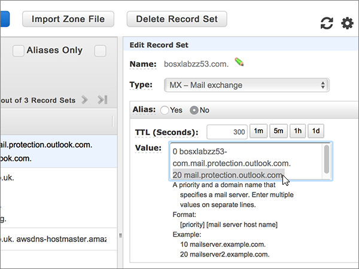

# Skapa DNS-poster på Amazon Web Services (AWS) för MicrosoftCreate DNS records at Amazon Web Services (AWS) for Microsoft

 **[Läs frågor och svar om domäner](../setup/domains-faq.md)** om du inte hittar det du letar efter.**[Check the Domains FAQ](../setup/domains-faq.md)** if you don't find what you're looking for. 
  
Om AWS är din DNS-värd följer du stegen i den här artikeln för att verifiera din domän och konfigurera DNS-poster för e-post, Skype online för företag och så vidare.If AWS is your DNS hosting provider, follow the steps in this article to verify your domain and set up DNS records for email, Skype Online for Business, and so on.
  
När du har lagt till dessa poster på AWS är din domän konfigurerad för att fungera med Microsoft-tjänster.After you add these records at AWS, your domain will be set up to work with Microsoft services.
  

  
> [!NOTE]
> Det brukar ta omkring 15 minuter för DNS-ändringarna att gå igenom. Ibland kan det dock ta längre tid att uppdatera DNS-systemet på Internet för en ändring som du har gjort. Om du stöter på problem med e-postflödet eller får andra problem när du har lagt till DNS-posterna, går du till [Hitta och åtgärda problem när du har lagt till din domän eller DNS-poster i Microsoft](../get-help-with-domains/find-and-fix-issues.md).Typically it takes about 15 minutes for DNS changes to take effect. However, it can occasionally take longer for a change you've made to update across the Internet's DNS system. If you're having trouble with mail flow or other issues after adding DNS records, see [Find and fix issues after adding your domain or DNS records](../get-help-with-domains/find-and-fix-issues.md). 
  
## Lägga till en TXT-post för verifieringAdd a TXT record for verification

Innan du använder din domän med Microsoft, vill vi vara säkra på att det är du som äger den. Att du kan logga in på ditt konto hos domänregistratorn och skapa DNS-posten bevisar för Microsoft att du äger domänen.Before you use your domain with Microsoft, we have to make sure that you own it. Your ability to log in to your account at your domain registrar and create the DNS record proves to Microsoft that you own the domain.
  
> [!NOTE]
> Den här posten används endast för att verifiera att du äger domänen. Den påverkar ingenting annat. Du kan ta bort den senare om du vill.This record is used only to verify that you own your domain; it doesn't affect anything else. You can delete it later, if you like. 
  
1. Kom igång genom att gå till domänsidan på AWS genom att klicka på [den här länken](https://console.aws.amazon.com/route53/home). Du uppmanas att logga in först.To get started, go to your domains page at AWS by using [this link](https://console.aws.amazon.com/route53/home). You'll be prompted to log in first.
    
2. På sidan **resurser** väljer du **värd zoner**.On the **Resources** page, select **Hosted Zones**.
    
3. Välj namnet på den domän som du vill redigera i kolumnen **domän namn** på sidan **värdbaserade zoner** .On the **Hosted Zones** page, in the **Domain Name** column, select the name of the domain that you want to edit. 
    
4. Välj **skapa post uppsättning**.Select **Create Record Set**.
    
5. I **Create Record Set** skriver du in, eller kopierar och klistrar in, värdena från följande tabell i fälten för den nya posten.In the **Create Record Set** area, in the boxes for the new record, type or copy and paste the values from the following table. 
    
    (Välj värdena för **Type** och **Routing Policy** i listrutorna.)(Choose the **Type** and **Routing Policy** values from the drop-down lists.) 
    
    > [!TIP]
    > Citattecken som krävs enligt anvisningarna på skärmen anges automatiskt. Du behöver inte skriva in dem manuellt.The quotation marks required by the onscreen instructions are supplied automatically. You don't need to type them manually. 
  
    |||||||
    |:-----|:-----|:-----|:-----|:-----|:-----|
    |**Name****Name**   |**Type (Typ)****Type**   |**Alias****Alias**   |**TTL (sekunder)****TTL (Seconds)**   |**Värde****Value**   |**Routing Policy (Routningsprincip)****Routing Policy**   |
    |(Lämna det här fältet tomt.)(Leave this field empty.)    |TXT - textTXT - Text    |NejNo    |300300    |MS=ms *XXXXXXXX*MS=ms *XXXXXXXX*   **Obs!** Det här är ett exempel.**Note:** This is an example. Använd det specifika värdet för **Mål eller pekar på-adress** här, från tabellen i Microsoft 365.Use your specific **Destination or Points to Address** value here, from the table in Microsoft 365. [Hur hittar jag det här?How do I find this?](../get-help-with-domains/information-for-dns-records.md)          |EnkeltSimple    |
   
6. Välj **skapa**.Select **Create**.
    
7. Vänta några minuter innan du fortsätter, så att den post som du nyss skapade kan uppdateras på Internet.Wait a few minutes before you continue, so that the record you just created can update across the Internet.
    
Nu när du har lagt till posten på domän registratorns webbplats kan du gå tillbaka till Microsoft och begära en sökning efter posten.Now that you've added the record at your domain registrar's site, you'll go back to Microsoft and request a search for the record.
  
När Microsoft hittar rätt TXT-post är din domän verifierad.When Microsoft finds the correct TXT record, your domain is verified.
  
1. I Microsoft-administrationscentret går du till **Inställningar** \> <a href="https://go.microsoft.com/fwlink/p/?linkid=834818" target="_blank">Domäner</a>.In the Microsoft admin center, go to the **Settings** \> <a href="https://go.microsoft.com/fwlink/p/?linkid=834818" target="_blank">Domains</a> page.

    
2. På sidan **Domains** väljer du den domän du verifierar.On the **Domains** page, select the domain that you are verifying. 
    
3. På sidan **Setup** väljer du **Start setup**.On the **Setup** page, select **Start setup**.
    
4. På sidan **Verify domain** väljer du **Verify**.On the **Verify domain** page, select **Verify**.
    
> [!NOTE]
> Det brukar ta omkring 15 minuter för DNS-ändringarna att gå igenom. Ibland kan det dock ta längre tid att uppdatera DNS-systemet på Internet för en ändring som du har gjort. Om du stöter på problem med e-postflödet eller får andra problem när du har lagt till DNS-posterna, går du till [Hitta och åtgärda problem när du har lagt till din domän eller DNS-poster i Microsoft](../get-help-with-domains/find-and-fix-issues.md).Typically it takes about 15 minutes for DNS changes to take effect. However, it can occasionally take longer for a change you've made to update across the Internet's DNS system. If you're having trouble with mail flow or other issues after adding DNS records, see [Find and fix issues after adding your domain or DNS records](../get-help-with-domains/find-and-fix-issues.md). 
  
## Lägga till en MX-post så att e-post för din domän kommer till Microsoft 365Add an MX record so email for your domain will come to Microsoft 365

1. Kom igång genom att gå till domänsidan på AWS genom att klicka på [den här länken](https://console.aws.amazon.com/route53/home). Du uppmanas att logga in först.To get started, go to your domains page at AWS by using [this link](https://console.aws.amazon.com/route53/home). You'll be prompted to log in first.
    
2. På sidan **resurser** väljer du **värd zoner**.On the **Resources** page, select **Hosted Zones**.
    
3. Välj namnet på den domän som du vill redigera i kolumnen **domän namn** på sidan **värdbaserade zoner** .On the **Hosted Zones** page, in the **Domain Name** column, select the name of the domain that you want to edit. 
    
4. Välj **skapa post uppsättning**.Select **Create Record Set**.
    
5. I **Create Record Set** skriver du in, eller kopierar och klistrar in, värdena från följande tabell i fälten för den nya posten.In the **Create Record Set** area, in the boxes for the new record, type or copy and paste the values from the following table. 
    
    (Välj värdena för **Type** och **Routing Policy** i listrutorna.)(Choose the **Type** and **Routing Policy** values from the drop-down lists.) 
    
    |**Name (Namn)****Name**|**Type (Typ)****Type**|**Alias****Alias**|**TTL (sekunder)****TTL (Seconds)**|**Värde****Value**|**Routing Policy (Routningsprincip)****Routing Policy**|
    |:-----|:-----|:-----|:-----|:-----|:-----|
    |(Lämna det här fältet tomt.)(Leave this field empty.)    |MX - Mail exchangeMX - Mail exchange    |NoNo    |300300    |0  *\<domain-key\>*  . mail.Protection.Outlook.com.0  *\<domain-key\>*  .mail.protection.outlook.com.    0 motsvarar MX-prioritetsvärdet. Skriv 0 i början av MX-värdet och infoga ett blanksteg före resten av värdet.  The 0 is the MX priority value. Add it to the beginning of the MX value, separated from the remainder of the value by a space.    **Värdet MÅSTE sluta med en punkt (.)****This value MUST end with a period (.)**   **Obs!** Hämta ditt \<*domain-key*\> från ditt Microsoft 365-konto.**Note:** Get your \<*domain-key*\> from your Microsoft 365 account. [Hur hittar jag det?How do I find this?](../get-help-with-domains/information-for-dns-records.md)          |EnkeltSimple    |
       
    
  
6. Välj **skapa**.Select **Create**.
    
    
  
7. Om det finns andra MX-poster tar du bort dem.If there are any other MX records, remove them.
    
    > [!IMPORTANT]
    > AWS lagrar MX-poster som en uppsättning som kan innehålla flera poster.AWS stores MX records as a set that may contain multiple records. Välj **inte** **ta bort post uppsättning**eftersom det här tar bort alla dina MX-poster, inklusive den du just lagt till.**DO NOT** select **Delete Record Set**, as this will delete all of your MX records, including the one you just added. Använd följande instruktioner i stället.Use the following instructions instead. 
  
    Välj först MX-postuppsättningen.First, select the MX record set.
    
    
  
    I **Edit Record Set** tar du sedan bort inaktuella MX-poster genom att markera respektive post i rutan **Value** och sedan trycka på **Delete** på tangentbordet.Next, in the **Edit Record Set** area, delete each obsolete MX record by selecting the entry in the **Value** box and then pressing the **Delete** key on your keyboard. 
    
    
  
8. Välj **Save Record set**.Select **Save Record Set**.
    
    
  
## Lägga till de fem CNAME-poster som krävs för Microsoft 365Add the five CNAME records that are required for Microsoft 365

1. Kom igång genom att gå till domänsidan på AWS genom att klicka på [den här länken](https://console.aws.amazon.com/route53/home). Du uppmanas att logga in först.To get started, go to your domains page at AWS by using [this link](https://console.aws.amazon.com/route53/home). You'll be prompted to log in first.
    
2. På sidan **resurser** väljer du **värd zoner**.On the **Resources** page, select **Hosted Zones**.
    
3. Välj namnet på den domän som du vill redigera i kolumnen **domän namn** på sidan **värdbaserade zoner** .On the **Hosted Zones** page, in the **Domain Name** column, select the name of the domain that you want to edit. 
    
4. Välj **skapa post uppsättning**.Select **Create Record Set**.
    
5. Lägg till den första CNAME-posten.Add the first CNAME record.
    
    I **Create Record Set** skriver du in, eller kopierar och klistrar in, värdena från den första raden i följande tabell i fälten för den nya posten.In the **Create Record Set** area, in the boxes for the new record, type or copy and paste the values from the first row in the following table. 
    
    (Välj värdena för **Type** och **Routing Policy** i listrutorna.)(Choose the **Type** and **Routing Policy** values from the drop-down lists.) 
    
    |**Name (Namn)****Name**|**Type (Typ)****Type**|**Alias****Alias**|**TTL (sekunder)****TTL (Seconds)**|**Värde****Value**|**Routing Policy (Routningsprincip)****Routing Policy**|
    |:-----|:-----|:-----|:-----|:-----|:-----|
    |autodiscoverautodiscover    |CNAME - Canonical nameCNAME - Canonical name    |NoNo    |300300    |autodiscover.outlook.com.autodiscover.outlook.com.    **Värdet MÅSTE sluta med en punkt (.)****This value MUST end with a period (.)**   |SimpleSimple    |
    |sipsip    |CNAME - Canonical nameCNAME - Canonical name    |NoNo    |300300    |sipdir.online.lync.com.sipdir.online.lync.com.    **Värdet MÅSTE sluta med en punkt (.)****This value MUST end with a period (.)**   |SimpleSimple    |
    |lyncdiscoverlyncdiscover    |CNAME - Canonical nameCNAME - Canonical name    |NoNo    |300300    |webdir.online.lync.com.webdir.online.lync.com.    **Värdet MÅSTE sluta med en punkt (.)****This value MUST end with a period (.)**   |EnkeltSimple    |
    |enterpriseregistrationenterpriseregistration    |CNAME - Canonical nameCNAME - Canonical name    |NoNo    |300300    |enterpriseregistration.windows.net.enterpriseregistration.windows.net.    **Värdet MÅSTE sluta med en punkt (.)****This value MUST end with a period (.)**   |SimpleSimple    |
    |enterpriseenrollmententerpriseenrollment    |CNAME - Canonical nameCNAME - Canonical name    |NoNo    |300300    |enterpriseenrollment-s.manage.microsoft.com.enterpriseenrollment-s.manage.microsoft.com.    **Värdet MÅSTE sluta med en punkt (.)****This value MUST end with a period (.)**   |EnkeltSimple    |
   
    
  
6. Välj **skapa**.Select **Create**.
    
    
  
7. Lägg till de andra fyra CNAME-posterna.Add the other four CNAME records.
    
    På sidan **Hosted Zones** väljer du **create Record set**, skapar en post med värdena från nästa rad i tabellen och väljer sedan **igen för att** slutföra den posten.In the **Hosted Zones** page, select **Create Record Set**, create a record using the values from the next row in the table, and then again select **Create** to complete that record. 
    
    Upprepa proceduren tills du har skapat alla fem CNAME-poster.Repeat this process until you have created all five CNAME records.
    
## Lägga till en TXT-post för SPF för att förhindra skräppostAdd a TXT record for SPF to help prevent email spam

> [!IMPORTANT]
> Du kan inte ha fler än en TXT-post för SPF för en domän.You cannot have more than one TXT record for SPF for a domain. Om din domän har fler än en SPF-post får du e-postfel och problem med leveranser och skräppostklassificering.If your domain has more than one SPF record, you'll get email errors, as well as delivery and spam classification issues. Om du redan har en SPF-post för domänen ska du inte skapa en ny för Microsoft.If you already have an SPF record for your domain, don't create a new one for Microsoft. I stället kan du lägga till de Microsoft-värden som krävs i den aktuella posten så att du har en  *enda*  SPF-post som innehåller båda uppsättningar med värden.Instead, add the required Microsoft values to the current record so that you have a  *single*  SPF record that includes both sets of values. Behöver du exempel?Need examples? Ta en titt på dessa [externa DNS-poster för Microsoft](https://docs.microsoft.com/microsoft-365/enterprise/external-domain-name-system-records).Check out these [External Domain Name System records for Microsoft](https://docs.microsoft.com/microsoft-365/enterprise/external-domain-name-system-records). Du kan validera SPF-posten genom att använda någon av dessa[SPF-verifierings verktyg](../setup/domains-faq.md).To validate your SPF record, you can use one of these[SPF validation tools](../setup/domains-faq.md). 
  
1. Kom igång genom att gå till domänsidan på AWS genom att klicka på [den här länken](https://console.aws.amazon.com/route53/home).To get started, go to your domains page at AWS by using [this link](https://console.aws.amazon.com/route53/home). Du uppmanas att logga in först.You'll be prompted to log in first.
    
2. På sidan **resurser** väljer du **värd zoner**.On the **Resources** page, select **Hosted Zones**.
    
3. Välj namnet på den domän som du vill redigera i kolumnen **domän namn** på sidan **värdbaserade zoner** .On the **Hosted Zones** page, in the **Domain Name** column, select the name of the domain that you want to edit. 
    
4. Välj **txt** -postuppsättningen.Select the **TXT** record set. 
    
    
  
5. Tryck på Retur på tangentbordet om du vill skapa en ny rad i området **Edit Record Set** i slutet av den aktuella inmatningen i rutan **Value:** för den befintliga posten. Skriv eller kopiera och klistra sedan in värdet från följande tabell på den nya raden (under det befintliga värdet). (Du kan se ett exempel i bilden under tabellen.)In the **Edit Record Set** area, at the end of the current entry in the **Value:** box for the existing record, press Enter on your keyboard to create a new line; and then, on that new line (under the existing value), type or copy and paste the value from the following table. (You can see an example in the illustration below the table.) 
    
    |**Värde:****Value:**|
    |:-----|
    |v=spf1 include:spf.protection.outlook.com -allv=spf1 include:spf.protection.outlook.com -all    (Citattecken som krävs enligt anvisningarna på skärmen anges automatiskt. Du behöver inte skriva in dem manuellt.)  (The quotation marks required by the onscreen instructions are supplied automatically. You don't need to type them manually.)    **Obs!** Vi rekommenderar att du kopierar och klistrar in den här posten så att alla avstånd förblir korrekta.    **Note:** We recommend copying and pasting this entry, so that all of the spacing stays correct.           |
   
    
  
6. Välj **Save Record set**.Select **Save Record Set**.
    
    
  
## Lägga till de två SRV-poster som krävs för Microsoft 365Add the two SRV records that are required for Microsoft 365

1. Kom igång genom att gå till domänsidan på AWS genom att klicka på [den här länken](https://console.aws.amazon.com/route53/home). Du uppmanas att logga in först.To get started, go to your domains page at AWS by using [this link](https://console.aws.amazon.com/route53/home). You'll be prompted to log in first.
    
2. På sidan **resurser** väljer du **värd zoner**.On the **Resources** page, select **Hosted Zones**.
    
3. Välj namnet på den domän som du vill redigera i kolumnen **domän namn** på sidan **värdbaserade zoner** .On the **Hosted Zones** page, in the **Domain Name** column, select the name of the domain that you want to edit. 
    
4. Välj **skapa post uppsättning**.Select **Create Record Set**.
    
5. Lägg till den första SRV-posten:Add the first SRV record:
    
    I **Create Record Set** skriver du in, eller kopierar och klistrar in, värdena från den första raden i följande tabell i fälten för den nya posten.In the **Create Record Set** area, in the boxes for the new record, type or copy and paste the values from the first row in the following table. 
    
    (Välj värdena för **Type** och **Routing Policy** i listrutorna.)(Choose the **Type** and **Routing Policy** values from the drop-down lists.) 
    
    |**Name (Namn)****Name**|**Type (Typ)****Type**|**Alias****Alias**|**TTL (sekunder)****TTL (Seconds)**|**Värde****Value**|**Routing Policy (Routningsprincip)****Routing Policy**|
    |:-----|:-----|:-----|:-----|:-----|:-----|
    |_sip. _tls_sip._tls|SRV - Service locatorSRV - Service locator|NoNo|300300|100 1 443 sipdir.online.lync.com.100 1 443 sipdir.online.lync.com. **Det här värdet måste sluta med en punkt (.)**>**This value MUST end with a period (.)**>  **Obs!** Vi rekommenderar att du kopierar och klistrar in den här posten så att alla avstånd förblir korrekta.    **Note:** We recommend copying and pasting this entry, so that all of the spacing stays correct.           |EnkeltSimple|
    |_sipfederationtls. _tcp_sipfederationtls._tcp|SRV - Service locatorSRV - Service locator|NoNo|300300|100 1 5061 sipfed.online.lync.com.100 1 5061 sipfed.online.lync.com. **Värdet MÅSTE sluta med en punkt (.)****This value MUST end with a period (.)**  **Obs!** Vi rekommenderar att du kopierar och klistrar in den här posten så att alla avstånd förblir korrekta.    **Note:** We recommend copying and pasting this entry, so that all of the spacing stays correct.           |EnkeltSimple|
   
    
  
6. Välj **skapa**.Select **Create**.
    
    
  
7. Lägg till den andra SRV-posten:To add the other SRV record:
    
    På sidan **Hosted Zones** väljer du **create Record set**, skapar en post med värdena från nästa rad i tabellen och väljer sedan **igen för att** slutföra den posten.In the **Hosted Zones** page, select **Create Record Set**, create a record using the values from the next row in the table, and then again select **Create** to complete that record. 
    
> [!NOTE]
> Det brukar ta omkring 15 minuter för DNS-ändringarna att gå igenom. Ibland kan det dock ta längre tid att uppdatera DNS-systemet på Internet för en ändring som du har gjort. Om du stöter på problem med e-postflödet eller får andra problem när du har lagt till DNS-posterna, går du till [Hitta och åtgärda problem när du har lagt till din domän eller DNS-poster i Microsoft](../get-help-with-domains/find-and-fix-issues.md).Typically it takes about 15 minutes for DNS changes to take effect. However, it can occasionally take longer for a change you've made to update across the Internet's DNS system. If you're having trouble with mail flow or other issues after adding DNS records, see [Find and fix issues after adding your domain or DNS records](../get-help-with-domains/find-and-fix-issues.md). 
  
