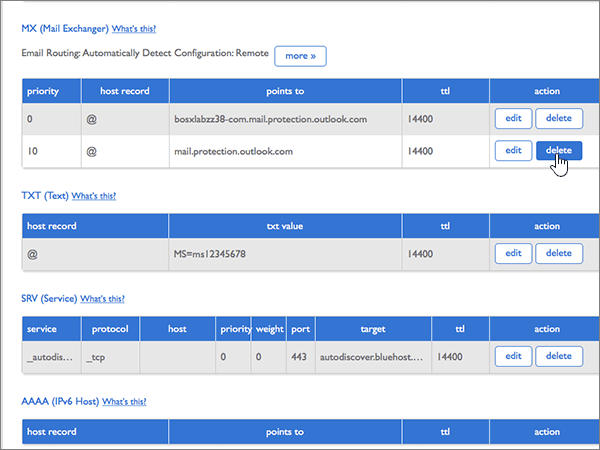

# Skapa DNS-poster på Bluehost för MicrosoftCreate DNS records at Bluehost for Microsoft

 **[Läs frågor och svar om domäner](../setup/domains-faq.md)** om du inte hittar det du letar efter.**[Check the Domains FAQ](../setup/domains-faq.md)** if you don't find what you're looking for. 
  
Om Bluehost är din DNS-värd följer du stegen i den här artikeln för att verifiera din domän och konfigurera DNS-poster för e-post, Skype för företag - Online och så vidare.If Bluehost is your DNS hosting provider, follow the steps in this article to verify your domain and set up DNS records for email, Skype for Business Online, and so on.
  
När du har lagt till dessa poster på Bluehost konfigureras domänen så att den fungerar med Microsoft-tjänster.After you add these records at Bluehost, your domain will be set up to work with Microsoft services.
  
Mer information om webbvärdverktyg och DNS för webbplatser med Microsoft finns i [Använda en offentlig webbplats med Microsoft](https://support.office.com/article/choose-a-public-website-3325d50e-d131-403c-a278-7f3296fe33a9).To learn about webhosting and DNS for websites with Microsoft, see [Use a public website with Microsoft](https://support.office.com/article/choose-a-public-website-3325d50e-d131-403c-a278-7f3296fe33a9).
  
> [!NOTE]
> Det brukar ta omkring 15 minuter för DNS-ändringarna att gå igenom. Ibland kan det dock ta längre tid att uppdatera DNS-systemet på Internet för en ändring som du har gjort. Om du stöter på problem med e-postflödet eller får andra problem när du har lagt till DNS-posterna, går du till [Hitta och åtgärda problem när du har lagt till din domän eller DNS-poster i Microsoft](../get-help-with-domains/find-and-fix-issues.md).Typically it takes about 15 minutes for DNS changes to take effect. However, it can occasionally take longer for a change you've made to update across the Internet's DNS system. If you're having trouble with mail flow or other issues after adding DNS records, see [Find and fix issues after adding your domain or DNS records](../get-help-with-domains/find-and-fix-issues.md). 
  
## Lägga till en TXT-post för verifieringAdd a TXT record for verification

Innan du använder din domän med Microsoft, vill vi vara säkra på att det är du som äger den. Att du kan logga in på ditt konto hos domänregistratorn och skapa DNS-posten bevisar för Microsoft att du äger domänen.Before you use your domain with Microsoft, we have to make sure that you own it. Your ability to log in to your account at your domain registrar and create the DNS record proves to Microsoft that you own the domain.
  
> [!NOTE]
> Den här posten används endast för att verifiera att du äger domänen. Den påverkar ingenting annat. Du kan ta bort den senare om du vill.This record is used only to verify that you own your domain; it doesn't affect anything else. You can delete it later, if you like. 
  
1. Kom igång genom att gå till domänsidan på Bluehost genom att klicka på [den här länken](https://my.bluehost.com/cgi/dm).To get started, go to your domains page at Bluehost by using [this link](https://my.bluehost.com/cgi/dm). Du uppmanas att logga in först.You'll be prompted to log in first.
    
2. Gå till sidan **domains** och området **domain**. Leta reda på raden för den domän du ändrar och markera kryssrutan för den domänen.On the **domains** page, in the **domain** area, find the row for the domain that you're changing, and then select the check box for that domain. 
    
    (Du kan behöva rulla nedåt.)(You may have to scroll down.)
    
3. Välj **Hantera DNS-poster**på raden **DNS Zone Editor** i området ***domain_name*** .In the ***domain_name*** area, on the **DNS Zone Editor** row, select **Manage DNS records**.
    
4. Gå till sidan **DNS Zone Editor** och området **Add DNS Record**. I den nya postens rutor skriver du in, eller kopierar och klistrar in värdena från följande tabell.On the **DNS Zone Editor** page, in the **Add DNS Record** area, in the boxes for the new record, type or copy and paste the values from the following table. 
    
    (Välj värdet för **Type** i listrutan.)(Choose the **Type** value from the drop-down list.) 
    
    |||||
    |:-----|:-----|:-----|:-----|
    |**Host Record****Host Record**   |**TTL****TTL**   |**Type****Type**   |**TXT Value****TXT Value**   |
    |@    |1440014400    |TXTTXT    |MS=ms *XXXXXXXX*MS=ms *XXXXXXXX*    **Obs!** Det här är ett exempel.**Note:** This is an example. Använd ditt specifika \*\*Mål eller pekar på adress \*\* värde här, från tabellen.Use your specific **Destination or Points to Address** value here, from the table. [Hur hittar jag det här?How do I find this?](../get-help-with-domains/information-for-dns-records.md)          |
   
5. Välj **lägg till post**.Select **add record**.
    
6. Vänta några minuter innan du fortsätter, så att den post som du nyss skapade kan uppdateras på Internet.Wait a few minutes before you continue, so that the record you just created can update across the Internet.
    
Nu när du har lagt till posten på domänregistratorerns webbplats går du tillbaka till Microsoft och begär en sökning efter posten.Now that you've added the record at your domain registrar's site, you'll go back to Microsoft and request a search for the record.
  
När Microsoft hittar rätt TXT-post är din domän verifierad.When Microsoft finds the correct TXT record, your domain is verified.
  
1. I Microsoft-administrationscentret går du till **Inställningar** \> <a href="https://go.microsoft.com/fwlink/p/?linkid=834818" target="_blank">Domäner</a>.In the Microsoft admin center, go to the **Settings** \> <a href="https://go.microsoft.com/fwlink/p/?linkid=834818" target="_blank">Domains</a> page.

    
2. På sidan **Domains** väljer du den domän du verifierar.On the **Domains** page, select the domain that you are verifying. 
    
3. På sidan **Setup** väljer du **Start setup**.On the **Setup** page, select **Start setup**.
    
4. På sidan **Verify domain** väljer du **Verify**.On the **Verify domain** page, select **Verify**.
    
> [!NOTE]
> Det brukar ta omkring 15 minuter för DNS-ändringarna att gå igenom. Ibland kan det dock ta längre tid att uppdatera DNS-systemet på Internet för en ändring som du har gjort. Om du stöter på problem med e-postflödet eller får andra problem när du har lagt till DNS-posterna, går du till [Hitta och åtgärda problem när du har lagt till din domän eller DNS-poster i Microsoft](../get-help-with-domains/find-and-fix-issues.md).Typically it takes about 15 minutes for DNS changes to take effect. However, it can occasionally take longer for a change you've made to update across the Internet's DNS system. If you're having trouble with mail flow or other issues after adding DNS records, see [Find and fix issues after adding your domain or DNS records](../get-help-with-domains/find-and-fix-issues.md). 
  
## Lägga till en MX-post så att e-post för din domän kommer till Microsoft.Add an MX record so email for your domain will come to Microsoft

1. Kom igång genom att gå till domänsidan på Bluehost genom att klicka på [den här länken](https://my.bluehost.com/cgi/dm).To get started, go to your domains page at Bluehost by using [this link](https://my.bluehost.com/cgi/dm). Du uppmanas att logga in först.You'll be prompted to log in first.
    
2. Gå till sidan **domains** och området **domain**. Leta reda på raden för den domän du ändrar och markera kryssrutan för den domänen.On the **domains** page, in the **domain** area, find the row for the domain that you're changing, and then select the check box for that domain. 
    
    (Du kan behöva rulla nedåt.)(You may have to scroll down.)
    
3. Välj **Hantera DNS-poster**på raden **DNS Zone Editor** i området ***domain_name*** .In the ***domain_name*** area, on the **DNS Zone Editor** row, select **Manage DNS records**.
    
4. Gå till sidan **DNS Zone Editor** och området **Add DNS Record**. I den nya postens rutor skriver du in, eller kopierar och klistrar in värdena från följande tabell.On the **DNS Zone Editor** page, in the **Add DNS Record** area, in the boxes for the new record, type or copy and paste the values from the following table. 
    
    (Välj värdet för **Type** i listrutan.)(Choose the **Type** value from the drop-down list.) 
    
    |**Host Record****Host Record**|**TTL****TTL**|**Type****Type**|**Points To****Points To**|**Priority****Priority**|
    |:-----|:-----|:-----|:-----|:-----|
    |@    |1440014400    |MXMX    | *\<domännyckel\>*  .mail.protection.outlook.com*\<domain-key\>*  .mail.protection.outlook.com   **Obs!** Hämta din \<*domännyckel*\> från ditt Microsoft-konto.**Note:** Get your \<*domain-key*\> from your Microsoft account. [Hur hittar jag det?How do I find this?](../get-help-with-domains/information-for-dns-records.md)          |00    Mer information om prioritet finns i [Vad är MX-prioritet?](https://support.office.com/article/2784cc4d-95be-443d-b5f7-bb5dd867ba83.aspx)For more information about priority, see [What is MX priority?](https://support.office.com/article/2784cc4d-95be-443d-b5f7-bb5dd867ba83.aspx)   |
   
   
  
5. Välj **lägg till post**.Select **add record**.
    
    
  
6. Om det finns andra MX-poster i avsnittet **MX (Mail Exchanger)** ska du ta bort dem.If there are any other MX records in the **MX (Mail Exchanger)** section, delete each of them. 
    
    För en av de andra MX-posterna väljer du **Ta bort.**For one of the other MX records, select **Delete.**
    
    
  
7. Välj **OK**i bekräftelsedialogrutan .In the confirmation dialog box, select **OK**.
    
    
  
8. Du använder samma process för att ta bort eventuella andra MX-poster som visas.Use the same process to delete any other MX records that were already listed.
    
## Lägga till de sex CNAME-poster som krävs för MicrosoftAdd the six CNAME records that are required for Microsoft

1. Kom igång genom att gå till domänsidan på Bluehost genom att klicka på [den här länken](https://my.bluehost.com/cgi/dm).To get started, go to your domains page at Bluehost by using [this link](https://my.bluehost.com/cgi/dm). Du uppmanas att logga in först.You'll be prompted to log in first.
    
2. Gå till sidan **domains** och området **domain**. Leta reda på raden för den domän du ändrar och markera kryssrutan för den domänen.On the **domains** page, in the **domain** area, find the row for the domain that you're changing, and then select the check box for that domain. 
    
    (Du kan behöva rulla nedåt.)(You may have to scroll down.)
    
3. Välj **Hantera DNS-poster**på raden **DNS Zone Editor** i området ***domain_name*** .In the ***domain_name*** area, on the **DNS Zone Editor** row, select **Manage DNS records**.
    
4. Leta reda på raden för posten för **automatisk upptäckt** i avsnittet **A (Värd)** och välj sedan **ta bort** för den raden.In the **A (Host)** records section, find the row for the **autodiscover** record, and then select **delete** for that row. 
    
    > [!IMPORTANT]
    > Du måste ta bort den befintliga posten för **automatisk upptäckt** *innan* du lägger till den **automatiska upptäcktspost** som krävs av Microsoft.You must delete the existing **autodiscover** record  *before*  adding the **autodiscover** record that is required by Microsoft. Bluehost tillåter inte att du har två **autodiscover** -poster samtidigt.Bluehost does not allow you to maintain two **autodiscover** records simultaneously. 
  
    
  
5. Välj **OK**.Select **OK**.
    
    
  
6. Skapa den första av de sex CNAME-posterna.Create the first of the six CNAME records.
    
    Gå till sidan **DNS Zone Editor** och området **Add DNS Record**. I den nya postens rutor skriver du eller kopierar och klistrar in värdena från den första raden i följande tabell.On the **DNS Zone Editor** page, in the **Add DNS Record** area, in the boxes for the new record, type or copy and paste the values from the first row in the following table. 
    
    (Välj värdet för **Type** i listrutan.)(Choose the **Type** value from the drop-down list.) 
    
    |**Host Record****Host Record**|**TTL****TTL**|**Type****Type**|**Points To****Points To**|
    |:-----|:-----|:-----|:-----|
    |autodiscoverautodiscover    |1440014400    |CNAMECNAME    |autodiscover.outlook.comautodiscover.outlook.com    |
    |sipsip    |1440014400    |CNAMECNAME    |sipdir.online.lync.comsipdir.online.lync.com    |
    |lyncdiscoverlyncdiscover    |1440014400    |CNAMECNAME    |webdir.online.lync.comwebdir.online.lync.com    |
    |enterpriseregistrationenterpriseregistration    |1440014400    |CNAMECNAME    |enterpriseregistration.windows.netenterpriseregistration.windows.net    |
    |enterpriseenrollmententerpriseenrollment    |1440014400    |CNAMECNAME    |enterpriseenrollment-s.manage.microsoft.comenterpriseenrollment-s.manage.microsoft.com    |
   
    
  
7. Välj **lägg till post**.Select **add record**.
    
    
  
8. Lägg till de andra fem CNAME-posterna var för sig.Add each of the other five CNAME records.
    
    I avsnittet **Lägg till DNS-post** skapar du en post med hjälp av värdena från nästa rad i tabellen och väljer sedan **lägga till post** igen för att slutföra posten.Still in the **Add DNS Record** section, create a record by using the values from the next row in the table, and then again select **add record** to complete that record. 
    
    Upprepa proceduren tills du har skapat alla sex CNAME-posterna.Repeat this process until you have created all six CNAME records.
    
## Lägga till en TXT-post för SPF för att förhindra skräppostAdd a TXT record for SPF to help prevent email spam

> [!IMPORTANT]
> Du kan inte ha fler än en TXT-post för SPF för en domän.You cannot have more than one TXT record for SPF for a domain. Om din domän har fler än en SPF-post får du e-postfel och problem med leveranser och skräppostklassificering.If your domain has more than one SPF record, you'll get email errors, as well as delivery and spam classification issues. Om du redan har en SPF-post för domänen ska du inte skapa en ny för Microsoft.If you already have an SPF record for your domain, don't create a new one for Microsoft. Lägg i stället till de nödvändiga Microsoft-värdena i den aktuella posten så att du har en *enda* SPF-post som innehåller båda uppsättningarna värden.Instead, add the required Microsoft values to the current record so that you have a  *single*  SPF record that includes both sets of values. Behöver du exempel?Need examples? Ta en titt på dessa [externa DNS-poster för Microsoft](https://support.office.com/article/c0531a6f-9e25-4f2d-ad0e-a70bfef09ac0).Check out these [External Domain Name System records for Microsoft](https://support.office.com/article/c0531a6f-9e25-4f2d-ad0e-a70bfef09ac0). Om du vill validera SPF-posten kan du använda något av dessa[SPF-valideringsverktyg](../setup/domains-faq.md).To validate your SPF record, you can use one of these[SPF validation tools](../setup/domains-faq.md). 
  
1. Kom igång genom att gå till domänsidan på Bluehost genom att klicka på [den här länken](https://my.bluehost.com/cgi/dm).To get started, go to your domains page at Bluehost by using [this link](https://my.bluehost.com/cgi/dm). Du uppmanas att logga in först.You'll be prompted to log in first.
    
2. Gå till sidan **domains** och området **domain**. Leta reda på raden för den domän du ändrar och markera kryssrutan för den domänen.On the **domains** page, in the **domain** area, find the row for the domain that you're changing, and then select the check box for that domain. 
    
    (Du kan behöva rulla nedåt.)(You may have to scroll down.)
    
3. Välj **Hantera DNS-poster**på raden **DNS Zone Editor** i området ***domain_name*** .In the ***domain_name*** area, on the **DNS Zone Editor** row, select **Manage DNS records**.
    
4. Gå till sidan **DNS Zone Editor** och området **Add DNS Record**. I den nya postens rutor skriver du in, eller kopierar och klistrar in värdena från följande tabell.On the **DNS Zone Editor** page, in the **Add DNS Record** area, in the boxes for the new record, type or copy and paste the values from the following table. 
    
    (Välj värdet för **Type** i listrutan.)(Choose the **Type** value from the drop-down list.) 
        
    |**Host Record****Host Record**|**TTL****TTL**|**Type****Type**|**TXT Value****TXT Value**|
    |:-----|:-----|:-----|:-----|
    |@    |1440014400    |TXTTXT    |v=spf1 include:spf.protection.outlook.com -allv=spf1 include:spf.protection.outlook.com -all   **Obs!** Vi rekommenderar att du kopierar och klistrar in den här posten så att alla avstånd förblir korrekta.    **Note:** We recommend copying and pasting this entry, so that all of the spacing stays correct.           |
   
    
  
5. Välj **lägg till post**.Select **add record**.
    
    
  
## Lägga till de två SRV-posterna som krävs för MicrosoftAdd the two SRV records that are required for Microsoft

1. Kom igång genom att gå till domänsidan på Bluehost genom att klicka på [den här länken](https://my.bluehost.com/cgi/dm).To get started, go to your domains page at Bluehost by using [this link](https://my.bluehost.com/cgi/dm). Du uppmanas att logga in först.You'll be prompted to log in first.
    
2. Gå till sidan **domains** och området **domain**. Leta reda på raden för den domän du ändrar och markera kryssrutan för den domänen.On the **domains** page, in the **domain** area, find the row for the domain that you're changing, and then select the check box for that domain. 
    
    (Du kan behöva rulla nedåt.)(You may have to scroll down.)
    
3. Välj **Hantera DNS-poster**på raden **DNS Zone Editor** i området ***domain_name*** .In the ***domain_name*** area, on the **DNS Zone Editor** row, select **Manage DNS records**.
    
4. Skapa den första av de två SRV-posterna.Create the first of the two SRV records.
    
    Gå till sidan **DNS Zone Editor** och området **Add DNS Record**. I den nya postens rutor skriver du eller kopierar och klistrar in värdena från den första raden i följande tabell.On the **DNS Zone Editor** page, in the **Add DNS Record** area, in the boxes for the new record, type or copy and paste the values from the first row in the following table. 
    
    (Välj värdet för **Type** i listrutan.)(Choose the **Type** value from the drop-down list.) 
    
    |**Service****Service**|**Protocol****Protocol**|**Host****Host**|**TTL****TTL**|**Type****Type**|**Prioritet****Priority**|**Vikt****Weight**|**Port****Port**|**Points To****Points To**|
    |:-----|:-----|:-----|:-----|:-----|:-----|:-----|:-----|:-----|
    |_sip_sip    |_tls_tls    |@    |1440014400    |SRVSRV    |100100    |11    |443443    |sipdir.online.lync.comsipdir.online.lync.com    |
    |_sipfederationtls_sipfederationtls    |_tcp_tcp    |@    |1440014400    |SRVSRV    |100100    |11    |50615061    |sipfed.online.lync.comsipfed.online.lync.com    |
   
    
  
5. Välj **lägg till post**.Select **add record**.
    
    
  
6. Lägg till den andra SRV-posten.Add the other SRV record.
    
    I avsnittet **Lägg till DNS-post** skapar du en post med hjälp av värdena från den andra raden i tabellen och väljer sedan **lägga till post** igen för att slutföra posten.Still in the **Add DNS Record** section, create a record by using the values from the other row in the table, and then again select **add record** to complete that record. 
    
> [!NOTE]
> Det brukar ta omkring 15 minuter för DNS-ändringarna att gå igenom. Ibland kan det dock ta längre tid att uppdatera DNS-systemet på Internet för en ändring som du har gjort. Om du stöter på problem med e-postflödet eller får andra problem när du har lagt till DNS-posterna, går du till [Hitta och åtgärda problem när du har lagt till din domän eller DNS-poster i Microsoft](../get-help-with-domains/find-and-fix-issues.md).Typically it takes about 15 minutes for DNS changes to take effect. However, it can occasionally take longer for a change you've made to update across the Internet's DNS system. If you're having trouble with mail flow or other issues after adding DNS records, see [Find and fix issues after adding your domain or DNS records](../get-help-with-domains/find-and-fix-issues.md). 
  

