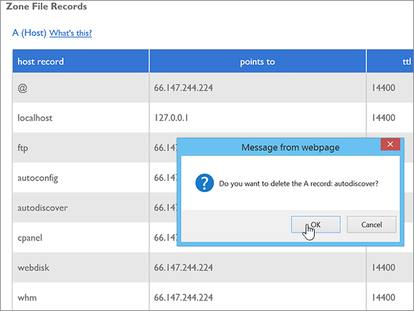

# Skapa DNS-poster hos Bluehost för Office 365

 **[Läs frågor och svar om domäner](../setup/domains-faq.md)** om du inte hittar det du letar efter. 
  
Om Bluehost är din DNS-värd följer du stegen i den här artikeln för att verifiera din domän och konfigurera DNS-poster för e-post, Skype för företag - Online och så vidare.
  
När du har lagt till dessa poster hos Bluehost är domänen konfigurerad för att fungera med Office 365-tjänster.
  
Mer information om webbvärdverktyg och DNS för webbplatser med Office 365 finns i [Använda en offentlig webbplats med Office 365](https://support.office.com/article/choose-a-public-website-3325d50e-d131-403c-a278-7f3296fe33a9).
  
> [!NOTE]
> Det brukar ta omkring 15 minuter för DNS-ändringarna att gå igenom. Ibland kan det dock ta längre tid att uppdatera DNS-systemet på Internet för en ändring som du har gjort. Om du stöter på problem med e-postflödet eller får andra problem när du har lagt till DNS-posterna, går du till [Hitta och åtgärda problem när du har lagt till din domän eller DNS-poster i Office 365](../get-help-with-domains/find-and-fix-issues.md). 
  
## Lägga till en TXT-post för verifiering

Innan du använder din domän med Office 365 vill vi vara säkra på att det är du som äger den. Att du kan logga in på kontot hos domänregistratorn och skapa en DNS-post bevisar för Office 365 att du äger domänen.
  
> [!NOTE]
> Den här posten används endast för att verifiera att du äger domänen. Den påverkar ingenting annat. Du kan ta bort den senare om du vill. 
  
1. Kom igång genom att gå till domänsidan på Bluehost genom att klicka på [den här länken](https://my.bluehost.com/cgi/dm). Du uppmanas att logga in först.
    
2. Gå till sidan **domains** och området **domain**. Leta reda på raden för den domän du ändrar och markera kryssrutan för den domänen. 
    
    (Du kan behöva rulla nedåt.)
    
3. ***domain_name*** Välj **Hantera DNS-poster**på raden DNS Zone Editor på raden **DNS Zone Editor.**
    
4. I fältet Lägg till DNS-post i rutorna för den nya posten skriver eller kopierar och klistrar in värdena från följande tabell i området **Lägg till DNS-post.** 
    
    (Välj värdet för **Type** i listrutan.) 
    
    |||||
    |:-----|:-----|:-----|:-----|
    |**Host Record**   |**TTL**   |**Type**   |**TXT Value**   |
    |@    |14400    |TXT    |MS=ms *XXXXXXXX*    **Obs:** Detta är ett exempel. Använd ditt specifika **Mål eller pekar på adress**-värde här, från tabellen i Office 365. [Hur hittar jag det?](../get-help-with-domains/information-for-dns-records.md)          |
   
5. Välj **lägg till post**.
    
6. Vänta några minuter innan du fortsätter, så att den post som du nyss skapade kan uppdateras på Internet.
    
Nu när du har lagt till posten på domänregistratorns webbplats kan du gå tillbaka till Office 365 och begära att Office 365 letar efter posten.
  
När Office 365 hittar rätt TXT-post är din domän verifierad.
  
1. Gå till sidan **Inställningar** \> domäner i <a href="https://go.microsoft.com/fwlink/p/?linkid=834818" target="_blank">administrationscentret.</a>

    
2. På sidan **Domäner** väljer du den domän som du verifierar. 
    
3. På **sidan Inställningar** väljer du **Starta installationsprogrammet**.
    
4. Välj **Verifiera**på **sidan Verifiera domän.**
    
> [!NOTE]
> Det brukar ta omkring 15 minuter för DNS-ändringarna att gå igenom. Ibland kan det dock ta längre tid att uppdatera DNS-systemet på Internet för en ändring som du har gjort. Om du stöter på problem med e-postflödet eller får andra problem när du har lagt till DNS-posterna, går du till [Hitta och åtgärda problem när du har lagt till din domän eller DNS-poster i Office 365](../get-help-with-domains/find-and-fix-issues.md). 
  
## Lägga till en MX-post så att e-post för din domän kommer till Office 365

1. Kom igång genom att gå till domänsidan på Bluehost genom att klicka på [den här länken](https://my.bluehost.com/cgi/dm). Du uppmanas att logga in först.
    
2. Gå till sidan **domains** och området **domain**. Leta reda på raden för den domän du ändrar och markera kryssrutan för den domänen. 
    
    (Du kan behöva rulla nedåt.)
    
3. ***domain_name*** Välj **Hantera DNS-poster**på raden DNS Zone Editor på raden **DNS Zone Editor.**
    
4. Gå till sidan **DNS Zone Editor** och området **Add DNS Record**. I den nya postens rutor skriver du in, eller kopierar och klistrar in värdena från följande tabell. 
    
    (Välj värdet för **Type** i listrutan.) 
    
    |**Host Record**|**TTL**|**Type**|**Points To**|**Priority**|
    |:-----|:-----|:-----|:-----|:-----|
    |@    |14400    |MX    | *\<domännyckel\>*  .mail.protection.outlook.com   **Obs:** Hämta \<din domännyckel\> från ditt Office 365-konto. *domain-key* [Hur hittar jag det?](../get-help-with-domains/information-for-dns-records.md)          |0    Mer information om prioritet finns i [Vad är MX-prioritet?](https://support.office.com/article/2784cc4d-95be-443d-b5f7-bb5dd867ba83.aspx)   |
   
   
  
5. Välj **lägg till post**.
    
    
  
6. Om det finns andra MX-poster i avsnittet **MX (Mail Exchanger)** ska du ta bort dem. 
    
    För en av de andra MX-posterna väljer du **Ta bort.**
    
    
  
7. Välj **OK**i dialogrutan bekräftelse.
    
    
  
8. Du använder samma process för att ta bort eventuella andra MX-poster som visas.
    
## Lägg till de sex CNAME-posterna som krävs för Office 365

1. Kom igång genom att gå till domänsidan på Bluehost genom att klicka på [den här länken](https://my.bluehost.com/cgi/dm). Du uppmanas att logga in först.
    
2. Gå till sidan **domains** och området **domain**. Leta reda på raden för den domän du ändrar och markera kryssrutan för den domänen. 
    
    (Du kan behöva rulla nedåt.)
    
3. ***domain_name*** Välj **Hantera DNS-poster**på raden DNS Zone Editor på raden **DNS Zone Editor.**
    
4. Leta reda på raden för posten för **automatisk upptäckt** i avsnittet **A (host)** och välj sedan **ta bort** för den raden. 
    
    > [!IMPORTANT]
    > Du måste ta bort den befintliga **autodiscover** -posten  *innan*  du kan lägga till den **autodiscover** -post som krävs av Office 365. Bluehost tillåter inte att du har två **autodiscover** -poster samtidigt. 
  
    
  
5. Välj **OK**.
    
    
  
6. Skapa den första av de sex CNAME-posterna.
    
    Gå till sidan **DNS Zone Editor** och området **Add DNS Record**. I den nya postens rutor skriver du eller kopierar och klistrar in värdena från den första raden i följande tabell. 
    
    (Välj värdet för **Type** i listrutan.) 
    
    |**Host Record**|**TTL**|**Type**|**Points To**|
    |:-----|:-----|:-----|:-----|
    |autodiscover    |14400    |CNAME    |autodiscover.outlook.com    |
    |sip    |14400    |CNAME    |sipdir.online.lync.com    |
    |lyncdiscover    |14400    |CNAME    |webdir.online.lync.com    |
    |enterpriseregistration    |14400    |CNAME    |enterpriseregistration.windows.net    |
    |enterpriseenrollment    |14400    |CNAME    |enterpriseenrollment-s.manage.microsoft.com    |
   
    
  
7. Välj **lägg till post**.
    
    
  
8. Lägg till de andra fem CNAME-posterna var för sig.
    
    Fortfarande i avsnittet **Lägg till DNS-post** skapar du en post med värdena från nästa rad i tabellen och väljer sedan återigen **lägga till post** för att slutföra posten. 
    
    Upprepa proceduren tills du har skapat alla sex CNAME-posterna.
    
## Lägga till en TXT-post för SPF för att förhindra skräppost

> [!IMPORTANT]
> Du kan inte ha fler än en TXT-post för SPF för en domän. Om din domän har fler än en SPF-post får du e-postfel och problem med leveranser och skräppostklassificering. Om du redan har en SPF-post för domänen ska du inte skapa en ny för Office 365. Lägg istället till de obligatoriska Office 365-värdena i den aktuella posten, så att du har en  *enda*  SPF-post som innehåller båda uppsättningarna med värden. Behöver du exempel? Kolla in dessa [externa domännamnssystemposter för Office 365](https://support.office.com/article/c0531a6f-9e25-4f2d-ad0e-a70bfef09ac0). Om du vill validera din SPF-post kan du använda något av dessa[SPF-valideringsverktyg](../setup/domains-faq.md). 
  
1. Kom igång genom att gå till domänsidan på Bluehost genom att klicka på [den här länken](https://my.bluehost.com/cgi/dm). Du uppmanas att logga in först.
    
2. Gå till sidan **domains** och området **domain**. Leta reda på raden för den domän du ändrar och markera kryssrutan för den domänen. 
    
    (Du kan behöva rulla nedåt.)
    
3. ***domain_name*** Välj **Hantera DNS-poster**på raden DNS Zone Editor på raden **DNS Zone Editor.**
    
4. Gå till sidan **DNS Zone Editor** och området **Add DNS Record**. I den nya postens rutor skriver du in, eller kopierar och klistrar in värdena från följande tabell. 
    
    (Välj värdet för **Type** i listrutan.) 
        
    |**Host Record**|**TTL**|**Type**|**TXT Value**|
    |:-----|:-----|:-----|:-----|
    |@    |14400    |TXT    |v=spf1 include:spf.protection.outlook.com -all   **Obs!** Vi rekommenderar att du kopierar och klistrar in den här posten så att alla avstånd förblir korrekta.               |
   
    
  
5. Välj **lägg till post**.
    
    
  
## Lägga till de två SRV-posterna som krävs för Office 365

1. Kom igång genom att gå till domänsidan på Bluehost genom att klicka på [den här länken](https://my.bluehost.com/cgi/dm). Du uppmanas att logga in först.
    
2. Gå till sidan **domains** och området **domain**. Leta reda på raden för den domän du ändrar och markera kryssrutan för den domänen. 
    
    (Du kan behöva rulla nedåt.)
    
3. ***domain_name*** Välj **Hantera DNS-poster**på raden DNS Zone Editor på raden **DNS Zone Editor.**
    
4. Skapa den första av de två SRV-posterna.
    
    Gå till sidan **DNS Zone Editor** och området **Add DNS Record**. I den nya postens rutor skriver du eller kopierar och klistrar in värdena från den första raden i följande tabell. 
    
    (Välj värdet för **Type** i listrutan.) 
    
    |**Service**|**Protocol**|**Host**|**TTL**|**Type**|**Priority**|**Weight**|**Port**|**Points To**|
    |:-----|:-----|:-----|:-----|:-----|:-----|:-----|:-----|:-----|
    |_sip    |_tls    |@    |14400    |SRV    |100    |1    |443    |sipdir.online.lync.com    |
    |_sipfederationtls    |_tcp    |@    |14400    |SRV    |100    |1    |5061    |sipfed.online.lync.com    |
   
    
  
5. Välj **lägg till post**.
    
    
  
6. Lägg till den andra SRV-posten.
    
    Fortfarande i avsnittet **Lägg till DNS-post** skapar du en post med hjälp av värdena från den andra raden i tabellen och väljer sedan återigen **lägga till post** för att slutföra posten. 
    
> [!NOTE]
> Det brukar ta omkring 15 minuter för DNS-ändringarna att gå igenom. Ibland kan det dock ta längre tid att uppdatera DNS-systemet på Internet för en ändring som du har gjort. Om du stöter på problem med e-postflödet eller får andra problem när du har lagt till DNS-posterna, går du till [Hitta och åtgärda problem när du har lagt till din domän eller DNS-poster i Office 365](../get-help-with-domains/find-and-fix-issues.md). 
  

