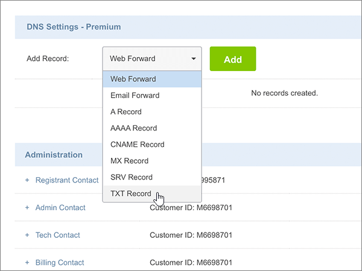
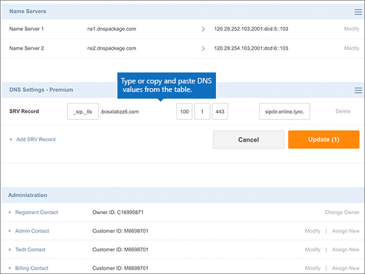

# Skapa DNS-poster på Crazy Domains för Office 365

 **[Läs frågor och svar om domäner](../setup/domains-faq.md)** om du inte hittar det du letar efter. 
  
Om Crazy Domains är din DNS-värd följer du stegen i den här artikeln för att verifiera din domän och konfigurera DNS-poster för e-post, Skype för företag - Online och så vidare.
  
När du har lagt till dessa poster på Crazy Domains konfigureras domänen så att den fungerar med Office 365-tjänster.
  
Mer information om webbvärdverktyg och DNS för webbplatser med Office 365 finns i [Använda en offentlig webbplats med Office 365](https://support.office.com/article/choose-a-public-website-3325d50e-d131-403c-a278-7f3296fe33a9).
  
> [!NOTE]
> Det brukar ta ungefär 15 minuter för DNS-ändringarna att gå igenom. Ibland kan det dock ta längre tid att uppdatera DNS-systemet på Internet för en ändring som du har gjort. Om du stöter på problem med e-postflödet eller får andra problem när du har lagt till DNS-posterna, går du till [Felsöka problem när du har ändrat domännamn eller DNS-poster](../get-help-with-domains/find-and-fix-issues.md). 
  
## Lägga till en TXT-post för verifiering

Innan du använder din domän med Office 365 vill vi vara säkra på att det är du som äger den. Att du kan logga in på kontot hos domänregistratorn och skapa en DNS-post bevisar för Office 365 att du äger domänen.
  
> [!NOTE]
> Den här posten används endast för att verifiera att du äger domänen. Den påverkar ingenting annat. Du kan ta bort den senare om du vill. 
  
1. Börja med att gå till domänsidan på Crazy Domains genom att klicka på [den här länken](https://manage.crazydomains.com/members/domains/). Du uppmanas att logga in först.
    
    
  
2. Välj **Domäner**i avsnittet **Mitt konto** .
    
    
  
3. På sidan **Domännamn** väljer du namnet på den domän som du uppdaterar i avsnittet **Domän.** 
    
    
  
4. Välj listrutan i avsnittet **DNS-inställningar.** 
    
    
  
5. Välj **Lägg till post**.
    
    
  
6. Välj **TXT Record** i listrutan **Add Record**. 
    
    
  
7. Välj **Lägg till**.
    
    
  
8. I rutorna för den nya posten skriver du in, eller kopierar och klistrar in, värdena från följande tabell.
    
    |**Underdomän**|**Textpost**|
    |:-----|:-----|
    |(Lämna det här fältet tomt.)    |MS=ms *XXXXXXXX*    **Obs!** Det här är ett exempel. Använd det specifika värdet för **Mål eller pekar på-adress** här, från tabellen i Office 365.           [Hur hittar jag det?](../get-help-with-domains/information-for-dns-records.md)          |
   
    
  
9. Välj **Uppdatera**.
    
    
  
10. Vänta några minuter innan du fortsätter, så att den post som du nyss skapade kan uppdateras på Internet.
    
Nu när du har lagt till posten på domänregistratorns webbplats kan du gå tillbaka till Office 365 och begära att Office 365 letar efter posten.
  
När Office 365 hittar rätt TXT-post är din domän verifierad.
  
1. Gå till sidan **Inställningar** \> domäner i <a href="https://go.microsoft.com/fwlink/p/?linkid=834818" target="_blank">administrationscentret.</a>

    
2. På sidan **Domäner** väljer du den domän som du verifierar. 
    
    
  
3. På **sidan Inställningar** väljer du **Starta installationsprogrammet**.
    
    
  
4. Välj **Verifiera**på **sidan Verifiera domän.**
    
    
  
> [!NOTE]
>  Det brukar ta ungefär 15 minuter för DNS-ändringarna att gå igenom. Ibland kan det dock ta längre tid att uppdatera DNS-systemet på Internet för en ändring som du har gjort. Om du stöter på problem med e-postflödet eller får andra problem när du har lagt till DNS-posterna, går du till [Felsöka problem när du har ändrat domännamn eller DNS-poster](../get-help-with-domains/find-and-fix-issues.md). 
  
## Lägga till en MX-post så att e-post för din domän kommer till Office 365

1. Börja med att gå till domänsidan på Crazy Domains genom att klicka på [den här länken](https://manage.crazydomains.com/members/domains/). Du uppmanas att logga in först.
    
    
  
2. Välj **Domäner**i avsnittet **Mitt konto** .
    
    
  
3. På sidan **Domännamn** väljer du namnet på den domän som du uppdaterar i avsnittet **Domän.** 
    
    
  
4. Välj listrutan i avsnittet **DNS-inställningar.** 
    
    
  
5. Välj **Lägg till post**.
    
    
  
6. Välj **MX Record** i listrutan **Add Record:**. 
    
    
  
7. Välj **Lägg till**.
    
    
  
8. I rutorna för den nya posten skriver du in, eller kopierar och klistrar in, värdena från följande tabell.
    
    (Välj **prioritetsvärdet** i listrutan.) 
    
    |**Mail for Zone**|**Priority**|**Assigned To Server**|
    |:-----|:-----|:-----|
    |(Lämna det här fältet tomt.)    |1    [Mer information om prioritet finns i ](https://support.office.com/article/2784cc4d-95be-443d-b5f7-bb5dd867ba83.aspx)Vad är MX-prioritet?   | *\<domännyckel\>*  .mail.protection.outlook.com    **Obs:** Hämta din * \<domännyckel\> * från ditt Office 365-konto.           [Hur hittar jag det?](../get-help-with-domains/information-for-dns-records.md)          |
       
   
  
9. Välj **Uppdatera**.
    
    
  
10. Om det finns några andra MX-poster i avsnittet **MX Record** väljer du **Ändra** för en av dessa poster. 
    
    
  
11. Välj **Ta bort**.
    
    
  
12. Välj **Uppdatera för** att bekräfta borttagningen. 
    
    
  
13. Använd samma sätt för att ta bort andra MX-poster i listan tills endast den du lade till tidigare i den här proceduren finns kvar.
    
## Lägg till de sex CNAME-posterna som krävs för Office 365

1. Börja med att gå till domänsidan på Crazy Domains genom att klicka på [den här länken](https://manage.crazydomains.com/members/domains/). Du uppmanas att logga in först.
    
    
  
2. Välj **Domäner**i avsnittet **Mitt konto** .
    
    
  
3. På sidan **Domännamn** väljer du namnet på den domän som du uppdaterar i avsnittet **Domän.** 
    
    
  
4. Välj listrutan i avsnittet **DNS-inställningar.** 
    
    
  
5. Välj **Lägg till post**.
    
    
  
6. Välj **CNAME Record** i listrutan **Add Record:**. 
    
    
  
7. Välj **Lägg till**.
    
    
  
8. Lägg till den första av de sex CNAME-posterna.
    
    I rutorna för den nya posten anger du eller kopierar och klistrar in värdena från den första raden i följande tabell.
    
    |**Underdomän**|**Alias for**|
    |:-----|:-----|
    |autodiscover    |autodiscover.outlook.com    |
    |sip    |sipdir.online.lync.com    |
    |lyncdiscover    |webdir.online.lync.com    |
    |enterpriseregistration    |enterpriseregistration.windows.net    |
    |enterpriseenrollment    |enterpriseenrollment-s.manage.microsoft.com    |
   
    
  
9. Välj **Lägg till CNAME-post**.
    
    
  
10. Lägg till den andra CNAME-posten.
    
    I rutorna för den nya posten använder du värdena från nästa rad i tabellen och väljer sedan **lägg till CNAME-post**igen .
    
    Upprepa proceduren tills du har skapat alla sex CNAME-posterna.
    
11. Välj **Uppdatera om** du vill spara ändringarna. 
    
    
  
## Lägga till en TXT-post för SPF för att förhindra skräppost

> [!IMPORTANT]
> Du kan inte ha fler än en TXT-post för SPF för en domän. Om din domän har fler än en SPF-post får du e-postfel och problem med leveranser och skräppostklassificering. Om du redan har en SPF-post för domänen ska du inte skapa en ny för Office 365. Lägg istället till de obligatoriska Office 365-värdena i den aktuella posten, så att du har en  *enda*  SPF-post som innehåller båda uppsättningarna med värden. 
  
1. Börja med att gå till domänsidan på Crazy Domains genom att klicka på [den här länken](https://manage.crazydomains.com/members/domains/). Du uppmanas att logga in först.
    
    
  
2. Välj **Domäner**i avsnittet **Mitt konto** .
    
    
  
3. På sidan **Domännamn** väljer du namnet på den domän som du uppdaterar i avsnittet **Domän.** 
    
    
  
4. Välj listrutan i avsnittet **DNS-inställningar.** 
    
    
  
5. Välj **Lägg till post**.
    
    
  
6. Välj **TXT Record** i listrutan **Add Record:**. 
    
    
  
7. Välj **Lägg till**.
    
    
  
8. I rutorna för den nya posten anger du eller kopierar och klistrar in värdena från följande tabell.
    
    |**Underdomän**|**Textpost**|
    |:-----|:-----|
    |(Lämna det här fältet tomt.)    |v=spf1 include:spf.protection.outlook.com -all    **Obs!** Vi rekommenderar att du kopierar och klistrar in den här posten så att alla avstånd förblir korrekta.               |
   
    
  
9. Välj **Uppdatera**.
    
    
  
## Lägga till de två SRV-posterna som krävs för Office 365

1. Börja med att gå till domänsidan på Crazy Domains genom att klicka på [den här länken](https://manage.crazydomains.com/members/domains/). Du uppmanas att logga in först.
    
    
  
2. Välj **Domäner**i avsnittet **Mitt konto** .
    
    
  
3. På sidan **Domännamn** väljer du namnet på den domän som du uppdaterar i avsnittet **Domän.** 
    
    
  
4. Välj listrutan i avsnittet **DNS-inställningar.** 
    
    
  
5. Välj **Lägg till post**.
    
    
  
6. Välj **SRV Record** från listrutan **Add Record:**. 
    
    
  
7. Välj **Lägg till**.
    
    
  
8. Lägg till den första av de två SRV-posterna.
    
    I rutorna för den nya posten anger du eller kopierar och klistrar in värdena från den första raden i följande tabell.
    
    |**Record Type**|**Underdomän**|**Priority**|**Weight**|**Port**|**Target**|
    |:-----|:-----|:-----|:-----|:-----|:-----|
    |SRV Record    |_sip._tls    |100    |1    |443    |sipdir.online.lync.com    |
    |SRV Record    |_sipfederationtls._tcp    |100    |1    |5061    |sipfed.online.lync.com    |
   
    
  
9. Välj **Lägg till SRV-post**.
    
    
  
10. Lägg till den andra SRV-posten.
    
    I rutorna för den nya posten använder du värdena från den andra raden i tabellen.
    
11. Välj **Uppdatera om** du vill spara ändringarna. 
    
    
  
> [!NOTE]
> Det brukar ta ungefär 15 minuter för DNS-ändringarna att gå igenom. Ibland kan det dock ta längre tid att uppdatera DNS-systemet på Internet för en ändring som du har gjort. Om du stöter på problem med e-postflödet eller får andra problem när du har lagt till DNS-posterna, går du till [Felsöka problem när du har ändrat domännamn eller DNS-poster](../get-help-with-domains/find-and-fix-issues.md). 
  
