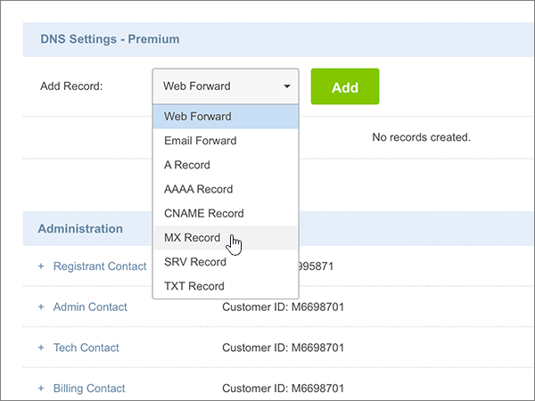

# Skapa DNS-poster på Crazy Domains för MicrosoftCreate DNS records at Crazy Domains for Microsoft

 **[Läs frågor och svar om domäner](../setup/domains-faq.md)** om du inte hittar det du letar efter.**[Check the Domains FAQ](../setup/domains-faq.md)** if you don't find what you're looking for. 
  
Om Crazy Domains är din DNS-värd följer du stegen i den här artikeln för att verifiera din domän och konfigurera DNS-poster för e-post, Skype för företag - Online och så vidare.If Crazy Domains is your DNS hosting provider, follow the steps in this article to verify your domain and set up DNS records for email, Skype for Business Online, and so on.
  
När du har lagt till dessa poster på Crazy Domains konfigureras domänen så att den fungerar med Microsoft-tjänster.After you add these records at Crazy Domains, your domain will be set up to work with Microsoft services.
  

  
> [!NOTE]
> Det brukar ta ungefär 15 minuter för DNS-ändringarna att gå igenom. Ibland kan det dock ta längre tid att uppdatera DNS-systemet på Internet för en ändring som du har gjort. Om du stöter på problem med e-postflödet eller får andra problem när du har lagt till DNS-posterna, går du till [Felsöka problem när du har ändrat domännamn eller DNS-poster](../get-help-with-domains/find-and-fix-issues.md).Typically it takes about 15 minutes for DNS changes to take effect. However, it can occasionally take longer for a change you've made to update across the Internet's DNS system. If you're having trouble with mail flow or other issues after adding DNS records, see [Troubleshoot issues after changing your domain name or DNS records](../get-help-with-domains/find-and-fix-issues.md). 
  
## Lägga till en TXT-post för verifieringAdd a TXT record for verification

Innan du använder din domän med Microsoft, vill vi vara säkra på att det är du som äger den. Att du kan logga in på ditt konto hos domänregistratorn och skapa DNS-posten bevisar för Microsoft att du äger domänen.Before you use your domain with Microsoft, we have to make sure that you own it. Your ability to log in to your account at your domain registrar and create the DNS record proves to Microsoft that you own the domain.
  
> [!NOTE]
> Den här posten används endast för att verifiera att du äger domänen. Den påverkar ingenting annat. Du kan ta bort den senare om du vill.This record is used only to verify that you own your domain; it doesn't affect anything else. You can delete it later, if you like. 
  
1. Börja med att gå till domänsidan på Crazy Domains genom att klicka på [den här länken](https://manage.crazydomains.com/members/domains/). Du uppmanas att logga in först.To get started, go to your domains page at Crazy Domains by using [this link](https://manage.crazydomains.com/members/domains/). You'll be prompted to log in first.
    
    
  
2. Välj **Domäner**i avsnittet **Mitt konto** .In the **My Account** section, select **Domains**.
    
    
  
3. Välj namnet på den domän som du uppdaterar i avsnittet **Domän** på sidan **Domännamn.**On the **Domain Names** page, in the **Domain** section, select the name of the domain that you are updating. 
    
    
  
4. Välj listrutan i avsnittet **DNS-inställningar.**In the **DNS Settings** section, select the drop-down list icon. 
    
    
  
5. Välj **Lägg till post**.Select **Add Record**.
    
    
  
6. Välj **TXT Record** i listrutan **Add Record**.Choose **TXT Record** from the **Add Record** drop-down list. 
    
    
  
7. Välj **Lägg till**.Select **Add**.
    
    
  
8. I rutorna för den nya posten skriver du in, eller kopierar och klistrar in, värdena från följande tabell.In the boxes for the new record, type or copy and paste the values from the following table.
    
    |**Underdomän****Sub Domain**|**Textpost****Text Record**|
    |:-----|:-----|
    |(Lämna det här fältet tomt.)(Leave this field empty.)    |MS=ms *XXXXXXXX*MS=ms *XXXXXXXX*    **Obs!** Det här är ett exempel.**Note:** This is an example. Använd ditt specifika \*\*Mål eller pekar på adress \*\* värde här, från tabellen.Use your specific **Destination or Points to Address** value here, from the table.           [Hur hittar jag det här?How do I find this?](../get-help-with-domains/information-for-dns-records.md)          |
   
    
  
9. Välj **Uppdatera**.Select **Update**.
    
    
  
10. Vänta några minuter innan du fortsätter, så att den post som du nyss skapade kan uppdateras på Internet.Wait a few minutes before you continue, so that the record you just created can update across the Internet.
    
Nu när du har lagt till posten på domänregistratorns webbplats kan du gå tillbaka till Microsoft och begär posten.Now that you've added the record at your domain registrar's site, you'll go back to Microsoft and request the record.
  
När Microsoft hittar rätt TXT-post är din domän verifierad.When Microsoft finds the correct TXT record, your domain is verified.
  
1. I Microsoft-administrationscentret går du till **Inställningar** \> <a href="https://go.microsoft.com/fwlink/p/?linkid=834818" target="_blank">Domäner</a>.In the Microsoft admin center, go to the **Settings** \> <a href="https://go.microsoft.com/fwlink/p/?linkid=834818" target="_blank">Domains</a> page.

    
2. På sidan **Domains** väljer du den domän du verifierar.On the **Domains** page, select the domain that you are verifying. 
    
    
  
3. På sidan **Setup** väljer du **Start setup**.On the **Setup** page, select **Start setup**.
    
    
  
4. På sidan **Verify domain** väljer du **Verify**.On the **Verify domain** page, select **Verify**.
    
    
  
> [!NOTE]
>  Det brukar ta ungefär 15 minuter för DNS-ändringarna att gå igenom. Ibland kan det dock ta längre tid att uppdatera DNS-systemet på Internet för en ändring som du har gjort. Om du stöter på problem med e-postflödet eller får andra problem när du har lagt till DNS-posterna, går du till [Felsöka problem när du har ändrat domännamn eller DNS-poster](../get-help-with-domains/find-and-fix-issues.md).Typically it takes about 15 minutes for DNS changes to take effect. However, it can occasionally take longer for a change you've made to update across the Internet's DNS system. If you're having trouble with mail flow or other issues after adding DNS records, see [Troubleshoot issues after changing your domain name or DNS records](../get-help-with-domains/find-and-fix-issues.md). 
  
## Lägga till en MX-post så att e-post för din domän kommer till Microsoft.Add an MX record so email for your domain will come to Microsoft

1. Börja med att gå till domänsidan på Crazy Domains genom att klicka på [den här länken](https://manage.crazydomains.com/members/domains/). Du uppmanas att logga in först.To get started, go to your domains page at Crazy Domains by using [this link](https://manage.crazydomains.com/members/domains/). You'll be prompted to log in first.
    
    
  
2. Välj **Domäner**i avsnittet **Mitt konto** .In the **My Account** section, select **Domains**.
    
    
  
3. Välj namnet på den domän som du uppdaterar i avsnittet **Domän** på sidan **Domännamn.**On the **Domain Names** page, in the **Domain** section, select the name of the domain that you are updating. 
    
    
  
4. Välj listrutan i avsnittet **DNS-inställningar.**In the **DNS Settings** section, select the drop-down list icon. 
    
    
  
5. Välj **Lägg till post**.Select **Add Record**.
    
    
  
6. Välj **MX Record** i listrutan **Add Record:**.Choose **MX Record** from the **Add Record:** drop-down list. 
    
    
  
7. Välj **Lägg till**.Select **Add**.
    
    
  
8. I rutorna för den nya posten skriver du in, eller kopierar och klistrar in, värdena från följande tabell.In the boxes for the new record, type or copy and paste the values from the following table.
    
    (Välj **prioritetsvärdet** i listrutan.)(Choose the **Priority** value from the drop-down list.) 
    
    |**Mail for Zone****Mail For Zone**|**Priority****Priority**|**Assigned To Server****Assigned To Server**|
    |:-----|:-----|:-----|
    |(Lämna det här fältet tomt.)(Leave this field empty.)    |11    [Mer information om prioritet finns i ](https://docs.microsoft.com/microsoft-365/admin/setup/domains-faq)Vad är MX-prioritet?For more information about priority, see [What is MX priority?](https://docs.microsoft.com/microsoft-365/admin/setup/domains-faq)   | *\<domain-key\>*.mail.protection.outlook.com*\<domain-key\>*  .mail.protection.outlook.com    **Anm.:** Hämta ditt *\<domain-key\>* från ditt Microsoft-konto.**Note:** Get your  *\<domain-key\>*  from your Microsoft account.           [Hur hittar jag det här?How do I find this?](../get-help-with-domains/information-for-dns-records.md)          |
       
   
  
9. Välj **Uppdatera**.Select **Update**.
    
    
  
10. Om det finns några andra MX-poster i avsnittet **MX-post** väljer du **Ändra** för en av dessa poster.If there are any other MX records listed in the **MX Record** section, select **Modify** for one of those records. 
    
    
  
11. Välj **Ta bort**.Select **Delete**.
    
    
  
12. Välj **Uppdatera** för att bekräfta borttagningen.Select **Update** to confirm the deletion. 
    
    
  
13. Använd samma sätt för att ta bort andra MX-poster i listan tills endast den du lade till tidigare i den här proceduren finns kvar.Use the same process to remove any other MX records in the list, until only the one that you added earlier in this procedure remains.
    
## Lägga till de sex CNAME-poster som krävs för MicrosoftAdd the six CNAME records that are required for Microsoft

1. Börja med att gå till domänsidan på Crazy Domains genom att klicka på [den här länken](https://manage.crazydomains.com/members/domains/). Du uppmanas att logga in först.To get started, go to your domains page at Crazy Domains by using [this link](https://manage.crazydomains.com/members/domains/). You'll be prompted to log in first.
    
    
  
2. Välj **Domäner**i avsnittet **Mitt konto** .In the **My Account** section, select **Domains**.
    
    
  
3. Välj namnet på den domän som du uppdaterar i avsnittet **Domän** på sidan **Domännamn.**On the **Domain Names** page, in the **Domain** section, select the name of the domain that you are updating. 
    
    
  
4. Välj listrutan i avsnittet **DNS-inställningar.**In the **DNS Settings** section, select the drop-down list icon. 
    
    
  
5. Välj **Lägg till post**.Select **Add Record**.
    
    
  
6. Välj **CNAME Record** i listrutan **Add Record:**.Choose **CNAME Record** from the **Add Record:** drop-down list. 
    
    
  
7. Välj **Lägg till**.Select **Add**.
    
    
  
8. Lägg till den första av de sex CNAME-posterna.Add the first of the six CNAME records.
    
    I rutorna för den nya posten anger du eller kopierar och klistrar in värdena från den första raden i följande tabell.In the boxes for the new record, type or copy and paste the values from the first row of the following table.
    
    |**Underdomän****Sub Domain**|**Alias for****Alias for**|
    |:-----|:-----|
    |autodiscoverautodiscover    |autodiscover.outlook.comautodiscover.outlook.com    |
    |sipsip    |sipdir.online.lync.comsipdir.online.lync.com    |
    |lyncdiscoverlyncdiscover    |webdir.online.lync.comwebdir.online.lync.com    |
    |enterpriseregistrationenterpriseregistration    |enterpriseregistration.windows.netenterpriseregistration.windows.net    |
    |enterpriseenrollmententerpriseenrollment    |enterpriseenrollment-s.manage.microsoft.comenterpriseenrollment-s.manage.microsoft.com    |
   
    
  
9. Välj **Lägg till CNAME-post**.Select **Add CNAME Record**.
    
    
  
10. Lägg till den andra CNAME-posten.Add the second CNAME record.
    
    I rutorna för den nya posten använder du värdena från nästa rad i tabellen och väljer sedan **Lägg till CNAME-post**igen .In the boxes for the new record, use the values from the next row in the table, and then again select **Add CNAME Record**.
    
    Upprepa proceduren tills du har skapat alla sex CNAME-posterna.Repeat this process until you have created all six CNAME records.
    
11. Välj **Uppdatera** om du vill spara ändringarna.Select **Update** to save your changes. 
    
    
  
## Lägga till en TXT-post för SPF för att förhindra skräppostAdd a TXT record for SPF to help prevent email spam

> [!IMPORTANT]
> Du kan inte ha fler än en TXT-post för SPF för en domän.You cannot have more than one TXT record for SPF for a domain. Om din domän har fler än en SPF-post får du e-postfel och problem med leveranser och skräppostklassificering.If your domain has more than one SPF record, you'll get email errors, as well as delivery and spam classification issues. Om du redan har en SPF-post för domänen ska du inte skapa en ny för Microsoft.If you already have an SPF record for your domain, don't create a new one for Microsoft. Lägg i stället till de nödvändiga Microsoft-värdena i den aktuella posten så att du har en *enda* SPF-post som innehåller båda uppsättningarna värden.Instead, add the required Microsoft values to the current record so that you have a  *single*  SPF record that includes both sets of values. 
  
1. Börja med att gå till domänsidan på Crazy Domains genom att klicka på [den här länken](https://manage.crazydomains.com/members/domains/). Du uppmanas att logga in först.To get started, go to your domains page at Crazy Domains by using [this link](https://manage.crazydomains.com/members/domains/). You'll be prompted to log in first.
    
    
  
2. Välj **Domäner**i avsnittet **Mitt konto** .In the **My Account** section, select **Domains**.
    
    
  
3. Välj namnet på den domän som du uppdaterar i avsnittet **Domän** på sidan **Domännamn.**On the **Domain Names** page, in the **Domain** section, select the name of the domain that you are updating. 
    
    
  
4. Välj listrutan i avsnittet **DNS-inställningar.**In the **DNS Settings** section, select the drop-down list icon. 
    
    
  
5. Välj **Lägg till post**.Select **Add Record**.
    
    
  
6. Välj **TXT Record** i listrutan **Add Record:**.Choose **TXT Record** from the **Add Record:** drop-down list. 
    
    
  
7. Välj **Lägg till**.Select **Add**.
    
    
  
8. I rutorna för den nya posten anger du eller kopierar och klistrar in värdena från följande tabell.In the boxes for the new record, type or paste the values from the following table.
    
    |**Underdomän****Sub Domain**|**Textpost****Text Record**|
    |:-----|:-----|
    |(Lämna det här fältet tomt.)(Leave this field empty.)    |v=spf1 include:spf.protection.outlook.com -allv=spf1 include:spf.protection.outlook.com -all    **Obs!** Vi rekommenderar att du kopierar och klistrar in den här posten så att alla avstånd förblir korrekta.    **Note:** We recommend copying and pasting this entry, so that all of the spacing stays correct.           |
   
    
  
9. Välj **Uppdatera**.Select **Update**.
    
    
  
## Lägga till de två SRV-posterna som krävs för MicrosoftAdd the two SRV records that are required for Microsoft

1. Börja med att gå till domänsidan på Crazy Domains genom att klicka på [den här länken](https://manage.crazydomains.com/members/domains/). Du uppmanas att logga in först.To get started, go to your domains page at Crazy Domains by using [this link](https://manage.crazydomains.com/members/domains/). You'll be prompted to log in first.
    
    
  
2. Välj **Domäner**i avsnittet **Mitt konto** .In the **My Account** section, select **Domains**.
    
    
  
3. Välj namnet på den domän som du uppdaterar i avsnittet **Domän** på sidan **Domännamn.**On the **Domain Names** page, in the **Domain** section, select the name of the domain that you are updating. 
    
    
  
4. Välj listrutan i avsnittet **DNS-inställningar.**In the **DNS Settings** section, select the drop-down list icon. 
    
    
  
5. Välj **Lägg till post**.Select **Add Record**.
    
    
  
6. Välj **SRV Record** från listrutan **Add Record:**.Choose **SRV Record** from the **Add Record:** drop-down list. 
    
    
  
7. Välj **Lägg till**.Select **Add**.
    
    
  
8. Lägg till den första av de två SRV-posterna.Add the first of the two SRV records.
    
    I rutorna för den nya posten anger du eller kopierar och klistrar in värdena från den första raden i följande tabell.In the boxes for the new record, type or copy and paste the values from the first row of the following table.
    
    |**Record Type****Record Type**|**Underdomän****Sub Domain**|**Prioritet****Priority**|**Vikt****Weight**|**Port****Port**|**Target****Target**|
    |:-----|:-----|:-----|:-----|:-----|:-----|
    |SRV RecordSRV Record    |_sip._tls_sip._tls    |100100    |11    |443443    |sipdir.online.lync.comsipdir.online.lync.com    |
    |SRV RecordSRV Record    |_sipfederationtls._tcp_sipfederationtls._tcp    |100100    |11    |50615061    |sipfed.online.lync.comsipfed.online.lync.com    |
   
    
  
9. Välj **Lägg till SRV-post**.Select **Add SRV Record**.
    
    
  
10. Lägg till den andra SRV-posten.Add the other SRV record.
    
    I rutorna för den nya posten använder du värdena från den andra raden i tabellen.In the boxes for the new record, use the values from the second row in the table.
    
11. Välj **Uppdatera** om du vill spara ändringarna.Select **Update** to save your changes. 
    
    
  
> [!NOTE]
> Det brukar ta ungefär 15 minuter för DNS-ändringarna att gå igenom. Ibland kan det dock ta längre tid att uppdatera DNS-systemet på Internet för en ändring som du har gjort. Om du stöter på problem med e-postflödet eller får andra problem när du har lagt till DNS-posterna, går du till [Felsöka problem när du har ändrat domännamn eller DNS-poster](../get-help-with-domains/find-and-fix-issues.md).Typically it takes about 15 minutes for DNS changes to take effect. However, it can occasionally take longer for a change you've made to update across the Internet's DNS system. If you're having trouble with mail flow or other issues after adding DNS records, see [Troubleshoot issues after changing your domain name or DNS records](../get-help-with-domains/find-and-fix-issues.md). 
  
