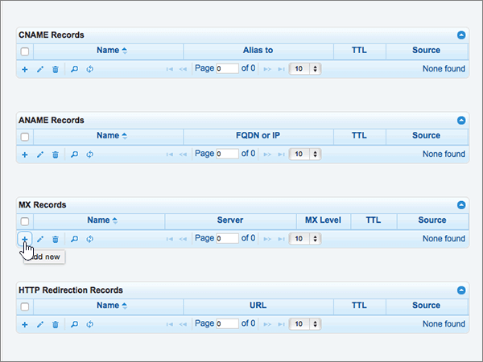
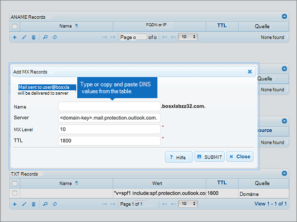
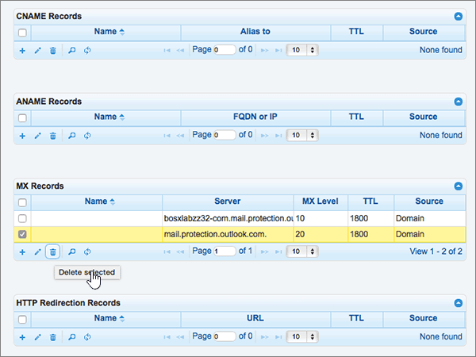

# Skapa DNS-poster på DNSMadeEasy för Microsoft

 **[Läs frågor och svar om domäner](../setup/domains-faq.md)** om du inte hittar det du letar efter. 
  
Om DNSMadeEasy är din DNS-värd följer du stegen i den här artikeln för att verifiera din domän och konfigurera DNS-poster för e-post, Skype för företag - Online och så vidare.
  
När du har lagt till dessa poster på DNSMadeEasy är din domän konfigurerad för att fungera med Microsoft-tjänster.
  

  
> [!NOTE]
> Det brukar ta omkring 15 minuter för DNS-ändringarna att gå igenom. Ibland kan det dock ta längre tid att uppdatera DNS-systemet på Internet för en ändring som du har gjort. Om du stöter på problem med e-postflödet eller får andra problem när du har lagt till DNS-posterna, går du till [Hitta och åtgärda problem när du har lagt till din domän eller DNS-poster i Microsoft](../get-help-with-domains/find-and-fix-issues.md). 
  
## Lägga till en TXT-post för verifiering

Innan du använder din domän med Microsoft, vill vi vara säkra på att det är du som äger den. Att du kan logga in på ditt konto hos domänregistratorn och skapa DNS-posten bevisar för Microsoft att du äger domänen.
  
> [!NOTE]
> Den här posten används endast för att verifiera att du äger domänen. Den påverkar ingenting annat. Du kan ta bort den senare om du vill. 
  
> [!IMPORTANT]
> För DNSMadeEasy-konton köptes domänen från en separat domän registrator. DNSMadeEasy erbjuder inte domän registrerings tjänster. Det är bara att logga in på DNSMadeEasy och skapa DNS-posten. 
  
1. Kom igång genom att gå till domänsidan på DNSMadeEasy genom att klicka på [den här länken](https://cp.dnsmadeeasy.com/). Du uppmanas att logga in först.
    
2. Välj den domän som du vill uppdatera i området **nyligen uppdaterade domäner** på **hanterings konsol** sidan. 
    
3. På sidan **hanterad DNS** , i området **TXT-poster** , väljer du **+** kontrollen () ( **Lägg till ny**).
    
    (Du kan behöva rulla nedåt.)
    
4. Gå till området **Add TXT Record**. I den nya postens rutor skriver du in, eller kopierar och klistrar in, värdena från följande tabell. 
    
    ||||
    |:-----|:-----|:-----|
    |**Namn**   |**Värde**   |**TTL**   |
    |(Lämna det här fältet tomt.)    |MS=ms *XXXXXXXX*    **Obs!** Det här är ett exempel. Använd ditt specifika **Mål eller pekar på adress ** värde här, från tabellen. [Hur hittar jag det här?](../get-help-with-domains/information-for-dns-records.md)          |1800    |
   
5. Välj **Skicka**.
    
6. Vänta några minuter innan du fortsätter, så att den post som du nyss skapade kan uppdateras på Internet.
    
Nu när du har lagt till posten på domänregistratorns webbplats kan du gå tillbaka till Microsoft och begär posten.
  
När Microsoft hittar rätt TXT-post är din domän verifierad.
  
1. I Microsoft-administrationscentret går du till **Inställningar** \> <a href="https://go.microsoft.com/fwlink/p/?linkid=834818" target="_blank">Domäner</a>.

    
2. På sidan **Domains** väljer du den domän du verifierar. 
    
3. På sidan **Setup** väljer du **Start setup**.
    
4. På sidan **Verify domain** väljer du **Verify**.
    
> [!NOTE]
> Det brukar ta omkring 15 minuter för DNS-ändringarna att gå igenom. Ibland kan det dock ta längre tid att uppdatera DNS-systemet på Internet för en ändring som du har gjort. Om du stöter på problem med e-postflödet eller får andra problem när du har lagt till DNS-posterna, går du till [Hitta och åtgärda problem när du har lagt till din domän eller DNS-poster i Microsoft](../get-help-with-domains/find-and-fix-issues.md). 
  
## Lägga till en MX-post så att e-post för din domän kommer till Microsoft.

1. Kom igång genom att gå till domänsidan på DNSMadeEasy genom att klicka på [den här länken](https://cp.dnsmadeeasy.com/). Du uppmanas att logga in först.
    
2. Välj den domän som du vill uppdatera i området **nyligen uppdaterade domäner** på **hanterings konsol** sidan. 
    
    Välj den domän som du vill uppdatera i området **nyligen uppdaterade domäner** på **hanterings konsol** sidan. 
    
    
  
3. Välj **(+)** kontrollen ( **Lägg till ny**) i området **MX Records** på sidan **hanterad DNS** .
    
    (Du kan behöva rulla nedåt.)
    
    
  
4. Gå till området **Add MX Records**. I den nya postens rutor skriver du in, eller kopierar och klistrar in, värdena från följande tabell. 
    
    (Du kan behöva rulla nedåt.)
    
    |**Name**|**Server**|**MX Level**|**TTL**|
    |:-----|:-----|:-----|:-----|
    |(Lämna det här fältet tomt.)    | *\<domain-key\>*  .mail.protection.outlook.com    **Värdet MÅSTE sluta med en punkt (.)**   **Obs!** Hämta din \<*domain-key*\> från ditt Microsoft-konto. [Hur hittar jag det?](../get-help-with-domains/information-for-dns-records.md)          |10.3    Mer information om prioritet finns i [Vad är MX-prioritet?](https://docs.microsoft.com/microsoft-365/admin/setup/domains-faq)   |1800    |
   
    
  
5. Välj **Skicka**.
    
    
  
6. Om det finns andra MX-poster som visas i avsnittet **MX Records** ska du ta bort alla genom att välja dem. 
    
    
  
7. När alla poster är markerade väljer du **ta bort markerat**.
    
    
  
8. I dialog rutan **ta bort MX-poster** väljer du **ta bort** för att bekräfta ändringarna. 
    
    
  
## Lägga till de fem CNAME-poster som krävs för Microsoft

1. Kom igång genom att gå till domänsidan på DNSMadeEasy genom att klicka på [den här länken](https://cp.dnsmadeeasy.com/). Du uppmanas att logga in först.
    
2. Välj den domän som du vill uppdatera i området **nyligen uppdaterade domäner** på **hanterings konsol** sidan. 
    
3. Välj **(+)** kontrollen ( **Lägg till ny**) i området **CNAME-poster** på sidan **hanterad DNS** .
    
    (Du kan behöva rulla nedåt.)
    
    
  
4. Lägg till den första av de fem CNAME-posterna.
    
    I den nya postens rutor i området **Add CNAME Records** skriver du in, eller kopierar och klistrar in, värdena från den första raden i följande tabell. 
    
    |**Name**|**Alias to**|**TTL**|
    |:-----|:-----|:-----|
    |autodiscover    |autodiscover.outlook.com.    **Värdet MÅSTE sluta med en punkt (.)**   |1800    |
    |sip    |sipdir.online.lync.com.    **Värdet MÅSTE sluta med en punkt (.)**   |1800    |
    |lyncdiscover    |webdir.online.lync.com.    **Värdet MÅSTE sluta med en punkt (.)**   |1800    |
    |enterpriseregistration    |enterpriseregistration.windows.net.    **Värdet MÅSTE sluta med en punkt (.)**   |1800    |
    |enterpriseenrollment    |enterpriseenrollment-s.manage.microsoft.com.    **Värdet MÅSTE sluta med en punkt (.)**   |1800    |
   
    
  
5. Välj **Skicka**.
    
    
  
6. Lägg till var och en av de andra fyra CNAME-posterna.
    
    I avsnittet **CNAME Records** markerar du **(+)** kontrollen ( **Lägg till ny**), skapar en post med värdena från nästa rad i tabellen och väljer sedan **Skicka** för att slutföra den posten. 
    
    Upprepa proceduren tills du har skapat alla fem CNAME-poster.
    
## Lägga till en TXT-post för SPF för att förhindra skräppost

> [!IMPORTANT]
> Du kan inte ha fler än en TXT-post för SPF för en domän. Om din domän har fler än en SPF-post får du e-postfel och problem med leveranser och skräppostklassificering. Om du redan har en SPF-post för domänen ska du inte skapa en ny för Microsoft. I stället kan du lägga till de Microsoft-värden som krävs i den aktuella posten så att du har en  *enda*  SPF-post som innehåller båda uppsättningar med värden. Behöver du exempel? Ta en titt på dessa [externa DNS-poster för Microsoft](https://docs.microsoft.com/microsoft-365/enterprise/external-domain-name-system-records). Du kan validera SPF-posten genom att använda någon av dessa[SPF-verifierings verktyg](../setup/domains-faq.md). 
  
1. Kom igång genom att gå till domänsidan på DNSMadeEasy genom att klicka på [den här länken](https://cp.dnsmadeeasy.com/). Du uppmanas att logga in först.
    
2. Välj den domän som du vill uppdatera i området **nyligen uppdaterade domäner** på **hanterings konsol** sidan. 
    
3. Välj **(+)** kontrollen ( **Lägg till ny**) i området **TXT-poster** på sidan **hanterad DNS** .
    
    (Du kan behöva rulla nedåt.)
    
    
  
4. Gå till området **Add TXT Record**. I den nya postens rutor skriver du in, eller kopierar och klistrar in, värdena från följande tabell. 
    
    |**Namn**|**Värde**|**TTL**|
    |:-----|:-----|:-----|
    |(Lämna det här fältet tomt.)    |v=spf1 include:spf.protection.outlook.com -all    **Obs!** Vi rekommenderar att du kopierar och klistrar in den här posten så att alla avstånd förblir korrekta.               |1800    |
   
    
  
5. Välj **Skicka**.
    
    
  
## Lägga till de två SRV-posterna som krävs för Microsoft

1. Kom igång genom att gå till domänsidan på DNSMadeEasy genom att klicka på [den här länken](https://cp.dnsmadeeasy.com/). Du uppmanas att logga in först.
    
2. Välj den domän som du vill uppdatera i området **nyligen uppdaterade domäner** på **hanterings konsol** sidan. 
    
3. Välj **(+)** kontrollen ( **Lägg till ny**) i området **SRV Records** på sidan **hanterad DNS** .
    
    (Du kan behöva rulla nedåt.)
    
    
  
4. Lägg till den första av de två SRV-posterna.
    
    I den nya postens rutor i området **Add SRV Records** skriver du in, eller kopierar och klistrar in, värdena från den första raden i följande tabell. 
    
    |**Name**|**Prioritet**|**Vikt**|**Port**|**Host**|**TTL**|
    |:-----|:-----|:-----|:-----|:-----|:-----|
    |_sip _sip._tls    |100    |9.1    |443    |sipdir.online.lync.com.    **Värdet MÅSTE sluta med en punkt (.)**   |1800    |
    |_sipfederationtls _sipfederationtls._tcp    |100    |9.1    |5061    |sipfed.online.lync.com.    **Värdet MÅSTE sluta med en punkt (.)**   |1800    |
   
    
  
5. Välj **Skicka**.
    
    
  
6. Lägg till den andra SRV-posten.
    
    I avsnittet **SRV Records** markerar du **(+)** kontrollen ( **Lägg till ny**), skapar en post med värdena från nästa rad i tabellen och väljer sedan **Skicka** för att slutföra den posten. 
    
> [!NOTE]
> Det brukar ta omkring 15 minuter för DNS-ändringarna att gå igenom. Ibland kan det dock ta längre tid att uppdatera DNS-systemet på Internet för en ändring som du har gjort. Om du stöter på problem med e-postflödet eller får andra problem när du har lagt till DNS-posterna, går du till [Hitta och åtgärda problem när du har lagt till din domän eller DNS-poster i Microsoft](../get-help-with-domains/find-and-fix-issues.md). 
  

