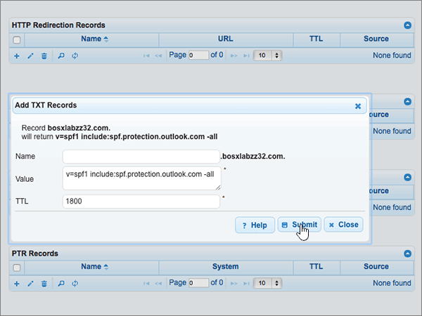

# Skapa DNS-poster på DNSMadeEasy för MicrosoftCreate DNS records at DNSMadeEasy for Microsoft

 **[Läs frågor och svar om domäner](../setup/domains-faq.md)** om du inte hittar det du letar efter.**[Check the Domains FAQ](../setup/domains-faq.md)** if you don't find what you're looking for. 
  
Om DNSMadeEasy är din DNS-värd följer du stegen i den här artikeln för att verifiera din domän och konfigurera DNS-poster för e-post, Skype för företag - Online och så vidare.If DNSMadeEasy is your DNS hosting provider, follow the steps in this article to verify your domain and set up DNS records for email, Skype for Business Online, and so on.
  
När du har lagt till dessa poster på DNSMadeEasy konfigureras domänen så att den fungerar med Microsoft-tjänster.After you add these records at DNSMadeEasy, your domain will be set up to work with Microsoft services.
  

  
> [!NOTE]
> Det brukar ta omkring 15 minuter för DNS-ändringarna att gå igenom. Ibland kan det dock ta längre tid att uppdatera DNS-systemet på Internet för en ändring som du har gjort. Om du stöter på problem med e-postflödet eller får andra problem när du har lagt till DNS-posterna, går du till [Hitta och åtgärda problem när du har lagt till din domän eller DNS-poster i Microsoft](../get-help-with-domains/find-and-fix-issues.md).Typically it takes about 15 minutes for DNS changes to take effect. However, it can occasionally take longer for a change you've made to update across the Internet's DNS system. If you're having trouble with mail flow or other issues after adding DNS records, see [Find and fix issues after adding your domain or DNS records](../get-help-with-domains/find-and-fix-issues.md). 
  
## Lägga till en TXT-post för verifieringAdd a TXT record for verification

Innan du använder din domän med Microsoft, vill vi vara säkra på att det är du som äger den. Att du kan logga in på ditt konto hos domänregistratorn och skapa DNS-posten bevisar för Microsoft att du äger domänen.Before you use your domain with Microsoft, we have to make sure that you own it. Your ability to log in to your account at your domain registrar and create the DNS record proves to Microsoft that you own the domain.
  
> [!NOTE]
> Den här posten används endast för att verifiera att du äger domänen. Den påverkar ingenting annat. Du kan ta bort den senare om du vill.This record is used only to verify that you own your domain; it doesn't affect anything else. You can delete it later, if you like. 
  
> [!IMPORTANT]
> För DNSMadeEasy-konton köptes domänen som du lade till från en separat domänregistratorer.For DNSMadeEasy accounts, the domain you added was purchased from a separate domain registrar. DNSMadeEasy erbjuder inte domänregistreringstjänster.DNSMadeEasy does not offer domain registration services. Din förmåga att logga in på DNSMadeEasy och skapa DNS-posten är tillräckligt bevis på ägande.Your ability to log in at DNSMadeEasy and create the DNS record is sufficient proof of ownership. 
  
1. Kom igång genom att gå till domänsidan på DNSMadeEasy genom att klicka på [den här länken](https://cp.dnsmadeeasy.com/).To get started, go to your domains page at DNSMadeEasy by using [this link](https://cp.dnsmadeeasy.com/). Du uppmanas att logga in först.You'll be prompted to login first.
    
2. Välj den domän som du vill uppdatera i området **Nyligen uppdaterade domäner** på sidan **Management Console.**On the **Management Console** page, in the **Recently Updated Domains** area, select the domain that you want to update. 
    
3. På sidan **Hanterad DNS** i området **TXT** **+** Records väljer du () **(Lägg till ny**).On the **Managed DNS** page, in the **TXT Records** area, select the ( **+**) control ( **Add new**).
    
    (Du kan behöva rulla nedåt.)(You may have to scroll down.)
    
4. Gå till området **Add TXT Record**. I den nya postens rutor skriver du in, eller kopierar och klistrar in, värdena från följande tabell.In the **Add TXT Records** area, in the boxes for the new record, type or copy and paste the values from the following table. 
    
    ||||
    |:-----|:-----|:-----|
    |**Namn****Name**   |**Värde****Value**   |**TTL****TTL**   |
    |(Lämna det här fältet tomt.)(Leave this field empty.)    |MS=ms *XXXXXXXX*MS=ms *XXXXXXXX*    **Obs!** Det här är ett exempel.**Note:** This is an example. Använd ditt specifika \*\*Mål eller pekar på adress \*\* värde här, från tabellen.Use your specific **Destination or Points to Address** value here, from the table. [Hur hittar jag det här?How do I find this?](../get-help-with-domains/information-for-dns-records.md)          |18001800    |
   
5. Välj **Skicka**.Select **Submit**.
    
6. Vänta några minuter innan du fortsätter, så att den post som du nyss skapade kan uppdateras på Internet.Wait a few minutes before you continue, so that the record you just created can update across the Internet.
    
Nu när du har lagt till posten på domänregistratorns webbplats kan du gå tillbaka till Microsoft och begär posten.Now that you've added the record at your domain registrar's site, you'll go back to Microsoft and request the record.
  
När Microsoft hittar rätt TXT-post är din domän verifierad.When Microsoft finds the correct TXT record, your domain is verified.
  
1. I Microsoft-administrationscentret går du till **Inställningar** \> <a href="https://go.microsoft.com/fwlink/p/?linkid=834818" target="_blank">Domäner</a>.In the Microsoft admin center, go to the **Settings** \> <a href="https://go.microsoft.com/fwlink/p/?linkid=834818" target="_blank">Domains</a> page.

    
2. På sidan **Domains** väljer du den domän du verifierar.On the **Domains** page, select the domain that you are verifying. 
    
3. På sidan **Setup** väljer du **Start setup**.On the **Setup** page, select **Start setup**.
    
4. På sidan **Verify domain** väljer du **Verify**.On the **Verify domain** page, select **Verify**.
    
> [!NOTE]
> Det brukar ta omkring 15 minuter för DNS-ändringarna att gå igenom. Ibland kan det dock ta längre tid att uppdatera DNS-systemet på Internet för en ändring som du har gjort. Om du stöter på problem med e-postflödet eller får andra problem när du har lagt till DNS-posterna, går du till [Hitta och åtgärda problem när du har lagt till din domän eller DNS-poster i Microsoft](../get-help-with-domains/find-and-fix-issues.md).Typically it takes about 15 minutes for DNS changes to take effect. However, it can occasionally take longer for a change you've made to update across the Internet's DNS system. If you're having trouble with mail flow or other issues after adding DNS records, see [Find and fix issues after adding your domain or DNS records](../get-help-with-domains/find-and-fix-issues.md). 
  
## Lägga till en MX-post så att e-post för din domän kommer till Microsoft.Add an MX record so email for your domain will come to Microsoft

1. Kom igång genom att gå till domänsidan på DNSMadeEasy genom att klicka på [den här länken](https://cp.dnsmadeeasy.com/). Du uppmanas att logga in först.To get started, go to your domains page at DNSMadeEasy by using [this link](https://cp.dnsmadeeasy.com/). You'll be prompted to login first.
    
2. Välj den domän som du vill uppdatera i området **Nyligen uppdaterade domäner** på sidan **Management Console.**On the **Management Console** page, in the **Recently Updated Domains** area, select the domain that you want to update. 
    
    Välj den domän som du vill uppdatera i området **Nyligen uppdaterade domäner** på sidan **Management Console.**On the **Management Console** page, in the **Recently Updated Domains** area, select the domain that you want to update. 
    
    
  
3. På sidan **Hanterad DNS** i området **MX Records** väljer du **(+)** kontrollen ( **Lägg till ny**).On the **Managed DNS** page, in the **MX Records** area, select the **(+)** control ( **Add new**).
    
    (Du kan behöva rulla nedåt.)(You may have to scroll down.)
    
    
  
4. Gå till området **Add MX Records**. I den nya postens rutor skriver du in, eller kopierar och klistrar in, värdena från följande tabell.In the **Add MX Records** area, in the boxes for the new record, type or copy and paste the values from the following table. 
    
    (Du kan behöva rulla nedåt.)(You may have to scroll down.)
    
    |**Namn****Name**|**Server****Server**|**MX Level****MX Level**|**TTL****TTL**|
    |:-----|:-----|:-----|:-----|
    |(Lämna det här fältet tomt.)(Leave this field empty.)    | *\<domännyckel\>*  .mail.protection.outlook.com*\<domain-key\>*  .mail.protection.outlook.com    **Värdet MÅSTE sluta med en punkt (.)****This value MUST end with a period (.)**   **Obs!** Hämta din \<*domännyckel*\> från ditt Microsoft-konto.**Note:** Get your \<*domain-key*\> from your Microsoft account. [Hur hittar jag det?How do I find this?](../get-help-with-domains/information-for-dns-records.md)          |1010    Mer information om prioritet finns i [Vad är MX-prioritet?](https://support.office.com/article/2784cc4d-95be-443d-b5f7-bb5dd867ba83.aspx)For more information about priority, see [What is MX priority?](https://support.office.com/article/2784cc4d-95be-443d-b5f7-bb5dd867ba83.aspx)   |18001800    |
   
    
  
5. Välj **Skicka**.Select **Submit**.
    
    
  
6. Om det finns andra MX-poster som visas i avsnittet **MX Records** ska du ta bort alla genom att välja dem.If there are any other MX records listed in the **MX Records** section, delete all of them by selecting each one. 
    
    
  
7. När alla poster är markerade väljer du **Ta bort markerat**.When all records are selected, select **Delete selected**.
    
    
  
8. Välj **Ta bort** för att bekräfta ändringarna i dialogrutan Ta **bort MX-poster.**In the **Delete MX Records** dialog box, select **Delete** to confirm your changes. 
    
    
  
## Lägga till de fem CNAME-poster som krävs för MicrosoftAdd the five CNAME records that are required for Microsoft

1. Kom igång genom att gå till domänsidan på DNSMadeEasy genom att klicka på [den här länken](https://cp.dnsmadeeasy.com/). Du uppmanas att logga in först.To get started, go to your domains page at DNSMadeEasy by using [this link](https://cp.dnsmadeeasy.com/). You'll be prompted to login first.
    
2. Välj den domän som du vill uppdatera i området **Nyligen uppdaterade domäner** på sidan **Management Console.**On the **Management Console** page, in the **Recently Updated Domains** area, select the domain that you want to update. 
    
3. På sidan **Hanterad DNS** i området **CNAME Records** väljer du **(+)** kontrollen ( **Lägg till ny**).On the **Managed DNS** page, in the **CNAME Records** area, select the **(+)** control ( **Add new**).
    
    (Du kan behöva rulla nedåt.)(You may have to scroll down.)
    
    
  
4. Lägg till den första av de fem CNAME-posterna.Add the first of the five CNAME records.
    
    I den nya postens rutor i området **Add CNAME Records** skriver du in, eller kopierar och klistrar in, värdena från den första raden i följande tabell.In the **Add CNAME Records** area, in the boxes for the new record, type or copy and paste the values from the first row in the following table. 
    
    |**Name****Name**|**Alias to****Alias to**|**TTL****TTL**|
    |:-----|:-----|:-----|
    |autodiscoverautodiscover    |autodiscover.outlook.com.autodiscover.outlook.com.    **Värdet MÅSTE sluta med en punkt (.)****This value MUST end with a period (.)**   |18001800    |
    |sipsip    |sipdir.online.lync.com.sipdir.online.lync.com.    **Värdet MÅSTE sluta med en punkt (.)****This value MUST end with a period (.)**   |18001800    |
    |lyncdiscoverlyncdiscover    |webdir.online.lync.com.webdir.online.lync.com.    **Värdet MÅSTE sluta med en punkt (.)****This value MUST end with a period (.)**   |18001800    |
    |enterpriseregistrationenterpriseregistration    |enterpriseregistration.windows.net.enterpriseregistration.windows.net.    **Värdet MÅSTE sluta med en punkt (.)****This value MUST end with a period (.)**   |18001800    |
    |enterpriseenrollmententerpriseenrollment    |enterpriseenrollment-s.manage.microsoft.com.enterpriseenrollment-s.manage.microsoft.com.    **Värdet MÅSTE sluta med en punkt (.)****This value MUST end with a period (.)**   |18001800    |
   
    
  
5. Välj **Skicka**.Select **Submit**.
    
    
  
6. Lägg till var och en av de fyra andra CNAME-posterna.Add each of the other four CNAME records.
    
    I avsnittet **CNAME-poster** markerar du **(+)** kontrollen ( **Lägg till ny**), skapar en post med hjälp av värdena från nästa rad i tabellen och väljer sedan **Skicka** igen för att slutföra posten.In the **CNAME Records** section, select the **(+)** control ( **Add new**), create a record by using the values from the next row in the table, and then again select **Submit** to complete that record. 
    
    Upprepa den här processen tills du har skapat alla fem CNAME-poster.Repeat this process until you have created all five CNAME records.
    
## Lägga till en TXT-post för SPF för att förhindra skräppostAdd a TXT record for SPF to help prevent email spam

> [!IMPORTANT]
> Du kan inte ha fler än en TXT-post för SPF för en domän.You cannot have more than one TXT record for SPF for a domain. Om din domän har fler än en SPF-post får du e-postfel och problem med leveranser och skräppostklassificering.If your domain has more than one SPF record, you'll get email errors, as well as delivery and spam classification issues. Om du redan har en SPF-post för domänen ska du inte skapa en ny för Microsoft.If you already have an SPF record for your domain, don't create a new one for Microsoft. Lägg i stället till de nödvändiga Microsoft-värdena i den aktuella posten så att du har en *enda* SPF-post som innehåller båda uppsättningarna värden.Instead, add the required Microsoft values to the current record so that you have a  *single*  SPF record that includes both sets of values. Behöver du exempel?Need examples? Ta en titt på dessa [externa DNS-poster för Microsoft](https://support.office.com/article/c0531a6f-9e25-4f2d-ad0e-a70bfef09ac0).Check out these [External Domain Name System records for Microsoft](https://support.office.com/article/c0531a6f-9e25-4f2d-ad0e-a70bfef09ac0). Om du vill validera SPF-posten kan du använda något av dessa[SPF-valideringsverktyg](../setup/domains-faq.md).To validate your SPF record, you can use one of these[SPF validation tools](../setup/domains-faq.md). 
  
1. Kom igång genom att gå till domänsidan på DNSMadeEasy genom att klicka på [den här länken](https://cp.dnsmadeeasy.com/).To get started, go to your domains page at DNSMadeEasy by using [this link](https://cp.dnsmadeeasy.com/). Du uppmanas att logga in först.You'll be prompted to login first.
    
2. Välj den domän som du vill uppdatera i området **Nyligen uppdaterade domäner** på sidan **Management Console.**On the **Management Console** page, in the **Recently Updated Domains** area, select the domain that you want to update. 
    
3. På sidan **Hanterad DNS** i området **TXT Records** väljer du **(+)** kontrollen ( **Lägg till ny**).On the **Managed DNS** page, in the **TXT Records** area, select the **(+)** control ( **Add new**).
    
    (Du kan behöva rulla nedåt.)(You may have to scroll down.)
    
    
  
4. Gå till området **Add TXT Record**. I den nya postens rutor skriver du in, eller kopierar och klistrar in, värdena från följande tabell.In the **Add TXT Records** area, in the boxes for the new record, type or copy and paste the values from the following table. 
    
    |**Namn****Name**|**Värde****Value**|**TTL****TTL**|
    |:-----|:-----|:-----|
    |(Lämna det här fältet tomt.)(Leave this field empty.)    |v=spf1 include:spf.protection.outlook.com -allv=spf1 include:spf.protection.outlook.com -all    **Obs!** Vi rekommenderar att du kopierar och klistrar in den här posten så att alla avstånd förblir korrekta.    **Note:** We recommend copying and pasting this entry, so that all of the spacing stays correct.           |18001800    |
   
    
  
5. Välj **Skicka**.Select **Submit**.
    
    
  
## Lägga till de två SRV-posterna som krävs för MicrosoftAdd the two SRV records that are required for Microsoft

1. Kom igång genom att gå till domänsidan på DNSMadeEasy genom att klicka på [den här länken](https://cp.dnsmadeeasy.com/). Du uppmanas att logga in först.To get started, go to your domains page at DNSMadeEasy by using [this link](https://cp.dnsmadeeasy.com/). You'll be prompted to login first.
    
2. Välj den domän som du vill uppdatera i området **Nyligen uppdaterade domäner** på sidan **Management Console.**On the **Management Console** page, in the **Recently Updated Domains** area, select the domain that you want to update. 
    
3. På sidan **Hanterad DNS** i området **SRV Records** på sidan Hanterade DNS väljer du **(+)** kontrollen ( **Lägg till ny**).On the **Managed DNS** page, in the **SRV Records** area, select the **(+)** control ( **Add new**).
    
    (Du kan behöva rulla nedåt.)(You may have to scroll down)
    
    
  
4. Lägg till den första av de två SRV-posterna.Add the first of the two SRV records.
    
    I den nya postens rutor i området **Add SRV Records** skriver du in, eller kopierar och klistrar in, värdena från den första raden i följande tabell.In the **Add SRV Records** area, in the boxes for the new record, type or copy and paste the values from the first row in the following table. 
    
    |**Name****Name**|**Prioritet****Priority**|**Vikt****Weight**|**Port****Port**|**Host****Host**|**TTL****TTL**|
    |:-----|:-----|:-----|:-----|:-----|:-----|
    |_sip._tls_sip._tls    |100100    |11    |443443    |sipdir.online.lync.com.sipdir.online.lync.com.    **Värdet MÅSTE sluta med en punkt (.)****This value MUST end with a period (.)**   |18001800    |
    |_sipfederationtls._tcp_sipfederationtls._tcp    |100100    |11    |50615061    |sipfed.online.lync.com.sipfed.online.lync.com.    **Värdet MÅSTE sluta med en punkt (.)****This value MUST end with a period (.)**   |18001800    |
   
    
  
5. Välj **Skicka**.Select **Submit**.
    
    
  
6. Lägg till den andra SRV-posten.Add the other SRV record.
    
    I avsnittet **SRV-poster** markerar du **(+)** kontrollen ( **Lägg till ny**), skapar en post med hjälp av värdena från nästa rad i tabellen och väljer sedan **Skicka** igen för att slutföra posten.In the **SRV Records** section, select the **(+)** control ( **Add new**), create a record by using the values from the next row in the table, and then again select **Submit** to complete that record. 
    
> [!NOTE]
> Det brukar ta omkring 15 minuter för DNS-ändringarna att gå igenom. Ibland kan det dock ta längre tid att uppdatera DNS-systemet på Internet för en ändring som du har gjort. Om du stöter på problem med e-postflödet eller får andra problem när du har lagt till DNS-posterna, går du till [Hitta och åtgärda problem när du har lagt till din domän eller DNS-poster i Microsoft](../get-help-with-domains/find-and-fix-issues.md).Typically it takes about 15 minutes for DNS changes to take effect. However, it can occasionally take longer for a change you've made to update across the Internet's DNS system. If you're having trouble with mail flow or other issues after adding DNS records, see [Find and fix issues after adding your domain or DNS records](../get-help-with-domains/find-and-fix-issues.md). 
  

