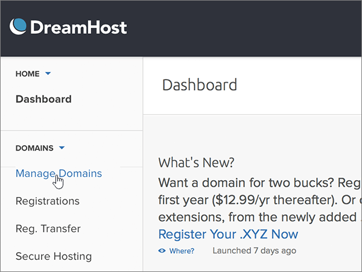

# Skapa DNS-poster på Dreamhost för MicrosoftCreate DNS records at Dreamhost for Microsoft

 **[Läs frågor och svar om domäner](../setup/domains-faq.md)** om du inte hittar det du letar efter.**[Check the Domains FAQ](../setup/domains-faq.md)** if you don't find what you're looking for. 
  
Om DreamHost är din DNS-värd följer du stegen i den här artikeln för att verifiera din domän och konfigurera DNS-poster för e-post, Lync och så vidare.If DreamHost is your DNS hosting provider, follow the steps in this article to verify your domain and set up DNS records for email, Lync, and so on.
 
När du har lagt till dessa poster på DreamHost konfigureras domänen så att den fungerar med Microsoft-tjänster.After you add these records at DreamHost, your domain will be set up to work with Microsoft services.
  
Mer information om webbhotell och DNS för webbplatser med Microsoft finns i [Använda en offentlig webbplats med Microsoft](https://support.office.com/article/a8178510-501d-4bd8-9921-b04f2e9517a5.aspx).To learn about webhosting and DNS for websites with Microsoft, see [Use a public website with Microsoft](https://support.office.com/article/a8178510-501d-4bd8-9921-b04f2e9517a5.aspx).
  
> [!NOTE]
> Det brukar ta ungefär 15 minuter för DNS-ändringarna att gå igenom. Ibland kan det dock ta längre tid att uppdatera DNS-systemet på Internet för en ändring som du har gjort. Om du stöter på problem med e-postflödet eller får andra problem när du har lagt till DNS-posterna, går du till [Felsöka problem när du har ändrat domännamn eller DNS-poster](../get-help-with-domains/find-and-fix-issues.md).Typically it takes about 15 minutes for DNS changes to take effect. However, it can occasionally take longer for a change you've made to update across the Internet's DNS system. If you're having trouble with mail flow or other issues after adding DNS records, see [Troubleshoot issues after changing your domain name or DNS records](../get-help-with-domains/find-and-fix-issues.md). 
  
## Lägga till en TXT-post för verifieringAdd a TXT record for verification

Innan du använder domänen med Microsoft måste vi se till att du äger den.Before you use your domain with Microsoft, we have to make sure that you own it. Din förmåga att logga in på ditt konto hos domänregistratorer och skapa DNS-posten bevisar för Microsoft att du äger domänen.Your ability to log in to your account at your domain registrar and create the DNS record proves to Microsoft that you own the domain.
  
> [!NOTE]
> Den här posten används endast för att verifiera att du äger domänen. Den påverkar ingenting annat. Du kan ta bort den senare om du vill.This record is used only to verify that you own your domain; it doesn't affect anything else. You can delete it later, if you like. 
  
1. För att komma igång, gå till din domänsida på DreamHost med hjälp av [denna länk](https://panel.dreamhost.com/).To get started, go to your domains page at DreamHost by using [this link](https://panel.dreamhost.com/). Du uppmanas att logga in.You'll be prompted to Sign in.
    
    
  
2. På **instrumentpanelssidan** väljer du **Domäner**och hanterar sedan **domäner**.On the **Dashboard** page, select **Domains**, and then **Manage Domains**.
    
    
  
3. Välj **DNS** för den domän som du vill redigera i avsnittet **Domän** på sidan **Hantera domäner.**On the **Manage Domains** page, in the **Domain** section, select **DNS** for the domain that you want to edit. 
    
    
  
4. I avsnittet **Lägg till en anpassad DNS-post** skriver eller kopierar eller klistrar du in värdena från följande tabell i rutorna för den nya posten.In the **Add a custom DNS record** section, in the boxes for the new record, type or copy and paste the values from the following table. 
    
    (Du kan behöva rulla nedåt.)(You may have to scroll down.)
    
    (Välj värdet för **Type** i listrutan.)(Choose the **Type** value from the drop-down list.) 
    
    |**Name****Name**|**Typ****Type**|**Värde****Value**|**Kommentar****Comment**|
    |:-----|:-----|:-----|:-----|
    |(Lämna det här fältet tomt.)(Leave this field empty.)    |TXTTXT    |MS=ms *XXXXXXXX*MS=ms *XXXXXXXX*    **Obs!** Det här är ett exempel.**Note:** This is an example. Använd ditt specifika **mål- eller poäng till-adress-värde** här, från bordet.Use your specific **Destination or Points to Address** value here, from the table.           [Hur hittar jag det här?How do I find this?](../get-help-with-domains/information-for-dns-records.md)          |(Det här fältet är valfritt.)(This field is optional.)    |
   
   
  
5. Välj **Lägg till post nu!**Select **Add Record Now!**
    
    
  
6. Vänta några minuter innan du fortsätter, så att den post som du nyss skapade kan uppdateras på Internet.Wait a few minutes before you continue, so that the record you just created can update across the Internet.
    
Nu när du har lagt till posten på domänregistratorerns webbplats går du tillbaka till Microsoft och begär posten.Now that you've added the record at your domain registrar's site, you'll go back to Microsoft and request the record.
  
När Microsoft hittar rätt TXT-post verifieras domänen.When Microsoft finds the correct TXT record, your domain is verified.
  
1. Gå till sidan **Inställningar** \> domäner i <a href="https://go.microsoft.com/fwlink/p/?linkid=834818" target="_blank">Microsofts administrationscenter.</a>In the Microsoft admin center, go to the **Settings** \> <a href="https://go.microsoft.com/fwlink/p/?linkid=834818" target="_blank">Domains</a> page.

    
2. På sidan **Domains** väljer du den domän du verifierar.On the **Domains** page, select the domain that you are verifying. 
    
    
  
3. På sidan **Setup** väljer du **Start setup**.On the **Setup** page, select **Start setup**.
    
    
  
4. På sidan **Verify domain** väljer du **Verify**.On the **Verify domain** page, select **Verify**.
    
    
  
> [!NOTE]
>  Det brukar ta ungefär 15 minuter för DNS-ändringarna att gå igenom. Ibland kan det dock ta längre tid att uppdatera DNS-systemet på Internet för en ändring som du har gjort. Om du stöter på problem med e-postflödet eller får andra problem när du har lagt till DNS-posterna, går du till [Felsöka problem när du har ändrat domännamn eller DNS-poster](../get-help-with-domains/find-and-fix-issues.md).Typically it takes about 15 minutes for DNS changes to take effect. However, it can occasionally take longer for a change you've made to update across the Internet's DNS system. If you're having trouble with mail flow or other issues after adding DNS records, see [Troubleshoot issues after changing your domain name or DNS records](../get-help-with-domains/find-and-fix-issues.md). 
  

  
## Lägg till en MX-post så att e-post för din domän kommer till MicrosoftAdd an MX record so email for your domain will come to Microsoft

Följ stegen nedan.Follow the steps below.
  
1. För att komma igång, gå till din domänsida på DreamHost med hjälp av [denna länk](https://panel.dreamhost.com/).To get started, go to your domains page at DreamHost by using [this link](https://panel.dreamhost.com/). Du uppmanas att logga in.You'll be prompted to Sign in.
    
    
  
2. På **instrumentpanelssidan** väljer du **E-post**och sedan **Anpassad MX**.On the **Dashboard** page, select **Mail**, and then **Custom MX**.
    
    
  
3. Välj **Redigera** för den domän som du vill redigera i kolumnen **Åtgärder** i avsnittet **Hantera e-postleverans.**In the **Manage Mail Delivery** section, in the **Actions** column, select **Edit** for the domain that you want to edit. 
    
    
  
4. I avsnittet **Anpassad MX-post** skriver eller kopierar eller klistrar du in följande värden från följande tabell i rutorna för den nya posten.In the **Custom MX Record** section, in the boxes for the new record, type or copy and paste the following values from the following table. 
    
    (Du kan behöva rulla nedåt.)(You may have to scroll down.)
    
    (Om det finns några andra befintliga MX-poster markerar du de poster som ska tas bort.)(If there are any other existing MX records, mark those records to be deleted.)
    
    |**MX-post (obligatoriskt)****MX Record (required)**|
    |:-----|
    |0  *\<domain-key\>*  .mail.protection.outlook.com.0  *\<domain-key\>*  .mail.protection.outlook.com.    **Värdet MÅSTE sluta med en punkt (.)****This value MUST end with a period (.)**   0 motsvarar MX-prioritetsvärdet. Skriv 0 i början av MX-värdet och infoga ett blanksteg före resten av värdet.  The 0 is the MX priority value. Add it to the beginning of the MX value, separated from the remainder of the value by a space.    **Anm.:** Hämta \* \<domännyckeln\> \* från ditt Microsoft-konto.**Note:** Get your  *\<domain-key\>*  from your Microsoft account.           [Hur hittar jag det här?How do I find this?](../get-help-with-domains/information-for-dns-records.md)          |
   
    
  
5. Välj **Ändra den här domänen om du vill använda anpassade MX-poster nu!**Select **Change this domain to use custom MX records now!**
    
    
  
6. Om det finns några andra befintliga MX-poster tar du bort varje post genom att markera posten och sedan trycka på **Delete-tangenten** på tangentbordet.If there are any other existing MX records, delete each record by selecting the entry and then pressing the **Delete** key on your keyboard. 
    
    
  
7. Om du har tagit bort några poster väljer du **Uppdatera dina anpassade MX-poster nu!**If you have deleted any records, select **Update your custom MX records now!**
    
    

  
## Lägga till de sex CNAME-poster som krävs för MicrosoftAdd the six CNAME records that are required for Microsoft

Följ stegen nedan.Follow the steps below.
  
1. För att komma igång, gå till din domänsida på DreamHost med hjälp av [denna länk](https://panel.dreamhost.com/).To get started, go to your domains page at DreamHost by using [this link](https://panel.dreamhost.com/). Du uppmanas att logga in.You'll be prompted to Sign in.
    
    
  
2. På **instrumentpanelssidan** väljer du **Domäner**och hanterar sedan **domäner**.On the **Dashboard** page, select **Domains**, and then **Manage Domains**.
    
    
  
3. Välj **DNS** för den domän som du vill redigera i avsnittet **Domän** på sidan **Hantera domäner.**On the **Manage Domains** page, in the **Domain** section, select **DNS** for the domain that you want to edit. 
    
    
  
4. I avsnittet **Lägg till en anpassad DNS-post** skriver eller kopierar eller klistrar du in värdena från den första raden i följande tabell i rutorna för den nya posten.In the **Add a custom DNS record** section, in the boxes for the new record, type or copy and paste the values from the first row in the following table. 
    
    (Du kan behöva rulla nedåt.)(You may have to scroll down.)
    
    (Välj värdet för **Type** i listrutan.)(Choose the **Type** value from the drop-down list.) 
    
    |**Name****Name**|**Typ****Type**|**Värde****Value**|**Kommentar****Comment**|
    |:-----|:-----|:-----|:-----|
    |autodiscoverautodiscover    |CNAMECNAME    |autodiscover.outlook.com.autodiscover.outlook.com.    **Värdet MÅSTE sluta med en punkt (.)****This value MUST end with a period (.)**   |(Det här fältet är valfritt.)(This field is optional.)    |
    |sipsip    |CNAMECNAME    |sipdir.online.lync.com.sipdir.online.lync.com.    **Värdet MÅSTE sluta med en punkt (.)****This value MUST end with a period (.)**   |(Det här fältet är valfritt.)(This field is optional.)    |
    |lyncdiscoverlyncdiscover    |CNAMECNAME    |webdir.online.lync.com.webdir.online.lync.com.    **Värdet MÅSTE sluta med en punkt (.)****This value MUST end with a period (.)**   |(Det här fältet är valfritt.)(This field is optional.)    |
    |enterpriseregistrationenterpriseregistration    |CNAMECNAME    |enterpriseregistration.windows.net.enterpriseregistration.windows.net.    **Värdet MÅSTE sluta med en punkt (.)****This value MUST end with a period (.)**   |(Det här fältet är valfritt.)(This field is optional.)    |
    |enterpriseenrollmententerpriseenrollment    |CNAMECNAME    |enterpriseenrollment-s.manage.microsoft.com.enterpriseenrollment-s.manage.microsoft.com.    **Värdet MÅSTE sluta med en punkt (.)****This value MUST end with a period (.)**   |(Det här fältet är valfritt.)(This field is optional.)    |
   
    
  
5. Välj **Lägg till post nu!**Select **Add Record Now!**
    
    
  
6. Lägg till var och en av de två andra CNAME-posterna med hjälp av föregående två steg och värdena från de andra fem raderna i tabellen.Using the preceding two steps and the values from the other five rows in the table, add each of the other five CNAME records.

  
## Lägga till en TXT-post för SPF för att förhindra skräppostAdd a TXT record for SPF to help prevent email spam

> [!IMPORTANT]
> Du kan inte ha fler än en TXT-post för SPF för en domän.You cannot have more than one TXT record for SPF for a domain. Om din domän har fler än en SPF-post får du e-postfel och problem med leveranser och skräppostklassificering.If your domain has more than one SPF record, you'll get email errors, as well as delivery and spam classification issues. Om du redan har en SPF-post för domänen ska du inte skapa en ny för Microsoft.If you already have an SPF record for your domain, don't create a new one for Microsoft. Lägg i stället till de nödvändiga Microsoft-värdena i den aktuella posten så att du har en *enda* SPF-post som innehåller båda uppsättningarna värden.Instead, add the required Microsoft values to the current record so that you have a  *single*  SPF record that includes both sets of values.
  
Följ stegen nedan.Follow the steps below.
  
1. För att komma igång, gå till din domänsida på DreamHost med hjälp av [denna länk](https://panel.dreamhost.com/).To get started, go to your domains page at DreamHost by using [this link](https://panel.dreamhost.com/). Du uppmanas att logga in.You'll be prompted to Sign in.
    
    
  
2. På **instrumentpanelssidan** väljer du **Domäner**och hanterar sedan **domäner**.On the **Dashboard** page, select **Domains**, and then **Manage Domains**.
    
    
  
3. Välj **DNS** för den domän som du vill redigera i avsnittet **Domän** på sidan **Hantera domäner.**On the **Manage Domains** page, in the **Domain** section, select **DNS** for the domain that you want to edit. 
    
    
  
4. I avsnittet **Lägg till en anpassad DNS-post** skriver eller kopierar eller klistrar du in värdena från den första raden i följande tabell i rutorna för den nya posten.In the **Add a custom DNS record** section, in the boxes for the new record, type or copy and paste the values from the first row in the following table. 
    
    (Du kan behöva rulla nedåt.)(You may have to scroll down.)
    
    (Välj värdet för **Type** i listrutan.)(Choose the **Type** value from the drop-down list.) 
    
    |**Name****Name**|**Typ****Type**|**Värde****Value**|**Kommentar****Comment**|
    |:-----|:-----|:-----|:-----|
    |(Lämna det här fältet tomt.)(Leave this field empty.)    |TXTTXT    |v=spf1 include:spf.protection.outlook.com -allv=spf1 include:spf.protection.outlook.com -all    **Obs!** Vi rekommenderar att du kopierar och klistrar in den här posten så att alla avstånd förblir korrekta.    **Note:** We recommend copying and pasting this entry, so that all of the spacing stays correct.           |(Det här fältet är valfritt.)(This field is optional.)    |
   
   
  
5. Välj **Lägg till post nu!**Select **Add Record Now!**
    
    
  
6. Lägg till den andra SRV-posten med föregående två steg och värdena från den andra raden i tabellen.Using the preceding two steps and the values from the second row in the table, add the other SRV record.
    
  
## Lägg till de två SRV-poster som krävs för MicrosoftAdd the two SRV records that are required for Microsoft

Följ stegen nedan.Follow the steps below.
  
1. För att komma igång, gå till din domänsida på DreamHost med hjälp av [denna länk](https://panel.dreamhost.com/).To get started, go to your domains page at DreamHost by using [this link](https://panel.dreamhost.com/). Du uppmanas att logga in.You'll be prompted to Sign in.
    
    
  
2. På **instrumentpanelssidan** väljer du **Domäner**och hanterar sedan **domäner**.On the **Dashboard** page, select **Domains**, and then **Manage Domains**.
    
    
  
3. Välj **DNS** för den domän som du vill redigera i avsnittet **Domän** på sidan **Hantera domäner.**On the **Manage Domains** page, in the **Domain** section, select **DNS** for the domain that you want to edit. 
    
    
  
4. I avsnittet **Lägg till en anpassad DNS-post** skriver eller kopierar eller klistrar du in värdena från den första raden i följande tabell i rutorna för den nya posten.In the **Add a custom DNS record** section, in the boxes for the new record, type or copy and paste the values from the first row in the following table. 
    
    (Du kan behöva rulla nedåt.)(You may have to scroll down.)
    
    (Välj värdet för **Type** i listrutan.)(Choose the **Type** value from the drop-down list.) 
    
    |**Name****Name**|**Typ****Type**|**Värde****Value**|**Kommentar****Comment**|
    |:-----|:-----|:-----|:-----|
    |_sip._tls_sip._tls    |SRVSRV    |100 1 443100 1 443    sipdir.online.lync.com.sipdir.online.lync.com.    **Värdet MÅSTE sluta med en punkt (.)****This value MUST end with a period (.)**   |(Det här fältet är valfritt.)(This field is optional.)    |
    |_sipfederationtls._tcp_sipfederationtls._tcp    |SRVSRV    |100 1 5061100 1 5061    sipfed.online.lync.com.sipfed.online.lync.com.    **Värdet MÅSTE sluta med en punkt (.)****This value MUST end with a period (.)**   |(Det här fältet är valfritt.)(This field is optional.)    |
   
    
  
5. Välj **Lägg till post nu!**.Select **Add Record Now!**.
    
    
  
6. Lägg till den andra SRV-posten med föregående två steg och värdena från den andra raden i tabellen.Using the preceding two steps and the values from the second row in the table, add the other SRV record.
    
> [!NOTE]
>  Det brukar ta ungefär 15 minuter för DNS-ändringarna att gå igenom. Ibland kan det dock ta längre tid att uppdatera DNS-systemet på Internet för en ändring som du har gjort. Om du stöter på problem med e-postflödet eller får andra problem när du har lagt till DNS-posterna, går du till [Felsöka problem när du har ändrat domännamn eller DNS-poster](../get-help-with-domains/find-and-fix-issues.md).Typically it takes about 15 minutes for DNS changes to take effect. However, it can occasionally take longer for a change you've made to update across the Internet's DNS system. If you're having trouble with mail flow or other issues after adding DNS records, see [Troubleshoot issues after changing your domain name or DNS records](../get-help-with-domains/find-and-fix-issues.md). 

  
