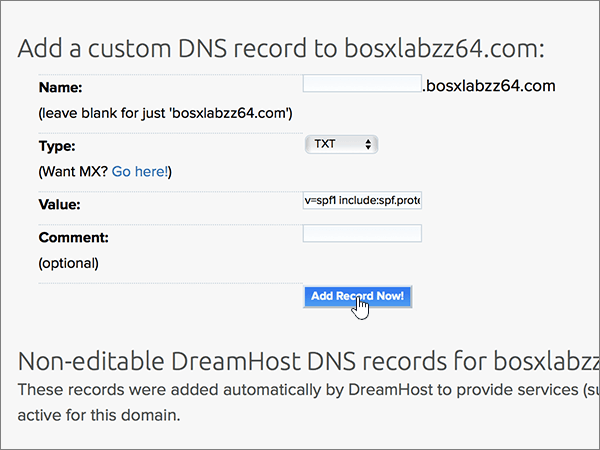

# Skapa DNS-poster på Dreamhost för Microsoft

 **[Läs frågor och svar om domäner](../setup/domains-faq.yml)** om du inte hittar det du letar efter. 
  
Om DreamHost är din DNS-värd följer du stegen i den här artikeln för att verifiera din domän och konfigurera DNS-poster för e-post, Lync och så vidare.
 
När du har lagt till dessa poster på DreamHost är din domän konfigurerad för att fungera med Microsoft-tjänster.
  
  
> [!NOTE]
> Det brukar ta ungefär 15 minuter för DNS-ändringarna att gå igenom. Ibland kan det dock ta längre tid att uppdatera DNS-systemet på Internet för en ändring som du har gjort. Om du stöter på problem med e-postflödet eller får andra problem när du har lagt till DNS-posterna, går du till [Felsöka problem när du har ändrat domännamn eller DNS-poster](../get-help-with-domains/find-and-fix-issues.md). 
  
## Lägga till en TXT-post för verifiering

Innan du använder din domän med Microsoft, vill vi vara säkra på att det är du som äger den. Att du kan logga in på ditt konto hos domänregistratorn och skapa DNS-posten bevisar för Microsoft att du äger domänen.
  
> [!NOTE]
> Den här posten används endast för att verifiera att du äger domänen. Den påverkar ingenting annat. Du kan ta bort den senare om du vill. 
  
1. Kom igång genom att gå till sidan Domains på DreamHost med hjälp av [den här länken](https://panel.dreamhost.com/). Du uppmanas att logga in.
    
    
  
2. Välj **domäner** på sidan **instrument panel** och sedan **hantera domäner**.
    
    
  
3. Välj **DNS** för den domän som du vill redigera i avsnittet **Domain** på sidan **hantera domäner** . 
    
    
  
4. I rutorna för den nya posten i avsnittet **Add a Custom DNS Record** skriver du in, eller kopierar och klistrar in, värdena från följande tabell. 
    
    (Du kan behöva rulla nedåt.)
    
    (Välj värdet för **Type** i listrutan.) 
    
    |**Name**|**Typ**|**Värde**|**Kommentar**|
    |:-----|:-----|:-----|:-----|
    |(Lämna det här fältet tomt.)    |TXT    |MS=ms *XXXXXXXX*    **Obs!** Det här är ett exempel. Använd ditt specifika **Mål eller pekar på adress** värde här, från tabellen.           [Hur hittar jag det här?](../get-help-with-domains/information-for-dns-records.md)          |(Det här fältet är valfritt.)    |
   
   
  
5. Välj **Lägg till post nu!**
    
    
  
6. Vänta några minuter innan du fortsätter, så att den post som du nyss skapade kan uppdateras på Internet.
    
Nu när du har lagt till posten på domänregistratorns webbplats kan du gå tillbaka till Microsoft och begär posten.
  
När Microsoft hittar rätt TXT-post är din domän verifierad.
  
1. I Microsoft-administrationscentret går du till **Inställningar** \> <a href="https://go.microsoft.com/fwlink/p/?linkid=834818" target="_blank">Domäner</a>.

    
2. På sidan **Domains** väljer du den domän du verifierar. 
    
    
  
3. På sidan **Setup** väljer du **Start setup**.
    
    
  
4. På sidan **Verify domain** väljer du **Verify**.
    
    
  
> [!NOTE]
>  Det brukar ta ungefär 15 minuter för DNS-ändringarna att gå igenom. Ibland kan det dock ta längre tid att uppdatera DNS-systemet på Internet för en ändring som du har gjort. Om du stöter på problem med e-postflödet eller får andra problem när du har lagt till DNS-posterna, går du till [Felsöka problem när du har ändrat domännamn eller DNS-poster](../get-help-with-domains/find-and-fix-issues.md). 
  

  
## Lägga till en MX-post så att e-post för din domän kommer till Microsoft.

Följ stegen nedan.
  
1. Kom igång genom att gå till sidan Domains på DreamHost med hjälp av [den här länken](https://panel.dreamhost.com/). Du uppmanas att logga in.
    
    
  
2. Välj **e-post** på sidan **Dashboard** och sedan **anpassad MX**.
    
    
  
3. I avsnittet **Hantera e-postleverans** i kolumnen **åtgärder** väljer du **Redigera** för den domän som du vill redigera. 
    
    
  
4. I den **anpassade MX-post** -rutan, i rutorna för den nya posten, skriver du in, eller kopierar, följande värden från följande tabell. 
    
    (Du kan behöva rulla nedåt.)
    
    (Om det finns andra befintliga MX-poster markerar du de poster som ska tas bort.)
    
    |**MX-post (obligatoriskt)**|
    |:-----|
    |0  *\<domain-key\>*  . mail.Protection.Outlook.com.    **Värdet MÅSTE sluta med en punkt (.)**   0 motsvarar MX-prioritetsvärdet. Skriv 0 i början av MX-värdet och infoga ett blanksteg före resten av värdet.    **Obs!** Hämta ditt  *\<domain-key\>*  från ditt Microsoft-konto.           [Hur hittar jag det här?](../get-help-with-domains/information-for-dns-records.md)          |
   
    
  
5. Välj **ändra den här domänen för att använda anpassade MX-poster nu!**
    
    
  
6. Om det finns andra befintliga MX-poster tar du bort varje post genom att välja posten och sedan trycka på **Delete** -tangenten på tangent bordet. 
    
    
  
7. Om du har tagit bort några poster väljer du **Uppdatera dina MX-poster nu!**
    
    

  
## Lägga till de sex CNAME-posterna som krävs för Microsoft

Följ stegen nedan.
  
1. Kom igång genom att gå till sidan Domains på DreamHost med hjälp av [den här länken](https://panel.dreamhost.com/). Du uppmanas att logga in.
    
    
  
2. Välj **domäner** på sidan **instrument panel** och sedan **hantera domäner**.
    
    
  
3. Välj **DNS** för den domän som du vill redigera i avsnittet **Domain** på sidan **hantera domäner** . 
    
    
  
4. Skriv eller kopiera och klistra in värdena från den första raden i följande tabell i rutorna för den nya posten i avsnittet **Lägg till en anpassad DNS-post** . 
    
    (Du kan behöva rulla nedåt.)
    
    (Välj värdet för **Type** i listrutan.) 
    
    |**Name**|**Typ**|**Värde**|**Kommentar**|
    |:-----|:-----|:-----|:-----|
    |autodiscover    |CNAME    |autodiscover.outlook.com.    **Värdet MÅSTE sluta med en punkt (.)**   |(Det här fältet är valfritt.)    |
    |sip    |CNAME    |sipdir.online.lync.com.    **Värdet MÅSTE sluta med en punkt (.)**   |(Det här fältet är valfritt.)    |
    |lyncdiscover    |CNAME    |webdir.online.lync.com.    **Värdet MÅSTE sluta med en punkt (.)**   |(Det här fältet är valfritt.)    |
    |enterpriseregistration    |CNAME    |enterpriseregistration.windows.net.    **Värdet MÅSTE sluta med en punkt (.)**   |(Det här fältet är valfritt.)    |
    |enterpriseenrollment    |CNAME    |enterpriseenrollment-s.manage.microsoft.com.    **Värdet MÅSTE sluta med en punkt (.)**   |(Det här fältet är valfritt.)    |
   
    
  
5. Välj **Lägg till post nu!**
    
    
  
6. Med föregående två steg och värdena från de andra fem raderna i tabellen lägger du till var och en av de andra fem CNAME-posterna.

  
## Lägga till en TXT-post för SPF för att förhindra skräppost

> [!IMPORTANT]
> Du kan inte ha fler än en TXT-post för SPF för en domän. Om din domän har fler än en SPF-post får du e-postfel och problem med leveranser och skräppostklassificering. Om du redan har en SPF-post för domänen ska du inte skapa en ny för Microsoft. I stället kan du lägga till de Microsoft-värden som krävs i den aktuella posten så att du har en  *enda*  SPF-post som innehåller båda uppsättningar med värden.
  
Följ stegen nedan.
  
1. Kom igång genom att gå till sidan Domains på DreamHost med hjälp av [den här länken](https://panel.dreamhost.com/). Du uppmanas att logga in.
    
    
  
2. Välj **domäner** på sidan **instrument panel** och sedan **hantera domäner**.
    
    
  
3. Välj **DNS** för den domän som du vill redigera i avsnittet **Domain** på sidan **hantera domäner** . 
    
    
  
4. Skriv eller kopiera och klistra in värdena från den första raden i följande tabell i rutorna för den nya posten i avsnittet **Lägg till en anpassad DNS-post** . 
    
    (Du kan behöva rulla nedåt.)
    
    (Välj värdet för **Type** i listrutan.) 
    
    |**Name**|**Typ**|**Värde**|**Kommentar**|
    |:-----|:-----|:-----|:-----|
    |(Lämna det här fältet tomt.)    |TXT    |v=spf1 include:spf.protection.outlook.com -all    **Obs!** Vi rekommenderar att du kopierar och klistrar in den här posten så att alla avstånd förblir korrekta.               |(Det här fältet är valfritt.)    |
   
   
  
5. Välj **Lägg till post nu!**
    
    
  
6. Med föregående två steg och värdena från den andra raden i tabellen lägger du till den andra SRV-posten.
    
  
## Lägga till de två SRV-posterna som krävs för Microsoft

Följ stegen nedan.
  
1. Kom igång genom att gå till sidan Domains på DreamHost med hjälp av [den här länken](https://panel.dreamhost.com/). Du uppmanas att logga in.
    
    
  
2. Välj **domäner** på sidan **instrument panel** och sedan **hantera domäner**.
    
    
  
3. Välj **DNS** för den domän som du vill redigera i avsnittet **Domain** på sidan **hantera domäner** . 
    
    
  
4. Skriv eller kopiera och klistra in värdena från den första raden i följande tabell i rutorna för den nya posten i avsnittet **Lägg till en anpassad DNS-post** . 
    
    (Du kan behöva rulla nedåt.)
    
    (Välj värdet för **Type** i listrutan.) 
    
    |**Name**|**Typ**|**Värde**|**Kommentar**|
    |:-----|:-----|:-----|:-----|
    |_sip _sip._tls    |SRV    |100 1 443    sipdir.online.lync.com.    **Värdet MÅSTE sluta med en punkt (.)**   |(Det här fältet är valfritt.)    |
    |_sipfederationtls _sipfederationtls._tcp    |SRV    |100 1 5061    sipfed.online.lync.com.    **Värdet MÅSTE sluta med en punkt (.)**   |(Det här fältet är valfritt.)    |
   
    
  
5. Välj **Lägg till post nu!**.
    
    
  
6. Med föregående två steg och värdena från den andra raden i tabellen lägger du till den andra SRV-posten.
    
> [!NOTE]
>  Det brukar ta ungefär 15 minuter för DNS-ändringarna att gå igenom. Ibland kan det dock ta längre tid att uppdatera DNS-systemet på Internet för en ändring som du har gjort. Om du stöter på problem med e-postflödet eller får andra problem när du har lagt till DNS-posterna, går du till [Felsöka problem när du har ändrat domännamn eller DNS-poster](../get-help-with-domains/find-and-fix-issues.md). 

  
