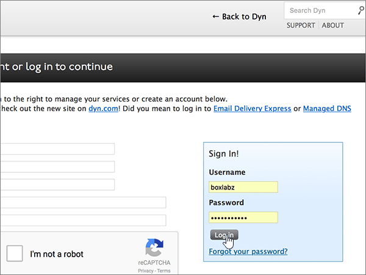
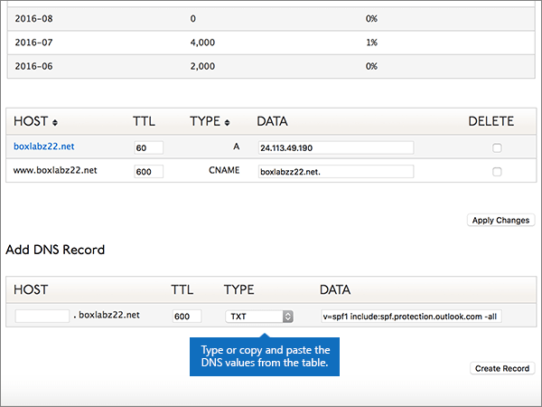

# Skapa DNS-poster på Dyn.com för Office 365Create DNS records at Dyn.com for Office 365

 **[Läs frågor och svar om domäner](../setup/domains-faq.md)** om du inte hittar det du letar efter.**[Check the Domains FAQ](../setup/domains-faq.md)** if you don't find what you're looking for. 
  
Om Dyn.com är din DNS-värd följer du stegen i den här artikeln för att verifiera din domän och konfigurera DNS-poster för e-post, Skype för företag - Online och så vidare.If Dyn.com is your DNS hosting provider, follow the steps in this article to verify your domain and set up DNS records for email, Skype for Business Online, and so on.
 
Mer information om webbvärdverktyg och DNS för webbplatser med Office 365 finns i [Använda en offentlig webbplats med Office 365](https://support.office.com/article/choose-a-public-website-3325d50e-d131-403c-a278-7f3296fe33a9).To learn about webhosting and DNS for websites with Office 365, see [Use a public website with Office 365](https://support.office.com/article/choose-a-public-website-3325d50e-d131-403c-a278-7f3296fe33a9).
  
> [!NOTE]
>  Det brukar ta ungefär 15 minuter för DNS-ändringarna att gå igenom. Ibland kan det dock ta längre tid att uppdatera DNS-systemet på Internet för en ändring som du har gjort. Om du stöter på problem med e-postflödet eller får andra problem när du har lagt till DNS-posterna, går du till [Felsöka problem när du har ändrat domännamn eller DNS-poster](../get-help-with-domains/find-and-fix-issues.md).Typically it takes about 15 minutes for DNS changes to take effect. However, it can occasionally take longer for a change you've made to update across the Internet's DNS system. If you're having trouble with mail flow or other issues after adding DNS records, see [Troubleshoot issues after changing your domain name or DNS records](../get-help-with-domains/find-and-fix-issues.md). 
  
## Lägga till en TXT-post för verifieringAdd a TXT record for verification

1. Kom igång genom att gå till domänsidan på Dyn.com genom att klicka på [den här länken](https://account.dyn.com/dns/). Du uppmanas att logga in först.To get started, go to your domains page at Dyn.com by using [this link](https://account.dyn.com/dns/). You'll be prompted to login first.
    
    
  
2. På sidan **Zonnivåtjänster** väljer du **Dyn Standard DNS-tjänst** för den domän som du vill redigera.On the **Zone Level Services** page, select **Dyn Standard DNS Service** for the domain that you want to edit. 
    
3. Välj **Inställningar**på **DNS-sidan** för domänen .On the **DNS** page for your domain, select **Preferences**.
    
4. Välj **Aktivera expertgränssnitt**.Select **Enable Expert Interface**.
    
5. Gå till avsnittet **Add DNS Record**. I den nya postens rutor skriver du in, eller kopierar och klistrar in, värdena från följande tabell.In the **Add DNS Record** section, in the boxes for the new record, type or copy and paste the values from the following table. 
    
    (Välj värdet för **Type** i listrutan.)(Choose the **Type** value from the drop-down list.) 
    
    |**Host****Host**|**TTL****TTL**|**Type****Type**|**Data****Data**|
    |:-----|:-----|:-----|:-----|
    |(Lämna det här fältet tomt.)(Leave this field empty.)    |600600    |TXTTXT    |MS=ms *XXXXXXXX*MS=ms *XXXXXXXX*    **Obs!** Det här är ett exempel. Använd det specifika värdet för **Mål eller pekar på-adress** här, från tabellen i Office 365.           [Hur hittar jag det?](../get-help-with-domains/information-for-dns-records.md)**Note:** This is an example. Use your specific **Destination or Points to Address** value here, from the table in Office 365.           [How do I find this?](../get-help-with-domains/information-for-dns-records.md)          |
       
   
  
6. Välj **Skapa post**.Select **Create Record**.
    
    
  
7. Vänta några minuter innan du fortsätter, så att den post som du nyss skapade kan uppdateras på Internet.Wait a few minutes before you continue, so that the record you just created can update across the Internet.
    
Nu när du har lagt till posten på domänregistratorns webbplats går du tillbaka till Office 365 och begär att Office 365 letar efter posten.Now that you've added the record at your domain registrar's site, you'll go back to Office 365 and request Office 365 to look for the record.
  
När Office 365 hittar rätt TXT-post är din domän verifierad.When Office 365 finds the correct TXT record, your domain is verified.
  
1. I administrationscentret går du till **Inställningar** \> <a href="https://go.microsoft.com/fwlink/p/?linkid=834818" target="_blank">Domains</a>.In the admin center, go to the **Settings** \> <a href="https://go.microsoft.com/fwlink/p/?linkid=834818" target="_blank">Domains</a> page.

    
2. På sidan **Domains** väljer du den domän du verifierar.On the **Domains** page, select the domain that you are verifying. 
    
    
  
3. På sidan **Setup** väljer du **Start setup**.On the **Setup** page, select **Start setup**.
    
    
  
4. På sidan **Verify domain** väljer du **Verify**.On the **Verify domain** page, select **Verify**.
    
    
  
> [!NOTE]
>  Det brukar ta ungefär 15 minuter för DNS-ändringarna att gå igenom. Ibland kan det dock ta längre tid att uppdatera DNS-systemet på Internet för en ändring som du har gjort. Om du stöter på problem med e-postflödet eller får andra problem när du har lagt till DNS-posterna, går du till [Felsöka problem när du har ändrat domännamn eller DNS-poster](../get-help-with-domains/find-and-fix-issues.md).Typically it takes about 15 minutes for DNS changes to take effect. However, it can occasionally take longer for a change you've made to update across the Internet's DNS system. If you're having trouble with mail flow or other issues after adding DNS records, see [Troubleshoot issues after changing your domain name or DNS records](../get-help-with-domains/find-and-fix-issues.md). 
  
## Lägga till en MX-post så att e-post för din domän kommer till Office 365Add an MX record so email for your domain will come to Office 365

1. Kom igång genom att gå till domänsidan på Dyn.com genom att klicka på [den här länken](https://account.dyn.com/dns/). Du uppmanas att logga in först.To get started, go to your domains page at Dyn.com by using [this link](https://account.dyn.com/dns/). You'll be prompted to login first.
    
    
  
2. På sidan **Zonnivåtjänster** väljer du **Dyn Standard DNS-tjänst** för den domän som du vill redigera.On the **Zone Level Services** page, select **Dyn Standard DNS Service** for the domain that you want to edit. 
    
3. Välj **Inställningar**på DNS-sidan för domänen .On the DNS page for your domain, select **Preferences**.
    
4. Välj **Aktivera expertgränssnitt**.Select **Enable Expert Interface**.
    
5. Gå till avsnittet **Add DNS Record**. I den nya postens rutor skriver du in, eller kopierar och klistrar in, värdena från följande tabell.In the **Add DNS Record** section, in the boxes for the new record, type or copy and paste the values from the following table. 
    
    (Välj värdet för **Type** i listrutan.)(Choose the **Type** value from the drop-down list.) 
    
    |**Host****Host**|**TTL****TTL**|**Type****Type**|**Data****Data**|
    |:-----|:-----|:-----|:-----|
    |(Lämna det här fältet tomt.)(Leave this field empty.)    |600600    |MXMX    |10  *\<domännyckel\>*  .mail.protection.outlook.com.10  *\<domain-key\>*  .mail.protection.outlook.com.    **Värdet MÅSTE sluta med en punkt (.)****This value MUST end with a period (.)**   **10** motsvarar MX-prioritetsvärdet. Skriv 10 i början av MX-värdet och infoga ett blanksteg före resten av värdet.  The **10** is the MX priority value. Add it to the beginning of the MX value, separated from the remainder of the value by a space.    **Anm.:** Hämta \* \<domännyckeln\> \* från ditt Office 365-konto.**Note:** Get your  *\<domain-key\>*  from your Office 365 account.           [Hur hittar jag det?How do I find this?](../get-help-with-domains/information-for-dns-records.md)           [Mer information om prioritet finns i ](https://support.office.com/article/2784cc4d-95be-443d-b5f7-bb5dd867ba83.aspx)Vad är MX-prioritet?For more information about priority, see [What is MX priority?](https://support.office.com/article/2784cc4d-95be-443d-b5f7-bb5dd867ba83.aspx)   |
   
    
  
6. Välj **Skapa post**.Select **Create Record**.
    
    
  
7. Om det finns andra MX-poster tar du bort dem genom att markera kryssrutan för varje post i kolumnen **Delete**.If there are any other MX records, remove them by selecting the check box for each one in the **Delete** column. 
    
    
  
8. Välj **Använd ändringar**.Select **Apply Changes**.
    
    
  
## Lägg till de sex CNAME-posterna som krävs för Office 365Add the six CNAME records that are required for Office 365

1. Kom igång genom att gå till domänsidan på Dyn.com genom att klicka på [den här länken](https://account.dyn.com/dns/). Du uppmanas att logga in först.To get started, go to your domains page at Dyn.com by using [this link](https://account.dyn.com/dns/). You'll be prompted to login first.
    
    
  
2. På sidan **Zonnivåtjänster** väljer du **Dyn Standard DNS-tjänst** för den domän som du vill redigera.On the **Zone Level Services** page, select **Dyn Standard DNS Service** for the domain that you want to edit. 
    
3. Välj **Inställningar**på **DNS-sidan** för domänen .On the **DNS** page for your domain, select **Preferences**.
    
4. Välj **Aktivera expertgränssnitt**.Select **Enable Expert Interface**.
    
5. Lägg till den första av de sex CNAME-posterna.Add the first of the six CNAME records.
    
    Gå till avsnittet **Add DNS Record**. I den nya postens rutor skriver du in, eller kopierar och klistrar in, värdena från den första raden i tabellen nedan.In the **Add DNS Record** section, in the boxes for the new record, type or copy and paste the values from the first row of the following table. 
    
    (Välj värdet för **Type** i listrutan.)(Choose the **Type** value from the drop-down list.) 
    
    |**Host****Host**|**TTL****TTL**|**Type****Type**|**Data****Data**|
    |:-----|:-----|:-----|:-----|
    |autodiscoverautodiscover    |600600    |CNAMECNAME    |autodiscover.outlook.com.autodiscover.outlook.com.    **Värdet MÅSTE sluta med en punkt (.)****This value MUST end with a period (.)**   |
    |sipsip    |600600    |CNAMECNAME    |sipdir.online.lync.com.sipdir.online.lync.com.    **Värdet MÅSTE sluta med en punkt (.)****This value MUST end with a period (.)**   |
    |lyncdiscoverlyncdiscover    |600600    |CNAMECNAME    |webdir.online.lync.com.webdir.online.lync.com.    **Värdet MÅSTE sluta med en punkt (.)****This value MUST end with a period (.)**   |
    |enterpriseregistrationenterpriseregistration    |600600    |CNAMECNAME    |enterpriseregistration.windows.net.enterpriseregistration.windows.net.    **Värdet MÅSTE sluta med en punkt (.)****This value MUST end with a period (.)**   |
    |enterpriseenrollmententerpriseenrollment    |600600    |CNAMECNAME    |enterpriseenrollment-s.manage.microsoft.com.enterpriseenrollment-s.manage.microsoft.com.    **Värdet MÅSTE sluta med en punkt (.)****This value MUST end with a period (.)**   |
   
    
  
6. Välj **Skapa post**.Select **Create Record**.
    
    
  
7. Lägg till de återstående fem CNAME-posterna.Add the remaining five CNAME records.
    
    Skapa en post i avsnittet **Lägg till DNS-post** med hjälp av värdena från nästa rad i tabellen och välj sedan **skapa post** igen för att slutföra posten.In the **Add DNS Record** section, create a record by using the values from the next row in the table, and then again select **Create Record** to complete that record. 
    
    Upprepa proceduren tills du har skapat alla sex CNAME-posterna.Repeat this process until you have created all six CNAME records.
    
## Lägga till en TXT-post för SPF för att förhindra skräppostAdd a TXT record for SPF to help prevent email spam

> [!IMPORTANT]
> Du kan inte ha fler än en TXT-post för SPF för en domän.You cannot have more than one TXT record for SPF for a domain. Om din domän har fler än en SPF-post får du e-postfel och problem med leveranser och skräppostklassificering.If your domain has more than one SPF record, you'll get email errors, as well as delivery and spam classification issues. Om du redan har en SPF-post för domänen ska du inte skapa en ny för Office 365.If you already have an SPF record for your domain, don't create a new one for Office 365. Lägg istället till de obligatoriska Office 365-värdena i den aktuella posten, så att du har en  *enda*  SPF-post som innehåller båda uppsättningarna med värden.Instead, add the required Office 365 values to the current record so that you have a  *single*  SPF record that includes both sets of values.
  
1. Kom igång genom att gå till domänsidan på Dyn.com genom att klicka på [den här länken](https://account.dyn.com/dns/). Du uppmanas att logga in först.To get started, go to your domains page at Dyn.com by using [this link](https://account.dyn.com/dns/). You'll be prompted to login first.
    
    
  
2. På sidan **Zonnivåtjänster** väljer du **Dyn Standard DNS-tjänst** för den domän som du vill redigera.On the **Zone Level Services** page, select **Dyn Standard DNS Service** for the domain that you want to edit. 
    
3. Välj **Inställningar**på **DNS-sidan** för domänen .On the **DNS** page for your domain, select **Preferences**.
    
4. Välj **Aktivera expertgränssnitt**.Select **Enable Expert Interface**.
    
5. Gå till avsnittet **Add DNS Record**. I den nya postens rutor skriver du in, eller kopierar och klistrar in, värdena från följande tabell.In the **Add DNS Record** section, in the boxes for the new record, type or copy and paste the values from the following table. 
    
    (Välj värdet för **Type** i listrutan.)(Choose the **Type** value from the drop-down list.) 
    
    |**Host****Host**|**TTL****TTL**|**Type****Type**|**Data****Data**|
    |:-----|:-----|:-----|:-----|
    |(Lämna det här fältet tomt.)(Leave this field empty.)    |600600    |TXTTXT    |v=spf1 include:spf.protection.outlook.com -allv=spf1 include:spf.protection.outlook.com -all    **Obs!** Vi rekommenderar att du kopierar och klistrar in den här posten så att alla avstånd förblir korrekta.    **Note:** We recommend copying and pasting this entry, so that all of the spacing stays correct.           |
   
    
  
6. Välj **Skapa post**.Select **Create Record**.
    
    
  
## Lägga till de två SRV-posterna som krävs för Office 365Add the two SRV records that are required for Office 365

1. Kom igång genom att gå till domänsidan på Dyn.com genom att klicka på [den här länken](https://account.dyn.com/dns/).To get started, go to your domains page at Dyn.com by using [this link](https://account.dyn.com/dns/). Du uppmanas att logga in förstYou'll be prompted to login first 
    
    
  
2. På sidan **Zonnivåtjänster** väljer du **Dyn Standard DNS-tjänst** för den domän som du vill redigera.On the **Zone Level Services** page, select **Dyn Standard DNS Service** for the domain that you want to edit. 
    
3. Välj **Inställningar**på **DNS-sidan** för domänen .On the **DNS** page for your domain, select **Preferences**.
    
4. Välj **Aktivera expertgränssnitt**.Select **Enable Expert Interface**.
    
5. Lägg till den första av de två SRV-posterna.Add the first of the two SRV records.
    
    Gå till avsnittet **Add DNS Record**. I den nya postens rutor skriver du in, eller kopierar och klistrar in, värdena från den första raden i tabellen nedan.In the **Add DNS Record** section, in the boxes for the new record, type or copy and paste the values from the first row of the following table. 
    
    (Välj värdet för **Type** i listrutan.)(Choose the **Type** value from the drop-down list.) 
    
    |**Host****Host**|**TTL****TTL**|**Type****Type**|**Data****Data**|
    |:-----|:-----|:-----|:-----|
    |_sip._tls_sip._tls|600600|SRVSRV|100 1 443 sipdir.online.lync.com.100 1 443 sipdir.online.lync.com. **Värdet MÅSTE sluta med en punkt (.)****This value MUST end with a period (.)** **Obs!** Vi rekommenderar att du kopierar och klistrar in den här posten så att alla avstånd förblir korrekta.    **Note:** We recommend copying and pasting this entry, so that all of the spacing stays correct.           |
    |_sipfederationtls._tcp_sipfederationtls._tcp|600600|SRVSRV|100 1 5061 sipfed.online.lync.com.100 1 5061 sipfed.online.lync.com. **Värdet MÅSTE sluta med en punkt (.)****This value MUST end with a period (.)**  **Obs!** Vi rekommenderar att du kopierar och klistrar in den här posten så att alla avstånd förblir korrekta.    **Note:** We recommend copying and pasting this entry, so that all of the spacing stays correct.           |
   
    
  
6. Välj **Skapa post**.Select **Create Record**.
    
    
  
7. Lägg till den andra SRV-posten.Add the other SRV record.
    
    Skapa en post i avsnittet **Lägg till DNS-post** med hjälp av värdena från den andra raden i tabellen och välj sedan **skapa post** igen för att slutföra posten.In the **Add DNS Record** section, create a record by using the values from the second row in the table, and then again select **Create Record** to complete that record. 
    
> [!NOTE]
>  Det brukar ta ungefär 15 minuter för DNS-ändringarna att gå igenom. Ibland kan det dock ta längre tid att uppdatera DNS-systemet på Internet för en ändring som du har gjort. Om du stöter på problem med e-postflödet eller får andra problem när du har lagt till DNS-posterna, går du till [Felsöka problem när du har ändrat domännamn eller DNS-poster](../get-help-with-domains/find-and-fix-issues.md).Typically it takes about 15 minutes for DNS changes to take effect. However, it can occasionally take longer for a change you've made to update across the Internet's DNS system. If you're having trouble with mail flow or other issues after adding DNS records, see [Troubleshoot issues after changing your domain name or DNS records](../get-help-with-domains/find-and-fix-issues.md). 
  
