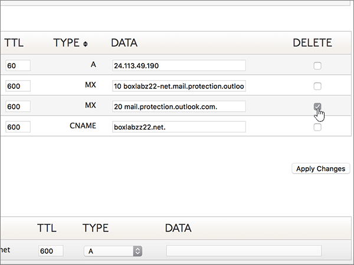
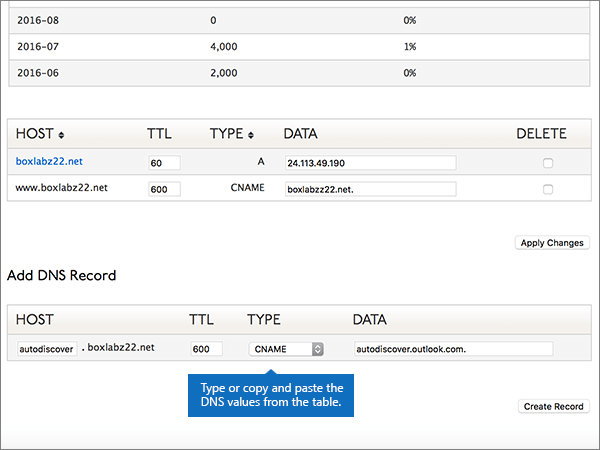

# Skapa DNS-poster på Dyn.com för Microsoft

 **[Läs frågor och svar om domäner](../setup/domains-faq.yml)** om du inte hittar det du letar efter. 
  
Om Dyn.com är din DNS-värd följer du stegen i den här artikeln för att verifiera din domän och konfigurera DNS-poster för e-post, Skype för företag - Online och så vidare.
 

  
> [!NOTE]
>  Det brukar ta ungefär 15 minuter för DNS-ändringarna att gå igenom. Ibland kan det dock ta längre tid att uppdatera DNS-systemet på Internet för en ändring som du har gjort. Om du stöter på problem med e-postflödet eller får andra problem när du har lagt till DNS-posterna, går du till [Felsöka problem när du har ändrat domännamn eller DNS-poster](../get-help-with-domains/find-and-fix-issues.md). 
  
## Lägga till en TXT-post för verifiering

1. Kom igång genom att gå till domänsidan på Dyn.com genom att klicka på [den här länken](https://account.dyn.com/dns/). Du uppmanas att logga in först.
    
    
  
2. På sidan **Zone Level Services** väljer du Dyn Standard DNS **Service** för den domän som du vill redigera. 
    
3. På sidan **DNS** för domänen väljer du **Preferences**.
    
4. Välj **Enable Expert Interface**.
    
5. Gå till avsnittet **Add DNS Record**. I den nya postens rutor skriver du in, eller kopierar och klistrar in, värdena från följande tabell. 
    
    (Välj värdet för **Type** i listrutan.) 
    
    |**Host**|**TTL**|**Type**|**Data**|
    |:-----|:-----|:-----|:-----|
    |(Lämna det här fältet tomt.)    |600    |TXT    |MS=ms *XXXXXXXX*    **Obs!** Det här är ett exempel. Använd ditt specifika **Mål eller pekar på adress** värde här, från tabellen.           [Hur hittar jag det här?](../get-help-with-domains/information-for-dns-records.md)          |
       
   
  
6. Välj **Create Record**.
    
    
  
7. Vänta några minuter innan du fortsätter, så att den post som du nyss skapade kan uppdateras på Internet.
    
Nu när du har lagt till posten på domänregistratorns webbplats kan du gå tillbaka till Microsoft och begär posten.
  
När Microsoft hittar rätt TXT-post är din domän verifierad.
  
1. I Microsoft-administrationscentret går du till **Inställningar** \> <a href="https://go.microsoft.com/fwlink/p/?linkid=834818" target="_blank">Domäner</a>.

    
2. På sidan **Domains** väljer du den domän du verifierar. 
    
    
  
3. På sidan **Setup** väljer du **Start setup**.
    
    
  
4. På sidan **Verify domain** väljer du **Verify**.
    
    
  
> [!NOTE]
>  Det brukar ta ungefär 15 minuter för DNS-ändringarna att gå igenom. Ibland kan det dock ta längre tid att uppdatera DNS-systemet på Internet för en ändring som du har gjort. Om du stöter på problem med e-postflödet eller får andra problem när du har lagt till DNS-posterna, går du till [Felsöka problem när du har ändrat domännamn eller DNS-poster](../get-help-with-domains/find-and-fix-issues.md). 
  
## Lägga till en MX-post så att e-post för din domän kommer till Microsoft.

1. Kom igång genom att gå till domänsidan på Dyn.com genom att klicka på [den här länken](https://account.dyn.com/dns/). Du uppmanas att logga in först.
    
    
  
2. På sidan **Zone Level Services** väljer du Dyn Standard DNS **Service** för den domän som du vill redigera. 
    
3. På sidan DNS för domänen väljer du **Preferences**.
    
4. Välj **Enable Expert Interface**.
    
5. Gå till avsnittet **Add DNS Record**. I den nya postens rutor skriver du in, eller kopierar och klistrar in, värdena från följande tabell. 
    
    (Välj värdet för **Type** i listrutan.) 
    
    |**Host**|**TTL**|**Type**|**Data**|
    |:-----|:-----|:-----|:-----|
    |(Lämna det här fältet tomt.)    |600    |MX    |10  *\<domain-key\>*  .mail.protection.outlook.com.    **Värdet MÅSTE sluta med en punkt (.)**   **10** motsvarar MX-prioritetsvärdet. Skriv 10 i början av MX-värdet och infoga ett blanksteg före resten av värdet.    **Obs!** Skaffa ditt  *\<domain-key\>*  Microsoft-konto.           [Hur hittar jag det?](../get-help-with-domains/information-for-dns-records.md)           [Mer information om prioritet finns i ](../setup/domains-faq.yml)Vad är MX-prioritet?   |
   
    
  
6. Välj **Create Record**.
    
    
  
7. Om det finns andra MX-poster tar du bort dem genom att markera kryssrutan för varje post i kolumnen **Delete**. 
    
    
  
8. Välj **Apply Changes**.
    
    
  
## Lägg till de sex CNAME-posterna som krävs för Microsoft

1. Kom igång genom att gå till domänsidan på Dyn.com genom att klicka på [den här länken](https://account.dyn.com/dns/). Du uppmanas att logga in först.
    
    
  
2. På sidan **Zone Level Services** väljer du Dyn Standard DNS **Service** för den domän som du vill redigera. 
    
3. På sidan **DNS** för domänen väljer du **Preferences**.
    
4. Välj **Enable Expert Interface**.
    
5. Lägg till den första av de sex CNAME-posterna.
    
    Gå till avsnittet **Add DNS Record**. I den nya postens rutor skriver du in, eller kopierar och klistrar in, värdena från den första raden i tabellen nedan. 
    
    (Välj värdet för **Type** i listrutan.) 
    
    |**Host**|**TTL**|**Type**|**Data**|
    |:-----|:-----|:-----|:-----|
    |autodiscover    |600    |CNAME    |autodiscover.outlook.com.    **Värdet MÅSTE sluta med en punkt (.)**   |
    |sip    |600    |CNAME    |sipdir.online.lync.com.    **Värdet MÅSTE sluta med en punkt (.)**   |
    |lyncdiscover    |600    |CNAME    |webdir.online.lync.com.    **Värdet MÅSTE sluta med en punkt (.)**   |
    |enterpriseregistration    |600    |CNAME    |enterpriseregistration.windows.net.    **Värdet MÅSTE sluta med en punkt (.)**   |
    |enterpriseenrollment    |600    |CNAME    |enterpriseenrollment-s.manage.microsoft.com.    **Värdet MÅSTE sluta med en punkt (.)**   |
   
    
  
6. Välj **Create Record**.
    
    
  
7. Lägg till de återstående fem CNAME-posterna.
    
    I avsnittet **Add DNS Record** skapar du en post med värdena från nästa rad i tabellen och väljer sedan Create **Record** igen för att slutföra posten. 
    
    Upprepa proceduren tills du har skapat alla sex CNAME-posterna.
    
## Lägga till en TXT-post för SPF för att förhindra skräppost

> [!IMPORTANT]
> Du kan inte ha fler än en TXT-post för SPF för en domän. Om din domän har fler än en SPF-post får du e-postfel och problem med leveranser och skräppostklassificering. Om du redan har en SPF-post för domänen ska du inte skapa en ny för Microsoft. Lägg istället till de obligatoriska Microsoft-värdena i den aktuella posten så att du har  *en*  enda SPF-post som innehåller båda uppsättningarna med värden.
  
1. Kom igång genom att gå till domänsidan på Dyn.com genom att klicka på [den här länken](https://account.dyn.com/dns/). Du uppmanas att logga in först.
    
    
  
2. På sidan **Zone Level Services** väljer du Dyn Standard DNS **Service** för den domän som du vill redigera. 
    
3. På sidan **DNS** för domänen väljer du **Preferences**.
    
4. Välj **Enable Expert Interface**.
    
5. Gå till avsnittet **Add DNS Record**. I den nya postens rutor skriver du in, eller kopierar och klistrar in, värdena från följande tabell. 
    
    (Välj värdet för **Type** i listrutan.) 
    
    |**Host**|**TTL**|**Type**|**Data**|
    |:-----|:-----|:-----|:-----|
    |(Lämna det här fältet tomt.)    |600    |TXT    |v=spf1 include:spf.protection.outlook.com -all    **Obs!** Vi rekommenderar att du kopierar och klistrar in den här posten så att alla avstånd förblir korrekta.               |
   
    
  
6. Välj **Create Record**.
    
    
  
## Lägga till de två SRV-posterna som krävs för Microsoft

1. Kom igång genom att gå till domänsidan på Dyn.com genom att klicka på [den här länken](https://account.dyn.com/dns/). Du uppmanas att logga in först 
    
    
  
2. På sidan **Zone Level Services** väljer du Dyn Standard DNS **Service** för den domän som du vill redigera. 
    
3. På sidan **DNS** för domänen väljer du **Preferences**.
    
4. Välj **Enable Expert Interface**.
    
5. Lägg till den första av de två SRV-posterna.
    
    Gå till avsnittet **Add DNS Record**. I den nya postens rutor skriver du in, eller kopierar och klistrar in, värdena från den första raden i tabellen nedan. 
    
    (Välj värdet för **Type** i listrutan.) 
    
    |**Host**|**TTL**|**Type**|**Data**|
    |:-----|:-----|:-----|:-----|
    |_sip._tls|600|SRV|100 1 443 sipdir.online.lync.com. **Värdet MÅSTE sluta med en punkt (.)** **Obs!** Vi rekommenderar att du kopierar och klistrar in den här posten så att alla avstånd förblir korrekta.               |
    |_sipfederationtls._tcp|600|SRV|100 1 5061 sipfed.online.lync.com. **Värdet MÅSTE sluta med en punkt (.)**  **Obs!** Vi rekommenderar att du kopierar och klistrar in den här posten så att alla avstånd förblir korrekta.               |
   
    
  
6. Välj **Create Record**.
    
    
  
7. Lägg till den andra SRV-posten.
    
    I avsnittet **Add DNS Record** skapar du en post med värdena från den andra raden i tabellen och väljer sedan Create **Record** igen för att slutföra posten. 
    
> [!NOTE]
>  Det brukar ta ungefär 15 minuter för DNS-ändringarna att gå igenom. Ibland kan det dock ta längre tid att uppdatera DNS-systemet på Internet för en ändring som du har gjort. Om du stöter på problem med e-postflödet eller får andra problem när du har lagt till DNS-posterna, går du till [Felsöka problem när du har ändrat domännamn eller DNS-poster](../get-help-with-domains/find-and-fix-issues.md). 
