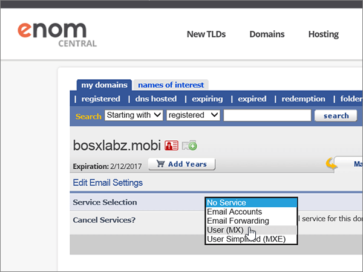
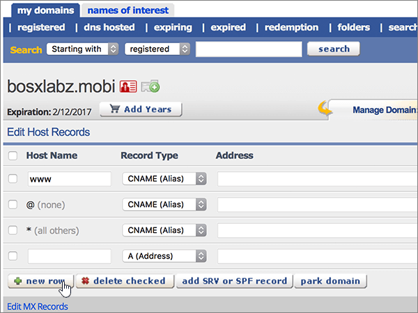
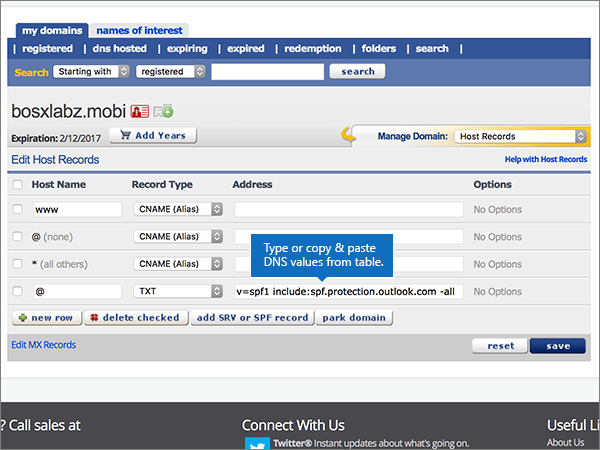

# Skapa DNS-poster på eNomCentral för Microsoft

 **[Läs frågor och svar om domäner](../setup/domains-faq.md)** om du inte hittar det du letar efter. 
  
Om eNomCentral är din DNS-värd följer du stegen i den här artikeln för att verifiera din domän och konfigurera DNS-poster för e-post, Skype för företag - Online och så vidare.
  
När du har lagt till dessa poster på eNomCentral konfigureras domänen så att den fungerar med Microsoft-tjänster.
  
Mer information om webbhotell och DNS för webbplatser med Microsoft finns i [Använda en offentlig webbplats med Microsoft](https://support.office.com/article/choose-a-public-website-3325d50e-d131-403c-a278-7f3296fe33a9).
  
> [!NOTE]
>  Det brukar ta ungefär 15 minuter för DNS-ändringarna att gå igenom. Ibland kan det dock ta längre tid att uppdatera DNS-systemet på Internet för en ändring som du har gjort. Om du stöter på problem med e-postflödet eller får andra problem när du har lagt till DNS-posterna, går du till [Felsöka problem när du har ändrat domännamn eller DNS-poster](../get-help-with-domains/find-and-fix-issues.md). 
  
## Lägga till en TXT-post för verifiering

Innan du använder domänen med Microsoft måste vi se till att du äger den. Din förmåga att logga in på ditt konto hos domänregistratorer och skapa DNS-posten bevisar för Microsoft att du äger domänen.
  
> [!NOTE]
> Den här posten används endast för att verifiera att du äger domänen. Den påverkar ingenting annat. Du kan ta bort den senare om du vill. 
  
Följ stegen nedan eller [titta på videon (börja vid 0:46)](https://support.office.com/article/Video-Create-DNS-records-at-eNomCentral-for-Office-365-3766a9e8-77dd-4a42-908d-89b076143e7d?ui=en-US&amp;rs=en-US&amp;ad=US).
  
1. Kom igång genom att gå till domänsidan på eNom Central med [den här länken](https://www.enomcentral.com/domains/Domain-Manager.aspx?tab=registered). Du uppmanas att logga in först.
    
    
  
2. Under **mina domäner**väljer du namnet på den domän som du vill redigera.
    
    
  
3. I listrutan **Manage Domain** väljer du **Host Records**.
    
    
  
4. I den nya postens rutor skriver du in, eller kopierar och klistrar in, värdena från följande tabell.
    
    (Välj värdet **Posttyp** i listrutan.) 
    
    ||||
    |:-----|:-----|:-----|
    |**Host Name**   |**Record Type**   |**Adress**   |
    |@    |TXT    |MS=ms *XXXXXXXX*    **Obs!** Det här är ett exempel. Använd ditt specifika **mål- eller poäng till-adress-värde** här, från bordet.           [Hur hittar jag det här?](../get-help-with-domains/information-for-dns-records.md)          |
       
   
  
5. Välj **spara**.
    
    
  
6. Vänta några minuter innan du fortsätter, så att den post som du nyss skapade kan uppdateras på Internet.
    
Nu när du har lagt till posten på domänregistratorerns webbplats går du tillbaka till Microsoft 365 och begär att Microsoft 365 ska söka efter posten.
  
När Microsoft hittar rätt TXT-post verifieras domänen.
  
1. Gå till sidan **Inställningar** \> domäner i <a href="https://go.microsoft.com/fwlink/p/?linkid=834818" target="_blank">Microsofts administrationscenter.</a>

    
2. På sidan **Domains** väljer du den domän du verifierar. 
    
    
  
3. På sidan **Setup** väljer du **Start setup**.
    
    
  
4. På sidan **Verify domain** väljer du **Verify**.
    
    
  
> [!NOTE]
>  Det brukar ta ungefär 15 minuter för DNS-ändringarna att gå igenom. Ibland kan det dock ta längre tid att uppdatera DNS-systemet på Internet för en ändring som du har gjort. Om du stöter på problem med e-postflödet eller får andra problem när du har lagt till DNS-posterna, går du till [Felsöka problem när du har ändrat domännamn eller DNS-poster](../get-help-with-domains/find-and-fix-issues.md). 
  
## Lägg till en MX-post så att e-post för din domän kommer till Microsoft

Följ stegen nedan eller [titta på videon (börja vid 3:40)](https://support.office.com/article/Video-Create-DNS-records-at-eNomCentral-for-Office-365-3766a9e8-77dd-4a42-908d-89b076143e7d?ui=en-US&amp;rs=en-US&amp;ad=US).
  
1. Kom igång genom att gå till domänsidan på eNom Central med [den här länken](https://www.enomcentral.com/domains/Domain-Manager.aspx?tab=registered). Du uppmanas att logga in först.
    
    
  
2. Under **mina domäner**väljer du namnet på den domän som du vill redigera.
    
    
  
3. I listrutan **Manage Domain** väljer du **Email Settings**.
    
    
  
4. I listrutan **Service Selection** väljer du **User (MX)**.
    
    
  
5. I rutorna för den nya posten skriver du in, eller kopierar och klistrar in, värdena från följande tabell.
    
    |**Värdnamn**|**Address (adress)**|**Pref**|
    |:-----|:-----|:-----|
    |@    | *\<domännyckel\>*  .mail.protection.outlook.com.    **Värdet MÅSTE sluta med en punkt (.)**   **Anm.:** Hämta * \<domännyckeln\> * från ditt Microsoft-konto.           [Hur hittar jag det?](../get-help-with-domains/information-for-dns-records.md)          |10    Mer information om prioritet finns i [Vad är MX-prioritet?](https://support.office.com/article/2784cc4d-95be-443d-b5f7-bb5dd867ba83.aspx)   |
       
   
  
6. Välj **spara**.
    
    
  
7. Om det finns andra befintliga MX-poster väljer du dem genom att markera kryssrutorna för posterna.
    
    
  
8. Markera **ta bort markerat**.
    
    
  
## Lägga till CNAME-poster som krävs för Microsoft 

Följ stegen nedan eller [titta på videon (börja vid 4:24)](https://support.office.com/article/Video-Create-DNS-records-at-eNomCentral-for-Office-365-3766a9e8-77dd-4a42-908d-89b076143e7d?ui=en-US&amp;rs=en-US&amp;ad=US).
  
1. Kom igång genom att gå till domänsidan på eNom Central med [den här länken](https://www.enomcentral.com/domains/Domain-Manager.aspx?tab=registered). Du uppmanas att logga in först.
    
    
  
2. Under **mina domäner**väljer du namnet på den domän som du vill redigera.
    
    
  
3. I listrutan **Manage Domain** väljer du **Host Records**.
    
    
  
4. Välj **ny rad**.
    
    
  
5. I rutorna för de sex nya posterna skriver du in, eller kopierar och klistrar in, följande värden.
    
        (Choose the **Record Type** value from the drop-down list.) 
        
    |**Host Name**|**Record Type**|**Address**|
    |:-----|:-----|:-----|
    |autodiscover    |CNAME (Alias)    |autodiscover.outlook.com.    **Värdet MÅSTE sluta med en punkt (.)**   |
    |sip    |CNAME (Alias)    |sipdir.online.lync.com.    **Värdet MÅSTE sluta med en punkt (.)**   |
    |lyncdiscover    |CNAME (Alias)    |webdir.online.lync.com.    **Värdet MÅSTE sluta med en punkt (.)**   |
    |enterpriseregistration    |CNAME (Alias)    |enterpriseregistration.windows.net.    **Värdet MÅSTE sluta med en punkt (.)**   |
    |enterpriseenrollment    |CNAME (Alias)    |enterpriseenrollment-s.manage.microsoft.com.    **Värdet MÅSTE sluta med en punkt (.)**   |
   
    
  
6. Välj **spara**.
    
    
  
## Lägga till en TXT-post för SPF för att förhindra skräppost

> [!IMPORTANT]
> Du kan inte ha fler än en TXT-post för SPF för en domän. Om din domän har fler än en SPF-post får du e-postfel och problem med leveranser och skräppostklassificering. Om du redan har en SPF-post för domänen ska du inte skapa en ny för Microsoft. Lägg i stället till de nödvändiga Microsoft-värdena i den aktuella posten så att du har en *enda* SPF-post som innehåller båda uppsättningarna värden.
  
Följ stegen nedan eller [titta på videon (börja vid 5:12)](https://support.office.com/article/Video-Create-DNS-records-at-eNomCentral-for-Office-365-3766a9e8-77dd-4a42-908d-89b076143e7d?ui=en-US&amp;rs=en-US&amp;ad=US).
  
1. Kom igång genom att gå till domänsidan på eNom Central med [den här länken](https://www.enomcentral.com/domains/Domain-Manager.aspx?tab=registered). Du uppmanas att logga in först.
    
    
  
2. Under **mina domäner**väljer du namnet på den domän som du vill redigera.
    
    
  
3. I listrutan **Manage Domain** väljer du **Host Records**.
    
    
  
4. I rutorna för den nya posten skriver du in, eller kopierar och klistrar in, värdena från följande tabell.
    
    (Välj värdet **Posttyp** i listrutan.) 
    
    |**Host Name**|**Record Type**|**Address**|
    |:-----|:-----|:-----|
    |@    |TXT    |v=spf1 include:spf.protection.outlook.com -all   **Obs!** Vi rekommenderar att du kopierar och klistrar in den här posten så att alla avstånd förblir korrekta.               |
   
   
  
5. Välj **spara**.
    
    
  
## Lägg till de två SRV-poster som krävs för Microsoft

Följ stegen nedan eller [titta på videon (börja vid 5:50)](https://support.office.com/article/Video-Create-DNS-records-at-eNomCentral-for-Office-365-3766a9e8-77dd-4a42-908d-89b076143e7d?ui=en-US&amp;rs=en-US&amp;ad=US).
  
1. Kom igång genom att gå till domänsidan på eNom Central med [den här länken](https://www.enomcentral.com/domains/Domain-Manager.aspx?tab=registered). Du uppmanas att logga in först.
    
    
  
2. Under **mina domäner**väljer du namnet på den domän som du vill redigera.
    
    
  
3. I listrutan **Manage Domain** väljer du **Host Records**.
    
    
  
4. Till höger om **den nya raden**väljer du Lägg till **SRV- eller SPF-post**.
    
    
  
5. I rutorna för de två nya posterna skriver du, eller kopierar och klistrar in, värdena från följande tabell.
    
    |**Service**|**Protocol**|**Prioritet**|**Vikt**|**Port**|**Target          (Hostname)**|
    |:-----|:-----|:-----|:-----|:-----|:-----|
    |_sip    |_tls    |100    |1    |443    |sipdir.online.lync.com.    **Värdet MÅSTE sluta med en punkt (.)**   |
    |_sipfederationtls    |_tcp    |100    |1    |5061    |sipfed.online.lync.com.    **Värdet MÅSTE sluta med en punkt (.)**   |
   
    
  
6. Välj **spara**
    
    
  
> [!NOTE]
>  Det brukar ta ungefär 15 minuter för DNS-ändringarna att gå igenom. Ibland kan det dock ta längre tid att uppdatera DNS-systemet på Internet för en ändring som du har gjort. Om du stöter på problem med e-postflödet eller får andra problem när du har lagt till DNS-posterna, går du till [Felsöka problem när du har ändrat domännamn eller DNS-poster](../get-help-with-domains/find-and-fix-issues.md). 
  

