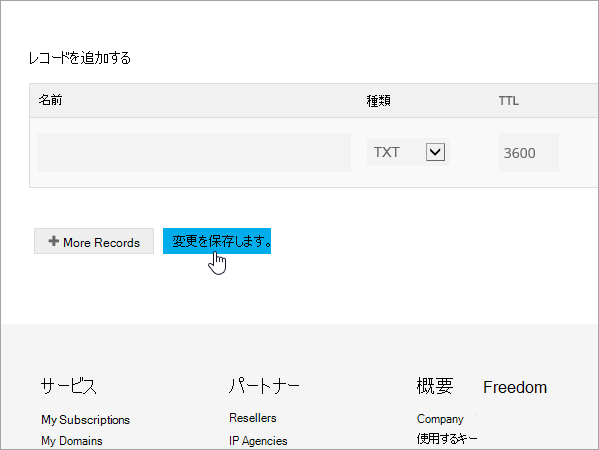
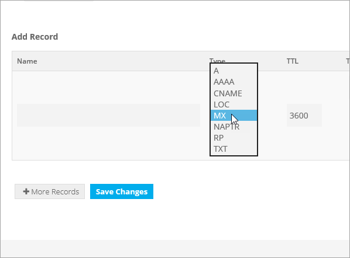

# Skapa DNS-poster på Freenom för Microsoft

[Läs frågor och svar om domäner ](../setup/domains-faq.md) om du inte hittar det du letar efter. 
  
> [!CAUTION]
> Freenom-webbplatsen stöder inte SRV-poster, vilket innebär att flera Skype för företag – online och Outlook Web App-funktioner inte fungerar. Oavsett vilket Microsoft-abonnemang du använder finns det betydande tjänstebegränsningar, och du kanske vill byta till en annan DNS-värd. 
  
Om du trots tjänstbegränsningarna väljer att hantera dina egna Microsoft DNS-poster på Freenom följer du stegen i den här artikeln för att verifiera domänen och konfigurera DNS-poster för e-post och andra tjänster.
  
  
> [!NOTE]
> Det brukar ta ungefär 15 minuter för DNS-ändringarna att gå igenom. Ibland kan det dock ta längre tid att uppdatera DNS-systemet på Internet för en ändring som du har gjort. Om du stöter på problem med e-postflödet eller får andra problem när du har lagt till DNS-posterna, går du till [Felsöka problem när du har ändrat domännamn eller DNS-poster](../get-help-with-domains/find-and-fix-issues.md). 
  
## Lägga till en TXT-post för verifiering

Innan du använder din domän med Microsoft, vill vi vara säkra på att det är du som äger den. Att du kan logga in på ditt konto hos domänregistratorn och skapa DNS-posten bevisar för Microsoft att du äger domänen.
  
> [!NOTE]
> Den här posten används endast för att verifiera att du äger domänen. Den påverkar ingenting annat. Du kan ta bort den senare om du vill. 
  
1. För att komma igång, gå till din domänsida i Freenom med hjälp av [denna länk](https://my.freenom.com/). Du uppmanas att logga in först.
    
    
  
2. Välj **Tjänster**och välj sedan **Mina domäner**.
    
    
  
3. För den domän som du vill redigera väljer du **Hantera domän**.
    
    
  
4. Välj **Hantera Freenom DNS**.
    
    
  
5. Under **Add Record** går du till kolumnen **Type** och väljer **TXT** på menyn. 
    
    
  
6. I rutorna för den nya posten skriver du in eller kopierar och klistrar in värdena från följande tabell. 
    
    |**Name**|**Type (typ)**|**TTL**|**Target (mål)**|
    |:-----|:-----|:-----|:-----|
    |(lämna tomt)    |TXT    |3600 (sekunder)    |MS=msXXXXXXXX    **Obs!** Det här är ett exempel. Använd ditt specifika **Mål eller pekar på adress ** värde här, från tabellen.           [Hur hittar jag det här?](../get-help-with-domains/information-for-dns-records.md)          |
   
    
  
7. Välj **Spara ändringar**.
    
    
  
8. Vänta några minuter innan du fortsätter, så att den post som du nyss skapade kan uppdateras på Internet.
    
Nu när du har lagt till posten på domänregistratorns webbplats kan du gå tillbaka till Microsoft och begär posten.
  
När Microsoft hittar rätt TXT-post är din domän verifierad.
  
1. I Microsoft-administrationscentret går du till **Inställningar** \> <a href="https://go.microsoft.com/fwlink/p/?linkid=834818" target="_blank">Domäner</a>.

    
2. På sidan **Domains** väljer du den domän du verifierar. 
    
    
  
3. På sidan **Setup** väljer du **Start setup**.
    
    
  
4. På sidan **Verify domain** väljer du **Verify**.
    
    
  
> [!NOTE]
>  Det brukar ta ungefär 15 minuter för DNS-ändringarna att gå igenom. Ibland kan det dock ta längre tid att uppdatera DNS-systemet på Internet för en ändring som du har gjort. Om du stöter på problem med e-postflödet eller får andra problem när du har lagt till DNS-posterna, går du till [Felsöka problem när du har ändrat domännamn eller DNS-poster](../get-help-with-domains/find-and-fix-issues.md). 
  
## Lägga till en MX-post så att e-post för din domän kommer till Microsoft.

1. För att komma igång, gå till din domänsida i Freenom med hjälp av [denna länk](https://my.freenom.com/). Du uppmanas att logga in först.
    
    
  
2. Välj **Tjänster**och välj sedan **Mina domäner**.
    
    
  
3. För den domän som du vill redigera väljer du **Hantera domän**.
    
    
  
4. Ange namnet för din domän till standard freenom namnservrar. Välj **Hanteringsverktyg**och välj sedan **Namnservrar**.
    
    
  
5. Kontrollera att **Använd standardnamnservrar** är markerat och välj sedan **Ändra namnservrar**.
    
    
  
6. Välj **Hantera Freenom DNS**.
    
    
  
7. Under **Add Record** går du till kolumnen **Type** och väljer **MX** på menyn. 
    
    
  
8. I rutorna för den nya posten anger du eller kopierar och klistrar in värdena från den första raden i följande tabell. 
    
    |**Name**|**Type (typ)**|**TTL**|**Target (mål)**|**Priority (prioritet)**|
    |:-----|:-----|:-----|:-----|:-----|
    |(lämna tomt)    |MX (Mail Exchanger)    |3600 (sekunder)    |\<domännyckeln\>.mail.protection.outlook.com    **Anm.:** Hämta * \<domännyckeln\> * från ditt Microsoft-konto.   [Hur hittar jag det?](../get-help-with-domains/information-for-dns-records.md)          |10    Mer information om prioritet finns i [What is MX priority?](https://docs.microsoft.com/microsoft-365/admin/setup/domains-faq)   |
   
   
  
9. Välj **Spara ändringar**.
    
    
  
10. Om det finns några andra MX-poster tar du bort dem alla. För varje post väljer du **Ta bort**. När meddelandet Vill du verkligen ta bort den **OK** **här posten?**
    
## Lägga till CNAME-posterna som krävs för Microsoft

1. För att komma igång, gå till din domänsida i Freenom med hjälp av [denna länk](https://my.freenom.com/). Du uppmanas att logga in först.
    
    
  
2. Välj **Tjänster**och välj sedan **Mina domäner**.
    
    
  
3. För den domän som du vill redigera väljer du **Hantera domän**.
    
    
  
4. Välj **Hantera Freenom DNS**.
    
    
  
5. Under **Add Record** går du till kolumnen **Type** och väljer **CNAME** på menyn. 
    
    
  
6. Skapa den första CNAME-posten. I den nya postens rutor skriver du in, eller kopierar och klistrar in, värdena från den första raden i tabellen nedan. 
    
    |**Name (namn)**|**Record type (posttyp)**|**TTL**|**Target (mål)**|
    |:-----|:-----|:-----|:-----|
    |autodiscover    |CNAME    |3600 (sekunder)    |autodiscover.outlook.com    |
    |sip    |CNAME    |3600 (sekunder)    |sipdir.online.lync.com    |
    |lyncdiscover    |CNAME    |3600 (sekunder)    |webdir.online.lync.com    |
    |enterpriseregistration    |CNAME    |3600 (sekunder)    |enterpriseregistration.windows.net    |
    |enterpriseenrollment    |CNAME    |3600 (sekunder)    |enterpriseenrollment-s.manage.microsoft.com    |
   
    
  
7. Välj **Spara ändringar**.
    
    
  
8. Upprepa föregående steg för att skapa de andra fem CNAME-posterna. 
    
    För varje post skriver du in, eller kopierar och klistrar in, värdena från nästa rad i tabellen ovan i rutorna för den posten.
    
## Lägga till en TXT-post för SPF för att förhindra skräppost

> [!IMPORTANT]
> Du kan inte ha fler än en TXT-post för SPF för en domän. Om din domän har fler än en SPF-post får du e-postfel och problem med leveranser och skräppostklassificering. Om du redan har en SPF-post för domänen ska du inte skapa en ny för Microsoft. Lägg i stället till de nödvändiga Microsoft-värdena i den aktuella posten så att du har en *enda* SPF-post som innehåller båda uppsättningarna värden. 

1. För att komma igång, gå till din domänsida i Freenom med hjälp av [denna länk](https://my.freenom.com/). Du uppmanas att logga in först.
    
    
  
2. Välj **Tjänster**och välj sedan **Mina domäner**.
    
    
  
3. För den domän som du vill redigera väljer du **Hantera domän**.
    
    
  
4. Välj **Hantera Freenom DNS**.
    
    
  
5. Under **Add Record** går du till kolumnen **Type** och väljer **TXT** på menyn. 
    
    
  
6. I rutorna för den nya posten skriver du in eller kopierar och klistrar in följande värden. 
    
    |**Name (namn)**|**Record type (posttyp)**|**TTL**|**Target (mål)**|
    |:-----|:-----|:-----|:-----|
    |(lämna tomt)    |TXT    |3600 (sekunder)    |v=spf1 include:spf.protection.outlook.com -all   **Obs!** Vi rekommenderar att du kopierar och klistrar in den här posten så att alla avstånd förblir korrekta.               |
   
    
  
7. Välj **Spara ändringar**.
    
    
  

