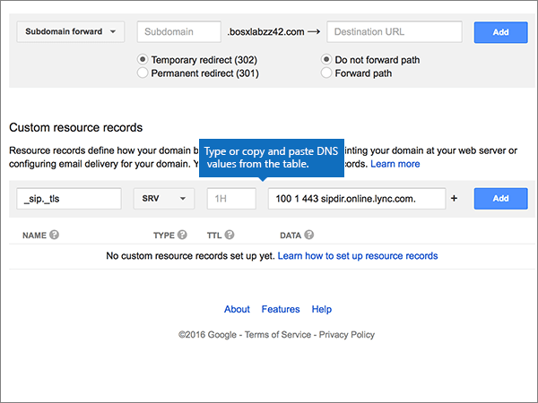

# Skapa DNS-poster på Google Domains för Office 365

 **[Läs frågor och svar om domäner](../setup/domains-faq.md)** om du inte hittar det du letar efter. 
  
Om Google Domains är din DNS-värd följer du anvisningarna i den här artikeln om du vill verifiera din domän och konfigurera DNS-posterna för e-post, Lync och så vidare.
  
När du har lagt till dessa poster på Google Domains konfigureras domänen så att den fungerar med Office 365-tjänster.
  
Mer information om webbvärdverktyg och DNS för webbplatser med Office 365 finns i [Använda en offentlig webbplats med Office 365](https://support.office.com/article/choose-a-public-website-3325d50e-d131-403c-a278-7f3296fe33a9).
  
> [!NOTE]
> Det brukar ta omkring 15 minuter för DNS-ändringarna att gå igenom. Ibland kan det dock ta längre tid att uppdatera DNS-systemet på Internet för en ändring som du har gjort. Om du stöter på problem med e-postflödet eller får andra problem när du har lagt till DNS-posterna, går du till [Hitta och åtgärda problem när du har lagt till din domän eller DNS-poster i Office 365](../get-help-with-domains/find-and-fix-issues.md). 
  
## Lägga till en TXT-post för verifiering

Innan du använder din domän med Office 365 vill vi vara säkra på att det är du som äger den. Att du kan logga in på kontot hos domänregistratorn och skapa en DNS-post bevisar för Office 365 att du äger domänen.
  
> [!NOTE]
> Den här posten används endast för att verifiera att du äger domänen. Den påverkar ingenting annat. Du kan ta bort den senare om du vill. 
  
1. Börja med att gå till domänsidan på Google Domains genom att klicka på [den här länken](https://domains.google.com/registrar). Du uppmanas att logga in. Gör så här:
    
1. Välj **Logga in**.
    
2. Ange dina inloggningsuppgifter och välj sedan **logga in**igen .
    
2. Leta reda på den domän som du vill använda med Office 365 på sidan **Mina domäner** och välj **länken HANTERA** bredvid den. Välj **DNS**i den vänstra navigeringen .
    
3. Skriv eller kopiera och klistra in värdena i rutorna för den nya posten i avsnittet ** Anpassade resursposter ** och klistra in värdena från följande tabell i rutorna för den nya posten. 
    
    (Du kan behöva rulla nedåt.)
    
    (Välj värdet för **Type** i listrutan.) 
    
    |||||
    |:-----|:-----|:-----|:-----|
    |**Name**   |**Type (typ)**   |**TTL**   |**Data**   |
    |@    |TXT    |1H (1H)    |MS=ms *XXXXXXXX*    **Obs:** Detta är ett exempel. Använd ditt specifika **Mål eller pekar på adress**-värde här, från tabellen i Office 365. [Hur hittar jag det?](../get-help-with-domains/information-for-dns-records.md)          |
   
4. Välj **Lägg till**.
    
5. Vänta några minuter innan du fortsätter, så att den post som du nyss skapade kan uppdateras på Internet.
    
Nu när du har lagt till posten på domänregistratorns webbplats kan du gå tillbaka till Office 365 och begära att Office 365 letar efter posten.
  
När Office 365 hittar rätt TXT-post är din domän verifierad.
  
1. Gå till sidan **Inställningar** \> domäner i <a href="https://go.microsoft.com/fwlink/p/?linkid=834818" target="_blank">administrationscentret.</a>

    
2. På sidan **Domäner** väljer du den domän som du verifierar. 
    
3. På **sidan Inställningar** väljer du **Starta installationsprogrammet**.
    
4. Välj **Verifiera**på **sidan Verifiera domän.**
    
> [!NOTE]
> Det brukar ta omkring 15 minuter för DNS-ändringarna att gå igenom. Ibland kan det dock ta längre tid att uppdatera DNS-systemet på Internet för en ändring som du har gjort. Om du stöter på problem med e-postflödet eller får andra problem när du har lagt till DNS-posterna, går du till [Hitta och åtgärda problem när du har lagt till din domän eller DNS-poster i Office 365](../get-help-with-domains/find-and-fix-issues.md). 

  
## Lägga till en MX-post så att e-post för din domän kommer till Office 365

1. Börja med att gå till domänsidan på Google Domains genom att klicka på [den här länken](https://domains.google.com/registrar). Du uppmanas att logga in. Gör så här:
    
2. Välj **Logga in**.
    
3. Ange dina inloggningsuppgifter och välj sedan **logga in**igen .
4. På sidan **Domäner** väljer du Konfigurera **DNS** för den domän som du vill redigera i avsnittet **Domän.**
    
    > [!IMPORTANT]
    > Om du har ett G Suite-e-postkonto måste du först ta bort MX-posterna som är kopplade till kontot. MX-posterna kopplade till G Suite förhindrar tillägg av MX-poster, däribland dem som krävs för Office 365. Observera att borttagning av MX-poster inte raderar ditt G Suite-konto. Så här tar du bort MX-posterna från ditt G Suite-konto. 
  
5. Välj **Ta bort**i avsnittet **Syntetiska poster** i området G **Suite.**
    
    (Du kan behöva rulla nedåt.)
    
    
  
6. Välj **Ta bort**.
    
    
  
7. Gå till avsnittet **Custom resource records**. I den nya postens rutor skriver du in, eller kopierar och klistrar in, värdena från följande tabell. 
    
    (Du kan behöva rulla nedåt.)
    
    (Välj värdet för **Type** i listrutan.) 
    
    |**Name**|**Type (typ)**|**TTL**|**Data**|
    |:-----|:-----|:-----|:-----|
    |@    |MX    |1H (1H)    |0  *\<domain-key\>*  .mail.protection.outlook.com.    **Värdet MÅSTE sluta med en punkt (.)**   **0** motsvarar MX-prioritetsvärdet. Skriv 0 i början av MX-värdet och infoga ett blanksteg före resten av värdet.    **Obs:** Hämta \<din domännyckel\> från ditt Office 365-konto. *domain-key*  [Hur hittar jag det?](../get-help-with-domains/information-for-dns-records.md)          [Mer information om prioritet finns i ](https://support.office.com/article/2784cc4d-95be-443d-b5f7-bb5dd867ba83.aspx)Vad är MX-prioritet?   |
   
    
  
5. Välj **Lägg till**.
    
    
  
6. Om det finns andra Custom MX-poster tar du bort dem.
    
1. Välj **Redigera** på raden MX-post. 
    
    
  
2. För var och en av de andra Anpassade MX-posterna markerar du posten i **rutan Data** och trycker sedan på **Delete-tangenten** på tangentbordet för att ta bort posten. 
    
    Fortsätt tills du har tagit bort **Data**-posten för var övriga MX-poster. 
    
    
  
7. När du har tagit bort **dataposten** för var och en av de andra MX-posterna väljer du **Spara** för att spara ändringarna. 
    
    
  
## Lägga till de fem CNAME-poster som krävs för Office 365

1. För att komma igång går du tillhttps://domains.google.com/registrar) din [Google Domains-sida] ( och loggar in.
    
2. På sidan **Domäner** väljer du Konfigurera **DNS** för den domän som du vill redigera i avsnittet **Domän.** 
    
3. Lägg till den första CNAME-posten.
    
    Gå till avsnittet **Custom resource records**. I den nya postens rutor skriver du, eller kopierar och klistrar, in värdena från första raden i följande tabell. 
    
    (Du kan behöva rulla nedåt.)
    
    (Välj värdet för **Type** i listrutan.) 
    
    |**Name**|**Type (typ)**|**TTL**|**Data**|
    |:-----|:-----|:-----|:-----|
    |autodiscover    |CNAME    |1H (1H)    |autodiscover.outlook.com.    **Värdet MÅSTE sluta med en punkt (.)**   |
    |sip    |CNAME    |1H (1H)    |sipdir.online.lync.com.    **Värdet MÅSTE sluta med en punkt (.)**   |
    |lyncdiscover    |CNAME    |1H (1H)    |webdir.online.lync.com.    **Värdet MÅSTE sluta med en punkt (.)**   |
    |enterpriseregistration    |CNAME    |1H (1H)    |enterpriseregistration.windows.net.    **Värdet MÅSTE sluta med en punkt (.)**   |
    |enterpriseenrollment    |CNAME    |1H (1H)    |enterpriseenrollment-s.manage.microsoft.com.    **Värdet MÅSTE sluta med en punkt (.)**   |
   
    
  
4. Välj **Lägg till**.
    
    
  
5. Lägg till de andra fyra CNAME-posterna.
    
    Skapa en post i avsnittet **Anpassade resursposter** genom att använda värdena från nästa rad i tabellen och **välj** sedan lägg till för att slutföra posten. 
    
    Upprepa den här processen tills du har skapat alla nödvändiga CNAME-poster.
    
## Lägga till en TXT-post för SPF för att förhindra skräppost

> [!IMPORTANT]
> Du kan inte ha fler än en TXT-post för SPF för en domän. Om din domän har fler än en SPF-post får du e-postfel och problem med leveranser och skräppostklassificering. Om du redan har en SPF-post för domänen ska du inte skapa en ny för Office 365. Lägg istället till de obligatoriska Office 365-värdena i den aktuella posten, så att du har en enda SPF-post som innehåller båda uppsättningarna med värden. Behöver du exempel? Kolla in dessa [externa domännamnssystemposter för Office 365](https://support.office.com/article/c0531a6f-9e25-4f2d-ad0e-a70bfef09ac0#bkmk_spfrecords). Om du vill validera SPF-posten kan du använda något av dessa [SPF-valideringsverktyg](../setup/domains-faq.md). 
  
1. Börja med att gå till domänsidan på Google Domains genom att klicka på [den här länken](https://domains.google.com/registrar). Du uppmanas att logga in. Gör så här:
    
1. Välj **Logga in**.
    
2. Ange dina inloggningsuppgifter och välj sedan **logga in**igen .
    
3. På sidan **Domäner** väljer du Konfigurera **DNS** för den domän som du vill redigera i avsnittet **Domän.** 
    
4. Välj **Redigera**på postraden TXT i avsnittet **Anpassade resursposter.** 
    
    > [!IMPORTANT]
    > I Google Domains betraktas en TXT-post som en uppsättning som kan innehålla flera poster. Om du har minst en TXT-post, till exempel TXT-posten du använde för att verifiera din domän, måste du lägga till nya TXT-poster i denna postuppsättning. Försöker du att ange ytterligare TXT-poster som separata poster får du ett felmeddelande om **Duplicate record** (dublettpost). 
  
    
  
5. Välj **(+)** kontroll. 
    
    
  
6. I rutorna för den nya posten skriver du in, eller kopierar och klistrar in, värdena från följande tabell.
    
    (Du kan behöva rulla nedåt.)
    
    |**Data**|
    |:-----|
    |v=spf1 include:spf.protection.outlook.com -all    

    > [!NOTE]
    > Vi rekommenderar att du kopierar och klistrar in den här posten, så att hela avståndet förblir korrekt.           
   
   
  
7. Välj **Spara**.
    
    
  
## Lägga till de två SRV-posterna som krävs för Office 365

1. Börja med att gå till domänsidan på Google Domains genom att klicka på [den här länken](https://domains.google.com/registrar). Du uppmanas att logga in. Gör så här:
    
2. Välj **Logga in**.
    
3. Ange dina inloggningsuppgifter och välj sedan **logga in**igen .
    
4. På sidan **Domäner** väljer du Konfigurera **DNS** för den domän som du vill redigera i avsnittet **Domän.** 
    
5. Lägga till den första SRV-posten.
    
    Gå till avsnittet **Custom resource records**. I den nya postens rutor skriver du in, eller kopierar och klistrar in, värdena från följande tabell. 
    
    (Du kan behöva rulla nedåt.)
    
    (Välj värdet för **Type** i listrutan.) 
    
    |**Name**|**Type (typ)**|**TTL**|**Data**|
    |:-----|:-----|:-----|:-----|
    |_sip._tls|SRV|1H (1H)|100 1 443 sipdir.online.lync.com. **Det här värdet MÅSTE sluta med en punkt (.)** **Obs:** Vi rekommenderar att du kopierar och klistrar in den här posten, så att hela avståndet förblir korrekt.           |
    |_sipfederationtls._tcp|SRV|1H (1H)|100 1 5061 sipfed.online.lync.com. **Värdet MÅSTE sluta med en punkt (.)**

    Vi rekommenderar att du kopierar och klistrar in den här posten, så att hela avståndet förblir korrekt.       
   
    
  
6. Välj **Lägg till**.
    
    
  
7. Lägg till den andra SRV-posten.
    
    Skapa en post i avsnittet **Anpassade resursposter** genom att använda värdena från den andra raden i tabellen och **välj** sedan lägg till för att slutföra posten. 
    
    > [!NOTE]
    > Det brukar ta omkring 15 minuter för DNS-ändringarna att gå igenom. Ibland kan det dock ta längre tid att uppdatera DNS-systemet på Internet för en ändring som du har gjort. Om du stöter på problem med e-postflödet eller får andra problem när du har lagt till DNS-posterna, går du till [Hitta och åtgärda problem när du har lagt till din domän eller DNS-poster i Office 365](../get-help-with-domains/find-and-fix-issues.md). 
  
