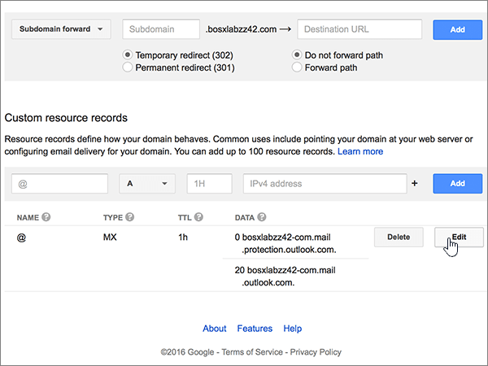
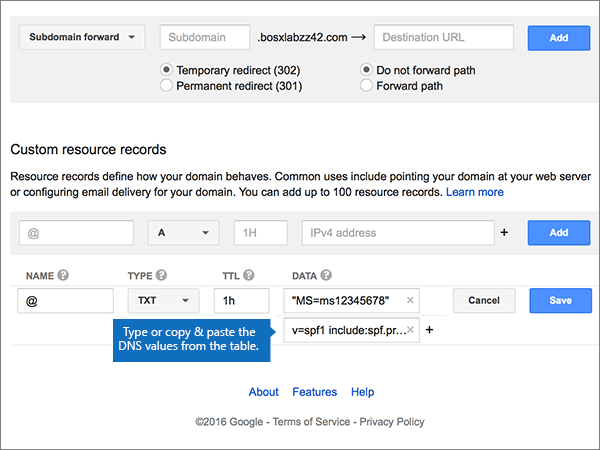

# Skapa DNS-poster på Google Domains för MicrosoftCreate DNS records at Google Domains for Microsoft

 **[Läs frågor och svar om domäner](../setup/domains-faq.md)** om du inte hittar det du letar efter.**[Check the Domains FAQ](../setup/domains-faq.md)** if you don't find what you're looking for. 
  
Om Google Domains är din DNS-värd följer du anvisningarna i den här artikeln om du vill verifiera din domän och konfigurera DNS-posterna för e-post, Lync och så vidare.If Google Domains is your DNS hosting provider, follow the steps in this article to verify your domain and set up DNS records for email, Lync, and so on.
  
När du har lagt till dessa poster på Google Domains är din domän konfigurerad för att fungera med Microsoft-tjänster.After you add these records at Google Domains, your domain will be set up to work with Microsoft services.
  

  
> [!NOTE]
> Det brukar ta ungefär 15 minuter för DNS-ändringarna att gå igenom.Typically it takes about 15 minutes for DNS changes to take effect. Ibland kan det dock ta längre tid att uppdatera DNS-systemet på Internet för en ändring som du har gjort.However, it can occasionally take longer for a change you've made to update across the Internet's DNS system. Om du har problem med e-postflöde eller andra problem efter att du har lagt till DNS-poster läser du [hitta och åtgärda problem när du har lagt till din domän eller DNS-poster i Microsoft](../get-help-with-domains/find-and-fix-issues.md).If you're having trouble with mail flow or other issues after adding DNS records, see [Find and fix issues after adding your domain or DNS records in Microsoft](../get-help-with-domains/find-and-fix-issues.md). 
  
## Lägga till en TXT-post för verifieringAdd a TXT record for verification

Innan du använder din domän med Microsoft, vill vi vara säkra på att det är du som äger den. Att du kan logga in på ditt konto hos domänregistratorn och skapa DNS-posten bevisar för Microsoft att du äger domänen.Before you use your domain with Microsoft, we have to make sure that you own it. Your ability to log in to your account at your domain registrar and create the DNS record proves to Microsoft that you own the domain.
  
> [!NOTE]
> Den här posten används endast för att verifiera att du äger domänen. Den påverkar ingenting annat. Du kan ta bort den senare om du vill.This record is used only to verify that you own your domain; it doesn't affect anything else. You can delete it later, if you like. 
  
1. Börja med att gå till domänsidan på Google Domains genom att klicka på [den här länken](https://domains.google.com/registrar). Du uppmanas att logga in. Gör så här:To get started, go to your domains page at Google Domains by using [this link](https://domains.google.com/registrar). You'll be prompted to sign in. To do so:
    
1. Välj **Logga in**.Select **Sign In**.
    
2. Ange dina inloggnings uppgifter och välj sedan **Logga**in igen.Enter your login credentials, and then again select **Sign In**.
    
2. På sidan **My** Domains letar du reda på den domän som du vill använda med Microsoft och väljer **Hantera** -länken bredvid den.On the **My domains** page, find the domain you want to use with Microsoft, and select the **MANAGE** link next to it. I det vänstra navigerings fältet väljer du **DNS**.In the left navigation, select **DNS**.
    
3. Gå till avsnittet **Custom resource records**. I den nya postens rutor skriver du in, eller kopierar och klistrar in, värdena från följande tabell.In the **Custom resource records** section, in the boxes for the new record, type or copy and paste the values from the following table. 
    
    (Du kan behöva rulla nedåt.)(You may have to scroll down.)
    
    (Välj värdet för **Type** i listrutan.)(Choose the **Type** value from the drop-down list.) 
    
    |||||
    |:-----|:-----|:-----|:-----|
    |**Name****Name**   |**Type (typ)****Type**   |**TTL****TTL**   |**Data****Data**   |
    |@    |TXTTXT    |1H1H    |MS=ms *XXXXXXXX*MS=ms *XXXXXXXX*    **Obs!** Det här är ett exempel.**Note:** This is an example. Använd ditt specifika \*\*Mål eller pekar på adress \*\* värde här, från tabellen.Use your specific **Destination or Points to Address** value here, from the table. [Hur hittar jag det här?How do I find this?](../get-help-with-domains/information-for-dns-records.md)          |
   
4. Välj **Lägg till**.Select **Add**.
    
5. Vänta några minuter innan du fortsätter, så att den post som du nyss skapade kan uppdateras på Internet.Wait a few minutes before you continue, so that the record you just created can update across the Internet.
    
Nu när du har lagt till posten på domänregistratorns webbplats kan du gå tillbaka till Microsoft och begär posten.Now that you've added the record at your domain registrar's site, you'll go back to Microsoft and request the record.
  
När Microsoft hittar rätt TXT-post är din domän verifierad.When Microsoft finds the correct TXT record, your domain is verified.
  
1. I Microsoft-administrationscentret går du till **Inställningar** \> <a href="https://go.microsoft.com/fwlink/p/?linkid=834818" target="_blank">Domäner</a>.In the Microsoft admin center, go to the **Settings** \> <a href="https://go.microsoft.com/fwlink/p/?linkid=834818" target="_blank">Domains</a> page.

    
2. På sidan **Domains** väljer du den domän du verifierar.On the **Domains** page, select the domain that you are verifying. 
    
3. På sidan **Setup** väljer du **Start setup**.On the **Setup** page, select **Start setup**.
    
4. På sidan **Verify domain** väljer du **Verify**.On the **Verify domain** page, select **Verify**.
    
> [!NOTE]
> Det brukar ta omkring 15 minuter för DNS-ändringarna att gå igenom. Ibland kan det dock ta längre tid att uppdatera DNS-systemet på Internet för en ändring som du har gjort. Om du stöter på problem med e-postflödet eller får andra problem när du har lagt till DNS-posterna, går du till [Hitta och åtgärda problem när du har lagt till din domän eller DNS-poster i Microsoft](../get-help-with-domains/find-and-fix-issues.md).Typically it takes about 15 minutes for DNS changes to take effect. However, it can occasionally take longer for a change you've made to update across the Internet's DNS system. If you're having trouble with mail flow or other issues after adding DNS records, see [Find and fix issues after adding your domain or DNS records](../get-help-with-domains/find-and-fix-issues.md). 

  
## Lägga till en MX-post så att e-post för din domän kommer till Microsoft.Add an MX record so email for your domain will come to Microsoft

1. Börja med att gå till domänsidan på Google Domains genom att klicka på [den här länken](https://domains.google.com/registrar). Du uppmanas att logga in. Gör så här:To get started, go to your domains page at Google Domains by using [this link](https://domains.google.com/registrar). You'll be prompted to sign in. To do so:
    
2. Välj **Logga in**.Select **Sign In**.
    
3. Ange dina inloggnings uppgifter och välj sedan **Logga**in igen.Enter your login credentials, and then again select **Sign In**.
4. Välj **Konfigurera DNS** för den domän som du vill redigera i avsnittet **Domain** **på sidan** domains.On the **Domains** page, in the **Domain** section, select **Configure DNS** for the domain that you want to edit.
    
    > [!IMPORTANT]
    > Om du har ett G Suite-e-postkonto måste du först ta bort MX-posterna som är kopplade till kontot.If you have a G Suite email account, you must first delete the MX records associated with that account. G Suite MX-posterna hindrar dig från att lägga till andra MX-poster, inklusive de som behövs för Microsoft.The G Suite MX records prevent you from adding any other MX records, including those required for Microsoft. Observera att borttagning av MX-poster inte raderar ditt G Suite-konto.Note that deleting the G Suite records does not delete your G Suite account. Så här tar du bort MX-posterna från ditt G Suite-konto.To delete your G Suite MX records, use the following steps. 
  
5. Välj **ta bort**i området **G Suite** i avsnittet **syntetiska poster** .In the **Synthetic records** section, in the **G Suite** area, select **Delete**.
    
    (Du kan behöva rulla nedåt.)(You may have to scroll down.)
    
    
  
6. Välj **ta bort**.Select **Delete**.
    
    
  
7. Gå till avsnittet **Custom resource records**. I den nya postens rutor skriver du in, eller kopierar och klistrar in, värdena från följande tabell.In the **Custom resource records** section, in the boxes for the new record, type or copy and paste the values from the following table. 
    
    (Du kan behöva rulla nedåt.)(You may have to scroll down.)
    
    (Välj värdet för **Type** i listrutan.)(Choose the **Type** value from the drop-down list.) 
    
    |**Name****Name**|**Type (typ)****Type**|**TTL****TTL**|**Data****Data**|
    |:-----|:-----|:-----|:-----|
    |@    |MXMX    |1H1H    |0  *\<domain-key\>*  . mail.Protection.Outlook.com.0  *\<domain-key\>*  .mail.protection.outlook.com.    **Värdet MÅSTE sluta med en punkt (.)****This value MUST end with a period (.)**   **0** motsvarar MX-prioritetsvärdet. Skriv 0 i början av MX-värdet och infoga ett blanksteg före resten av värdet.  The **0** is the MX priority value. Add it to the beginning of the MX value, separated from the remainder of the value by a space.    **Obs!** Hämta din \<*domain-key*\> från ditt Microsoft-konto.**Note:** Get your \<*domain-key*\> from your Microsoft account.  [Hur hittar jag det?How do I find this?](../get-help-with-domains/information-for-dns-records.md)          [Mer information om prioritet finns i ](https://docs.microsoft.com/microsoft-365/admin/setup/domains-faq)Vad är MX-prioritet?For more information about priority, see [What is MX priority?](https://docs.microsoft.com/microsoft-365/admin/setup/domains-faq)   |
   
    
  
5. Välj **Lägg till**.Select **Add**.
    
    
  
6. Om det finns andra Custom MX-poster tar du bort dem.If there are any other Custom MX records, remove them.
    
1. Välj **redigera** i MX Record-raden.Select **Edit** in the MX record row. 
    
    
  
2. För var och en av de andra anpassade MX-posterna markerar du posten i rutan **data** och trycker sedan på **Delete** -tangenten på tangent bordet för att ta bort posten.For each of the other Custom MX records, select the entry in the **Data** box and then press the **Delete** key on your keyboard to delete that record. 
    
    Fortsätt tills du har tagit bort **Data**-posten för var övriga MX-poster.Continue until you have deleted the **Data** entry for each of the other MX records. 
    
    
  
7. När du har tagit bort **data** inmatningen för var och en av de andra MX-posterna väljer du **Spara** för att spara ändringarna.When you have deleted the **Data** entry for each of the other MX records, select **Save** to save your changes. 
    
    
  
## Lägga till de fem CNAME-poster som krävs för MicrosoftAdd the five CNAME records that are required for Microsoft

1. För att komma igång går du till sidan [Google Domains] ( https://domains.google.com/registrar) och loggar in.To get started, go to your [Google Domains page] (https://domains.google.com/registrar) and sign in.
    
2. Välj **Konfigurera DNS** för den domän som du vill redigera i avsnittet **Domain** **på sidan** domains.On the **Domains** page, in the **Domain** section, select **Configure DNS** for the domain that you want to edit. 
    
3. Lägg till den första CNAME-posten.Add the first CNAME record.
    
    Gå till avsnittet **Custom resource records**. I den nya postens rutor skriver du, eller kopierar och klistrar, in värdena från första raden i följande tabell.In the **Custom resource records** section, in the boxes for the new record, type or copy and paste the values from first row of the following table. 
    
    (Du kan behöva rulla nedåt.)(You may have to scroll down.)
    
    (Välj värdet för **Type** i listrutan.)(Choose the **Type** value from the drop-down list.) 
    
    |**Name****Name**|**Type (typ)****Type**|**TTL****TTL**|**Data****Data**|
    |:-----|:-----|:-----|:-----|
    |autodiscoverautodiscover    |CNAMECNAME    |1H1H    |autodiscover.outlook.com.autodiscover.outlook.com.    **Värdet MÅSTE sluta med en punkt (.)****This value MUST end with a period (.)**   |
    |sipsip    |CNAMECNAME    |1H1H    |sipdir.online.lync.com.sipdir.online.lync.com.    **Värdet MÅSTE sluta med en punkt (.)****This value MUST end with a period (.)**   |
    |lyncdiscoverlyncdiscover    |CNAMECNAME    |1H1H    |webdir.online.lync.com.webdir.online.lync.com.    **Värdet MÅSTE sluta med en punkt (.)****This value MUST end with a period (.)**   |
    |enterpriseregistrationenterpriseregistration    |CNAMECNAME    |1H1H    |enterpriseregistration.windows.net.enterpriseregistration.windows.net.    **Värdet MÅSTE sluta med en punkt (.)****This value MUST end with a period (.)**   |
    |enterpriseenrollmententerpriseenrollment    |CNAMECNAME    |1H1H    |enterpriseenrollment-s.manage.microsoft.com.enterpriseenrollment-s.manage.microsoft.com.    **Värdet MÅSTE sluta med en punkt (.)****This value MUST end with a period (.)**   |
   
    
  
4. Välj **Lägg till**.Select **Add**.
    
    
  
5. Lägg till de andra fyra CNAME-posterna.Add the other four CNAME records.
    
    I avsnittet **Custom Resource Records** skapar du en post med värdena från nästa rad i tabellen och väljer sedan **Add** för att slutföra posten.In the **Custom resource records** section, create a record by using the values from the next row in the table, and then again select **Add** to complete that record. 
    
    Upprepa proceduren tills du har skapat alla nödvändiga CNAME-poster.Repeat this process until you have created all of the required CNAME records.
    
## Lägga till en TXT-post för SPF för att förhindra skräppostAdd a TXT record for SPF to help prevent email spam

> [!IMPORTANT]
> Du kan inte ha fler än en TXT-post för SPF för en domän.You cannot have more than one TXT record for SPF for a domain. Om din domän har fler än en SPF-post får du e-postfel och problem med leveranser och skräppostklassificering.If your domain has more than one SPF record, you'll get email errors, as well as delivery and spam classification issues. Om du redan har en SPF-post för domänen ska du inte skapa en ny för Microsoft.If you already have an SPF record for your domain, don't create a new one for Microsoft. Lägg istället till de obligatoriska Microsoft-värdena i den aktuella posten, så att du har en enda SPF-post som innehåller båda uppsättningarna med värden.Instead, add the required Microsoft values to the current record so that you have a single SPF record that includes both sets of values. Behöver du exempel?Need examples? Ta en titt på dessa [externa DNS-poster för Microsoft](https://docs.microsoft.com/microsoft-365/enterprise/external-domain-name-system-records#bkmk_spfrecords).Check out these [External Domain Name System records for Microsoft](https://docs.microsoft.com/microsoft-365/enterprise/external-domain-name-system-records#bkmk_spfrecords). Om du vill validera SPF-posten kan du använda något av dessa [SPF-valideringsverktyg](../setup/domains-faq.md).To validate your SPF record, you can use one of these [SPF validation tools](../setup/domains-faq.md). 
  
1. Börja med att gå till domänsidan på Google Domains genom att klicka på [den här länken](https://domains.google.com/registrar). Du uppmanas att logga in. Gör så här:To get started, go to your domains page at Google Domains by using [this link](https://domains.google.com/registrar). You'll be prompted to sign in. To do so:
    
1. Välj **Logga in**.Select **Sign In**.
    
2. Ange dina inloggnings uppgifter och välj sedan **Logga**in igen.Enter your login credentials, and then again select **Sign In**.
    
3. Välj **Konfigurera DNS** för den domän som du vill redigera i avsnittet **Domain** **på sidan** domains.On the **Domains** page, in the **Domain** section, select **Configure DNS** for the domain that you want to edit. 
    
4. Välj **Redigera**på raden txt Record i avsnittet **Custom Resource Records** .In the **Custom resource records** section, on the TXT record row, select **Edit**. 
    
    > [!IMPORTANT]
    > I Google Domains betraktas en TXT-post som en uppsättning som kan innehålla flera poster. Om du har minst en TXT-post, till exempel TXT-posten du använde för att verifiera din domän, måste du lägga till nya TXT-poster i denna postuppsättning. Försöker du att ange ytterligare TXT-poster som separata poster får du ett felmeddelande om **Duplicate record** (dublettpost).Google Domains stores TXT records as a set that may contain multiple records. When you have at least one other TXT record, such as the TXT record you used to verify your domain, you must add TXT new records to that record set. Any attempt to enter additional TXT records as separate entries will result in a **Duplicate record** error message. 
  
    
  
5. Välj **(+)** kontroll.Select the **(+)** control. 
    
    
  
6. I rutorna för den nya posten skriver du in, eller kopierar och klistrar in, värdena från följande tabell.In the boxes for the new record, type or copy and paste the values from the following table.
    
    (Du kan behöva rulla nedåt.)(You may have to scroll down.)
    
    |**Data****Data**|
    |:-----|
    |v=spf1 include:spf.protection.outlook.com -allv=spf1 include:spf.protection.outlook.com -all    

    > [!NOTE]
    > Vi rekommenderar att du kopierar och klistrar in den här posten så att alla avstånd förblir korrekta.We recommend copying and pasting this entry, so that all of the spacing stays correct.           
   
   
  
7. Välj **Spara**.Select **Save**.
    
    
  
## Lägga till de två SRV-posterna som krävs för MicrosoftAdd the two SRV records that are required for Microsoft

1. Börja med att gå till domänsidan på Google Domains genom att klicka på [den här länken](https://domains.google.com/registrar). Du uppmanas att logga in. Gör så här:To get started, go to your domains page at Google Domains by using [this link](https://domains.google.com/registrar). You'll be prompted to sign in. To do so:
    
2. Välj **Logga in**.Select **Sign In**.
    
3. Ange dina inloggnings uppgifter och välj sedan **Logga**in igen.Enter your login credentials, and then again select **Sign In**.
    
4. Välj **Konfigurera DNS** för den domän som du vill redigera i avsnittet **Domain** **på sidan** domains.On the **Domains** page, in the **Domain** section, select **Configure DNS** for the domain that you want to edit. 
    
5. Lägga till den första SRV-posten.Add the first SRV record.
    
    Gå till avsnittet **Custom resource records**. I den nya postens rutor skriver du in, eller kopierar och klistrar in, värdena från följande tabell.In the **Custom resource records** section, in the boxes for the new record, type or copy and paste the values from the following table. 
    
    (Du kan behöva rulla nedåt.)(You may have to scroll down.)
    
    (Välj värdet för **Type** i listrutan.)(Choose the **Type** value from the drop-down list.) 
    
    |**Name****Name**|**Type (typ)****Type**|**TTL****TTL**|**Data****Data**|
    |:-----|:-----|:-----|:-----|
    |_sip _sip._tls_sip._tls|SRVSRV|1H1H|100 1 443 sipdir.online.lync.com.100 1 443 sipdir.online.lync.com. **Det här värdet måste sluta med en punkt (.)** **Obs!** Vi rekommenderar att du kopierar och klistrar in den här posten så att alla avstånd förblir korrekta.**This value MUST end with a period (.)** **Note:** We recommend copying and pasting this entry, so that all of the spacing stays correct.           |
    |_sipfederationtls _sipfederationtls._tcp_sipfederationtls._tcp|SRVSRV|1H1H|100 1 5061 sipfed.online.lync.com.100 1 5061 sipfed.online.lync.com. **Värdet MÅSTE sluta med en punkt (.)****This value MUST end with a period (.)**

    Vi rekommenderar att du kopierar och klistrar in den här posten så att alla avstånd förblir korrekta.We recommend copying and pasting this entry, so that all of the spacing stays correct.       
   
    
  
6. Välj **Lägg till**.Select **Add**.
    
    
  
7. Lägg till den andra SRV-posten.Add the other SRV record.
    
    I avsnittet **Custom Resource Records** skapar du en post med värdena från den andra raden i tabellen och väljer sedan **Add** för att slutföra posten.In the **Custom resource records** section, create a record by using the values from the second row in the table, and then again select **Add** to complete that record. 
    
    > [!NOTE]
    > Det brukar ta omkring 15 minuter för DNS-ändringarna att gå igenom. Ibland kan det dock ta längre tid att uppdatera DNS-systemet på Internet för en ändring som du har gjort. Om du stöter på problem med e-postflödet eller får andra problem när du har lagt till DNS-posterna, går du till [Hitta och åtgärda problem när du har lagt till din domän eller DNS-poster i Microsoft](../get-help-with-domains/find-and-fix-issues.md).Typically it takes about 15 minutes for DNS changes to take effect. However, it can occasionally take longer for a change you've made to update across the Internet's DNS system. If you're having trouble with mail flow or other issues after adding DNS records, see [Find and fix issues after adding your domain or DNS records](../get-help-with-domains/find-and-fix-issues.md). 
  
