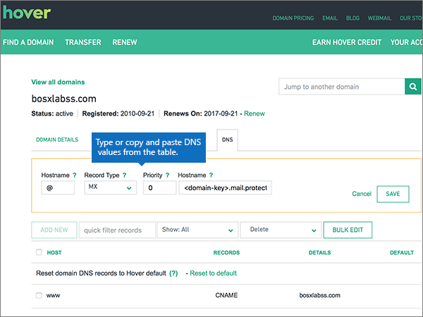

# Skapa DNS-poster på Hover för Microsoft

 **[Läs frågor och svar om domäner](../setup/domains-faq.md)** om du inte hittar det du letar efter. 
  
Om Hover är din DNS-värd följer du stegen i den här artikeln för att verifiera domänen och konfigurera DNS-poster för e-post, Skype för företag - Online och så vidare.
     
När du har lagt till dessa poster på Hover konfigureras domänen så att den fungerar med Microsoft-tjänster.
  

  
> [!NOTE]
>  Typically it takes about 15 minutes for DNS changes to take effect. However, it can occasionally take longer for a change you've made to update across the Internet's DNS system. If you're having trouble with mail flow or other issues after adding DNS records, see [Troubleshoot issues after changing your domain name or DNS records](../get-help-with-domains/find-and-fix-issues.md). 
  
## Lägga till en TXT-post för verifiering

Before you use your domain with Microsoft, we have to make sure that you own it. Your ability to log in to your account at your domain registrar and create the DNS record proves to Microsoft that you own the domain.
  
> [!NOTE]
> This record is used only to verify that you own your domain; it doesn't affect anything else. You can delete it later, if you like. 
  
Följ stegen nedan eller [titta på videon](https://support.microsoft.com/office/182bd58e-8fe4-4717-9233-3a3546b72ad2).
  
1. To get started, go to your domains page at Hover by using [this link](https://www.hover.com/domains). You'll be prompted to sign in.
    
    
  
2. Under **Hantera dina domäner**väljer du namnet på den domän som du vill redigera.
    
    
  
3. Välj fliken **DNS.** 
    
    
  
4. Välj **Lägg till ny**.
    
    
  
5. I rutan för den nya posten väljer du **TXT** för **Record Type** och skriver sedan in, eller kopierar och klistrar in, värdena från följande tabell.
    
    ||||
    |:-----|:-----|:-----|
    |Hostname    |Record Type    |Value    |
    |@    |TXT    |MS=ms *XXXXXXXX*    **Obs!** Det här är ett exempel. Använd ditt specifika **Mål eller pekar på adress ** värde här, från tabellen.           [Hur hittar jag det här?](../get-help-with-domains/information-for-dns-records.md)          |
   
    
  
6. Välj **Spara**.
    
    
  
7. Vänta några minuter innan du fortsätter, så att den post som du nyss skapade kan uppdateras på Internet.
    
Nu när du har lagt till posten på domänregistratorns webbplats går du tillbaka till Microsoft 365 och begär att Microsoft 365 letar efter posten.
  
När Microsoft hittar rätt TXT-post är din domän verifierad.
  
1. I Microsoft-administrationscentret går du till **Inställningar** \> <a href="https://go.microsoft.com/fwlink/p/?linkid=834818" target="_blank">Domäner</a>.
    
2. På sidan **Domains** väljer du den domän du verifierar. 
    
    
  
3. På sidan **Setup** väljer du **Start setup**.
    
    
  
4. På sidan **Verify domain** väljer du **Verify**.
    
    
  
> [!NOTE]
>  Typically it takes about 15 minutes for DNS changes to take effect. However, it can occasionally take longer for a change you've made to update across the Internet's DNS system. If you're having trouble with mail flow or other issues after adding DNS records, see [Troubleshoot issues after changing your domain name or DNS records](../get-help-with-domains/find-and-fix-issues.md). 
  
## Lägga till en MX-post så att e-post för din domän kommer till Microsoft.

Följ stegen nedan eller [titta på videon](https://support.microsoft.com/office/182bd58e-8fe4-4717-9233-3a3546b72ad2).
  
1. To get started, go to your domains page at Hover by using [this link](https://www.hover.com/domains). You'll be prompted to sign in.
    
    
  
2. Under **Hantera dina domäner**väljer du namnet på den domän som du vill redigera.
    
    
  
3. Välj fliken **DNS.** 
    
    
  
4. Välj **Lägg till ny**.
    
    
  
5. I rutan för den nya posten väljer du **MX** för **Record Type** och skriver sedan in, eller kopierar och klistrar in, värdena från följande tabell.
    
    |**Hostname**|**Record Type**|**Priority**|**Hostname**|
    |:-----|:-----|:-----|:-----|
    |@    |MX    |0    Mer information om prioritet finns i [Vad är MX-prioritet?](https://docs.microsoft.com/microsoft-365/admin/setup/domains-faq)   | *\<domain-key\>*.mail.protection.outlook.com    **Obs:** Hämta ditt *\<domain-key\>* från ditt Microsoft-konto.           [Hur hittar jag det här?](../get-help-with-domains/information-for-dns-records.md)          |
   
    
  
6. Välj **Spara**.
    
    
  
7. Om det förekommer andra MX-poster tar du bort dem med följande tvåstegsprocedur:
    
    Välj först **Ta bort**en post som du vill ta bort .
    
    
  
    För det andra väljer du **Ja** för att bekräfta varje borttagning. 
    
    
  
    Upprepa proceduren tills du har tagit bort alla MX-poster förutom den du lade till tidigare i proceduren.
    
## Lägga till CNAME-posterna som krävs för Microsoft

Följ stegen nedan eller [titta på videon](https://support.microsoft.com/office/182bd58e-8fe4-4717-9233-3a3546b72ad2).
  
1. To get started, go to your domains page at Hover by using [this link](https://www.hover.com/domains). You'll be prompted to sign in.
    
    
  
2. Under **Hantera dina domäner**väljer du namnet på den domän som du vill redigera.
    
    
  
3. Välj fliken **DNS.** 
    
    
  
4. Lägg till den första av de sex CNAME-posterna.
    
    Välj **Lägg till ny**.
    
    
  
5. I de tomma rutorna för den nya posten väljer du **CNAME** för **Record Type** och skriver sedan in, eller kopierar och klistrar in, värdena från den första raden i följande tabell.
    
    |**Hostname**|**Record Type**|**Target Host**|
    |:-----|:-----|:-----|
    |autodiscover    |CNAME    |autodiscover.outlook.com    |
    |sip    |CNAME    |sipdir.online.lync.com    |
    |lyncdiscover    |CNAME    |webdir.online.lync.com    |
    |enterpriseregistration    |CNAME    |enterpriseregistration.windows.net    |
    |enterpriseenrollment    |CNAME    |enterpriseenrollment-s.manage.microsoft.com    |
   
    
  
6. Välj **Spara**.
    
    
  
7. Du använder de tre föregående stegen när du lägger till de andra fem CNAME-posterna med värdena från de andra fem raderna i tabellen.
    
## Lägga till en TXT-post för SPF för att förhindra skräppost

> [!IMPORTANT]
> Du kan inte ha fler än en TXT-post för SPF för en domän. Om din domän har fler än en SPF-post får du e-postfel och problem med leveranser och skräppostklassificering. Om du redan har en SPF-post för domänen ska du inte skapa en ny för Microsoft. Lägg i stället till de nödvändiga Microsoft-värdena i den aktuella posten så att du har en *enda* SPF-post som innehåller båda uppsättningarna värden. 
  
Följ stegen nedan eller [titta på videon](https://support.microsoft.com/office/182bd58e-8fe4-4717-9233-3a3546b72ad2).
  
1. To get started, go to your domains page at Hover by using [this link](https://www.hover.com/domains). You'll be prompted to sign in.
    
    
  
2. Under **Hantera dina domäner**väljer du namnet på den domän som du vill redigera.
    
    
  
3. Välj fliken **DNS.** 
    
    
  
4. Välj **Lägg till ny**.
    
    
  
5. I rutan för den nya posten väljer du **TXT** för **Record Type** och skriver sedan in, eller kopierar och klistrar in, värdena från följande tabell.
    
    |**Hostname**|**Record Type**|**Value (Värde)**|
    |:-----|:-----|:-----|
    |@    |TXT    |v=spf1 include:spf.protection.outlook.com -all   **Obs!** Vi rekommenderar att du kopierar och klistrar in den här posten så att alla avstånd förblir korrekta.               |
   
    
  
6. Välj **Spara**.
    
    
  
## Lägga till de två SRV-posterna som krävs för Microsoft

Följ stegen nedan eller [titta på videon](https://support.microsoft.com/office/182bd58e-8fe4-4717-9233-3a3546b72ad2).
  
1. To get started, go to your domains page at Hover by using [this link](https://www.hover.com/domains). You'll be prompted to sign in.
    
    
  
2. Under **Hantera dina domäner**väljer du namnet på den domän som du vill redigera.
    
    
  
3. Välj fliken **DNS.** 
    
    
  
4. Lägg till den första av de två SRV-posterna.
    
    Välj **Lägg till ny**.
    
    
  
5. I de tomma rutorna för den nya posten väljer du **SRV** för **Record Type** och skriver sedan in, eller kopierar och klistrar in, värdena från den första raden i följande tabell.
    
    |**Hostname**|**Record Type**|**Prioritet**|**Vikt**|**Port**|**Target**|
    |:-----|:-----|:-----|:-----|:-----|:-----|
    |_sip._tls    |SRV    |100    |1    |443    |sipdir.online.lync.com    |
    |_sipfederationtls._tcp    |SRV    |100    |1    |5061    |sipfed.online.lync.com    |
   
    
  
6. Välj **Spara**.
    
    
  
7. Du använder de tre föregående stegen när du lägger till den andra SRV-posten med värdena från tabellens andra rad.
    
> [!NOTE]
> Typically it takes about 15 minutes for DNS changes to take effect. However, it can occasionally take longer for a change you've made to update across the Internet's DNS system. If you're having trouble with mail flow or other issues after adding DNS records, see [Troubleshoot issues after changing your domain name or DNS records](../get-help-with-domains/find-and-fix-issues.md). 
  
