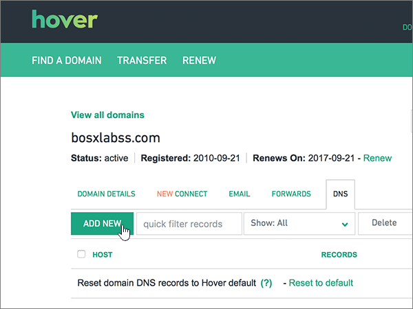

# Skapa DNS-poster på Hover för Office 365

 **[Läs frågor och svar om domäner](../setup/domains-faq.md)** om du inte hittar det du letar efter. 
  
Om Hover är din DNS-värd följer du stegen i den här artikeln för att verifiera domänen och konfigurera DNS-poster för e-post, Skype för företag - Online och så vidare.
     
När du har lagt till dessa poster på Hover är din domän konfigurerad för att fungera med Office 365-tjänster.
  
Mer information om webbvärdverktyg och DNS för webbplatser med Office 365 finns i [Använda en offentlig webbplats med Office 365](https://support.office.com/article/choose-a-public-website-3325d50e-d131-403c-a278-7f3296fe33a9).
  
> [!NOTE]
>  Det brukar ta ungefär 15 minuter för DNS-ändringarna att gå igenom. Ibland kan det dock ta längre tid att uppdatera DNS-systemet på Internet för en ändring som du har gjort. Om du stöter på problem med e-postflödet eller får andra problem när du har lagt till DNS-posterna, går du till [Felsöka problem när du har ändrat domännamn eller DNS-poster](../get-help-with-domains/find-and-fix-issues.md). 
  
## Lägga till en TXT-post för verifiering

Innan du använder din domän med Office 365 vill vi vara säkra på att det är du som äger den. Att du kan logga in på kontot hos domänregistratorn och skapa en DNS-post bevisar för Office 365 att du äger domänen.
  
> [!NOTE]
> Den här posten används endast för att verifiera att du äger domänen. Den påverkar ingenting annat. Du kan ta bort den senare om du vill. 
  
Följ stegen nedan eller [titta på videon](https://support.office.com/article/Video-Create-DNS-records-at-Hover-for-Office-365-182bd58e-8fe4-4717-9233-3a3546b72ad2?ui=en-US&amp;rs=en-US&amp;ad=US).
  
1. Kom igång genom att gå till domänsidan på Hover med [den här länken](https://www.hover.com/domains). Du uppmanas att logga in först.
    
    
  
2. Under **Hantera dina domäner**väljer du namnet på den domän som du vill redigera.
    
    
  
3. Välj fliken **DNS.** 
    
    
  
4. Välj **Lägg till ny**.
    
    
  
5. I rutan för den nya posten väljer du **TXT** för **Record Type** och skriver sedan in, eller kopierar och klistrar in, värdena från följande tabell.
    
    ||||
    |:-----|:-----|:-----|
    |Hostname    |Record Type    |Value    |
    |@    |TXT    |MS=ms *XXXXXXXX*    **Obs!** Det här är ett exempel. Använd det specifika värdet för **Mål eller pekar på-adress** här, från tabellen i Office 365.           [Hur hittar jag det?](../get-help-with-domains/information-for-dns-records.md)          |
   
    
  
6. Välj **Spara**.
    
    
  
7. Vänta några minuter innan du fortsätter, så att den post som du nyss skapade kan uppdateras på Internet.
    
Nu när du har lagt till posten på domänregistratorns webbplats kan du gå tillbaka till Office 365 och begära att Office 365 letar efter posten.
  
När Office 365 hittar rätt TXT-post är din domän verifierad.
  
1. Gå till sidan **Inställningar** \> domäner i <a href="https://go.microsoft.com/fwlink/p/?linkid=834818" target="_blank">administrationscentret.</a>
    
2. På sidan **Domäner** väljer du den domän som du verifierar. 
    
    
  
3. Välj **Starta inställningar**på sidan **Inställningar** .
    
    
  
4. På sidan **Verifiera domän** väljer du **Verifiera**.
    
    
  
> [!NOTE]
>  Det brukar ta ungefär 15 minuter för DNS-ändringarna att gå igenom. Ibland kan det dock ta längre tid att uppdatera DNS-systemet på Internet för en ändring som du har gjort. Om du stöter på problem med e-postflödet eller får andra problem när du har lagt till DNS-posterna, går du till [Felsöka problem när du har ändrat domännamn eller DNS-poster](../get-help-with-domains/find-and-fix-issues.md). 
  
## Lägga till en MX-post så att e-post för din domän kommer till Office 365

Följ stegen nedan eller [titta på videon](https://support.office.com/article/Video-Create-DNS-records-at-Hover-for-Office-365-182bd58e-8fe4-4717-9233-3a3546b72ad2?ui=en-US&amp;rs=en-US&amp;ad=US).
  
1. Kom igång genom att gå till domänsidan på Hover med [den här länken](https://www.hover.com/domains). Du uppmanas att logga in först.
    
    
  
2. Under **Hantera dina domäner**väljer du namnet på den domän som du vill redigera.
    
    
  
3. Välj fliken **DNS.** 
    
    
  
4. Välj **Lägg till ny**.
    
    
  
5. I rutan för den nya posten väljer du **MX** för **Record Type** och skriver sedan in, eller kopierar och klistrar in, värdena från följande tabell.
    
    |**Hostname**|**Record Type**|**Priority**|**Hostname**|
    |:-----|:-----|:-----|:-----|
    |@    |MX    |0    Mer information om prioritet finns i [Vad är MX-prioritet?](https://support.office.com/article/2784cc4d-95be-443d-b5f7-bb5dd867ba83.aspx)   | *\<domännyckel\>*  .mail.protection.outlook.com    **Anm.:** Hämta * \<domännyckeln\> * från ditt Office 365-konto.           [Hur hittar jag det?](../get-help-with-domains/information-for-dns-records.md)          |
   
    
  
6. Välj **Spara**.
    
    
  
7. Om det förekommer andra MX-poster tar du bort dem med följande tvåstegsprocedur:
    
    Välj först **Ta bort**en post som du vill ta bort .
    
    
  
    För det andra väljer du **Ja** för att bekräfta varje borttagning. 
    
    
  
    Upprepa proceduren tills du har tagit bort alla MX-poster förutom den du lade till tidigare i proceduren.
    
## Lägg till CNAME-posterna som krävs för Office 365

Följ stegen nedan eller [titta på videon](https://support.office.com/article/Video-Create-DNS-records-at-Hover-for-Office-365-182bd58e-8fe4-4717-9233-3a3546b72ad2?ui=en-US&amp;rs=en-US&amp;ad=US).
  
1. Kom igång genom att gå till domänsidan på Hover med [den här länken](https://www.hover.com/domains). Du uppmanas att logga in först.
    
    
  
2. Under **Hantera dina domäner**väljer du namnet på den domän som du vill redigera.
    
    
  
3. Välj fliken **DNS.** 
    
    
  
4. Lägg till den första av de sex CNAME-posterna.
    
    Välj **Lägg till ny**.
    
    
  
5. I de tomma rutorna för den nya posten väljer du **CNAME** för **Record Type** och skriver sedan in, eller kopierar och klistrar in, värdena från den första raden i följande tabell.
    
    |**Hostname**|**Record Type**|**Target Host**|
    |:-----|:-----|:-----|
    |autodiscover    |CNAME    |autodiscover.outlook.com    |
    |sip    |CNAME    |sipdir.online.lync.com    |
    |lyncdiscover    |CNAME    |webdir.online.lync.com    |
    |enterpriseregistration    |CNAME    |enterpriseregistration.windows.net    |
    |enterpriseenrollment    |CNAME    |enterpriseenrollment-s.manage.microsoft.com    |
   
    
  
6. Välj **Spara**.
    
    
  
7. Du använder de tre föregående stegen när du lägger till de andra fem CNAME-posterna med värdena från de andra fem raderna i tabellen.
    
## Lägga till en TXT-post för SPF för att förhindra skräppost

> [!IMPORTANT]
> Du kan inte ha fler än en TXT-post för SPF för en domän. Om din domän har fler än en SPF-post får du e-postfel och problem med leveranser och skräppostklassificering. Om du redan har en SPF-post för domänen ska du inte skapa en ny för Office 365. Lägg istället till de obligatoriska Office 365-värdena i den aktuella posten, så att du har en  *enda*  SPF-post som innehåller båda uppsättningarna med värden. 
  
Följ stegen nedan eller [titta på videon](https://support.office.com/article/Video-Create-DNS-records-at-Hover-for-Office-365-182bd58e-8fe4-4717-9233-3a3546b72ad2?ui=en-US&amp;rs=en-US&amp;ad=US).
  
1. Kom igång genom att gå till domänsidan på Hover med [den här länken](https://www.hover.com/domains). Du uppmanas att logga in först.
    
    
  
2. Under **Hantera dina domäner**väljer du namnet på den domän som du vill redigera.
    
    
  
3. Välj fliken **DNS.** 
    
    
  
4. Välj **Lägg till ny**.
    
    
  
5. I rutan för den nya posten väljer du **TXT** för **Record Type** och skriver sedan in, eller kopierar och klistrar in, värdena från följande tabell.
    
    |**Hostname**|**Record Type**|**Value (Värde)**|
    |:-----|:-----|:-----|
    |@    |TXT    |v=spf1 include:spf.protection.outlook.com -all   **Obs!** Vi rekommenderar att du kopierar och klistrar in den här posten så att alla avstånd förblir korrekta.               |
   
    
  
6. Välj **Spara**.
    
    
  
## Lägga till de två SRV-posterna som krävs för Office 365

Följ stegen nedan eller [titta på videon](https://support.office.com/article/Video-Create-DNS-records-at-Hover-for-Office-365-182bd58e-8fe4-4717-9233-3a3546b72ad2?ui=en-US&amp;rs=en-US&amp;ad=US).
  
1. Kom igång genom att gå till domänsidan på Hover med [den här länken](https://www.hover.com/domains). Du uppmanas att logga in först.
    
    
  
2. Under **Hantera dina domäner**väljer du namnet på den domän som du vill redigera.
    
    
  
3. Välj fliken **DNS.** 
    
    
  
4. Lägg till den första av de två SRV-posterna.
    
    Välj **Lägg till ny**.
    
    
  
5. I de tomma rutorna för den nya posten väljer du **SRV** för **Record Type** och skriver sedan in, eller kopierar och klistrar in, värdena från den första raden i följande tabell.
    
    |**Hostname**|**Record Type**|**Priority**|**Weight**|**Port**|**Target**|
    |:-----|:-----|:-----|:-----|:-----|:-----|
    |_sip._tls    |SRV    |100    |1    |443    |sipdir.online.lync.com    |
    |_sipfederationtls._tcp    |SRV    |100    |1    |5061    |sipfed.online.lync.com    |
   
    
  
6. Välj **Spara**.
    
    
  
7. Du använder de tre föregående stegen när du lägger till den andra SRV-posten med värdena från tabellens andra rad.
    
> [!NOTE]
> Det brukar ta ungefär 15 minuter för DNS-ändringarna att gå igenom. Ibland kan det dock ta längre tid att uppdatera DNS-systemet på Internet för en ändring som du har gjort. Om du stöter på problem med e-postflödet eller får andra problem när du har lagt till DNS-posterna, går du till [Felsöka problem när du har ändrat domännamn eller DNS-poster](../get-help-with-domains/find-and-fix-issues.md). 
  
