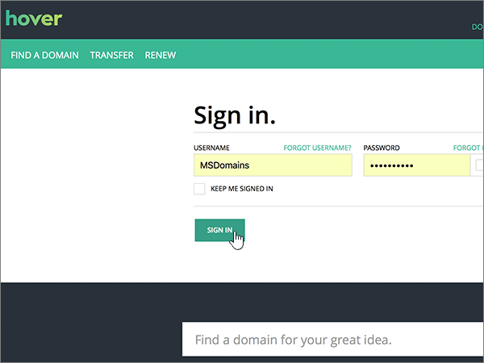
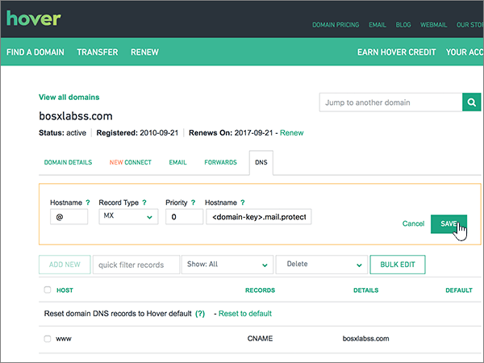
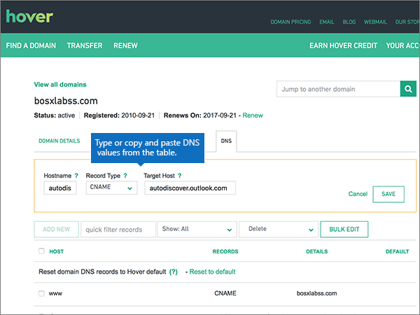

# Skapa DNS-poster på Hover för Office 365Create DNS records at Hover for Office 365

 **[Läs frågor och svar om domäner](../setup/domains-faq.md)** om du inte hittar det du letar efter.**[Check the Domains FAQ](../setup/domains-faq.md)** if you don't find what you're looking for. 
  
Om Hover är din DNS-värd följer du stegen i den här artikeln för att verifiera domänen och konfigurera DNS-poster för e-post, Skype för företag - Online och så vidare.If Hover is your DNS hosting provider, follow the steps in this article to verify your domain and set up DNS records for email, Skype for Business Online, and so on.
     
När du har lagt till dessa poster på Hover är din domän konfigurerad för att fungera med Office 365-tjänster.After you add these records at Hover, your domain will be set up to work with Office 365 services.
  
Mer information om webbvärdverktyg och DNS för webbplatser med Office 365 finns i [Använda en offentlig webbplats med Office 365](https://support.office.com/article/choose-a-public-website-3325d50e-d131-403c-a278-7f3296fe33a9).To learn about webhosting and DNS for websites with Office 365, see [Use a public website with Office 365](https://support.office.com/article/choose-a-public-website-3325d50e-d131-403c-a278-7f3296fe33a9).
  
> [!NOTE]
>  Det brukar ta ungefär 15 minuter för DNS-ändringarna att gå igenom. Ibland kan det dock ta längre tid att uppdatera DNS-systemet på Internet för en ändring som du har gjort. Om du stöter på problem med e-postflödet eller får andra problem när du har lagt till DNS-posterna, går du till [Felsöka problem när du har ändrat domännamn eller DNS-poster](../get-help-with-domains/find-and-fix-issues.md).Typically it takes about 15 minutes for DNS changes to take effect. However, it can occasionally take longer for a change you've made to update across the Internet's DNS system. If you're having trouble with mail flow or other issues after adding DNS records, see [Troubleshoot issues after changing your domain name or DNS records](../get-help-with-domains/find-and-fix-issues.md). 
  
## Lägga till en TXT-post för verifieringAdd a TXT record for verification

Innan du använder din domän med Office 365 vill vi vara säkra på att det är du som äger den. Att du kan logga in på kontot hos domänregistratorn och skapa en DNS-post bevisar för Office 365 att du äger domänen.Before you use your domain with Office 365, we have to make sure that you own it. Your ability to log in to your account at your domain registrar and create the DNS record proves to Office 365 that you own the domain.
  
> [!NOTE]
> Den här posten används endast för att verifiera att du äger domänen. Den påverkar ingenting annat. Du kan ta bort den senare om du vill.This record is used only to verify that you own your domain; it doesn't affect anything else. You can delete it later, if you like. 
  
Följ stegen nedan eller [titta på videon](https://support.office.com/article/Video-Create-DNS-records-at-Hover-for-Office-365-182bd58e-8fe4-4717-9233-3a3546b72ad2?ui=en-US&amp;rs=en-US&amp;ad=US).Follow the steps below or [watch the video](https://support.office.com/article/Video-Create-DNS-records-at-Hover-for-Office-365-182bd58e-8fe4-4717-9233-3a3546b72ad2?ui=en-US&amp;rs=en-US&amp;ad=US).
  
1. Kom igång genom att gå till domänsidan på Hover med [den här länken](https://www.hover.com/domains). Du uppmanas att logga in först.To get started, go to your domains page at Hover by using [this link](https://www.hover.com/domains). You'll be prompted to sign in.
    
    
  
2. Under **Hantera dina domäner**väljer du namnet på den domän som du vill redigera.Under **Manage Your Domains**, select the name of the domain that you want to edit.
    
    
  
3. Välj fliken **DNS.**Select the **DNS** tab. 
    
    
  
4. Välj **Lägg till ny**.Select **Add New**.
    
    
  
5. I rutan för den nya posten väljer du **TXT** för **Record Type** och skriver sedan in, eller kopierar och klistrar in, värdena från följande tabell.In the boxes for the new record, select **TXT** for the **Record Type**, and then type or copy and paste the values from the following table.
    
    ||||
    |:-----|:-----|:-----|
    |HostnameHostname    |Record TypeRecord Type    |ValueValue    |
    |@    |TXTTXT    |MS=ms *XXXXXXXX*MS=ms *XXXXXXXX*    **Obs!** Det här är ett exempel. Använd det specifika värdet för **Mål eller pekar på-adress** här, från tabellen i Office 365.           [Hur hittar jag det?](../get-help-with-domains/information-for-dns-records.md)**Note:** This is an example. Use your specific **Destination or Points to Address** value here, from the table in Office 365.           [How do I find this?](../get-help-with-domains/information-for-dns-records.md)          |
   
    
  
6. Välj **Spara**.Select **Save**.
    
    
  
7. Vänta några minuter innan du fortsätter, så att den post som du nyss skapade kan uppdateras på Internet.Wait a few minutes before you continue, so that the record you just created can update across the Internet.
    
Nu när du har lagt till posten på domänregistratorns webbplats kan du gå tillbaka till Office 365 och begära att Office 365 letar efter posten.Now that you've added the record at your domain registrar's site, you'll go back to Office 365 and request Office 365 to look for the record.
  
När Office 365 hittar rätt TXT-post är din domän verifierad.When Office 365 finds the correct TXT record, your domain is verified.
  
1. Gå till sidan **Inställningar** \> domäner i <a href="https://go.microsoft.com/fwlink/p/?linkid=834818" target="_blank">administrationscentret.</a>In the admin center, go to the **Settings** \> <a href="https://go.microsoft.com/fwlink/p/?linkid=834818" target="_blank">Domains</a> page.
    
2. På sidan **Domäner** väljer du den domän som du verifierar.On the **Domains** page, select the domain that you are verifying. 
    
    
  
3. Välj **Starta inställningar**på sidan **Inställningar** .On the **Setup** page, select **Start setup**.
    
    
  
4. På sidan **Verifiera domän** väljer du **Verifiera**.On the **Verify domain** page, select **Verify**.
    
    
  
> [!NOTE]
>  Det brukar ta ungefär 15 minuter för DNS-ändringarna att gå igenom. Ibland kan det dock ta längre tid att uppdatera DNS-systemet på Internet för en ändring som du har gjort. Om du stöter på problem med e-postflödet eller får andra problem när du har lagt till DNS-posterna, går du till [Felsöka problem när du har ändrat domännamn eller DNS-poster](../get-help-with-domains/find-and-fix-issues.md).Typically it takes about 15 minutes for DNS changes to take effect. However, it can occasionally take longer for a change you've made to update across the Internet's DNS system. If you're having trouble with mail flow or other issues after adding DNS records, see [Troubleshoot issues after changing your domain name or DNS records](../get-help-with-domains/find-and-fix-issues.md). 
  
## Lägga till en MX-post så att e-post för din domän kommer till Office 365Add an MX record so email for your domain will come to Office 365

Följ stegen nedan eller [titta på videon](https://support.office.com/article/Video-Create-DNS-records-at-Hover-for-Office-365-182bd58e-8fe4-4717-9233-3a3546b72ad2?ui=en-US&amp;rs=en-US&amp;ad=US).Follow the steps below or [watch the video](https://support.office.com/article/Video-Create-DNS-records-at-Hover-for-Office-365-182bd58e-8fe4-4717-9233-3a3546b72ad2?ui=en-US&amp;rs=en-US&amp;ad=US).
  
1. Kom igång genom att gå till domänsidan på Hover med [den här länken](https://www.hover.com/domains). Du uppmanas att logga in först.To get started, go to your domains page at Hover by using [this link](https://www.hover.com/domains). You'll be prompted to sign in.
    
    
  
2. Under **Hantera dina domäner**väljer du namnet på den domän som du vill redigera.Under **Manage Your Domains**, select the name of the domain that you want to edit.
    
    
  
3. Välj fliken **DNS.**Select the **DNS** tab. 
    
    
  
4. Välj **Lägg till ny**.Select **Add New**.
    
    
  
5. I rutan för den nya posten väljer du **MX** för **Record Type** och skriver sedan in, eller kopierar och klistrar in, värdena från följande tabell.In the boxes for the new record, select **MX** for the **Record Type**, and then type or copy and paste the values from the following table.
    
    |**Hostname****Hostname**|**Record Type****Record Type**|**Priority****Priority**|**Hostname****Hostname**|
    |:-----|:-----|:-----|:-----|
    |@    |MXMX    |00    Mer information om prioritet finns i [Vad är MX-prioritet?](https://support.office.com/article/2784cc4d-95be-443d-b5f7-bb5dd867ba83.aspx)For more information about priority, see [What is MX priority?](https://support.office.com/article/2784cc4d-95be-443d-b5f7-bb5dd867ba83.aspx)   | *\<domännyckel\>*  .mail.protection.outlook.com*\<domain-key\>*  .mail.protection.outlook.com    **Anm.:** Hämta \* \<domännyckeln\> \* från ditt Office 365-konto.**Note:** Get your  *\<domain-key\>*  from your Office 365 account.           [Hur hittar jag det?How do I find this?](../get-help-with-domains/information-for-dns-records.md)          |
   
    
  
6. Välj **Spara**.Select **Save**.
    
    
  
7. Om det förekommer andra MX-poster tar du bort dem med följande tvåstegsprocedur:If there are any other MX records, use the following two-step process to remove each of them:
    
    Välj först **Ta bort**en post som du vill ta bort .First, mousing over a record that you want to remove, select **Delete**.
    
    
  
    För det andra väljer du **Ja** för att bekräfta varje borttagning.Second, select **Yes** to confirm each deletion. 
    
    
  
    Upprepa proceduren tills du har tagit bort alla MX-poster förutom den du lade till tidigare i proceduren.Repeat this process until you have deleted all MX records except for the one that you added earlier in this procedure.
    
## Lägg till CNAME-posterna som krävs för Office 365Add the CNAME records that are required for Office 365

Följ stegen nedan eller [titta på videon](https://support.office.com/article/Video-Create-DNS-records-at-Hover-for-Office-365-182bd58e-8fe4-4717-9233-3a3546b72ad2?ui=en-US&amp;rs=en-US&amp;ad=US).Follow the steps below or [watch the video](https://support.office.com/article/Video-Create-DNS-records-at-Hover-for-Office-365-182bd58e-8fe4-4717-9233-3a3546b72ad2?ui=en-US&amp;rs=en-US&amp;ad=US).
  
1. Kom igång genom att gå till domänsidan på Hover med [den här länken](https://www.hover.com/domains). Du uppmanas att logga in först.To get started, go to your domains page at Hover by using [this link](https://www.hover.com/domains). You'll be prompted to sign in.
    
    
  
2. Under **Hantera dina domäner**väljer du namnet på den domän som du vill redigera.Under **Manage Your Domains**, select the name of the domain that you want to edit.
    
    
  
3. Välj fliken **DNS.**Select the **DNS** tab. 
    
    
  
4. Lägg till den första av de sex CNAME-posterna.Add the first of the six CNAME records.
    
    Välj **Lägg till ny**.Select **Add New**.
    
    
  
5. I de tomma rutorna för den nya posten väljer du **CNAME** för **Record Type** och skriver sedan in, eller kopierar och klistrar in, värdena från den första raden i följande tabell.In the empty boxes for the new record, select **CNAME** for the **Record Type**, and then type or copy and paste the values from the first row in the following table.
    
    |**Hostname****Hostname**|**Record Type****Record Type**|**Target Host****Target Host**|
    |:-----|:-----|:-----|
    |autodiscoverautodiscover    |CNAMECNAME    |autodiscover.outlook.comautodiscover.outlook.com    |
    |sipsip    |CNAMECNAME    |sipdir.online.lync.comsipdir.online.lync.com    |
    |lyncdiscoverlyncdiscover    |CNAMECNAME    |webdir.online.lync.comwebdir.online.lync.com    |
    |enterpriseregistrationenterpriseregistration    |CNAMECNAME    |enterpriseregistration.windows.netenterpriseregistration.windows.net    |
    |enterpriseenrollmententerpriseenrollment    |CNAMECNAME    |enterpriseenrollment-s.manage.microsoft.comenterpriseenrollment-s.manage.microsoft.com    |
   
    
  
6. Välj **Spara**.Select **Save**.
    
    
  
7. Du använder de tre föregående stegen när du lägger till de andra fem CNAME-posterna med värdena från de andra fem raderna i tabellen.Using the preceding three steps and the values from the other five rows in the table, add each of the other five CNAME records.
    
## Lägga till en TXT-post för SPF för att förhindra skräppostAdd a TXT record for SPF to help prevent email spam

> [!IMPORTANT]
> Du kan inte ha fler än en TXT-post för SPF för en domän.You cannot have more than one TXT record for SPF for a domain. Om din domän har fler än en SPF-post får du e-postfel och problem med leveranser och skräppostklassificering.If your domain has more than one SPF record, you'll get email errors, as well as delivery and spam classification issues. Om du redan har en SPF-post för domänen ska du inte skapa en ny för Office 365.If you already have an SPF record for your domain, don't create a new one for Office 365. Lägg istället till de obligatoriska Office 365-värdena i den aktuella posten, så att du har en  *enda*  SPF-post som innehåller båda uppsättningarna med värden.Instead, add the required Office 365 values to the current record so that you have a  *single*  SPF record that includes both sets of values. 
  
Följ stegen nedan eller [titta på videon](https://support.office.com/article/Video-Create-DNS-records-at-Hover-for-Office-365-182bd58e-8fe4-4717-9233-3a3546b72ad2?ui=en-US&amp;rs=en-US&amp;ad=US).Follow the steps below or [watch the video](https://support.office.com/article/Video-Create-DNS-records-at-Hover-for-Office-365-182bd58e-8fe4-4717-9233-3a3546b72ad2?ui=en-US&amp;rs=en-US&amp;ad=US).
  
1. Kom igång genom att gå till domänsidan på Hover med [den här länken](https://www.hover.com/domains). Du uppmanas att logga in först.To get started, go to your domains page at Hover by using [this link](https://www.hover.com/domains). You'll be prompted to sign in.
    
    
  
2. Under **Hantera dina domäner**väljer du namnet på den domän som du vill redigera.Under **Manage Your Domains**, select the name of the domain that you want to edit.
    
    
  
3. Välj fliken **DNS.**Select the **DNS** tab. 
    
    
  
4. Välj **Lägg till ny**.Select **Add New**.
    
    
  
5. I rutan för den nya posten väljer du **TXT** för **Record Type** och skriver sedan in, eller kopierar och klistrar in, värdena från följande tabell.In the boxes for the new record, select **TXT** for the **Record Type**, and then type or copy and paste the values from the following table.
    
    |**Hostname****Hostname**|**Record Type****Record Type**|**Value (Värde)****Value**|
    |:-----|:-----|:-----|
    |@    |TXTTXT    |v=spf1 include:spf.protection.outlook.com -allv=spf1 include:spf.protection.outlook.com -all   **Obs!** Vi rekommenderar att du kopierar och klistrar in den här posten så att alla avstånd förblir korrekta.    **Note:** We recommend copying and pasting this entry, so that all of the spacing stays correct.           |
   
    
  
6. Välj **Spara**.Select **Save**.
    
    
  
## Lägga till de två SRV-posterna som krävs för Office 365Add the two SRV records that are required for Office 365

Följ stegen nedan eller [titta på videon](https://support.office.com/article/Video-Create-DNS-records-at-Hover-for-Office-365-182bd58e-8fe4-4717-9233-3a3546b72ad2?ui=en-US&amp;rs=en-US&amp;ad=US).Follow the steps below or [watch the video](https://support.office.com/article/Video-Create-DNS-records-at-Hover-for-Office-365-182bd58e-8fe4-4717-9233-3a3546b72ad2?ui=en-US&amp;rs=en-US&amp;ad=US).
  
1. Kom igång genom att gå till domänsidan på Hover med [den här länken](https://www.hover.com/domains). Du uppmanas att logga in först.To get started, go to your domains page at Hover by using [this link](https://www.hover.com/domains). You'll be prompted to sign in.
    
    
  
2. Under **Hantera dina domäner**väljer du namnet på den domän som du vill redigera.Under **Manage Your Domains**, select the name of the domain that you want to edit.
    
    
  
3. Välj fliken **DNS.**Select the **DNS** tab. 
    
    
  
4. Lägg till den första av de två SRV-posterna.Add the first of the two SRV records.
    
    Välj **Lägg till ny**.Select **Add New**.
    
    
  
5. I de tomma rutorna för den nya posten väljer du **SRV** för **Record Type** och skriver sedan in, eller kopierar och klistrar in, värdena från den första raden i följande tabell.In the empty boxes for the new record, select **SRV** for the **Record Type**, and then type or copy and paste the values from the first row in the following table.
    
    |**Hostname****Hostname**|**Record Type****Record Type**|**Priority****Priority**|**Weight****Weight**|**Port****Port**|**Target****Target**|
    |:-----|:-----|:-----|:-----|:-----|:-----|
    |_sip._tls_sip._tls    |SRVSRV    |100100    |11    |443443    |sipdir.online.lync.comsipdir.online.lync.com    |
    |_sipfederationtls._tcp_sipfederationtls._tcp    |SRVSRV    |100100    |11    |50615061    |sipfed.online.lync.comsipfed.online.lync.com    |
   
    
  
6. Välj **Spara**.Select **Save**.
    
    
  
7. Du använder de tre föregående stegen när du lägger till den andra SRV-posten med värdena från tabellens andra rad.Using the preceding three steps and the values from the second row in the table, add the other SRV record.
    
> [!NOTE]
> Det brukar ta ungefär 15 minuter för DNS-ändringarna att gå igenom. Ibland kan det dock ta längre tid att uppdatera DNS-systemet på Internet för en ändring som du har gjort. Om du stöter på problem med e-postflödet eller får andra problem när du har lagt till DNS-posterna, går du till [Felsöka problem när du har ändrat domännamn eller DNS-poster](../get-help-with-domains/find-and-fix-issues.md).Typically it takes about 15 minutes for DNS changes to take effect. However, it can occasionally take longer for a change you've made to update across the Internet's DNS system. If you're having trouble with mail flow or other issues after adding DNS records, see [Troubleshoot issues after changing your domain name or DNS records](../get-help-with-domains/find-and-fix-issues.md). 
  
