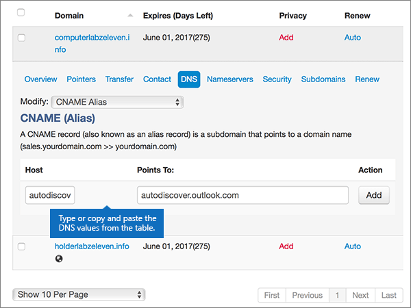
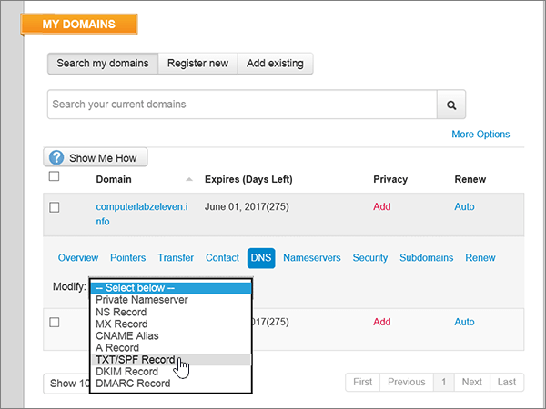

# Skapa DNS-poster på MyDomain för MicrosoftCreate DNS records at MyDomain for Microsoft

  
 **[Läs frågor och svar om domäner](../setup/domains-faq.md)** om du inte hittar det du letar efter.**[Check the Domains FAQ](../setup/domains-faq.md)** if you don't find what you're looking for. 
  
> [!CAUTION]
> The MyDomain website doesn't support SRV records, which means several Skype for Business Online and Outlook Web App features won't work.The MyDomain website doesn't support SRV records, which means several Skype for Business Online and Outlook Web App features won't work. No matter which Microsoft plan you use, if you manage your DNS records at MyDomain, there are [significant service limitations](https://docs.microsoft.com/microsoft-365/admin/setup/domains-faq), and you might want to switch to a different DNS hosting provider.No matter which Microsoft plan you use, if you manage your DNS records at MyDomain, there are [significant service limitations](https://docs.microsoft.com/microsoft-365/admin/setup/domains-faq), and you might want to switch to a different DNS hosting provider. 
  
Om du väljer att hantera dina egna Microsoft DNS-poster hos MyDomain trots tjänstbegränsningarna utför du stegen i den här artikeln för att konfigurera DNS-posterna för e-post, Skype för företag – Online o.s.v.If you choose to manage your own Microsoft DNS records at MyDomain despite the service limitations, follow the steps in this article to set up your DNS records for email, Skype for Business Online, and so on.
    
När du har lagt till dessa poster på MyDomain är din domän konfigurerad för att fungera med Microsoft-tjänster.After you add these records at MyDomain, your domain will be set up to work with Microsoft services.
  

  
> [!NOTE]
> Typically it takes about 15 minutes for DNS changes to take effect.Typically it takes about 15 minutes for DNS changes to take effect. However, it can occasionally take longer for a change you've made to update across the Internet's DNS system.However, it can occasionally take longer for a change you've made to update across the Internet's DNS system. If you're having trouble with mail flow or other issues after adding DNS records, see [Find and fix issues after adding your domain or DNS records](../get-help-with-domains/find-and-fix-issues.md).If you're having trouble with mail flow or other issues after adding DNS records, see [Find and fix issues after adding your domain or DNS records](../get-help-with-domains/find-and-fix-issues.md). 
  
## Lägga till en TXT-post för verifieringAdd a TXT record for verification

Before you use your domain with Microsoft, we have to make sure that you own it.Before you use your domain with Microsoft, we have to make sure that you own it. Your ability to log in to your account at your domain registrar and create the DNS record proves to Microsoft that you own the domain.Your ability to log in to your account at your domain registrar and create the DNS record proves to Microsoft that you own the domain.
  
> [!NOTE]
> This record is used only to verify that you own your domain; it doesn't affect anything else.This record is used only to verify that you own your domain; it doesn't affect anything else. You can delete it later, if you like.You can delete it later, if you like. 
  
1. To get started, go to your domains page at MyDomain by using [this link](https://www.mydomain.com/controlpanel).To get started, go to your domains page at MyDomain by using [this link](https://www.mydomain.com/controlpanel). You'll be prompted to log in first.You'll be prompted to log in first.
    
2. Välj **Domain Central** under **My Favorites**.In the **My Favorites** section, select **Domain Central**.
    
3. Under **Domain** väljer du namnet på den domän som du vill redigera.Under **Domain**, select the name of the domain that you want to edit.
    
4. På raden **Overview** väljer du **DNS**.In the **Overview** row, select **DNS**.
    
5. I listrutan **Modify** väljer du **TXT/SPF Record**.From the **Modify** drop-down list, choose **TXT/SPF Record**.
    
6. Under **Content**, i rutan för den nya posten, skriver du in, eller kopierar och klistrar in, värdet från följande tabell.Under **Content**, in the box for the new record, type or copy and paste the value from the following table.
    
    ||
    |:-----|
    |**Content****Content**   |
    |MS=ms *XXXXXXXX*MS=ms *XXXXXXXX*    **Obs!** Det här är ett exempel.**Note:** This is an example. Använd ditt specifika \*\*Mål eller pekar på adress \*\* värde här, från tabellen.Use your specific **Destination or Points to Address** value here, from the table. [Hur hittar jag det här?How do I find this?](../get-help-with-domains/information-for-dns-records.md)          |
   
7. Välj **Lägg till**.Select **Add**.
    
8. Vänta några minuter innan du fortsätter, så att den post som du nyss skapade kan uppdateras på Internet.Wait a few minutes before you continue, so that the record you just created can update across the Internet.
    
Nu när du har lagt till posten på domänregistratorns webbplats kan du gå tillbaka till Microsoft och begär posten.Now that you've added the record at your domain registrar's site, you'll go back to Microsoft and request the record.
  
När Microsoft hittar rätt TXT-post är din domän verifierad.When Microsoft finds the correct TXT record, your domain is verified.
  
1. I Microsoft-administrationscentret går du till **Inställningar** \> <a href="https://go.microsoft.com/fwlink/p/?linkid=834818" target="_blank">Domäner</a>.In the Microsoft admin center, go to the **Settings** \> <a href="https://go.microsoft.com/fwlink/p/?linkid=834818" target="_blank">Domains</a> page.
    
2. På sidan **Domains** väljer du den domän du verifierar.On the **Domains** page, select the domain that you are verifying. 
    
3. På sidan **Setup** väljer du **Start setup**.On the **Setup** page, select **Start setup**.
    
4. På sidan **Verify domain** väljer du **Verify**.On the **Verify domain** page, select **Verify**.
    
> [!NOTE]
> Typically it takes about 15 minutes for DNS changes to take effect.Typically it takes about 15 minutes for DNS changes to take effect. However, it can occasionally take longer for a change you've made to update across the Internet's DNS system.However, it can occasionally take longer for a change you've made to update across the Internet's DNS system. If you're having trouble with mail flow or other issues after adding DNS records, see [Find and fix issues after adding your domain or DNS records](../get-help-with-domains/find-and-fix-issues.md).If you're having trouble with mail flow or other issues after adding DNS records, see [Find and fix issues after adding your domain or DNS records](../get-help-with-domains/find-and-fix-issues.md). 
  
## Lägga till en MX-post så att e-post för din domän kommer till Microsoft.Add an MX record so email for your domain will come to Microsoft

1. To get started, go to your domains page at MyDomain by using [this link](https://www.mydomain.com/controlpanel).To get started, go to your domains page at MyDomain by using [this link](https://www.mydomain.com/controlpanel). You'll be prompted to log in first.You'll be prompted to log in first.
    
2. Välj **Domain Central** under **My Favorites**.In the **My Favorites** section, select **Domain Central**.
    
3. Under **Domain** väljer du namnet på den domän som du vill redigera.Under **Domain**, select the name of the domain that you want to edit.
    
4. På raden **Overview** väljer du **DNS**.In the **Overview** row, select **DNS**.
    
5. Välj **MX Record** i listrutan **Modify**.From the **Modify** drop-down list, choose **MX Record**.
    
    
  
6. I den nya postens rutor skriver du in, eller kopierar och klistrar in, värdena från följande tabell.In the boxes for the new record, type or copy and paste the values from the following table.
    
    |**Priority****Priority**|**Värd****Host**|**Points To: (pekar på)****Points To:**|
    |:-----|:-----|:-----|
    |00    Mer information om prioritet finns i [Vad är MX-prioritet?](https://docs.microsoft.com/microsoft-365/admin/setup/domains-faq)For more information about priority, see [What is MX priority?](https://docs.microsoft.com/microsoft-365/admin/setup/domains-faq)   |@    | *\<domain-key\>*  .mail.protection.outlook.com*\<domain-key\>*  .mail.protection.outlook.com    **Obs!** Hämta din \<*domain-key*\> från ditt Microsoft-konto.**Note:** Get your \<*domain-key*\> from your Microsoft account. > [Hur hittar jag det?](../get-help-with-domains/information-for-dns-records.md) > [How do I find this?](../get-help-with-domains/information-for-dns-records.md)          |
   
    
  
7. Välj **Lägg till**.Select **Add**.
    
    
  
8. Om det finns andra befintliga MX-poster väljer du **Remove** i kolumnen **Action** för var och en för att ta bort den.If there are any other existing MX records, select **Remove** in the **Action** column for each one to delete it. 
    
    
  
9. Välj **OK**.Select **OK**.
    
    
  
## Lägga till CNAME-posterna som krävs för MicrosoftAdd the CNAME records that are required for Microsoft

1. To get started, go to your domains page at MyDomain by using [this link](https://www.mydomain.com/controlpanel).To get started, go to your domains page at MyDomain by using [this link](https://www.mydomain.com/controlpanel). You'll be prompted to log in first.You'll be prompted to log in first.
    
2. Välj **Domain Central** under **My Favorites**.In the **My Favorites** section, select **Domain Central**.
    
3. Under **Domain** väljer du namnet på den domän som du vill redigera.Under **Domain**, select the name of the domain that you want to edit.
    
4. På raden **Overview** väljer du **DNS**.In the **Overview** row, select **DNS**.
    
5. Välj **CNAME Alias** i listrutan **Modify**.From the **Modify** drop-down list, choose **CNAME Alias**.
    
    
  
6. Lägg till den första CNAME-posten.Add the first CNAME record.
    
    I rutorna för den nya posten anger du eller kopierar och klistrar in värdena från den första raden i följande tabell.In the boxes for the new record, type or copy and paste the values from the first row of the following table.
    
    |**Värd****Host**|**Points To: (pekar på)****Points To:**|
    |:-----|:-----|
    |autodiscoverautodiscover    |autodiscover.outlook.comautodiscover.outlook.com    |
    |sipsip    |sipdir.online.lync.comsipdir.online.lync.com    |
    |lyncdiscoverlyncdiscover    |webdir.online.lync.comwebdir.online.lync.com    |
    |enterpriseregistrationenterpriseregistration    |enterpriseregistration.windows.netenterpriseregistration.windows.net    |
    |enterpriseenrollmententerpriseenrollment    |enterpriseenrollment-s.manage.microsoft.comenterpriseenrollment-s.manage.microsoft.com    |
   
    
  
7. Välj **Add** (lägg till) för att lägga till den första posten.Select **Add** to add the first record. 
    
    
  
8. Lägg till den andra CNAME-posten.Add the second CNAME record.
    
    Använd värden från den andra raden i tabellen ovan och välj sedan **Add** (lägg till) för att lägga till den andra posten.Use the values from the second row of the table above, and then select **Add** to add the second record. 
    
    Lägg till de återstående posterna på samma sätt med värdena från den tredje, fjärde, femte och sjätte raden i tabellen.Add the remaining records in the same way, using the values from the third, fourth, fifth, and sixth rows of the table.
    
## Lägga till en TXT-post för SPF för att förhindra skräppostAdd a TXT record for SPF to help prevent email spam

> [!IMPORTANT]
> Du kan inte ha fler än en TXT-post för SPF för en domän.You cannot have more than one TXT record for SPF for a domain. Om din domän har fler än en SPF-post får du e-postfel och problem med leveranser och skräppostklassificering.If your domain has more than one SPF record, you'll get email errors, as well as delivery and spam classification issues. Om du redan har en SPF-post för domänen ska du inte skapa en ny för Microsoft.If you already have an SPF record for your domain, don't create a new one for Microsoft. Lägg istället till de obligatoriska Microsoft-värdena i den aktuella posten, så att du har en enda SPF-post som innehåller båda uppsättningarna med värden.Instead, add the required Microsoft values to the current record so that you have a single SPF record that includes both sets of values. Behöver du exempel?Need examples? Ta en titt på dessa [externa DNS-poster för Microsoft](https://docs.microsoft.com/office365/enterprise/external-domain-name-system-records#bkmk_spfrecords).Check out these [External Domain Name System records for Microsoft](https://docs.microsoft.com/office365/enterprise/external-domain-name-system-records#bkmk_spfrecords). Om du vill validera SPF-posten kan du använda något av dessa [SPF-valideringsverktyg](../setup/domains-faq.md).To validate your SPF record, you can use one of these [SPF validation tools](../setup/domains-faq.md). 
  
1. To get started, go to your domains page at MyDomain by using [this link](https://www.mydomain.com/controlpanel).To get started, go to your domains page at MyDomain by using [this link](https://www.mydomain.com/controlpanel). You'll be prompted to log in first.You'll be prompted to log in first.
    
2. Välj **Domain Central** under **My Favorites**.In the **My Favorites** section, select **Domain Central**.
    
3. Under **Domain** väljer du namnet på den domän som du vill redigera.Under **Domain**, select the name of the domain that you want to edit.
    
4. På raden **Overview** väljer du **DNS**.In the **Overview** row, select **DNS**.
    
5. I listrutan **Modify** väljer du **TXT/SPF Record**.From the **Modify** drop-down list, choose **TXT/SPF Record**.
    
    
  
6. Under **Content**, i rutan för den nya posten, skriver du in, eller kopierar och klistrar in, värdet från följande tabell.Under **Content**, in the box for the new record, type or copy and paste the value from the following table.
    
    |**Content****Content**|
    |:-----|
    |v=spf1 include:spf.protection.outlook.com -allv=spf1 include:spf.protection.outlook.com -all    **Obs!** Vi rekommenderar att du kopierar och klistrar in den här posten så att alla avstånd förblir korrekta.    **Note:** We recommend copying and pasting this entry, so that all of the spacing stays correct.           |
   
    
  
7. Välj **Lägg till**.Select **Add**.
    
    
  
## Lägga till de två SRV-posterna som krävs för MicrosoftAdd the two SRV records that are required for Microsoft

> [!CAUTION]
> The MyDomain website doesn't support SRV records, which means several Skype for Business Online and Outlook Web App features won't work.The MyDomain website doesn't support SRV records, which means several Skype for Business Online and Outlook Web App features won't work. No matter which Microsoft plan you use, if you manage your DNS records at MyDomain, there are [significant service limitations](https://docs.microsoft.com/microsoft-365/admin/setup/domains-faq), and you might want to switch to a different DNS hosting provider.No matter which Microsoft plan you use, if you manage your DNS records at MyDomain, there are [significant service limitations](https://docs.microsoft.com/microsoft-365/admin/setup/domains-faq), and you might want to switch to a different DNS hosting provider. 
  
> [!NOTE]
> Typically it takes about 15 minutes for DNS changes to take effect.Typically it takes about 15 minutes for DNS changes to take effect. However, it can occasionally take longer for a change you've made to update across the Internet's DNS system.However, it can occasionally take longer for a change you've made to update across the Internet's DNS system. If you're having trouble with mail flow or other issues after adding DNS records, see [Find and fix issues after adding your domain or DNS records](../get-help-with-domains/find-and-fix-issues.md).If you're having trouble with mail flow or other issues after adding DNS records, see [Find and fix issues after adding your domain or DNS records](../get-help-with-domains/find-and-fix-issues.md). 
  
