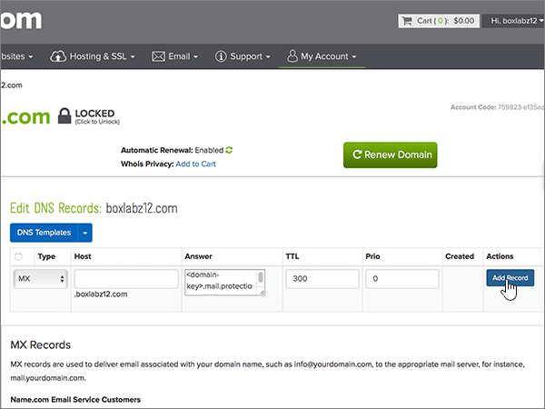
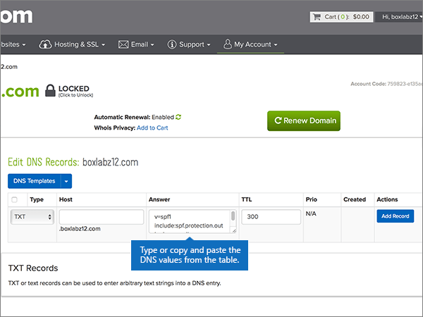

# Skapa DNS-poster på name.com för MicrosoftCreate DNS records at name.com for Microsoft

 **[Läs frågor och svar om domäner](../setup/domains-faq.yml)** om du inte hittar det du letar efter.**[Check the Domains FAQ](../setup/domains-faq.yml)** if you don't find what you're looking for. 
  
Om name.com är din DNS-värd följer du stegen i den här artikeln för att verifiera din domän och konfigurera DNS-poster för e-post, Skype för företag - Online och så vidare.If name.com is your DNS hosting provider, follow the steps in this article to verify your domain and set up DNS records for email, Skype for Business Online, and so on.
  
När du har lagt till dessa poster på name.com är din domän konfigurerad för att fungera med Microsoft-tjänster.After you add these records at name.com, your domain will be set up to work with Microsoft services.

  
> [!NOTE]
> Det brukar ta ungefär 15 minuter för DNS-ändringarna att gå igenom. Ibland kan det dock ta längre tid att uppdatera DNS-systemet på Internet för en ändring som du har gjort. Om du stöter på problem med e-postflödet eller får andra problem när du har lagt till DNS-posterna, går du till [Felsöka problem när du har ändrat domännamn eller DNS-poster](../get-help-with-domains/find-and-fix-issues.md).Typically it takes about 15 minutes for DNS changes to take effect. However, it can occasionally take longer for a change you've made to update across the Internet's DNS system. If you're having trouble with mail flow or other issues after adding DNS records, see [Troubleshoot issues after changing your domain name or DNS records](../get-help-with-domains/find-and-fix-issues.md). 
  
## Lägga till en TXT-post för verifieringAdd a TXT record for verification

Innan du använder din domän med Microsoft, vill vi vara säkra på att det är du som äger den. Att du kan logga in på ditt konto hos domänregistratorn och skapa DNS-posten bevisar för Microsoft att du äger domänen.Before you use your domain with Microsoft, we have to make sure that you own it. Your ability to log in to your account at your domain registrar and create the DNS record proves to Microsoft that you own the domain.
  
> [!NOTE]
> Den här posten används endast för att verifiera att du äger domänen. Den påverkar ingenting annat. Du kan ta bort den senare om du vill.This record is used only to verify that you own your domain; it doesn't affect anything else. You can delete it later, if you like. 
  
1. Kom igång genom att gå till domänsidan på name.com med [den här länken](https://www.name.com/account/domain). Du uppmanas att logga in först.To get started, go to your domains page at name.com by using [this link](https://www.name.com/account/domain). You'll be prompted to log in first.
    
    
  
2. Under **My Domains** väljer du namnet på den domän som du vill ändra.Under **My Domains**, select the name of the domain that you want to modify.
    
    
  
3. Välj **DNS Records** i kolumnen **information** .In the **Details** column, select **DNS Records**. 
    
    
  
4. I rutorna för den nya posten skriver du in, eller kopierar och klistrar in, värdena från följande tabell.In the boxes for the new record, type or copy and paste the values from the following table.
    
    (Välj värdet för **Type** i listrutan.)(Choose the **Type** value from the drop-down list.) 
    
    |||||
    |:-----|:-----|:-----|:-----|
    |**Typ****Type**   |**Host (värd)****Host**   |**Answer (svar)****Answer**   |**TTL****TTL**   |
    |TXTTXT    |(Lämna det här fältet tomt.)(Leave this field empty.)    |MS=ms *XXXXXXXX*MS=ms *XXXXXXXX*    **Obs!** Det här är ett exempel.**Note:** This is an example. Använd ditt specifika **Mål eller pekar på adress** värde här, från tabellen.Use your specific **Destination or Points to Address** value here, from the table.           [Hur hittar jag det här?How do I find this?](../get-help-with-domains/information-for-dns-records.md)          |Använd standardvärdet (300).Use the default value (300).    |
   
    
  
5. Välj **Add Record**.Select **Add Record**.
    
    
  
6. Vänta några minuter innan du fortsätter, så att den post som du nyss skapade kan uppdateras på Internet.Wait a few minutes before you continue, so that the record you just created can update across the Internet.
    
Nu när du har lagt till posten på domänregistratorns webbplats kan du gå tillbaka till Microsoft och begär posten.Now that you've added the record at your domain registrar's site, you'll go back to Microsoft and request the record.
  
När Microsoft hittar rätt TXT-post är din domän verifierad.When Microsoft finds the correct TXT record, your domain is verified.
  
1. I administrationscentret går du till **Inställningar** \> <a href="https://go.microsoft.com/fwlink/p/?linkid=834818" target="_blank">Domains</a>.In the admin center, go to the **Settings** \> <a href="https://go.microsoft.com/fwlink/p/?linkid=834818" target="_blank">Domains</a> page.
    
2. På sidan **Domains** väljer du den domän du verifierar.On the **Domains** page, select the domain that you are verifying. 
    
    
  
3. På sidan **Setup** väljer du **Start setup**.On the **Setup** page, select **Start setup**.
    
    
  
4. På sidan **Verify domain** väljer du **Verify**.On the **Verify domain** page, select **Verify**.
    
    
  
> [!NOTE]
> Det brukar ta ungefär 15 minuter för DNS-ändringarna att gå igenom. Ibland kan det dock ta längre tid att uppdatera DNS-systemet på Internet för en ändring som du har gjort. Om du stöter på problem med e-postflödet eller får andra problem när du har lagt till DNS-posterna, går du till [Felsöka problem när du har ändrat domännamn eller DNS-poster](../get-help-with-domains/find-and-fix-issues.md).Typically it takes about 15 minutes for DNS changes to take effect. However, it can occasionally take longer for a change you've made to update across the Internet's DNS system. If you're having trouble with mail flow or other issues after adding DNS records, see [Troubleshoot issues after changing your domain name or DNS records](../get-help-with-domains/find-and-fix-issues.md). 
  
## Lägga till en MX-post så att e-post för din domän kommer till Microsoft.Add an MX record so email for your domain will come to Microsoft

1. Kom igång genom att gå till domänsidan på name.com med [den här länken](https://www.name.com/account/domain). Du uppmanas att logga in först.To get started, go to your domains page at name.com by using [this link](https://www.name.com/account/domain). You'll be prompted to log in first.
    
    
  
2. Under **My Domains** väljer du namnet på den domän som du vill ändra.Under **My Domains**, select the name of the domain that you want to modify.
    
    
  
3. Välj **DNS Records** i kolumnen **information** .In the **Details** column, select **DNS Records**. 
    
    
  
4. I rutorna för den nya posten skriver du in, eller kopierar och klistrar in, värdena från följande tabell.In the boxes for the new record, type or copy and paste the values from the following table.
    
    (Välj värdet för **Type** i listrutan.)(Choose the **Type** value from the drop-down list.) 
    
    |**Typ****Type**|**Host (värd)****Host**|**Answer (svar)****Answer**|**TTL****TTL**|**Prio****Prio**|
    |:-----|:-----|:-----|:-----|:-----|
    |MXMX    |(Lämna det här fältet tomt.)(Leave this field empty.)    | *\<domain-key\>*  .mail.protection.outlook.com*\<domain-key\>*  .mail.protection.outlook.com    **Obs!** Hämta ditt  *\<domain-key\>*  från ditt Microsoft-konto.**Note:** Get your  *\<domain-key\>*  from your Microsoft account.           [Hur hittar jag det?How do I find this?](../get-help-with-domains/information-for-dns-records.md)          |Använd standardvärdet (300).Use the default value (300).    |siffrorna0    Mer information om prioritet finns i [Vad är MX-prioritet?](https://docs.microsoft.com/microsoft-365/admin/setup/domains-faq)For more information about priority, see [What is MX priority?](https://docs.microsoft.com/microsoft-365/admin/setup/domains-faq)   |
   
   
  
5. Välj **Add Record**.Select **Add Record**.
    
    
  
6. Om det förekommer andra MX-poster tar du bort dem med följande tvåstegsprocedur:If there are any other MX records, delete each of them by using the following two-step procedure:
    
    För var och en av de andra MX-posterna väljer du **Delete** i kolumnen **Actions** .For each other MX record, select **Delete** in the **Actions** column. 
    
    
  
    Bekräfta varje borttagning genom att välja **ta bort** i kolumnen **åtgärder** igen.To confirm each deletion, select **Delete** in the **Actions** column again. 
    
    
  
    Upprepa den här tvåstegsproceduren tills du har tagit bort alla de andra MX-posterna.Repeat this two-step procedure until you have deleted each of the other MX records.
    
## Lägga till CNAME-posterna som krävs för MicrosoftAdd the CNAME records that are required for Microsoft

1. Kom igång genom att gå till domänsidan på name.com med [den här länken](https://www.name.com/account/domain). Du uppmanas att logga in först.To get started, go to your domains page at name.com by using [this link](https://www.name.com/account/domain). You'll be prompted to log in first.
    
    
  
2. Under **My Domains** väljer du namnet på den domän som du vill ändra.Under **My Domains**, select the name of the domain that you want to modify.
    
    
  
3. Välj **DNS Records** i kolumnen **information** .In the **Details** column, select **DNS Records**. 
    
    
  
4. Lägg till den första CNAME-posten.Add the first CNAME record.
    
    I rutorna för den nya posten anger du eller kopierar och klistrar in värdena från den första raden i följande tabell.In the boxes for the new record, type or copy and paste the values from the first row of the following table.
    
    (Välj värdet för **Type** i listrutan.)(Choose the **Type** value from the drop-down list.) 
    
    |**Typ****Type**|**Host (värd)****Host**|**Answer (svar)****Answer**|**TTL****TTL**|
    |:-----|:-----|:-----|:-----|
    |CNAMECNAME    |autodiscoverautodiscover    |autodiscover.outlook.comautodiscover.outlook.com    |Använd standardvärdet (300).Use the default value (300).    |
    |CNAMECNAME    |sipsip    |sipdir.online.lync.comsipdir.online.lync.com    |Använd standardvärdet (300).Use the default value (300).    |
    |CNAMECNAME    |lyncdiscoverlyncdiscover    |webdir.online.lync.comwebdir.online.lync.com    |Använd standardvärdet (300).Use the default value (300).    |
    |CNAMECNAME    |enterpriseregistrationenterpriseregistration    |enterpriseregistration.windows.netenterpriseregistration.windows.net    |Använd standardvärdet (300).Use the default value (300).    |
    |CNAMECNAME    |enterpriseenrollmententerpriseenrollment    |enterpriseenrollment-s.manage.microsoft.comenterpriseenrollment-s.manage.microsoft.com    |Använd standardvärdet (300).Use the default value (300).    |
   
   
  
5. Välj **Add Record** för att lägga till den första posten.Select **Add Record** to add the first record. 
    
    
  
6. Lägg till den andra CNAME-posten.Add the second CNAME record.
    
    Använd värdena från den andra raden i tabellen ovan och välj sedan **Add Record (Lägg till post** ) för att lägga till den andra posten.Use the values from the second row of the table above, and then select **Add Record** to add the second record. 
    
    Lägg till de återstående posterna på samma sätt med värdena från den tredje, fjärde, femte och sjätte raden i tabellen.Add the remaining records in the same way, using the values from the third, fourth, fifth, and sixth rows of the table.
    
## Lägga till en TXT-post för SPF för att förhindra skräppostAdd a TXT record for SPF to help prevent email spam

> [!IMPORTANT]
> Du kan inte ha fler än en TXT-post för SPF för en domän.You cannot have more than one TXT record for SPF for a domain. Om din domän har fler än en SPF-post får du e-postfel och problem med leveranser och skräppostklassificering.If your domain has more than one SPF record, you'll get email errors, as well as delivery and spam classification issues. Om du redan har en SPF-post för domänen ska du inte skapa en ny för Microsoft.If you already have an SPF record for your domain, don't create a new one for Microsoft. I stället kan du lägga till de Microsoft-värden som krävs i den aktuella posten så att du har en  *enda*  SPF-post som innehåller båda uppsättningar med värden.Instead, add the required Microsoft values to the current record so that you have a  *single*  SPF record that includes both sets of values. 
  
1. Kom igång genom att gå till domänsidan på name.com med [den här länken](https://www.name.com/account/domain). Du uppmanas att logga in först.To get started, go to your domains page at name.com by using [this link](https://www.name.com/account/domain). You'll be prompted to log in first.
    
    
  
2. Under **My Domains** väljer du namnet på den domän som du vill ändra.Under **My Domains**, select the name of the domain that you want to modify.

    
  
3. Välj **DNS Records** i kolumnen **information** .In the **Details** column, select **DNS Records**. 
    
    
  
4. I rutorna för den nya posten skriver du in, eller kopierar och klistrar in, värdena från följande tabell.In the boxes for the new record, type or copy and paste the values from the following table.
    
    (Välj värdet för **Type** i listrutan.)(Choose the **Type** value from the drop-down list.) 
    
    |**Typ****Type**|**Host (värd)****Host**|**Answer (svar)****Answer**|**TTL****TTL**|
    |:-----|:-----|:-----|:-----|
    |TXTTXT    |(Lämna det här fältet tomt.)(Leave this field empty.)    |v=spf1 include:spf.protection.outlook.com -allv=spf1 include:spf.protection.outlook.com -all    **Obs!** Vi rekommenderar att du kopierar och klistrar in den här posten så att alla avstånd förblir korrekta.    **Note:** We recommend copying and pasting this entry, so that all of the spacing stays correct.           |Använd standardvärdet (300).Use the default value (300).    |
   
   
  
5. Välj **Add Record**.Select **Add Record**.
    
    
  
## Lägga till de två SRV-posterna som krävs för MicrosoftAdd the two SRV records that are required for Microsoft

1. Kom igång genom att gå till domänsidan på name.com med [den här länken](https://www.name.com/account/domain). Du uppmanas att logga in först.To get started, go to your domains page at name.com by using [this link](https://www.name.com/account/domain). You'll be prompted to log in first.
    
    
  
2. Under **My Domains** väljer du namnet på den domän som du vill ändra.Under **My Domains**, select the name of the domain that you want to modify.
    
    
  
3. I kolumnen **information** väljer du **DNS Records +**.In the **Details** column, select **DNS Records+**. 
    
    
  
4. Lägg till den första SRV-posten:Add the first SRV record:
    
    I rutorna för den nya posten anger du eller kopierar och klistrar in värdena från den första raden i följande tabell.In the boxes for the new record, type or copy and paste the values from the first row of the following table.
    
    (Välj värdet för **Type** i listrutan.)(Choose the **Type** value from the drop-down list.) 
    
    |**Type (typ)****Type**|**Service (tjänst)****Service**|**Weight (vikt)****Weight**|**TTL****TTL**|**Prio****Prio**|**Protocol (protokoll)****Protocol**|**Port****Port**|**Target (mål)****Target**|
    |:-----|:-----|:-----|:-----|:-----|:-----|:-----|:-----|
    |SRVSRV|sipsip|9.11|Använd standardvärdet (300).Use the default value (300).|100100|tlstls|443443|sipdir.online.lync.comsipdir.online.lync.com   **Obs!** Vi rekommenderar att du kopierar och klistrar in den här posten så att alla avstånd förblir korrekta.    **Note:** We recommend copying and pasting this entry, so that all of the spacing stays correct.           |
    |SRVSRV|sipfederationtlssipfederationtls|9.11|Använd standardvärdet (300).Use the default value (300).|100100|tcptcp|50615061|sipfed.online.lync.comsipfed.online.lync.com  **Obs!** Vi rekommenderar att du kopierar och klistrar in den här posten så att alla avstånd förblir korrekta.    **Note:** We recommend copying and pasting this entry, so that all of the spacing stays correct.           |
   
   
  
5. Välj **Add Record**.Select **Add Record**.

    
  
6. Lägg till den andra SRV-posten.Add the second SRV record:

Använd värdena från nästa rad i tabellen ovan och välj sedan **Lägg till post** för att lägga till den andra posten.Use the values from the next row of the table above, and then select **Add Record** to add the second record.

>[!NOTE]
>Det brukar ta ungefär 15 minuter för DNS-ändringarna att gå igenom. Ibland kan det dock ta längre tid att uppdatera DNS-systemet på Internet för en ändring som du har gjort. Om du stöter på problem med e-postflödet eller får andra problem när du har lagt till DNS-posterna, går du till [Felsöka problem när du har ändrat domännamn eller DNS-poster](../get-help-with-domains/find-and-fix-issues.md).Typically it takes about 15 minutes for DNS changes to take effect. However, it can occasionally take longer for a change you've made to update across the Internet's DNS system. If you're having trouble with mail flow or other issues after adding DNS records, see [Troubleshoot issues after changing your domain name or DNS records](../get-help-with-domains/find-and-fix-issues.md).
