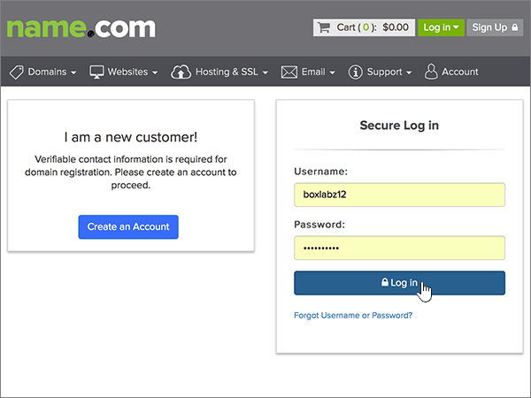

# Skapa DNS-poster på name.com för Microsoft

 **[Läs frågor och svar om domäner](../setup/domains-faq.md)** om du inte hittar det du letar efter. 
  
Om name.com är din DNS-värd följer du stegen i den här artikeln för att verifiera din domän och konfigurera DNS-poster för e-post, Skype för företag - Online och så vidare.
  
När du har lagt till dessa poster i name.com konfigureras domänen så att den fungerar med Microsoft-tjänster.

  
> [!NOTE]
> Det brukar ta ungefär 15 minuter för DNS-ändringarna att gå igenom. Ibland kan det dock ta längre tid att uppdatera DNS-systemet på Internet för en ändring som du har gjort. Om du stöter på problem med e-postflödet eller får andra problem när du har lagt till DNS-posterna, går du till [Felsöka problem när du har ändrat domännamn eller DNS-poster](../get-help-with-domains/find-and-fix-issues.md). 
  
## Lägga till en TXT-post för verifiering

Innan du använder din domän med Microsoft, vill vi vara säkra på att det är du som äger den. Att du kan logga in på ditt konto hos domänregistratorn och skapa DNS-posten bevisar för Microsoft att du äger domänen.
  
> [!NOTE]
> Den här posten används endast för att verifiera att du äger domänen. Den påverkar ingenting annat. Du kan ta bort den senare om du vill. 
  
1. Kom igång genom att gå till domänsidan på name.com med [den här länken](https://www.name.com/account/domain). Du uppmanas att logga in först.
    
    
  
2. Under **Mina domäner**väljer du namnet på den domän som du vill ändra.
    
    
  
3. Välj **DNS Records**i kolumnen **Detaljer** . 
    
    
  
4. I rutorna för den nya posten skriver du in, eller kopierar och klistrar in, värdena från följande tabell.
    
    (Välj värdet för **Type** i listrutan.) 
    
    |||||
    |:-----|:-----|:-----|:-----|
    |**Typ**   |**Host (värd)**   |**Answer (svar)**   |**TTL**   |
    |TXT    |(Lämna det här fältet tomt.)    |MS=ms *XXXXXXXX*    **Obs!** Det här är ett exempel. Använd ditt specifika **Mål eller pekar på adress ** värde här, från tabellen.           [Hur hittar jag det här?](../get-help-with-domains/information-for-dns-records.md)          |Använd standardvärdet (300).    |
   
    
  
5. Välj **Lägg till post**.
    
    
  
6. Vänta några minuter innan du fortsätter, så att den post som du nyss skapade kan uppdateras på Internet.
    
Nu när du har lagt till posten på domänregistratorns webbplats kan du gå tillbaka till Microsoft och begär posten.
  
När Microsoft hittar rätt TXT-post är din domän verifierad.
  
1. I administrationscentret går du till **Inställningar** \> <a href="https://go.microsoft.com/fwlink/p/?linkid=834818" target="_blank">Domains</a>.
    
2. På sidan **Domains** väljer du den domän du verifierar. 
    
    
  
3. På sidan **Setup** väljer du **Start setup**.
    
    
  
4. På sidan **Verify domain** väljer du **Verify**.
    
    
  
> [!NOTE]
> Det brukar ta ungefär 15 minuter för DNS-ändringarna att gå igenom. Ibland kan det dock ta längre tid att uppdatera DNS-systemet på Internet för en ändring som du har gjort. Om du stöter på problem med e-postflödet eller får andra problem när du har lagt till DNS-posterna, går du till [Felsöka problem när du har ändrat domännamn eller DNS-poster](../get-help-with-domains/find-and-fix-issues.md). 
  
## Lägga till en MX-post så att e-post för din domän kommer till Microsoft.

1. Kom igång genom att gå till domänsidan på name.com med [den här länken](https://www.name.com/account/domain). Du uppmanas att logga in först.
    
    
  
2. Under **Mina domäner**väljer du namnet på den domän som du vill ändra.
    
    
  
3. Välj **DNS Records**i kolumnen **Detaljer** . 
    
    
  
4. I rutorna för den nya posten skriver du in, eller kopierar och klistrar in, värdena från följande tabell.
    
    (Välj värdet för **Type** i listrutan.) 
    
    |**Typ**|**Host (värd)**|**Answer (svar)**|**TTL**|**Prio**|
    |:-----|:-----|:-----|:-----|:-----|
    |MX    |(Lämna det här fältet tomt.)    | *\<domännyckel\>*  .mail.protection.outlook.com    **Anm.:** Hämta * \<domännyckeln\> * från ditt Microsoft-konto.           [Hur hittar jag det?](../get-help-with-domains/information-for-dns-records.md)          |Använd standardvärdet (300).    |0    Mer information om prioritet finns i [Vad är MX-prioritet?](https://docs.microsoft.com/microsoft-365/admin/setup/domains-faq)   |
   
   
  
5. Välj **Lägg till post**.
    
    
  
6. Om det förekommer andra MX-poster tar du bort dem med följande tvåstegsprocedur:
    
    För varandra MX-post väljer du **Ta bort** i kolumnen **Åtgärder.** 
    
    
  
    Om du vill bekräfta varje borttagning väljer du **Ta bort** i kolumnen **Åtgärder** igen. 
    
    
  
    Upprepa den här tvåstegsproceduren tills du har tagit bort alla de andra MX-posterna.
    
## Lägga till CNAME-posterna som krävs för Microsoft

1. Kom igång genom att gå till domänsidan på name.com med [den här länken](https://www.name.com/account/domain). Du uppmanas att logga in först.
    
    
  
2. Under **Mina domäner**väljer du namnet på den domän som du vill ändra.
    
    
  
3. Välj **DNS Records**i kolumnen **Detaljer** . 
    
    
  
4. Lägg till den första CNAME-posten.
    
    I rutorna för den nya posten anger du eller kopierar och klistrar in värdena från den första raden i följande tabell.
    
    (Välj värdet för **Type** i listrutan.) 
    
    |**Typ**|**Host (värd)**|**Answer (svar)**|**TTL**|
    |:-----|:-----|:-----|:-----|
    |CNAME    |autodiscover    |autodiscover.outlook.com    |Använd standardvärdet (300).    |
    |CNAME    |sip    |sipdir.online.lync.com    |Använd standardvärdet (300).    |
    |CNAME    |lyncdiscover    |webdir.online.lync.com    |Använd standardvärdet (300).    |
    |CNAME    |enterpriseregistration    |enterpriseregistration.windows.net    |Använd standardvärdet (300).    |
    |CNAME    |enterpriseenrollment    |enterpriseenrollment-s.manage.microsoft.com    |Använd standardvärdet (300).    |
   
   
  
5. Välj **Lägg till post om** du vill lägga till den första posten. 
    
    
  
6. Lägg till den andra CNAME-posten.
    
    Använd värdena från den andra raden i tabellen ovan och välj sedan **Lägg till post** för att lägga till den andra posten. 
    
    Lägg till de återstående posterna på samma sätt med värdena från den tredje, fjärde, femte och sjätte raden i tabellen.
    
## Lägga till en TXT-post för SPF för att förhindra skräppost

> [!IMPORTANT]
> Du kan inte ha fler än en TXT-post för SPF för en domän. Om din domän har fler än en SPF-post får du e-postfel och problem med leveranser och skräppostklassificering. Om du redan har en SPF-post för domänen ska du inte skapa en ny för Microsoft. Lägg i stället till de nödvändiga Microsoft-värdena i den aktuella posten så att du har en *enda* SPF-post som innehåller båda uppsättningarna värden. 
  
1. Kom igång genom att gå till domänsidan på name.com med [den här länken](https://www.name.com/account/domain). Du uppmanas att logga in först.
    
    
  
2. Under **Mina domäner**väljer du namnet på den domän som du vill ändra.

    
  
3. Välj **DNS Records**i kolumnen **Detaljer** . 
    
    
  
4. I rutorna för den nya posten skriver du in, eller kopierar och klistrar in, värdena från följande tabell.
    
    (Välj värdet för **Type** i listrutan.) 
    
    |**Typ**|**Host (värd)**|**Answer (svar)**|**TTL**|
    |:-----|:-----|:-----|:-----|
    |TXT    |(Lämna det här fältet tomt.)    |v=spf1 include:spf.protection.outlook.com -all    **Obs!** Vi rekommenderar att du kopierar och klistrar in den här posten så att alla avstånd förblir korrekta.               |Använd standardvärdet (300).    |
   
   
  
5. Välj **Lägg till post**.
    
    
  
## Lägga till de två SRV-posterna som krävs för Microsoft

1. Kom igång genom att gå till domänsidan på name.com med [den här länken](https://www.name.com/account/domain). Du uppmanas att logga in först.
    
    
  
2. Under **Mina domäner**väljer du namnet på den domän som du vill ändra.
    
    
  
3. Välj **DNS Records+ i**kolumnen **Detaljer.** 
    
    
  
4. Lägg till den första SRV-posten:
    
    I rutorna för den nya posten anger du eller kopierar och klistrar in värdena från den första raden i följande tabell.
    
    (Välj värdet för **Type** i listrutan.) 
    
    |**Type (typ)**|**Service (tjänst)**|**Weight (vikt)**|**TTL**|**Prio**|**Protocol (protokoll)**|**Port**|**Target (mål)**|
    |:-----|:-----|:-----|:-----|:-----|:-----|:-----|:-----|
    |SRV|sip|1|Använd standardvärdet (300).|100|tls|443|sipdir.online.lync.com   **Obs!** Vi rekommenderar att du kopierar och klistrar in den här posten så att alla avstånd förblir korrekta.               |
    |SRV|sipfederationtls|1|Använd standardvärdet (300).|100|tcp|5061|sipfed.online.lync.com  **Obs!** Vi rekommenderar att du kopierar och klistrar in den här posten så att alla avstånd förblir korrekta.               |
   
   
  
5. Välj **Lägg till post**.

    
  
6. Lägg till den andra SRV-posten.

Använd värdena från nästa rad i tabellen ovan och välj sedan **Lägg till post** för att lägga till den andra posten.

>[!NOTE]
>Det brukar ta ungefär 15 minuter för DNS-ändringarna att gå igenom. Ibland kan det dock ta längre tid att uppdatera DNS-systemet på Internet för en ändring som du har gjort. Om du stöter på problem med e-postflödet eller får andra problem när du har lagt till DNS-posterna, går du till [Felsöka problem när du har ändrat domännamn eller DNS-poster](../get-help-with-domains/find-and-fix-issues.md).
