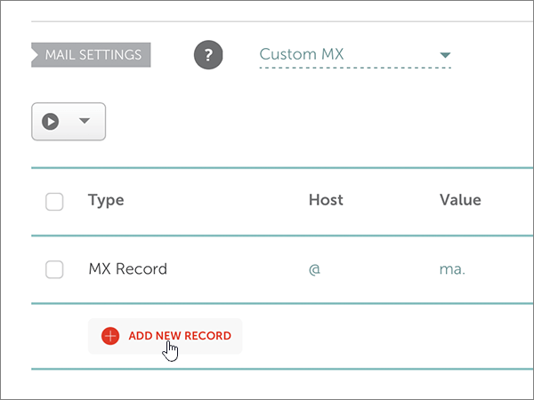

# Skapa DNS-poster på Namecheap för MicrosoftCreate DNS records at Namecheap for Microsoft

 **[Läs frågor och svar om domäner](../setup/domains-faq.md)** om du inte hittar det du letar efter.**[Check the Domains FAQ](../setup/domains-faq.md)** if you don't find what you're looking for. 
  
Om du har Namecheap som DNS-värd följer du stegen i den här artikeln för att verifiera din domän och konfigurera DNS-poster för e-post, Skype för företag Online och så vidare.If Namecheap is your DNS hosting provider, follow the steps in this article to verify your domain and set up DNS records for email, Skype for Business Online, and so on.
  
När du har lagt till dessa poster på Namecheap konfigureras domänen så att den fungerar med Microsoft-tjänster.After you add these records at Namecheap, your domain will be set up to work with Microsoft services.
  
> [!NOTE]
> Det brukar ta ungefär 15 minuter för DNS-ändringarna att gå igenom. Ibland kan det dock ta längre tid att uppdatera DNS-systemet på Internet för en ändring som du har gjort. Om du stöter på problem med e-postflödet eller får andra problem när du har lagt till DNS-posterna, går du till [Felsöka problem när du har ändrat domännamn eller DNS-poster](../get-help-with-domains/find-and-fix-issues.md).Typically it takes about 15 minutes for DNS changes to take effect. However, it can occasionally take longer for a change you've made to update across the Internet's DNS system. If you're having trouble with mail flow or other issues after adding DNS records, see [Troubleshoot issues after changing your domain name or DNS records](../get-help-with-domains/find-and-fix-issues.md). 
  
## Lägga till en TXT-post för verifieringAdd a TXT record for verification

Innan du använder domänen med Microsoft måste vi se till att du äger den.Before you use your domain with Microsoft, we have to make sure that you own it. Din förmåga att logga in på ditt konto hos domänregistratorer och skapa DNS-posten bevisar för Microsoft att du äger domänen.Your ability to log in to your account at your domain registrar and create the DNS record proves to Microsoft that you own the domain.
  
> [!NOTE]
> Den här posten används endast för att verifiera att du äger domänen. Den påverkar ingenting annat. Du kan ta bort den senare om du vill.This record is used only to verify that you own your domain; it doesn't affect anything else. You can delete it later, if you like. 
  
Följ stegen nedan.Follow the steps below.
  
1. Börja med att gå till domänsidan på Namecheap genom att klicka på [den här länken](https://www.namecheap.com/myaccount/login.aspx?ReturnUrl=%2f). Du uppmanas att logga in och fortsätta.To get started, go to your domains page at Namecheap by using [this link](https://www.namecheap.com/myaccount/login.aspx?ReturnUrl=%2f). You'll be prompted to Sign in and Continue.
    
    
  
2. Välj **Domänlista** i listrutan under **Konto**på sidan **Mål.**On the **Landing** page, under **Account**, choose **Domain List** from the drop-down list. 
    
    
  
3. Leta reda på namnet på den domän som du vill redigera på sidan **Domänlista** och välj sedan **Hantera**.On the **Domain List** page, find the name of the domain that you want to edit, and then select **Manage**.
    
    
  
4. Välj **Avancerad DNS**.Select **Advanced DNS**.
    
    
  
5. Välj **LÄGG TILL NY POST i**avsnittet **VÄRDPOSTER** .In the **HOST RECORDS** section, select **ADD NEW RECORD**.
    
    
  
6. Välj **TXT Record** i listrutan **Type**.In the **Type** drop-down, select **TXT Record**.
    
    > [!NOTE]
    > Listrutan **Typ** visas automatiskt när du väljer **LÄGG TILL NY POST**.The **Type** drop-down automatically appears when you select **ADD NEW RECORD**. 
  
    
  
7. I rutorna för den nya posten skriver du in, eller kopierar och klistrar in, värdena från följande tabell.In the boxes for the new record, type or copy and paste the values from the following table.
    
    (Välj **TTL-värdet** i listrutan.)(Choose the **TTL** value from the drop-down list.) 
    
    |**Typ****Type**|**Host****Host**|**Value****Value**|**TTL****TTL**|
    |:-----|:-----|:-----|:-----|
    |TXTTXT    |@    |MS=ms *XXXXXXXX*MS=ms *XXXXXXXX*   **Obs!** Det här är ett exempel.**Note:** This is an example. Använd ditt specifika **mål- eller poäng till-adress-värde** här, från bordet.Use your specific **Destination or Points to Address** value here, from the table.  [Hur hittar jag detta?How do I find this?](../get-help-with-domains/information-for-dns-records.md)          |30 min30 min    |
       
    
  
8. Markera kontrollen **Spara ändringar** (markera).Select the **Save Changes** (check mark) control. 
    
    
  
9. Vänta några minuter innan du fortsätter, så att den post som du nyss skapade kan uppdateras på Internet.Wait a few minutes before you continue, so that the record you just created can update across the Internet.
    
Nu när du har lagt till posten på domänregistratorerns webbplats går du tillbaka till Microsoft och begär posten.Now that you've added the record at your domain registrar's site, you'll go back to Microsoft and request the record.
  
När Microsoft hittar rätt TXT-post verifieras domänen.When Microsoft finds the correct TXT record, your domain is verified.
  
1. I administrationscentret går du till **Inställningar** \> <a href="https://go.microsoft.com/fwlink/p/?linkid=834818" target="_blank">Domains</a>.In the admin center, go to the **Settings** \> <a href="https://go.microsoft.com/fwlink/p/?linkid=834818" target="_blank">Domains</a> page.
    
2. På sidan **Domains** väljer du den domän du verifierar.On the **Domains** page, select the domain that you are verifying. 
    
    
  
3. På sidan **Setup** väljer du **Start setup**.On the **Setup** page, select **Start setup**.
    
    
  
4. På sidan **Verify domain** väljer du **Verify**.On the **Verify domain** page, select **Verify**.
    
    
  
> [!NOTE]
> Det brukar ta ungefär 15 minuter för DNS-ändringarna att gå igenom. Ibland kan det dock ta längre tid att uppdatera DNS-systemet på Internet för en ändring som du har gjort. Om du stöter på problem med e-postflödet eller får andra problem när du har lagt till DNS-posterna, går du till [Felsöka problem när du har ändrat domännamn eller DNS-poster](../get-help-with-domains/find-and-fix-issues.md).Typically it takes about 15 minutes for DNS changes to take effect. However, it can occasionally take longer for a change you've made to update across the Internet's DNS system. If you're having trouble with mail flow or other issues after adding DNS records, see [Troubleshoot issues after changing your domain name or DNS records](../get-help-with-domains/find-and-fix-issues.md). 

  
## Lägg till en MX-post så att e-post för din domän kommer till MicrosoftAdd an MX record so email for your domain will come to Microsoft

Följ stegen nedan.Follow the steps below.
  
1. Börja med att gå till domänsidan på Namecheap genom att klicka på [den här länken](https://www.namecheap.com/myaccount/login.aspx?ReturnUrl=%2f). Du uppmanas att logga in och fortsätta.To get started, go to your domains page at Namecheap by using [this link](https://www.namecheap.com/myaccount/login.aspx?ReturnUrl=%2f). You'll be prompted to Sign in and Continue.
    
    
  
2. Välj **Domänlista** i listrutan under **Konto**på sidan **Mål.**On the **Landing** page, under **Account**, choose **Domain List** from the drop-down list. 
    
    
  
3. Leta reda på namnet på den domän som du vill redigera på sidan **Domänlista** och välj sedan **Hantera**.On the **Domain List** page, find the name of the domain that you want to edit, and then select **Manage**.
    
    
  
4. Välj **Avancerad DNS**.Select **Advanced DNS**.
    
    
  
5. I avsnittet **MAIL SETTINGS** väljer du **Custom MX** från listrutan **Email Forwarding**.In the **MAIL SETTINGS** section, select **Custom MX** from the **Email Forwarding** drop-down list. 
    
    (Du kan behöva rulla nedåt.)(You may have to scroll down.)
    
    
  
6. Välj **Lägg till ny post**.Select **Add New Record**.
    
    
  
7. I rutorna för den nya posten skriver du in eller kopierar värdena från följande tabell.In the boxes for the new record, type or copy and paste the values, from the following table.
    
    (Rutan **Priority** är rutan utan namn till höger om rutan **Värde**.(The **Priority** box is the unnamed box to the right of the **Value** box. Välj **TTL-värdet** i listrutan.)Choose the **TTL** value from the drop-down list.) 
    
    |**Typ****Type**|**Host****Host**|**Värde****Value**|**Prioritet****Priority**|**TTL****TTL**|
    |:-----|:-----|:-----|:-----|:-----|
    |MX Record (MX-post)MX Record    |@    |\<*domännyckeln*\>.mail.protection.outlook.com.\<*domain-key*\>.mail.protection.outlook.com.    **Värdet MÅSTE sluta med en punkt (.)****This value MUST end with a period (.)**   **Anm.:** Hämta \* \<domännyckeln\> \* från ditt Microsoft-konto.**Note:** Get your  *\<domain-key\>*  from your Microsoft account.  [Hur hittar jag det?How do I find this?](../get-help-with-domains/information-for-dns-records.md)          |00    Mer information om prioritet finns i [Vad är MX-prioritet?](https://support.office.com/article/2784cc4d-95be-443d-b5f7-bb5dd867ba83.aspx)For more information about priority, see [What is MX priority?](https://support.office.com/article/2784cc4d-95be-443d-b5f7-bb5dd867ba83.aspx)   |30 min30 min    |
       
    
  
8. Markera kontrollen **Spara ändringar** (markera).Select the **Save Changes** (check mark) control. 
    
    
  
9. Om det förekommer andra MX-poster tar du bort dem med följande tvåstegsprocedur:If there are any other MX records, use the following two-step process to remove each of them:
    
    Välj först **ikonen Ta bort** (papperskorgen) för den post som du vill ta bort.First, select the **Delete icon** (trash can) for the record that you want to remove. 
    
    
  
    För det andra väljer du **Ja** för att bekräfta borttagningen.Second, select **Yes** to confirm the deletion. 
    
    
  
    Ta bort alla MX-poster förutom den du lade till tidigare i proceduren.Remove all MX records except for the one that you added earlier in this procedure.

  
## Lägga till de sex CNAME-poster som krävs för MicrosoftAdd the six CNAME records that are required for Microsoft

Följ stegen nedan.Follow the steps below.
  
1. Börja med att gå till domänsidan på Namecheap genom att klicka på [den här länken](https://www.namecheap.com/myaccount/login.aspx?ReturnUrl=%2f). Du uppmanas att logga in och fortsätta.To get started, go to your domains page at Namecheap by using [this link](https://www.namecheap.com/myaccount/login.aspx?ReturnUrl=%2f). You'll be prompted to Sign in and Continue.
    
    
  
2. Välj **Domänlista** i listrutan under **Konto**på sidan **Mål.**On the **Landing** page, under **Account**, choose **Domain List** from the drop-down list. 
    
    
  
3. Leta reda på namnet på den domän som du vill redigera på sidan **Domänlista** och välj sedan **Hantera**.On the **Domain List** page, find the name of the domain that you want to edit, and then select **Manage**.
    
    
  
4. Välj **Avancerad DNS**.Select **Advanced DNS**.
    
    
  
5. Välj **LÄGG TILL NY POST i**avsnittet **VÄRDPOSTER** .In the **HOST RECORDS** section, select **ADD NEW RECORD**.
    
    
  
6. Välj **CNAME Record** i listrutan **Type**.In the **Type** drop-down, select **CNAME Record**.
    
    > [!NOTE]
    > Listrutan **Typ** visas automatiskt när du väljer **LÄGG TILL NY POST**.The **Type** drop-down automatically appears when you select **ADD NEW RECORD**. 
  
    
  
7. I de tomma rutorna för den nya posten väljer du **CNAME** för **Record Type** och skriver sedan in, eller kopierar och klistrar in, värdena från den första raden i följande tabell.In the empty boxes for the new record, select **CNAME** for the **Record Type**, and then type or copy and paste the values from the first row in the following table.
    
    |**Type****Type**|**Host****Host**|**Värde****Value**|**TTL****TTL**|
    |:-----|:-----|:-----|:-----|
    |CNAMECNAME    |autodiscoverautodiscover    |autodiscover.outlook.com.autodiscover.outlook.com.    **Värdet MÅSTE sluta med en punkt (.)****This value MUST end with a period (.)**   |36003600    |
    |CNAMECNAME    |sipsip    |sipdir.online.lync.com.sipdir.online.lync.com.    **Värdet MÅSTE sluta med en punkt (.)****This value MUST end with a period (.)**   |36003600    |
    |CNAMECNAME    |lyncdiscoverlyncdiscover    |webdir.online.lync.com.webdir.online.lync.com.    **Värdet MÅSTE sluta med en punkt (.)****This value MUST end with a period (.)**   |36003600    |
    |CNAMECNAME    |enterpriseregistrationenterpriseregistration    |enterpriseregistration.windows.net.enterpriseregistration.windows.net.    **Värdet MÅSTE sluta med en punkt (.)****This value MUST end with a period (.)**   |36003600    |
    |CNAMECNAME    |enterpriseenrollmententerpriseenrollment    |enterpriseenrollment-s.manage.microsoft.com.enterpriseenrollment-s.manage.microsoft.com.    **Värdet MÅSTE sluta med en punkt (.)****This value MUST end with a period (.)**   |36003600    |
       
    
  
8. Markera kontrollen **Spara ändringar** (markera).Select the **Save Changes** (check mark) control. 
    
    
  
9. Upprepa de fyra föregående stegen när du lägger till de andra fem CNAME-posterna med värdena från de andra fem raderna i tabellen.Using the preceding four steps and the values from the other five rows in the table, add each of the other five CNAME records.

  
## Lägga till en TXT-post för SPF för att förhindra skräppostAdd a TXT record for SPF to help prevent email spam

> [!IMPORTANT]
> Du kan inte ha fler än en TXT-post för SPF för en domän.You cannot have more than one TXT record for SPF for a domain. Om din domän har fler än en SPF-post får du e-postfel och problem med leveranser och skräppostklassificering.If your domain has more than one SPF record, you'll get email errors, as well as delivery and spam classification issues. Om du redan har en SPF-post för domänen ska du inte skapa en ny för Microsoft.If you already have an SPF record for your domain, don't create a new one for Microsoft. Lägg i stället till de nödvändiga Microsoft-värdena i den aktuella posten så att du har en *enda* SPF-post som innehåller båda uppsättningarna värden.Instead, add the required Microsoft values to the current record so that you have a  *single*  SPF record that includes both sets of values. 

Följ stegen nedan.Follow the steps below.
  
1. Börja med att gå till domänsidan på Namecheap genom att klicka på [den här länken](https://www.namecheap.com/myaccount/login.aspx?ReturnUrl=%2f). Du uppmanas att logga in och fortsätta.To get started, go to your domains page at Namecheap by using [this link](https://www.namecheap.com/myaccount/login.aspx?ReturnUrl=%2f). You'll be prompted to Sign in and Continue.
    
2. Välj **Domänlista** i listrutan under **Konto**på sidan **Mål.**On the **Landing** page, under **Account**, choose **Domain List** from the drop-down list. 
    
    
  
3. Leta reda på namnet på den domän som du vill redigera på sidan **Domänlista** och välj sedan **Hantera**.On the **Domain List** page, find the name of the domain that you want to edit and then select **Manage**.
    
    
  
4. Välj **Avancerad DNS**.Select **Advanced DNS**.
    
    
  
5. Välj **LÄGG TILL NY POST i**avsnittet **VÄRDPOSTER** .In the **HOST RECORDS** section, select **ADD NEW RECORD**.
    
    
  
6. Välj **TXT Record** i listrutan **Type**.In the **Type** drop-down, select **TXT Record**.
    
    > [!NOTE]
    > Listrutan **Typ** visas automatiskt när du väljer **LÄGG TILL NY POST**.The **Type** drop-down automatically appears when you select **ADD NEW RECORD**. 
  
    
  
7. I rutorna för den nya posten skriver du in, eller kopierar och klistrar in, värdena från följande tabell.In the boxes for the new record, type or copy and paste the following values from the following table.
    
    (Välj **TTL-värdet** i listrutan.)(Choose the **TTL** value from the drop-down list.) 
    
    |**Typ****Type**|**Host****Host**|**Värde****Value**|**TTL****TTL**|
    |:-----|:-----|:-----|:-----|
    |TXTTXT    |@    |v=spf1 include:spf.protection.outlook.com -allv=spf1 include:spf.protection.outlook.com -all    **Obs!** Vi rekommenderar att du kopierar och klistrar in den här posten så att alla avstånd förblir korrekta.    **Note:** We recommend copying and pasting this entry, so that all of the spacing stays correct.           |30 min30 min    |
       
    
  
8. Markera kontrollen **Spara ändringar** (markera).Select the **Save Changes** (check mark) control. 
    
    
  
## Lägg till de två SRV-poster som krävs för MicrosoftAdd the two SRV records that are required for Microsoft

1. Börja med att gå till domänsidan på Namecheap genom att klicka på [den här länken](https://www.namecheap.com/myaccount/login.aspx?ReturnUrl=%2f). Du uppmanas att logga in.To get started, go to your domains page at Namecheap by using [this link](https://www.namecheap.com/myaccount/login.aspx?ReturnUrl=%2f). You'll be prompted to sign in.
    
    
  
2. Välj **Domänlista** i listrutan under **Konto**på sidan **Mål.**On the **Landing** page, under **Account**, choose **Domain List** from the drop-down list. 
    
    
  
3. Leta reda på namnet på den domän som du vill redigera på sidan **Domänlista** och välj sedan **Hantera**.On the **Domain List** page, find the name of the domain that you want to edit and then select **Manage**.
    
    
  
4. Välj **Avancerad DNS**.Select **Advanced DNS**.
    
    
  
5. Välj **LÄGG TILL NY POST i**avsnittet **VÄRDPOSTER** .In the **HOST RECORDS** section, select **ADD NEW RECORD**.
    
    
  
6. Välj **SRV Record** i listrutan **Type**.In the **Type** drop-down, select **SRV Record**.
    
    > [!NOTE]
    > Listrutan **Typ** visas automatiskt när du väljer **LÄGG TILL NY POST**.The **Type** drop-down automatically appears when you select **ADD NEW RECORD**. 
  
    
  
7. I de tomma rutorna för den nya posten skriver du in, eller kopierar och klistrar in, värdena från den första raden i tabellen nedan.In the empty boxes for the new records, type or copy and paste the values from the first row in the following table.
    
    |**Service****Service**|**Protocol****Protocol**|**Prioritet****Priority**|**Vikt****Weight**|**Port****Port**|**Target (mål)****Target**|**TTL****TTL**|
    |:-----|:-----|:-----|:-----|:-----|:-----|:-----|
    |_sip_sip    |_tls_tls    |100100    |11    |443443    |sipdir.online.lync.com.sipdir.online.lync.com.    **Värdet MÅSTE sluta med en punkt (.)****This value MUST end with a period (.)**   |30 min30 min    |
    |_sipfederationtls_sipfederationtls    |_tcp_tcp    |100100    |11    |50615061    |sipfed.online.lync.com.sipfed.online.lync.com.    **Värdet MÅSTE sluta med en punkt (.)****This value MUST end with a period (.)**   |30 min30 min    |
       
    
  
8. Markera kontrollen **Spara ändringar** (markera).Select the **Save Changes** (check mark) control. 
    
    
  
9. Upprepa de fyra föregående stegen när du lägger till den andra SRV-posten med värdena från tabellens andra rad.Using the preceding four steps and the values from the second row in the table, add the other SRV record.
    
> [!NOTE]
> Det brukar ta ungefär 15 minuter för DNS-ändringarna att gå igenom. Ibland kan det dock ta längre tid att uppdatera DNS-systemet på Internet för en ändring som du har gjort. Om du stöter på problem med e-postflödet eller får andra problem när du har lagt till DNS-posterna, går du till [Felsöka problem när du har ändrat domännamn eller DNS-poster](../get-help-with-domains/find-and-fix-issues.md).Typically it takes about 15 minutes for DNS changes to take effect. However, it can occasionally take longer for a change you've made to update across the Internet's DNS system. If you're having trouble with mail flow or other issues after adding DNS records, see [Troubleshoot issues after changing your domain name or DNS records](../get-help-with-domains/find-and-fix-issues.md). 
  

  
