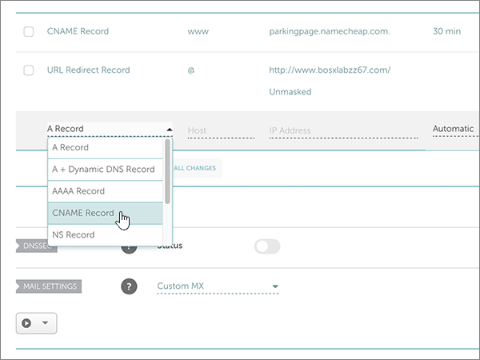

# Skapa DNS-poster på NameCheap för Microsoft

 **[Läs frågor och svar om domäner](../setup/domains-faq.md)** om du inte hittar det du letar efter. 
  
Om du har Namecheap som DNS-värd följer du stegen i den här artikeln för att verifiera din domän och konfigurera DNS-poster för e-post, Skype för företag Online och så vidare.
  
När du har lagt till dessa poster på NameCheap är din domän konfigurerad för att fungera med Microsoft-tjänster.
  
> [!NOTE]
> Det brukar ta ungefär 15 minuter för DNS-ändringarna att gå igenom. Ibland kan det dock ta längre tid att uppdatera DNS-systemet på Internet för en ändring som du har gjort. Om du stöter på problem med e-postflödet eller får andra problem när du har lagt till DNS-posterna, går du till [Felsöka problem när du har ändrat domännamn eller DNS-poster](../get-help-with-domains/find-and-fix-issues.md). 
  
## Lägga till en TXT-post för verifiering

Innan du använder din domän med Microsoft, vill vi vara säkra på att det är du som äger den. Att du kan logga in på ditt konto hos domänregistratorn och skapa DNS-posten bevisar för Microsoft att du äger domänen.
  
> [!NOTE]
> Den här posten används endast för att verifiera att du äger domänen. Den påverkar ingenting annat. Du kan ta bort den senare om du vill. 
  
Följ stegen nedan.
  
1. Börja med att gå till domänsidan på Namecheap genom att klicka på [den här länken](https://www.namecheap.com/myaccount/login.aspx?ReturnUrl=%2f). Du uppmanas att logga in och fortsätta.
    
    
  
2. Välj **domän lista** i list rutan under **konto** **på Start sidan.** 
    
    
  
3. Leta reda på namnet på den domän som du vill redigera på sidan **Domain List** och välj sedan **Manage**.
    
    
  
4. Välj **Advanced DNS**.
    
    
  
5. Välj **Add New Record**i avsnittet **Host Records** .
    
    
  
6. Välj **TXT Record** i listrutan **Type**.
    
    > [!NOTE]
    > List rutan **typ** visas automatiskt när du väljer **Lägg till ny post**. 
  
    
  
7. I rutorna för den nya posten skriver du in, eller kopierar och klistrar in, värdena från följande tabell.
    
    (Välj **TTL** -värdet i list rutan.) 
    
    |**Typ**|**Host**|**Värde**|**TTL**|
    |:-----|:-----|:-----|:-----|
    |TXT    |@    |MS=ms *XXXXXXXX*   **Obs!** Det här är ett exempel. Använd ditt specifika **Mål eller pekar på adress ** värde här, från tabellen.  [Hur hittar jag det här?](../get-help-with-domains/information-for-dns-records.md)          |30 min    |
       
    
  
8. Markera kontrollen **Spara ändringar** (bock markering). 
    
    
  
9. Vänta några minuter innan du fortsätter, så att den post som du nyss skapade kan uppdateras på Internet.
    
Nu när du har lagt till posten på domänregistratorns webbplats kan du gå tillbaka till Microsoft och begär posten.
  
När Microsoft hittar rätt TXT-post är din domän verifierad.
  
1. I administrationscentret går du till **Inställningar** \> <a href="https://go.microsoft.com/fwlink/p/?linkid=834818" target="_blank">Domains</a>.
    
2. På sidan **Domains** väljer du den domän du verifierar. 
    
    
  
3. På sidan **Setup** väljer du **Start setup**.
    
    
  
4. På sidan **Verify domain** väljer du **Verify**.
    
    
  
> [!NOTE]
> Det brukar ta ungefär 15 minuter för DNS-ändringarna att gå igenom. Ibland kan det dock ta längre tid att uppdatera DNS-systemet på Internet för en ändring som du har gjort. Om du stöter på problem med e-postflödet eller får andra problem när du har lagt till DNS-posterna, går du till [Felsöka problem när du har ändrat domännamn eller DNS-poster](../get-help-with-domains/find-and-fix-issues.md). 

  
## Lägga till en MX-post så att e-post för din domän kommer till Microsoft.

Följ stegen nedan.
  
1. Börja med att gå till domänsidan på Namecheap genom att klicka på [den här länken](https://www.namecheap.com/myaccount/login.aspx?ReturnUrl=%2f). Du uppmanas att logga in och fortsätta.
    
    
  
2. Välj **domän lista** i list rutan under **konto** **på Start sidan.** 
    
    
  
3. Leta reda på namnet på den domän som du vill redigera på sidan **Domain List** och välj sedan **Manage**.
    
    
  
4. Välj **Advanced DNS**.
    
    
  
5. I avsnittet **MAIL SETTINGS** väljer du **Custom MX** från listrutan **Email Forwarding**. 
    
    (Du kan behöva rulla nedåt.)
    
    
  
6. Välj **Lägg till ny post**.
    
    
  
7. I rutorna för den nya posten skriver du in eller kopierar värdena från följande tabell.
    
    (Rutan **Priority** är rutan utan namn till höger om rutan **Värde**. Välj **TTL** -värdet i list rutan.) 
    
    |**Typ**|**Host**|**Värde**|**Prioritet**|**TTL**|
    |:-----|:-----|:-----|:-----|:-----|
    |MX Record (MX-post)    |@    |\<*domain-key*\>. mail.protection.outlook.com.    **Värdet MÅSTE sluta med en punkt (.)**   **Obs!** Hämta ditt  *\<domain-key\>*  från ditt Microsoft-konto.  [Hur hittar jag det?](../get-help-with-domains/information-for-dns-records.md)          |siffrorna    Mer information om prioritet finns i [Vad är MX-prioritet?](https://docs.microsoft.com/microsoft-365/admin/setup/domains-faq)   |30 min    |
       
    
  
8. Markera kontrollen **Spara ändringar** (bock markering). 
    
    
  
9. Om det förekommer andra MX-poster tar du bort dem med följande tvåstegsprocedur:
    
    Först väljer du **ikonen Ta bort** (pappers korgen) för den post som du vill ta bort. 
    
    
  
    Välj sedan **Ja** för att bekräfta borttagningen. 
    
    
  
    Ta bort alla MX-poster förutom den du lade till tidigare i proceduren.

  
## Lägga till de sex CNAME-posterna som krävs för Microsoft

Följ stegen nedan.
  
1. Börja med att gå till domänsidan på Namecheap genom att klicka på [den här länken](https://www.namecheap.com/myaccount/login.aspx?ReturnUrl=%2f). Du uppmanas att logga in och fortsätta.
    
    
  
2. Välj **domän lista** i list rutan under **konto** **på Start sidan.** 
    
    
  
3. Leta reda på namnet på den domän som du vill redigera på sidan **Domain List** och välj sedan **Manage**.
    
    
  
4. Välj **Advanced DNS**.
    
    
  
5. Välj **Add New Record**i avsnittet **Host Records** .
    
    
  
6. Välj **CNAME Record** i listrutan **Type**.
    
    > [!NOTE]
    > List rutan **typ** visas automatiskt när du väljer **Lägg till ny post**. 
  
    
  
7. I de tomma rutorna för den nya posten väljer du **CNAME** för **Record Type** och skriver sedan in, eller kopierar och klistrar in, värdena från den första raden i följande tabell.
    
    |**Type**|**Host**|**Värde**|**TTL**|
    |:-----|:-----|:-----|:-----|
    |CNAME    |autodiscover    |autodiscover.outlook.com.    **Värdet MÅSTE sluta med en punkt (.)**   |3600    |
    |CNAME    |sip    |sipdir.online.lync.com.    **Värdet MÅSTE sluta med en punkt (.)**   |3600    |
    |CNAME    |lyncdiscover    |webdir.online.lync.com.    **Värdet MÅSTE sluta med en punkt (.)**   |3600    |
    |CNAME    |enterpriseregistration    |enterpriseregistration.windows.net.    **Värdet MÅSTE sluta med en punkt (.)**   |3600    |
    |CNAME    |enterpriseenrollment    |enterpriseenrollment-s.manage.microsoft.com.    **Värdet MÅSTE sluta med en punkt (.)**   |3600    |
       
    
  
8. Markera kontrollen **Spara ändringar** (bock markering). 
    
    
  
9. Upprepa de fyra föregående stegen när du lägger till de andra fem CNAME-posterna med värdena från de andra fem raderna i tabellen.

  
## Lägga till en TXT-post för SPF för att förhindra skräppost

> [!IMPORTANT]
> Du kan inte ha fler än en TXT-post för SPF för en domän. Om din domän har fler än en SPF-post får du e-postfel och problem med leveranser och skräppostklassificering. Om du redan har en SPF-post för domänen ska du inte skapa en ny för Microsoft. I stället kan du lägga till de Microsoft-värden som krävs i den aktuella posten så att du har en  *enda*  SPF-post som innehåller båda uppsättningar med värden. 

Följ stegen nedan.
  
1. Börja med att gå till domänsidan på Namecheap genom att klicka på [den här länken](https://www.namecheap.com/myaccount/login.aspx?ReturnUrl=%2f). Du uppmanas att logga in och fortsätta.
    
2. Välj **domän lista** i list rutan under **konto** **på Start sidan.** 
    
    
  
3. Leta reda på namnet på den domän som du vill redigera på sidan **Domain List** och välj sedan **Manage**.
    
    
  
4. Välj **Advanced DNS**.
    
    
  
5. Välj **Add New Record**i avsnittet **Host Records** .
    
    
  
6. Välj **TXT Record** i listrutan **Type**.
    
    > [!NOTE]
    > List rutan **typ** visas automatiskt när du väljer **Lägg till ny post**. 
  
    
  
7. I rutorna för den nya posten skriver du in, eller kopierar och klistrar in, värdena från följande tabell.
    
    (Välj **TTL** -värdet i list rutan.) 
    
    |**Typ**|**Host**|**Värde**|**TTL**|
    |:-----|:-----|:-----|:-----|
    |TXT    |@    |v=spf1 include:spf.protection.outlook.com -all    **Obs!** Vi rekommenderar att du kopierar och klistrar in den här posten så att alla avstånd förblir korrekta.               |30 min    |
       
    
  
8. Markera kontrollen **Spara ändringar** (bock markering). 
    
    
  
## Lägga till de två SRV-posterna som krävs för Microsoft

1. Börja med att gå till domänsidan på Namecheap genom att klicka på [den här länken](https://www.namecheap.com/myaccount/login.aspx?ReturnUrl=%2f). Du uppmanas att logga in.
    
    
  
2. Välj **domän lista** i list rutan under **konto** **på Start sidan.** 
    
    
  
3. Leta reda på namnet på den domän som du vill redigera på sidan **Domain List** och välj sedan **Manage**.
    
    
  
4. Välj **Advanced DNS**.
    
    
  
5. Välj **Add New Record**i avsnittet **Host Records** .
    
    
  
6. Välj **SRV Record** i listrutan **Type**.
    
    > [!NOTE]
    > List rutan **typ** visas automatiskt när du väljer **Lägg till ny post**. 
  
    
  
7. I de tomma rutorna för den nya posten skriver du in, eller kopierar och klistrar in, värdena från den första raden i tabellen nedan.
    
    |**Service**|**Protocol**|**Prioritet**|**Vikt**|**Port**|**Target (mål)**|**TTL**|
    |:-----|:-----|:-----|:-----|:-----|:-----|:-----|
    |_sip    |_tls    |100    |9.1    |443    |sipdir.online.lync.com.    **Värdet MÅSTE sluta med en punkt (.)**   |30 min    |
    |_sipfederationtls    |_tcp    |100    |9.1    |5061    |sipfed.online.lync.com.    **Värdet MÅSTE sluta med en punkt (.)**   |30 min    |
       
    
  
8. Markera kontrollen **Spara ändringar** (bock markering). 
    
    
  
9. Upprepa de fyra föregående stegen när du lägger till den andra SRV-posten med värdena från tabellens andra rad.
    
> [!NOTE]
> Det brukar ta ungefär 15 minuter för DNS-ändringarna att gå igenom. Ibland kan det dock ta längre tid att uppdatera DNS-systemet på Internet för en ändring som du har gjort. Om du stöter på problem med e-postflödet eller får andra problem när du har lagt till DNS-posterna, går du till [Felsöka problem när du har ändrat domännamn eller DNS-poster](../get-help-with-domains/find-and-fix-issues.md). 
  

  
