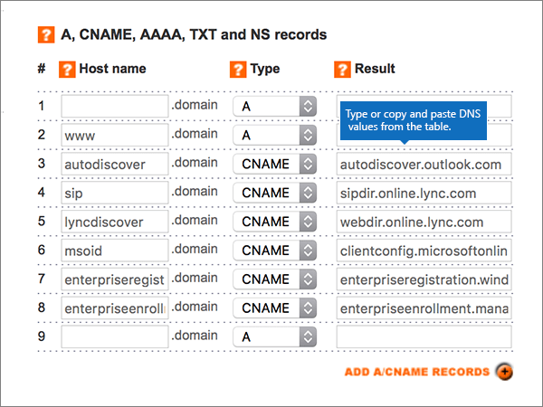

# Skapa DNS-poster på Names.co.uk för MicrosoftCreate DNS records at Names.co.uk for Microsoft

 **[Läs frågor och svar om domäner](../setup/domains-faq.md)** om du inte hittar det du letar efter.**[Check the Domains FAQ](../setup/domains-faq.md)** if you don't find what you're looking for. 
  
Om Names.co.uk är din DNS-värd följer du stegen i den här artikeln för att verifiera din domän och konfigurera DNS-poster för e-post, Skype för företag - Online och så vidare.If Names.co.uk is your DNS hosting provider, follow the steps in this article to verify your domain and set up DNS records for email, Skype for Business Online, and so on.
    
När du har lagt till dessa poster i Names.co.uk konfigureras domänen så att den fungerar med Microsoft-tjänster.After you add these records at Names.co.uk, your domain will be set up to work with Microsoft services.
  

  
> [!NOTE]
>  Det brukar ta ungefär 15 minuter för DNS-ändringarna att gå igenom. Ibland kan det dock ta längre tid att uppdatera DNS-systemet på Internet för en ändring som du har gjort. Om du stöter på problem med e-postflödet eller får andra problem när du har lagt till DNS-posterna, går du till [Felsöka problem när du har ändrat domännamn eller DNS-poster](../get-help-with-domains/find-and-fix-issues.md).Typically it takes about 15 minutes for DNS changes to take effect. However, it can occasionally take longer for a change you've made to update across the Internet's DNS system. If you're having trouble with mail flow or other issues after adding DNS records, see [Troubleshoot issues after changing your domain name or DNS records](../get-help-with-domains/find-and-fix-issues.md). 
  
## Lägga till en TXT-post för verifieringAdd a TXT record for verification

Innan du använder din domän med Microsoft, vill vi vara säkra på att det är du som äger den. Att du kan logga in på ditt konto hos domänregistratorn och skapa DNS-posten bevisar för Microsoft att du äger domänen.Before you use your domain with Microsoft, we have to make sure that you own it. Your ability to log in to your account at your domain registrar and create the DNS record proves to Microsoft that you own the domain.
  
> [!NOTE]
> Den här posten används endast för att verifiera att du äger domänen. Den påverkar ingenting annat. Du kan ta bort den senare om du vill.This record is used only to verify that you own your domain; it doesn't affect anything else. You can delete it later, if you like. 
  
1. Kom igång genom att gå till domänsidan på Names.co.uk genom att klicka på [den här länken](https://account.names.co.uk/dashboard#/). Du uppmanas att logga in först.To get started, go to your domains page at Names.co.uk by using [this link](https://account.names.co.uk/dashboard#/). You'll be prompted to log in first.
    
    
  
2. På **Dashboard**-sidan hittar du namnet på domänen du uppdaterar. Välj sedan **DNS Settings** i listrutan.On the **Dashboard** page, find the name of the domain that you are updating, and then choose **DNS Settings** from the drop-down list. 
    
    (Du kan behöva rulla nedåt.)(You may have to scroll down.)
    
    
  
3. Under **A, CNAME, AAAA, TXT and NS records** på sidan **Add/Modify DNS Zone** skriver du in eller kopierar och klistrar in följande värden i rutorna för den nya posten.On the **Add/Modify DNS Zone** page, in the **A, CNAME, AAAA, TXT and NS records** section, in the boxes for the new record, type or copy and paste the values from the following table. 
    
    (Välj värdet för **Type** i listrutan.)(Choose the **Type** value from the drop-down list.) 
    
    (Om du behöver lägga till en rad väljer du **LÄGG TILL A/CNAME-POSTER (+)**.)(If you need to add a row, select **ADD A/CNAME RECORDS (+)**.)
    
    (Du kan behöva rulla nedåt.)(You may have to scroll down.)
        
    |**Värdnamn****Host name**|**Typ****Type**|**Resultat****Result**|
    |:-----|:-----|:-----|
    |(Lämna det här fältet tomt.)(Leave this field empty.)    |TXTTXT    |MS=ms *XXXXXXXX*MS=ms *XXXXXXXX*    **Obs!** Det här är ett exempel.**Note:** This is an example. Använd ditt specifika \*\*Mål eller pekar på adress \*\* värde här, från tabellen.Use your specific **Destination or Points to Address** value here, from the table.           [Hur hittar jag det här?How do I find this?](../get-help-with-domains/information-for-dns-records.md)    |
       
    
  
4. Välj **Spara**.Select **Save**.
    
    (Du kan behöva rulla nedåt.)(You may have to scroll down.)
    
    
  
5. Vänta några minuter innan du fortsätter, så att den post som du nyss skapade kan uppdateras på Internet.Wait a few minutes before you continue, so that the record you just created can update across the Internet.
    
Nu när du har lagt till posten på domänregistratorns webbplats kan du gå tillbaka till Microsoft och begär posten.Now that you've added the record at your domain registrar's site, you'll go back to Microsoft and request the record.
  
När Microsoft hittar rätt TXT-post är din domän verifierad.When Microsoft finds the correct TXT record, your domain is verified.
  
1. I administrationscentret går du till **Inställningar** \> <a href="https://go.microsoft.com/fwlink/p/?linkid=834818" target="_blank">Domains</a>.In the admin center, go to the **Settings** \> <a href="https://go.microsoft.com/fwlink/p/?linkid=834818" target="_blank">Domains</a> page.
    
2. På sidan **Domains** väljer du den domän du verifierar.On the **Domains** page, select the domain that you are verifying. 
    
    
  
3. På sidan **Setup** väljer du **Start setup**.On the **Setup** page, select **Start setup**.
    
    
  
4. På sidan **Verify domain** väljer du **Verify**.On the **Verify domain** page, select **Verify**.
    
    
  
> [!NOTE]
>  Det brukar ta ungefär 15 minuter för DNS-ändringarna att gå igenom. Ibland kan det dock ta längre tid att uppdatera DNS-systemet på Internet för en ändring som du har gjort. Om du stöter på problem med e-postflödet eller får andra problem när du har lagt till DNS-posterna, går du till [Felsöka problem när du har ändrat domännamn eller DNS-poster](../get-help-with-domains/find-and-fix-issues.md).Typically it takes about 15 minutes for DNS changes to take effect. However, it can occasionally take longer for a change you've made to update across the Internet's DNS system. If you're having trouble with mail flow or other issues after adding DNS records, see [Troubleshoot issues after changing your domain name or DNS records](../get-help-with-domains/find-and-fix-issues.md). 
  
## Lägga till en MX-post så att e-post för din domän kommer till Microsoft.Add an MX record so email for your domain will come to Microsoft

1. Kom igång genom att gå till domänsidan på Names.co.uk genom att klicka på [den här länken](https://account.names.co.uk/dashboard#/). Du uppmanas att logga in först.To get started, go to your domains page at Names.co.uk by using [this link](https://account.names.co.uk/dashboard#/). You'll be prompted to log in first.
    
    
  
2. På **Dashboard**-sidan hittar du namnet på domänen du uppdaterar. Välj sedan **DNS Settings** i listrutan.On the **Dashboard** page, find the name of the domain that you are updating, and then choose **DNS Settings** from the drop-down list. 
    
    (Du kan behöva rulla nedåt.)(You may have to scroll down.)
    
    
  
3. I avsnittet **Mail exchange records** på sidan **Add/Modify DNS Zone** skriver du in eller kopierar och klistrar in värdena från följande tabell i rutorna för den nya posten.On the **Add/Modify DNS Zone** page, in the **Mail exchange records** section, in the boxes for the new record, type or copy and paste the values from the following table. 
    
    (Du kan behöva rulla nedåt.)(You may have to scroll down.)
    
    |**Värdnamn****Host name**|**Priority****Priority**|**Resultat****Result**|
    |:-----|:-----|:-----|
    |(Lämna det här fältet tomt.)(Leave this field empty.)    |11    [Mer information om prioritet finns i ](https://docs.microsoft.com/microsoft-365/admin/setup/domains-faq)Vad är MX-prioritet?For more information about priority, see [What is MX priority?](https://docs.microsoft.com/microsoft-365/admin/setup/domains-faq)   | *\<domain-key\>*.mail.protection.outlook.com*\<domain-key\>*  .mail.protection.outlook.com    > [!NOTE]> Hämta ditt *\<domain-key\>* från ditt Microsoft-konto.> [!NOTE]> Get your  *\<domain-key\>*  from your Microsoft account.           [Hur hittar jag det här?How do I find this?](../get-help-with-domains/information-for-dns-records.md)          |
       
    
  
4. Välj **Spara**.Select **Save**.
    
    (Du kan behöva rulla nedåt.)(You may have to scroll down.)
    
    
  
5. Om det finns andra MX-poster i avsnittet **Mail exchange records** tar du bort var och en av dem genom att markera den och sedan trycka på **Delete**-tangenten.If there are any other MX records listed in the **Mail exchange records** section, delete each one by selecting it and then pressing the **Delete** key on your keyboard. 
    
    
  
6. Välj **Spara**.Select **Save**.
    
    (Du kan behöva rulla nedåt.)(You may have to scroll down.)
    
    
  
## Lägga till de sex CNAME-poster som krävs för MicrosoftAdd the six CNAME records that are required for Microsoft

1. Kom igång genom att gå till domänsidan på Names.co.uk genom att klicka på [den här länken](https://account.names.co.uk/dashboard#/). Du uppmanas att logga in först.To get started, go to your domains page at Names.co.uk by using [this link](https://account.names.co.uk/dashboard#/). You'll be prompted to log in first.
    
    
  
2. På **Dashboard**-sidan hittar du namnet på domänen du uppdaterar. Välj sedan **DNS Settings** i listrutan.On the **Dashboard** page, find the name of the domain that you are updating, and then choose **DNS Settings** from the drop-down list. 
    
    (Du kan behöva rulla nedåt.)(You may have to scroll down.)
    
    
  
3. Under **A, CNAME, AAAA, TXT and NS records** på sidan **Add/Modify DNS Zone** skriver du in eller kopierar och klistrar in följande värden i rutorna för den nya posten.On the **Add/Modify DNS Zone** page, in the **A, CNAME, AAAA, TXT and NS records** section, in the boxes for the new record, type or copy and paste the values from the following table. 
    
    (Välj värdet för **Type** i listrutan.)(Choose the **Type** value from the drop-down list.) 
    
    (Om du behöver lägga till en rad väljer du **LÄGG TILL A/CNAME-POSTER (+)**.)(If you need to add a row, select **ADD A/CNAME RECORDS (+)**.)
    
    (Du kan behöva rulla nedåt.)(You may have to scroll down.)
    
    |**Host Name****Host Name**|**Type****Type**|**Resultat****Result**|
    |:-----|:-----|:-----|
    |autodiscoverautodiscover    |CNAMECNAME    |autodiscover.outlook.comautodiscover.outlook.com    |
    |sipsip    |CNAMECNAME    |sipdir.online.lync.comsipdir.online.lync.com    |
    |lyncdiscoverlyncdiscover    |CNAMECNAME    |webdir.online.lync.comwebdir.online.lync.com    |
    |enterpriseregistrationenterpriseregistration    |CNAMECNAME    |enterpriseregistration.windows.netenterpriseregistration.windows.net    |
    |enterpriseenrollmententerpriseenrollment    |CNAMECNAME    |enterpriseenrollment-s.manage.microsoft.comenterpriseenrollment-s.manage.microsoft.com    |
       
    
  
4. Välj **Spara**.Select **Save**.
    
    
  
## Lägga till en TXT-post för SPF för att förhindra skräppostAdd a TXT record for SPF to help prevent email spam

> [!IMPORTANT]
> Du kan inte ha fler än en TXT-post för SPF för en domän.You cannot have more than one TXT record for SPF for a domain. Om din domän har fler än en SPF-post får du e-postfel och problem med leveranser och skräppostklassificering.If your domain has more than one SPF record, you'll get email errors, as well as delivery and spam classification issues. Om du redan har en SPF-post för domänen ska du inte skapa en ny för Microsoft.If you already have an SPF record for your domain, don't create a new one for Microsoft. Lägg i stället till de nödvändiga Microsoft-värdena i den aktuella posten så att du har en *enda* SPF-post som innehåller båda uppsättningarna värden.Instead, add the required Microsoft values to the current record so that you have a  *single*  SPF record that includes both sets of values.
  
1. Kom igång genom att gå till domänsidan på Names.co.uk genom att klicka på [den här länken](https://account.names.co.uk/dashboard#/). Du uppmanas att logga in först.To get started, go to your domains page at Names.co.uk by using [this link](https://account.names.co.uk/dashboard#/). You'll be prompted to log in first.
    
    
  
2. På **Dashboard**-sidan hittar du namnet på domänen du uppdaterar. Välj sedan **DNS Settings** i listrutan.On the **Dashboard** page, find the name of the domain that you are updating, and then choose **DNS Settings** from the drop-down list. 
    
    (Du kan behöva rulla nedåt.)(You may have to scroll down.)
    
    
  
3. Välj namnet på den domän som du uppdaterar i kolumnen **Domännamn** på sidan **DNS-zoner på kontot.**On the **DNS Zones on Account** page, in the **Domain name** column, select the name of the domain that you are updating. 
    
    
  
4. Under **A, CNAME, AAAA, TXT and NS records** på sidan **Add/Modify DNS Zone** skriver du in eller kopierar och klistrar in värdena från följande tabell i rutorna för den nya posten.On the **Add/Modify DNS Zone** page, in the **A, CNAME, AAAA, TXT and NS records** section, in the boxes for the new record, type or copy and paste the values from the following table. 
    
    (Välj värdet för **Type** i listrutan.)(Choose the **Type** value from the drop-down list.) 
    
    (Om du behöver lägga till en rad väljer du **LÄGG TILL A/CNAME-POSTER (+)**.)(If you need to add a row, select **ADD A/CNAME RECORDS (+)**.)
    
    (Du kan behöva rulla nedåt.)(You may have to scroll down.)
    
    |**Värdnamn****Host name**|**Typ****Type**|**Resultat****Result**|
    |:-----|:-----|:-----|
    |(Lämna det här fältet tomt.)(Leave this field empty.)    |TXTTXT    |v=spf1 include:spf.protection.outlook.com -allv=spf1 include:spf.protection.outlook.com -all    **Obs!** Vi rekommenderar att du kopierar och klistrar in den här posten så att alla avstånd förblir korrekta.    **Note:** We recommend copying and pasting this entry, so that all of the spacing stays correct.           |
       
    
  
5. Välj **Spara**.Select **Save**.
    
    (Du kan behöva rulla nedåt.)(You may have to scroll down.)
    
    
  
## Lägga till de två SRV-posterna som krävs för MicrosoftAdd the two SRV records that are required for Microsoft

1. Kom igång genom att gå till domänsidan på Names.co.uk genom att klicka på [den här länken](https://account.names.co.uk/dashboard#/). Du uppmanas att logga in först.To get started, go to your domains page at Names.co.uk by using [this link](https://account.names.co.uk/dashboard#/). You'll be prompted to log in first.
    
    
  
2. På **Dashboard**-sidan hittar du namnet på domänen du uppdaterar. Välj sedan **DNS Settings** i listrutan.On the **Dashboard** page, find the name of the domain that you are updating, and then choose **DNS Settings** from the drop-down list. 
    
    (Du kan behöva rulla nedåt.)(You may have to scroll down.)
    
    
  
3. Under **Service records** på sidan **Add/Modify DNS Zone** skriver du in eller kopierar och klistrar in värdena från följande tabell i rutorna för den nya posten.On the **Add/Modify DNS Zone** page, in the **Service records** section, in the boxes for the new record, type or copy and paste the values from the following table. 
    
    (Du kan behöva rulla nedåt.)(You may have to scroll down.)
    
    |**Name****Name**|**Prioritet****Priority**|**Vikt****Weight**|**Port****Port**|**Result****Result**|
    |:-----|:-----|:-----|:-----|:-----|
    |_sip._tls_sip._tls    |100100    |11    |443443    |sipdir.online.lync.comsipdir.online.lync.com    |
    |_sipfederationtls._tcp_sipfederationtls._tcp    |100100    |11    |50615061    |sipfed.online.lync.comsipfed.online.lync.com    |
       
    
  
4. Välj **Spara**.Select **Save**.
    
    (Du kan behöva rulla nedåt.)(You may have to scroll down.)
    
    
  
> [!NOTE]
>  Det brukar ta ungefär 15 minuter för DNS-ändringarna att gå igenom. Ibland kan det dock ta längre tid att uppdatera DNS-systemet på Internet för en ändring som du har gjort. Om du stöter på problem med e-postflödet eller får andra problem när du har lagt till DNS-posterna, går du till [Felsöka problem när du har ändrat domännamn eller DNS-poster](../get-help-with-domains/find-and-fix-issues.md).Typically it takes about 15 minutes for DNS changes to take effect. However, it can occasionally take longer for a change you've made to update across the Internet's DNS system. If you're having trouble with mail flow or other issues after adding DNS records, see [Troubleshoot issues after changing your domain name or DNS records](../get-help-with-domains/find-and-fix-issues.md). 
  
