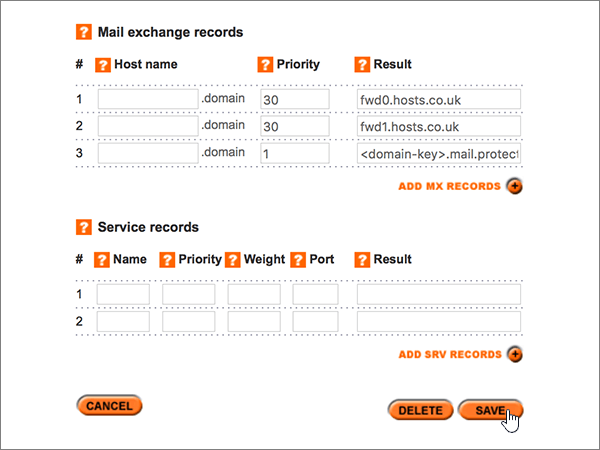

# Skapa DNS-poster på Names.co.uk för Microsoft

 **[Läs frågor och svar om domäner](../setup/domains-faq.yml)** om du inte hittar det du letar efter. 
  
Om Names.co.uk är din DNS-värd följer du stegen i den här artikeln för att verifiera din domän och konfigurera DNS-poster för e-post, Skype för företag - Online och så vidare.
    
När du har lagt till dessa Names.co.uk domän är din domän konfigurerad för att fungera med Microsoft-tjänster.
  

  
> [!NOTE]
>  Det brukar ta ungefär 15 minuter för DNS-ändringarna att gå igenom. Ibland kan det dock ta längre tid att uppdatera DNS-systemet på Internet för en ändring som du har gjort. Om du stöter på problem med e-postflödet eller får andra problem när du har lagt till DNS-posterna, går du till [Felsöka problem när du har ändrat domännamn eller DNS-poster](../get-help-with-domains/find-and-fix-issues.md). 
  
## Lägga till en TXT-post för verifiering

Innan du använder din domän med Microsoft, vill vi vara säkra på att det är du som äger den. Att du kan logga in på ditt konto hos domänregistratorn och skapa DNS-posten bevisar för Microsoft att du äger domänen.
  
> [!NOTE]
> Den här posten används endast för att verifiera att du äger domänen. Den påverkar ingenting annat. Du kan ta bort den senare om du vill. 
  
1. Kom igång genom att gå till domänsidan på Names.co.uk genom att klicka på [den här länken](https://account.names.co.uk/dashboard#/). Du uppmanas att logga in först.
    
    
  
2. På **Dashboard**-sidan hittar du namnet på domänen du uppdaterar. Välj sedan **DNS Settings** i listrutan. 
    
    (Du kan behöva rulla nedåt.)
    
    
  
3. Under **A, CNAME, AAAA, TXT and NS records** på sidan **Add/Modify DNS Zone** skriver du in eller kopierar och klistrar in värdena från följande tabell i rutorna för den nya posten. 
    
    (Välj värdet för **Type** i listrutan.) 
    
    (Om du behöver lägga till en rad väljer du **ADD A/CNAME RECORDS (+)**.)
    
    (Du kan behöva rulla nedåt.)
        
    |**Värdnamn**|**Typ**|**Result**|
    |:-----|:-----|:-----|
    |(Lämna det här fältet tomt.)    |TXT    |MS=ms *XXXXXXXX*    **Obs!** Det här är ett exempel. Använd ditt specifika **Mål eller pekar på adress** värde här, från tabellen.           [Hur hittar jag det här?](../get-help-with-domains/information-for-dns-records.md)    |
       
    
  
4. Välj **Spara**.
    
    (Du kan behöva rulla nedåt.)
    
    
  
5. Vänta några minuter innan du fortsätter, så att den post som du nyss skapade kan uppdateras på Internet.
    
Nu när du har lagt till posten på domänregistratorns webbplats kan du gå tillbaka till Microsoft och begär posten.
  
När Microsoft hittar rätt TXT-post är din domän verifierad.
  
1. I administrationscentret går du till **Inställningar** \> <a href="https://go.microsoft.com/fwlink/p/?linkid=834818" target="_blank">Domains</a>.
    
2. På sidan **Domains** väljer du den domän du verifierar. 
    
    
  
3. På sidan **Setup** väljer du **Start setup**.
    
    
  
4. På sidan **Verify domain** väljer du **Verify**.
    
    
  
> [!NOTE]
>  Det brukar ta ungefär 15 minuter för DNS-ändringarna att gå igenom. Ibland kan det dock ta längre tid att uppdatera DNS-systemet på Internet för en ändring som du har gjort. Om du stöter på problem med e-postflödet eller får andra problem när du har lagt till DNS-posterna, går du till [Felsöka problem när du har ändrat domännamn eller DNS-poster](../get-help-with-domains/find-and-fix-issues.md). 
  
## Lägga till en MX-post så att e-post för din domän kommer till Microsoft.

1. Kom igång genom att gå till domänsidan på Names.co.uk genom att klicka på [den här länken](https://account.names.co.uk/dashboard#/). Du uppmanas att logga in först.
    
    
  
2. På **Dashboard**-sidan hittar du namnet på domänen du uppdaterar. Välj sedan **DNS Settings** i listrutan. 
    
    (Du kan behöva rulla nedåt.)
    
    
  
3. I avsnittet **Mail exchange records** på sidan **Add/Modify DNS Zone** skriver du in eller kopierar och klistrar in värdena från följande tabell i rutorna för den nya posten. 
    
    (Du kan behöva rulla nedåt.)
    
    |**Värdnamn**|**Priority**|**Result**|
    |:-----|:-----|:-----|
    |(Lämna det här fältet tomt.)    |1    Mer information om prioritet finns i [Vad är MX-prioritet?](../setup/domains-faq.yml)   | *\<domain-key\>*  .mail.protection.outlook.com    > [!NOTE]> Hämta ditt  *\<domain-key\>*  Microsoft-konto.           [Hur hittar jag det här?](../get-help-with-domains/information-for-dns-records.md)          |
       
    
  
4. Välj **Spara**.
    
    (Du kan behöva rulla nedåt.)
    
    
  
5. Om det finns andra MX-poster i avsnittet **Mail exchange records** tar du bort var och en av dem genom att markera den och sedan trycka på **Delete**-tangenten. 
    
    
  
6. Välj **Spara**.
    
    (Du kan behöva rulla nedåt.)
    
    
  
## Lägg till de sex CNAME-posterna som krävs för Microsoft

1. Kom igång genom att gå till domänsidan på Names.co.uk genom att klicka på [den här länken](https://account.names.co.uk/dashboard#/). Du uppmanas att logga in först.
    
    
  
2. På **Dashboard**-sidan hittar du namnet på domänen du uppdaterar. Välj sedan **DNS Settings** i listrutan. 
    
    (Du kan behöva rulla nedåt.)
    
    
  
3. Under **A, CNAME, AAAA, TXT and NS records** på sidan **Add/Modify DNS Zone** skriver du in eller kopierar och klistrar in värdena från följande tabell i rutorna för den nya posten. 
    
    (Välj värdet för **Type** i listrutan.) 
    
    (Om du behöver lägga till en rad väljer du **ADD A/CNAME RECORDS (+)**.)
    
    (Du kan behöva rulla nedåt.)
    
    |**Host Name**|**Type**|**Result**|
    |:-----|:-----|:-----|
    |autodiscover    |CNAME    |autodiscover.outlook.com    |
    |sip    |CNAME    |sipdir.online.lync.com    |
    |lyncdiscover    |CNAME    |webdir.online.lync.com    |
    |enterpriseregistration    |CNAME    |enterpriseregistration.windows.net    |
    |enterpriseenrollment    |CNAME    |enterpriseenrollment-s.manage.microsoft.com    |
       
    
  
4. Välj **Spara**.
    
    
  
## Lägga till en TXT-post för SPF för att förhindra skräppost

> [!IMPORTANT]
> Du kan inte ha fler än en TXT-post för SPF för en domän. Om din domän har fler än en SPF-post får du e-postfel och problem med leveranser och skräppostklassificering. Om du redan har en SPF-post för domänen ska du inte skapa en ny för Microsoft. Lägg istället till de obligatoriska Microsoft-värdena i den aktuella posten så att du har  *en*  enda SPF-post som innehåller båda uppsättningarna med värden.
  
1. Kom igång genom att gå till domänsidan på Names.co.uk genom att klicka på [den här länken](https://account.names.co.uk/dashboard#/). Du uppmanas att logga in först.
    
    
  
2. På **Dashboard**-sidan hittar du namnet på domänen du uppdaterar. Välj sedan **DNS Settings** i listrutan. 
    
    (Du kan behöva rulla nedåt.)
    
    
  
3. På sidan **DNS Zones on Account,** i **kolumnen Domain name,** väljer du namnet på den domän som du uppdaterar. 
    
    
  
4. Under **A, CNAME, AAAA, TXT and NS records** på sidan **Add/Modify DNS Zone** skriver du in eller kopierar och klistrar in värdena från följande tabell i rutorna för den nya posten. 
    
    (Välj värdet för **Type** i listrutan.) 
    
    (Om du behöver lägga till en rad väljer du **ADD A/CNAME RECORDS (+)**.)
    
    (Du kan behöva rulla nedåt.)
    
    |**Värdnamn**|**Typ**|**Result**|
    |:-----|:-----|:-----|
    |(Lämna det här fältet tomt.)    |TXT    |v=spf1 include:spf.protection.outlook.com -all    **Obs!** Vi rekommenderar att du kopierar och klistrar in den här posten så att alla avstånd förblir korrekta.               |
       
    
  
5. Välj **Spara**.
    
    (Du kan behöva rulla nedåt.)
    
    
  
## Lägga till de två SRV-posterna som krävs för Microsoft

1. Kom igång genom att gå till domänsidan på Names.co.uk genom att klicka på [den här länken](https://account.names.co.uk/dashboard#/). Du uppmanas att logga in först.
    
    
  
2. På **Dashboard**-sidan hittar du namnet på domänen du uppdaterar. Välj sedan **DNS Settings** i listrutan. 
    
    (Du kan behöva rulla nedåt.)
    
    
  
3. Under **Service records** på sidan **Add/Modify DNS Zone** skriver du in eller kopierar och klistrar in värdena från följande tabell i rutorna för den nya posten. 
    
    (Du kan behöva rulla nedåt.)
    
    |**Name**|**Prioritet**|**Vikt**|**Port**|**Result**|
    |:-----|:-----|:-----|:-----|:-----|
    |_sip._tls    |100    |1    |443    |sipdir.online.lync.com    |
    |_sipfederationtls._tcp    |100    |1    |5061    |sipfed.online.lync.com    |
       
    
  
4. Välj **Spara**.
    
    (Du kan behöva rulla nedåt.)
    
    
  
> [!NOTE]
>  Det brukar ta ungefär 15 minuter för DNS-ändringarna att gå igenom. Ibland kan det dock ta längre tid att uppdatera DNS-systemet på Internet för en ändring som du har gjort. Om du stöter på problem med e-postflödet eller får andra problem när du har lagt till DNS-posterna, går du till [Felsöka problem när du har ändrat domännamn eller DNS-poster](../get-help-with-domains/find-and-fix-issues.md). 
