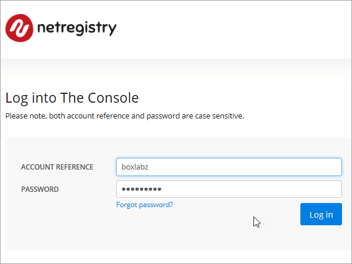
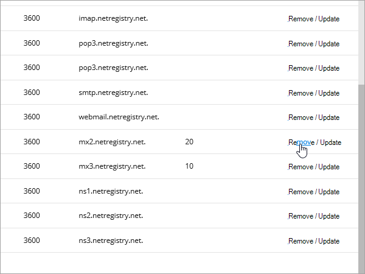
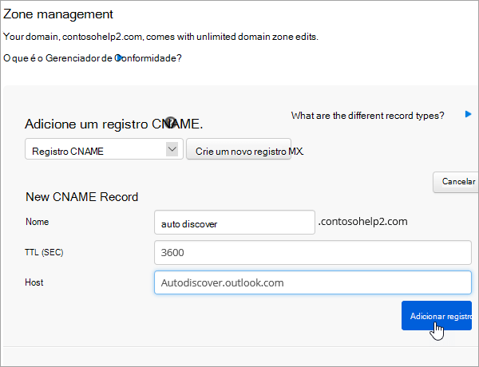
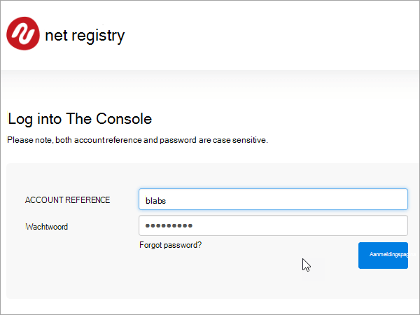
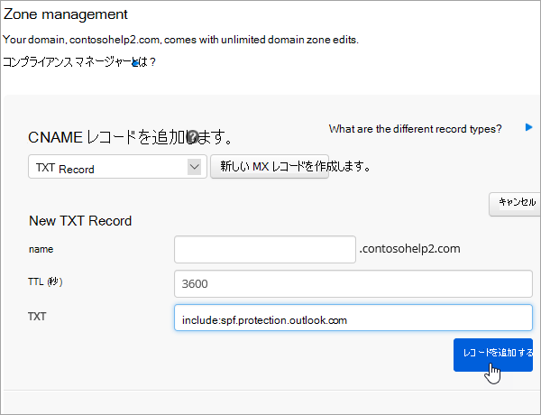
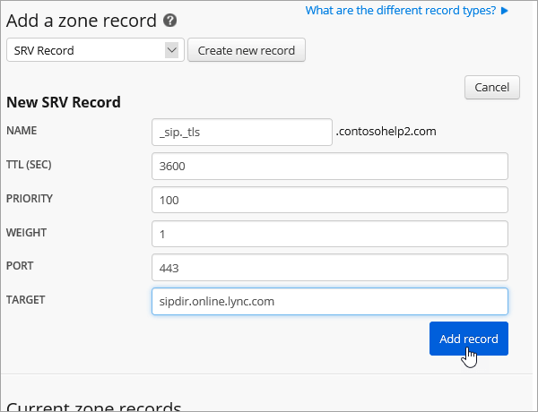

# Skapa DNS-poster i Netregistry för MicrosoftCreate DNS records at Netregistry for Microsoft

[Läs frågor och svar om domäner](../setup/domains-faq.md) om du inte hittar det du letar efter.[Check the Domains FAQ](../setup/domains-faq.md) if you don't find what you're looking for. 
  
Om Netregistry är din DNS-värd följer du stegen i den här artikeln för att verifiera din domän och konfigurera DNS-poster för e-post, Skype för företag – Online och så vidare.If Netregistry is your DNS hosting provider, follow the steps in this article to verify your domain and set up DNS records for email, Skype for Business Online, and so on.
  
Det här är de viktigaste posterna att lägga till:These are the main records to add.
  
- [Lägga till en TXT-post för verifieringAdd a TXT record for verification](#add-a-txt-record-for-verification)
    
- [Lägga till en MX-post så att e-post för din domän kommer till Microsoft.Add an MX record so email for your domain will come to Microsoft](#add-an-mx-record-so-email-for-your-domain-will-come-to-microsoft)

- [Lägga till CNAME-posterna som krävs för MicrosoftAdd the CNAME records that are required for Microsoft](#add-the-cname-records-that-are-required-for-microsoft)
    
- [Lägga till en TXT-post för SPF för att förhindra skräppostAdd a TXT record for SPF to help prevent email spam](#add-a-txt-record-for-spf-to-help-prevent-email-spam)
    
- [Lägga till de två SRV-posterna som krävs för MicrosoftAdd the two SRV records that are required for Microsoft](#add-the-two-srv-records-that-are-required-for-microsoft)
    
När du har lagt till dessa poster i Netregistry konfigureras domänen så att den fungerar med Microsoft-tjänster.After you add these records at Netregistry, your domain will be set up to work with Microsoft services.
  
  
> [!NOTE]
> Det brukar ta ungefär 15 minuter för DNS-ändringarna att gå igenom. Ibland kan det dock ta längre tid att uppdatera DNS-systemet på Internet för en ändring som du har gjort. Om du stöter på problem med e-postflödet eller får andra problem när du har lagt till DNS-posterna, går du till [Felsöka problem när du har ändrat domännamn eller DNS-poster](../get-help-with-domains/find-and-fix-issues.md).Typically it takes about 15 minutes for DNS changes to take effect. However, it can occasionally take longer for a change you've made to update across the Internet's DNS system. If you're having trouble with mail flow or other issues after adding DNS records, see [Troubleshoot issues after changing your domain name or DNS records](../get-help-with-domains/find-and-fix-issues.md). 
  
## Lägga till en TXT-post för verifieringAdd a TXT record for verification

Innan du använder din domän med Microsoft, vill vi vara säkra på att det är du som äger den. Att du kan logga in på ditt konto hos domänregistratorn och skapa DNS-posten bevisar för Microsoft att du äger domänen.Before you use your domain with Microsoft, we have to make sure that you own it. Your ability to log in to your account at your domain registrar and create the DNS record proves to Microsoft that you own the domain.
  
> [!NOTE]
> Den här posten används endast för att verifiera att du äger domänen. Den påverkar ingenting annat. Du kan ta bort den senare om du vill.This record is used only to verify that you own your domain; it doesn't affect anything else. You can delete it later, if you like. 
  
1. För att komma igång, gå till din domänsida i Netregistry med hjälp av [denna länk](https://theconsole.netregistry.com.au/).To get started, go to your domains page in Netregistry by using [this link](https://theconsole.netregistry.com.au/). Du uppmanas att logga in.You'll be prompted to log in.
    
    
  
2. Bredvid den domän som du vill hantera väljer du **Hantera**.Next to the domain you want to manage, select **Manage**.
    
    
  
3. Välj **Zonhanteraren**.Select **Zone Manager**.
    
    
  
4. Under **Lägg till en zonpost**väljer du **TXT-post** i listan och väljer sedan **Skapa ny post**.Under **Add a zone record**, choose **TXT Record** from the list, and then select **Create new record**.
    
    
  
    > [!NOTE]
    > Du måste använda citattecken före och efter posten i rutan TXT.You must use quotation marks before and after the entry in the TXT box. 
  
    Skriv eller kopiera och klistra in värdena från följande tabell i formuläret **Ny TXT-post.**In the **New TXT Record** form, type or copy and paste the values from the following table. 
    
    |**Namn****Name**|**TTL (SEK)****TTL (SEC)**|**TXT (Pekar på adress eller värde)****TXT (Points to address or value)**|
    |:-----|:-----|:-----|
    |(lämna tomt)(leave blank)    |3600 (sekunder)3600 (seconds)    |"MS=msXXXXXXXX""MS=msXXXXXXXX"    **Obs!** Det här är ett exempel.**Note:** This is an example. Använd ditt specifika \*\*Mål eller pekar på adress \*\* värde här, från tabellen.Use your specific **Destination or Points to Address** value here, from the table. [Hur hittar jag det här?How do I find this?](../get-help-with-domains/information-for-dns-records.md)  |
       
    
  
6. Välj **Lägg till post**.Select **Add record**.
    
Nu när du har lagt till posten på domänregistratorns webbplats kan du gå tillbaka till Microsoft och begär posten.Now that you've added the record at your domain registrar's site, you'll go back to Microsoft and request the record.
  
När Microsoft hittar rätt TXT-post är din domän verifierad.When Microsoft finds the correct TXT record, your domain is verified.
  
1. I administrationscentret går du till **Inställningar** \> <a href="https://go.microsoft.com/fwlink/p/?linkid=834818" target="_blank">Domains</a>.In the admin center, go to the **Settings** \> <a href="https://go.microsoft.com/fwlink/p/?linkid=834818" target="_blank">Domains</a> page.
    
2. På sidan **Domains** väljer du den domän du verifierar.On the **Domains** page, select the domain that you are verifying. 
    
    
  
3. På sidan **Setup** väljer du **Start setup**.On the **Setup** page, select **Start setup**.
    
    
  
4. På sidan **Verify domain** väljer du **Verify**.On the **Verify domain** page, select **Verify**.
    
    
  
> [!NOTE]
>  Det brukar ta ungefär 15 minuter för DNS-ändringarna att gå igenom. Ibland kan det dock ta längre tid att uppdatera DNS-systemet på Internet för en ändring som du har gjort. Om du stöter på problem med e-postflödet eller får andra problem när du har lagt till DNS-posterna, går du till [Felsöka problem när du har ändrat domännamn eller DNS-poster](../get-help-with-domains/find-and-fix-issues.md).Typically it takes about 15 minutes for DNS changes to take effect. However, it can occasionally take longer for a change you've made to update across the Internet's DNS system. If you're having trouble with mail flow or other issues after adding DNS records, see [Troubleshoot issues after changing your domain name or DNS records](../get-help-with-domains/find-and-fix-issues.md). 
  
## Lägga till en MX-post så att e-post för din domän kommer till Microsoft.Add an MX record so email for your domain will come to Microsoft

1. För att komma igång, gå till din domänsida i Netregistry med hjälp av [denna länk](https://theconsole.netregistry.com.au/).To get started, go to your domains page in Netregistry by using [this link](https://theconsole.netregistry.com.au/). Du uppmanas att logga in.You'll be prompted to log in.
    
    
  
2. Bredvid den domän som du vill hantera väljer du **Hantera**.Next to the domain you want to manage, select **Manage**.
    
    
  
3. Välj **Zonhanteraren**.Select **Zone Manager**.
    
    
  
4. Under **Aktuella zonposter**tar du bort standard-MX-posterna genom att välja **Ta bort** bredvid varje MX-post i listan.Under **Current zone records**, remove the default MX records by selecting **Remove** next to each MX record in the list. 
    
    
  
5. Under **Lägg till en zonpost**väljer du **MX Record** i listan och väljer sedan Skapa ny **post**.Under **Add a zone record**, choose **MX Record** from the list, and then select **Create new record**.
    
    
  
6. Skriv eller kopiera och klistra in värdena från följande tabell i formuläret **Ny MX-post.**In the **New MX Record** form, type or copy and paste the values from the following table. 
    
    |**Namn****Name**|**TTL (SEK)****TTL (SEC)**|**Exchange (Pekar på adress eller värde)****Exchange (Points to address or value)**|**Är värden fullt kvalificerad?****Is host fully qualified?**|**Preferens (prioritet)****Preference (Priority)**|
    |:-----|:-----|:-----|:-----|:-----|
    |(lämna tomt)(leave blank)    |3600 (sekunder)3600 (seconds)    | *\<domain-key\>*.mail.protection.outlook.com*\<domain-key\>*  .mail.protection.outlook.com    **Anm.:** Hämta ditt *\<domain-key\>* från ditt Microsoft-konto.**Note:** Get your  *\<domain-key\>*  from your Microsoft account.  [Hur hittar jag det här?How do I find this?](../get-help-with-domains/information-for-dns-records.md)      |(markera kryssrutan)(select the checkbox)    |1010    Mer information om prioritet finns i Vad är MX-prioritet?For more information about priority, see What is MX priority?    |
       
    
  
7. Välj **Lägg till post**.Select **Add Record**.
    
    
  
## Lägga till CNAME-posterna som krävs för MicrosoftAdd the CNAME records that are required for Microsoft

1. För att komma igång, gå till din domänsida i Netregistry med hjälp av [denna länk](https://theconsole.netregistry.com.au/).To get started, go to your domains page in Netregistry by using [this link](https://theconsole.netregistry.com.au/). Du uppmanas att logga in.You'll be prompted to log in.
    
    
  
2. Bredvid den domän som du vill hantera väljer du **Hantera**.Next to the domain you want to manage, select **Manage**.
    
    
  
3. Välj **Zonhanteraren**.Select **Zone Manager**.
    
    
  
4. Under **Lägg till en zonpost**väljer du **CNAME-post** i listan och väljer sedan **Skapa ny post**.Under  **Add a zone record**, choose **CNAME Record** from the list, and then select **Create new record**.
    
    
  
5. I rutorna för den nya posten skriver du in eller kopierar och klistrar in värdena från följande tabell.In the boxes for the new record, type or copy and paste the values from the following table.
    
    |**Name (namn)****Name**|**Type (typ)****Type**|**TTL****TTL**|**HOST (Pekar på eller adressvärde)****HOST (Points to or address value)**|
    |:-----|:-----|:-----|:-----|
    |autodiscoverautodiscover    |CNAMECNAME    |3600 (sekunder)3600 (seconds)    |autodiscover.outlook.comautodiscover.outlook.com    |
    |sipsip    |CNAMECNAME    |3600 (sekunder)3600 (seconds)    |sipdir.online.lync.comsipdir.online.lync.com    |
    |lyncdiscoverlyncdiscover    |CNAMECNAME    |3600 (sekunder)3600 (seconds)    |webdir.online.lync.comwebdir.online.lync.com    |
    |enterpriseregistrationenterpriseregistration    |CNAMECNAME    |3600 (sekunder)3600 (seconds)    |enterpriseregistration.windows.netenterpriseregistration.windows.net    |
    |enterpriseenrollmententerpriseenrollment    |CNAMECNAME    |3600 (sekunder)3600 (seconds)    |enterpriseenrollment-s.manage.microsoft.comenterpriseenrollment-s.manage.microsoft.com    |
       
    
      
6. Välj **Lägg till post**.Select **Add record**.
    
    
  
7. Upprepa föregående steg för att skapa de andra fem CNAME-posterna.Repeat the previous steps to create the other five CNAME records.
    
    För varje post skriver du in, eller kopierar och klistrar in, värdena från nästa rad i tabellen ovan i rutorna för den posten.For each record, type or copy and paste the values from the next row of the table above into the boxes for that record.
    
## Lägga till en TXT-post för SPF för att förhindra skräppostAdd a TXT record for SPF to help prevent email spam

> [!IMPORTANT]
> Du kan inte ha fler än en TXT-post för SPF för en domän.You cannot have more than one TXT record for SPF for a domain. Om din domän har fler än en SPF-post får du e-postfel och problem med leveranser och skräppostklassificering.If your domain has more than one SPF record, you'll get email errors, as well as delivery and spam classification issues. Om du redan har en SPF-post för domänen ska du inte skapa en ny för Microsoft.If you already have an SPF record for your domain, don't create a new one for Microsoft. Lägg i stället till de nödvändiga Microsoft-värdena i den aktuella posten så att du har en *enda* SPF-post som innehåller båda uppsättningarna värden.Instead, add the required Microsoft values to the current record so that you have a  *single*  SPF record that includes both sets of values.
  
1. För att komma igång, gå till din domänsida i Netregistry med hjälp av [denna länk](https://theconsole.netregistry.com.au/).To get started, go to your domains page in Netregistry by using [this link](https://theconsole.netregistry.com.au/). Du uppmanas att logga in.You'll be prompted to log in.
    
    
  
2. Bredvid den domän som du vill hantera väljer du **Hantera**.Next to the domain you want to manage, select **Manage**.
    
    
  
3. Välj **Zonhanteraren**.Select **Zone Manager**.
    
    
  
4. Under **Lägg till en zonpost**väljer du **TXT-post** i listan och väljer sedan **Skapa ny post**.Under **Add a zone record**, choose **TXT Record** from the list, and then select **Create new record**.
    
    
  
5. I den nya postens rutor skriver du in, eller kopierar och klistrar in, värdena från följande tabell.In the boxes for the new record, type or copy and paste the values from the following table. 
    
    > [!NOTE]
    > Du måste använda citattecken före och efter posten i rutan TXT.You must use quotation marks before and after the entry in the TXT box. 
  
    |**Name****Name**|**Type (Typ)****Type**|**TTL****TTL**|**TXT-data (mål)****TXT Data (Target)**|
    |:-----|:-----|:-----|:-----|
    |(lämna tomt)(leave blank)    |TXTTXT    |3600 (sekunder)3600 (seconds)    |"v=spf1 include:spf.protection.outlook.com -all""v=spf1 include:spf.protection.outlook.com -all"    **Obs!** Vi rekommenderar att du kopierar och klistrar in den här posten så att alla avstånd förblir korrekta.    **Note:** We recommend copying and pasting this entry, so that all of the spacing stays correct.           |
   
    
  
6. Välj **Lägg till post**.Select **Add Record**.
    
    
  
## Lägga till de två SRV-posterna som krävs för MicrosoftAdd the two SRV records that are required for Microsoft

1. För att komma igång, gå till din domänsida i Netregistry med hjälp av [denna länk](https://theconsole.netregistry.com.au/).To get started, go to your domains page in Netregistry by using [this link](https://theconsole.netregistry.com.au/). Du uppmanas att logga in.You'll be prompted to log in.
    
    
  
2. Bredvid den domän som du vill hantera väljer du **Hantera**.Next to the domain you want to manage, select  **Manage**.
    
    
  
3. Välj **Zonhanteraren**.Select **Zone Manager**.
    
    
  
4. Under **Lägg till en zonpost**väljer du **SRV-post** i listan och väljer sedan **Skapa ny post**.Under  **Add a zone record**, choose **SRV Record** from the list, and then select **Create new record**.
    
    
  
5. I den nya postens rutor skriver du in, eller kopierar och klistrar in, värdena från följande tabell.In the boxes for the new record, type or copy and paste the values from the following table.
    
    > [!NOTE]
    > Fältet Namn är en kombination av tjänsten (till exempel _sip) och protokoll (till exempel _tls).The Name field is a combination of the service (for example, _sip) and protocol (for example, _tls). 
  
    |**Type (typ)****Type**|**Namn****Name**|**TTL (SEK)****TTL (SEC)**|**Prioritet****Priority**|**Vikt****Weight**|**Port****Port**|**Target (mål)****Target**|
    |:-----|:-----|:-----|:-----|:-----|:-----|:-----|
    |SRV (tjänst)SRV (service)    |_sip._tls_sip._tls    |3600 (sekunder)3600 (seconds)    |100100    |11    |443443    |sipdir.online.lync.comsipdir.online.lync.com    |
    |SRV (tjänst)SRV (service)    |_sipfederationtls._tcp_sipfederationtls._tcp    |3600 (sekunder)3600 (seconds)    |100100    |11    |50615061    |sipfed.online.lync.comsipfed.online.lync.com    |
       
    
  
6. Välj **Lägg till post**.Select **Add Record**.
    
    
  
7. Upprepa stegen för att skapa den andra SRV-posten.Repeat the previous steps to create the other SRV record.
    
    I rutorna för den andra posten skriver du in, eller kopierar och klistrar in, värdena från den andra raden i tabellen ovan.Type or copy and paste the values from the second row of the table above into the boxes for the second record.
    
> [!NOTE]
> Det brukar ta ungefär 15 minuter för DNS-ändringarna att gå igenom. Ibland kan det dock ta längre tid att uppdatera DNS-systemet på Internet för en ändring som du har gjort. Om du stöter på problem med e-postflödet eller får andra problem när du har lagt till DNS-posterna, går du till [Felsöka problem när du har ändrat domännamn eller DNS-poster](../get-help-with-domains/find-and-fix-issues.md).Typically it takes about 15 minutes for DNS changes to take effect. However, it can occasionally take longer for a change you've made to update across the Internet's DNS system. If you're having trouble with mail flow or other issues after adding DNS records, see [Troubleshoot issues after changing your domain name or DNS records](../get-help-with-domains/find-and-fix-issues.md). 
  

