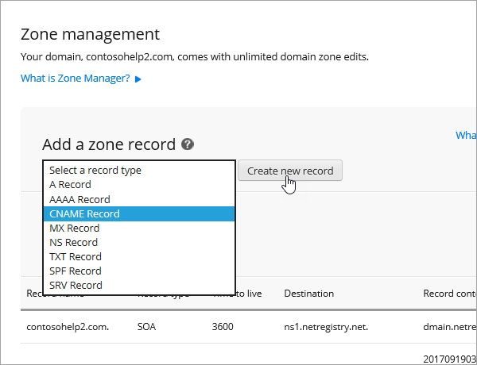

# Skapa DNS-poster på netregistry för Microsoft

[Läs frågor och svar om domäner](../setup/domains-faq.yml) om du inte hittar det du letar efter. 
  
Om netregistry är din DNS-värd följer du stegen i den här artikeln för att verifiera din domän och konfigurera DNS-poster för e-post, Skype för företag – Online och så vidare.
  
Det här är de viktigaste posterna att lägga till:
  
- [Lägga till en TXT-post för verifiering](#add-a-txt-record-for-verification)
    
- [Lägga till en MX-post så att e-post för din domän kommer till Microsoft.](#add-an-mx-record-so-email-for-your-domain-will-come-to-microsoft)

- [Lägga till CNAME-posterna som krävs för Microsoft](#add-the-cname-records-that-are-required-for-microsoft)
    
- [Lägga till en TXT-post för SPF för att förhindra skräppost](#add-a-txt-record-for-spf-to-help-prevent-email-spam)
    
- [Lägga till de två SRV-posterna som krävs för Microsoft](#add-the-two-srv-records-that-are-required-for-microsoft)
    
När du har lagt till dessa poster på netregistry är domänen konfigurerad för att fungera med Microsoft-tjänster.
  
  
> [!NOTE]
> Det brukar ta ungefär 15 minuter för DNS-ändringarna att gå igenom. Ibland kan det dock ta längre tid att uppdatera DNS-systemet på Internet för en ändring som du har gjort. Om du stöter på problem med e-postflödet eller får andra problem när du har lagt till DNS-posterna, går du till [Felsöka problem när du har ändrat domännamn eller DNS-poster](../get-help-with-domains/find-and-fix-issues.md). 
  
## Lägga till en TXT-post för verifiering

Innan du använder din domän med Microsoft, vill vi vara säkra på att det är du som äger den. Att du kan logga in på ditt konto hos domänregistratorn och skapa DNS-posten bevisar för Microsoft att du äger domänen.
  
> [!NOTE]
> Den här posten används endast för att verifiera att du äger domänen. Den påverkar ingenting annat. Du kan ta bort den senare om du vill. 
  
1. För att komma igång går du till sidan domäner i netregistry med [den här länken](https://theconsole.netregistry.com.au/). Du uppmanas att logga in.
    
    
  
2. Välj **Hantera** bredvid den domän som du vill hantera.
    
    
  
3. Välj **Zone Manager**.
    
    
  
4. Under **Lägg till en zonfil** väljer du **txt Record** i listan och väljer sedan **Skapa ny post**.
    
    
  
    > [!NOTE]
    > Du måste använda citat tecken före och efter posten i TXT-rutan. 
  
    Skriv eller kopiera och klistra in värdena från följande tabell i formuläret **ny TXT-post** . 
    
    |**Namn**|**TTL (SEK)**|**TXT (pekar på adress eller värde)**|
    |:-----|:-----|:-----|
    |(lämna tomt)    |3600 (sekunder)    |"MS = msXXXXXXXX"    **Obs!** Det här är ett exempel. Använd ditt specifika **Mål eller pekar på adress** värde här, från tabellen. [Hur hittar jag det här?](../get-help-with-domains/information-for-dns-records.md)  |
       
    
  
6. Välj **Add Record**.
    
Nu när du har lagt till posten på domänregistratorns webbplats kan du gå tillbaka till Microsoft och begär posten.
  
När Microsoft hittar rätt TXT-post är din domän verifierad.
  
1. I administrationscentret går du till **Inställningar** \> <a href="https://go.microsoft.com/fwlink/p/?linkid=834818" target="_blank">Domains</a>.
    
2. På sidan **Domains** väljer du den domän du verifierar. 
    
    
  
3. På sidan **Setup** väljer du **Start setup**.
    
    
  
4. På sidan **Verify domain** väljer du **Verify**.
    
    
  
> [!NOTE]
>  Det brukar ta ungefär 15 minuter för DNS-ändringarna att gå igenom. Ibland kan det dock ta längre tid att uppdatera DNS-systemet på Internet för en ändring som du har gjort. Om du stöter på problem med e-postflödet eller får andra problem när du har lagt till DNS-posterna, går du till [Felsöka problem när du har ändrat domännamn eller DNS-poster](../get-help-with-domains/find-and-fix-issues.md). 
  
## Lägga till en MX-post så att e-post för din domän kommer till Microsoft.

1. För att komma igång går du till sidan domäner i netregistry med [den här länken](https://theconsole.netregistry.com.au/). Du uppmanas att logga in.
    
    
  
2. Välj **Hantera** bredvid den domän som du vill hantera.
    
    
  
3. Välj **Zone Manager**.
    
    
  
4. Under **aktuella zondata** tar du bort de förvalda MX-posterna genom att välja **ta bort** bredvid varje MX-post i listan. 
    
    
  
5. Under **Lägg till en zonfil** väljer du **MX Record** i listan och väljer sedan **Skapa ny post**.
    
    
  
6. Skriv in, eller kopiera och klistra in, värdena från följande tabell i det **nya MX Record** -formuläret. 
    
    |**Namn**|**TTL (SEK)**|**Utbyte (pekar på adress eller värde)**|**Är värden fullt kvalificerad?**|**Preferens (prioritet)**|
    |:-----|:-----|:-----|:-----|:-----|
    |(lämna tomt)    |3600 (sekunder)    | *\<domain-key\>*  .mail.protection.outlook.com    **Obs!** Hämta ditt  *\<domain-key\>*  från ditt Microsoft-konto.  [Hur hittar jag det här?](../get-help-with-domains/information-for-dns-records.md)      |(Markera kryss rutan)    |10.3    Mer information om prioritet finns i Vad är MX-prioritet?    |
       
    
  
7. Välj **Add Record**.
    
    
  
## Lägga till CNAME-posterna som krävs för Microsoft

1. För att komma igång går du till sidan domäner i netregistry med [den här länken](https://theconsole.netregistry.com.au/). Du uppmanas att logga in.
    
    
  
2. Välj **Hantera** bredvid den domän som du vill hantera.
    
    
  
3. Välj **Zone Manager**.
    
    
  
4. Under  **Lägg till en zonfil** väljer du **CNAME-post** i listan och väljer sedan **Skapa ny post**.
    
    
  
5. I rutorna för den nya posten skriver du in eller kopierar och klistrar in värdena från följande tabell.
    
    |**Name (namn)**|**Type (typ)**|**TTL**|**VÄRD (pekar på eller adress värde)**|
    |:-----|:-----|:-----|:-----|
    |autodiscover    |CNAME    |3600 (sekunder)    |autodiscover.outlook.com    |
    |sip    |CNAME    |3600 (sekunder)    |sipdir.online.lync.com    |
    |lyncdiscover    |CNAME    |3600 (sekunder)    |webdir.online.lync.com    |
    |enterpriseregistration    |CNAME    |3600 (sekunder)    |enterpriseregistration.windows.net    |
    |enterpriseenrollment    |CNAME    |3600 (sekunder)    |enterpriseenrollment-s.manage.microsoft.com    |
       
    
      
6. Välj **Add Record**.
    
    
  
7. Upprepa föregående steg för att skapa de andra fem CNAME-posterna.
    
    För varje post skriver du in, eller kopierar och klistrar in, värdena från nästa rad i tabellen ovan i rutorna för den posten.
    
## Lägga till en TXT-post för SPF för att förhindra skräppost

> [!IMPORTANT]
> Du kan inte ha fler än en TXT-post för SPF för en domän. Om din domän har fler än en SPF-post får du e-postfel och problem med leveranser och skräppostklassificering. Om du redan har en SPF-post för domänen ska du inte skapa en ny för Microsoft. I stället kan du lägga till de Microsoft-värden som krävs i den aktuella posten så att du har en  *enda*  SPF-post som innehåller båda uppsättningar med värden.
  
1. För att komma igång går du till sidan domäner i netregistry med [den här länken](https://theconsole.netregistry.com.au/). Du uppmanas att logga in.
    
    
  
2. Välj **Hantera** bredvid den domän som du vill hantera.
    
    
  
3. Välj **Zone Manager**.
    
    
  
4. Under **Lägg till en zonfil** väljer du **txt Record** i listan och väljer sedan **Skapa ny post**.
    
    
  
5. I den nya postens rutor skriver du in, eller kopierar och klistrar in, värdena från följande tabell. 
    
    > [!NOTE]
    > Du måste använda citat tecken före och efter posten i TXT-rutan. 
  
    |**Name**|**Type (typ)**|**TTL**|**TXT-data (mål)**|
    |:-----|:-----|:-----|:-----|
    |(lämna tomt)    |TXT    |3600 (sekunder)    |"v = spf1 inkluderar include SPF. Protection. Outlook. com-all"    **Obs!** Vi rekommenderar att du kopierar och klistrar in den här posten så att alla avstånd förblir korrekta.               |
   
    
  
6. Välj **Add Record**.
    
    
  
## Lägga till de två SRV-posterna som krävs för Microsoft

1. För att komma igång går du till sidan domäner i netregistry med [den här länken](https://theconsole.netregistry.com.au/). Du uppmanas att logga in.
    
    
  
2. Välj  **Hantera** bredvid den domän som du vill hantera.
    
    
  
3. Välj **Zone Manager**.
    
    
  
4. Under  **Lägg till en zonfil** väljer du **SRV-post** i listan och väljer sedan **Skapa ny post**.
    
    
  
5. I den nya postens rutor skriver du in, eller kopierar och klistrar in, värdena från följande tabell.
    
    > [!NOTE]
    > Fältet Name är en kombination av tjänsten (till exempel _sip) och protokoll (till exempel _tls). 
  
    |**Type (typ)**|**Namn**|**TTL (SEK)**|**Prioritet**|**Vikt**|**Port**|**Target (mål)**|
    |:-----|:-----|:-----|:-----|:-----|:-----|:-----|
    |SRV (tjänst)    |_sip _sip._tls    |3600 (sekunder)    |100    |9.1    |443    |sipdir.online.lync.com    |
    |SRV (tjänst)    |_sipfederationtls _sipfederationtls._tcp    |3600 (sekunder)    |100    |9.1    |5061    |sipfed.online.lync.com    |
       
    
  
6. Välj **Add Record**.
    
    
  
7. Upprepa stegen för att skapa den andra SRV-posten.
    
    I rutorna för den andra posten skriver du in, eller kopierar och klistrar in, värdena från den andra raden i tabellen ovan.
    
> [!NOTE]
> Det brukar ta ungefär 15 minuter för DNS-ändringarna att gå igenom. Ibland kan det dock ta längre tid att uppdatera DNS-systemet på Internet för en ändring som du har gjort. Om du stöter på problem med e-postflödet eller får andra problem när du har lagt till DNS-posterna, går du till [Felsöka problem när du har ändrat domännamn eller DNS-poster](../get-help-with-domains/find-and-fix-issues.md). 
  

