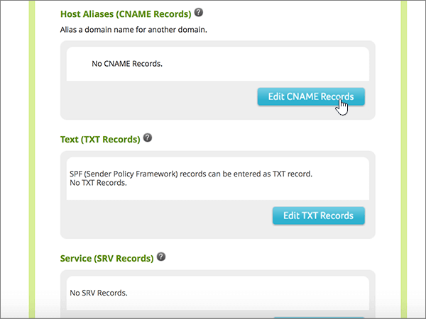

# Skapa DNS-poster på Network Solutions för Microsoft

 **[Läs frågor och svar om domäner](../setup/domains-faq.md)** om du inte hittar det du letar efter. 
  
Om Network Solutions är din DNS-värd följer du stegen i den här artikeln för att verifiera din domän och konfigurera DNS-poster för e-post, Skype för företag - Online och så vidare.
  
Det här är de viktigaste posterna att lägga till. Följ stegen nedan eller [titta på videon](https://support.microsoft.com/office/c49698c2-6991-47fb-b5ac-18e49a505099). 
  
- [Lägga till en TXT-post för verifiering](#add-a-txt-record-for-verification)
    
- [Lägga till en MX-post så att e-post för din domän kommer till Microsoft.](#add-an-mx-record-so-email-for-your-domain-will-come-to-microsoft)
    
- [Lägga till CNAME-posterna som krävs för Microsoft](#add-the-cname-records-that-are-required-for-microsoft)
    
- [Lägga till en TXT-post för SPF för att förhindra skräppost](#add-a-txt-record-for-spf-to-help-prevent-email-spam)
    
- [Lägga till de två SRV-posterna som krävs för Microsoft](#add-the-two-srv-records-that-are-required-for-microsoft)
    
När du har lagt till dessa poster på Network Solutions konfigureras domänen så att den fungerar med Microsoft-tjänster.
  

  
> [!NOTE]
>  Typically it takes about 15 minutes for DNS changes to take effect. However, it can occasionally take longer for a change you've made to update across the Internet's DNS system. If you're having trouble with mail flow or other issues after adding DNS records, see [Troubleshoot issues after changing your domain name or DNS records](../get-help-with-domains/find-and-fix-issues.md). 
  
## Lägga till en TXT-post för verifiering

Before you use your domain with Microsoft, we have to make sure that you own it. Your ability to log in to your account at your domain registrar and create the DNS record proves to Microsoft that you own the domain.
  
> [!NOTE]
> This record is used only to verify that you own your domain; it doesn't affect anything else. You can delete it later, if you like. 
  
Följ stegen nedan eller [titta på videon (börja vid 0:47)](https://support.microsoft.com/office/c49698c2-6991-47fb-b5ac-18e49a505099).
  
1. Kom igång genom att gå till domänsidan på Network Solutions med [den här länken](https://www.networksolutions.com/manage-it). Du uppmanas att logga in.
    
    > [!IMPORTANT]
    > Innan du väljer **knappen Logga in** väljer du först Hantera mina **domännamn** i **listrutan Logga in på:** . 
  
    
  
2. Markera kryssrutan bredvid namnet på den domän som du uppdaterar.
    
    
  
3. Välj **Redigera DNS**.
    
    
  
4. Välj **Hantera avancerade DNS-poster**.
    
    (Du kan behöva rulla nedåt.)
    
    
  
5. Bläddra ned till avsnittet **Text (TXT Records)** och välj sedan **Redigera TXT-poster**.
    
    
  
6. I rutorna för den nya posten skriver du in, eller kopierar och klistrar in, värdena i följande tabell.
    
    |**Host**|**TTL**|**Text**|
    |:-----|:-----|:-----|
    |@    (Värdet ändras till **@ (None)** när du sparar posten.)    |3600    |MS=ms *XXXXXXXX*    **Obs!** Det här är ett exempel. Använd ditt specifika **Mål eller pekar på adress ** värde här, från tabellen.  [Hur hittar jag det här?](../get-help-with-domains/information-for-dns-records.md)   |
       
    
  
7. Välj **Fortsätt**.
    
    
  
8. Välj **Spara ändringar**.
    
    
  
9. Vänta några minuter innan du fortsätter, så att den post som du nyss skapade kan uppdateras på Internet.
    
Nu när du har lagt till posten på domänregistratorns webbplats kan du gå tillbaka till Microsoft och begär posten.
  
När Microsoft hittar rätt TXT-post är din domän verifierad.

1. I administrationscentret går du till **Inställningar** \> <a href="https://go.microsoft.com/fwlink/p/?linkid=834818" target="_blank">Domains</a>.
    
2. På sidan **Domains** väljer du den domän du verifierar. 
    
    
  
3. På sidan **Setup** väljer du **Start setup**.
    
    
  
4. På sidan **Verify domain** väljer du **Verify**.
    
    
  
> [!NOTE]
>  Typically it takes about 15 minutes for DNS changes to take effect. However, it can occasionally take longer for a change you've made to update across the Internet's DNS system. If you're having trouble with mail flow or other issues after adding DNS records, see [Troubleshoot issues after changing your domain name or DNS records](../get-help-with-domains/find-and-fix-issues.md). 
  
## Lägga till en MX-post så att e-post för din domän kommer till Microsoft.

Följ stegen nedan eller [titta på videon (börja vid 3:51)](https://support.microsoft.com/office/c49698c2-6991-47fb-b5ac-18e49a505099).
  
1. Kom igång genom att gå till domänsidan på Network Solutions med [den här länken](https://www.networksolutions.com/manage-it). Du uppmanas att logga in.
    
    > [!IMPORTANT]
    > Innan du väljer **knappen Logga in** väljer du först Hantera mina **domännamn** i **listrutan Logga in på:** . 
  
    
  
2. Markera kryssrutan bredvid namnet på den domän som du uppdaterar.
    
    
  
3. Välj **Redigera DNS**.
    
    
  
4. Välj **Hantera avancerade DNS-poster**.
    
    (Du kan behöva rulla nedåt.)
    
    
  
5. Bläddra ned till avsnittet **E-postservrar (MX Records)** och välj sedan **Redigera MX-poster**.
    
    
  
6. I den nya postens rutor skriver du in, eller kopierar och klistrar in, värdena från följande tabell.
    
    |**Prioritet**|**TTL**|**Mail Server**|
    |:-----|:-----|:-----|
    |10    Mer information om prioritet finns i [Vad är MX-prioritet?](https://docs.microsoft.com/microsoft-365/admin/setup/domains-faq)   |3600    | *\<domain-key\>*.mail.protection.outlook.com.    **Värdet MÅSTE sluta med en punkt (.)**   **Obs:** Hämta ditt *\<domain-key\>* från ditt Microsoft-konto. [Hur hittar jag det här?](../get-help-with-domains/information-for-dns-records.md)          |
       
    
  
7. Välj **Fortsätt**.
    
    
  
8. Välj **Spara ändringar**.
    
    
  
9. Om det finns andra MX-poster tar du bort alla genom att välja **Delete** för varje post. 
    
    
  
10. När alla är markerade väljer du **Fortsätt**.
    
    
  
11. Välj **Spara ändringar**.
    
    
  
## Lägga till CNAME-posterna som krävs för Microsoft

Följ stegen nedan eller [titta på videon (börja vid 4:43)](https://support.microsoft.com/office/c49698c2-6991-47fb-b5ac-18e49a505099).
  
1. Kom igång genom att gå till domänsidan på Network Solutions med [den här länken](https://www.networksolutions.com/manage-it). Du uppmanas att logga in.
    
    > [!IMPORTANT]
    > Innan du väljer **knappen Logga in** väljer du först Hantera mina **domännamn** i **listrutan Logga in på:** . 
  
    
  
2. Markera kryssrutan bredvid namnet på den domän som du uppdaterar.
    
    
  
3. Välj **Redigera DNS**.
    
    
  
4. Välj **Hantera avancerade DNS-poster**.
    
    (Du kan behöva rulla nedåt.)
    
    
  
5. Bläddra ned till avsnittet **Värdalias (CNAME Records)** och välj sedan **Redigera CNAME-poster**.
    
    
  
6. I rutorna för de fyra nya posterna skriver du, eller kopierar och klistrar in, värdena från följande tabell.
    
    |**Alias**|**TTL**|**Refers to Host Name**|**Other Host          (välj alternativknappen **Other Host**)**|
    |:-----|:-----|:-----|:-----|
    |autodiscover    |3600    |(Ingen inställning)    |autodiscover.outlook.com.    **Värdet MÅSTE sluta med en punkt (.)**   |
    |sip    |3600    |(Ingen inställning)    |sipdir.online.lync.com.    **Värdet MÅSTE sluta med en punkt (.)**   |
    |lyncdiscover    |3600    |(Ingen inställning)    |webdir.online.lync.com.    **Värdet MÅSTE sluta med en punkt (.)**   |
    |enterpriseregistration    |3600    |(Ingen inställning)    |enterpriseregistration.windows.net    **Värdet MÅSTE sluta med en punkt (.)**   |
    |enterpriseenrollment    |3600    |(Ingen inställning)    |enterpriseenrollment-s.manage.microsoft.com    **Värdet MÅSTE sluta med en punkt (.)**   |
    
    
  
7. När du har lagt till alla CNAME-poster som du behöver väljer du **Fortsätt**.
    
    
  
8. Välj **Spara ändringar**.
    
    
  
## Lägga till en TXT-post för SPF för att förhindra skräppost

> [!IMPORTANT]
> Du kan inte ha fler än en TXT-post för SPF för en domän. Om din domän har fler än en SPF-post får du e-postfel och problem med leveranser och skräppostklassificering. Om du redan har en SPF-post för domänen ska du inte skapa en ny för Microsoft. Lägg i stället till de nödvändiga Microsoft-värdena i den aktuella posten så att du har en *enda* SPF-post som innehåller båda uppsättningarna värden. 
  
Följ stegen nedan eller [titta på videon (börja vid 5:35)](https://support.microsoft.com/office/c49698c2-6991-47fb-b5ac-18e49a505099).
  
1. Kom igång genom att gå till domänsidan på Network Solutions med [den här länken](https://www.networksolutions.com/manage-it). Du uppmanas att logga in.
    
    > [!IMPORTANT]
    > Innan du väljer **knappen Logga in** väljer du först Hantera mina **domännamn** i **listrutan Logga in på:** . 
  
    
  
2. Markera kryssrutan bredvid namnet på den domän som du uppdaterar.
    
    
  
3. Välj **Redigera DNS**.
    
    
  
4. Välj **Hantera avancerade DNS-poster**.
    
    (Du kan behöva rulla nedåt.)
    
    
  
5. Bläddra ned till avsnittet **Text (TXT Records)** och välj sedan **Redigera TXT-poster**.
    
    
  
6. I rutorna för den nya posten skriver du in eller kopierar och klistrar in följande värden.
    
    |**Host**|**TTL**|**Text**|
    |:-----|:-----|:-----|
    |@    (Värdet ändras till **@ (None)** när du sparar posten.)    |3600    |v=spf1 include:spf.protection.outlook.com -all    **Obs!** Vi rekommenderar att du kopierar och klistrar in den här posten så att alla avstånd förblir korrekta.     |
       
    
  
7. Välj **Fortsätt**.
    
    
  
8. Välj **Spara ändringar**.
    
    
  
## Lägga till de två SRV-posterna som krävs för Microsoft

Följ stegen nedan eller [titta på videon (börja vid 6:18)](https://support.microsoft.com/office/c49698c2-6991-47fb-b5ac-18e49a505099).
  
1. To get started, go to your domains page at Network Solutions by using [this link](https://www.networksolutions.com/manage-it). You'll be prompted to log in.
    
    > [!IMPORTANT]
    > Innan du väljer **knappen Logga in** väljer du först Hantera mina **domännamn** i **listrutan Logga in på:** . 
  
    
  
2. Markera kryssrutan bredvid namnet på den domän som du uppdaterar.
    
    
  
3. Välj **Redigera DNS**.
    
    
  
4. Välj **Hantera avancerade DNS-poster**.
    
    (Du kan behöva rulla nedåt.)
    
    
  
5. Bläddra ned till avsnittet **Service (SRV Records)** och välj sedan **Redigera SRV-poster**.
    
    
  
6. I rutorna för de två nya posterna skriver du, eller kopierar och klistrar in, värdena från följande tabell.
    
    (Välj värdena för **Service** och **Protocol** i listrutorna.) 
    
    |**Service**|**Protocol**|**TTL**|**Prioritet**|**Vikt**|**Port**|**Target**|
    |:-----|:-----|:-----|:-----|:-----|:-----|:-----|
    |_sip    |_tls    |3600    |100    |1    |443    |sipdir.online.lync.com.    **Värdet MÅSTE sluta med en punkt (.)**   |
    |_sipfederationtls    |_tcp    |3600    |100    |1    |5061    |sipfed.online.lync.com.    **Värdet MÅSTE sluta med en punkt (.)**   |
       
    
  
7. Välj **Fortsätt**.
    
    
  
8. Välj **Spara ändringar**.
    
    
  
> [!NOTE]
>  Typically it takes about 15 minutes for DNS changes to take effect. However, it can occasionally take longer for a change you've made to update across the Internet's DNS system. If you're having trouble with mail flow or other issues after adding DNS records, see [Troubleshoot issues after changing your domain name or DNS records](../get-help-with-domains/find-and-fix-issues.md). 
  
