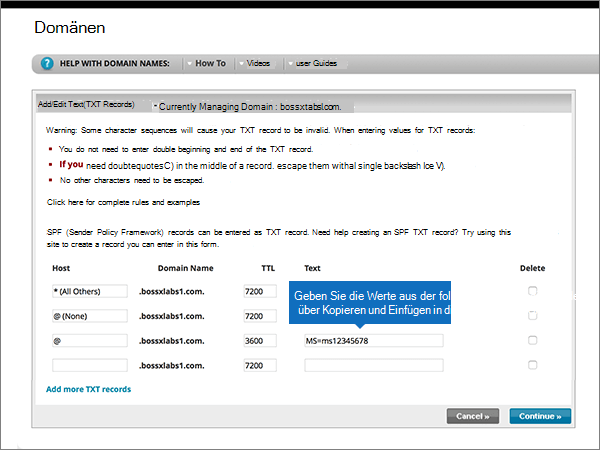

# Skapa DNS-poster på Network Solutions för Office 365Create DNS records at Network Solutions for Office 365

 **[Läs frågor och svar om domäner](../setup/domains-faq.md)** om du inte hittar det du letar efter.**[Check the Domains FAQ](../setup/domains-faq.md)** if you don't find what you're looking for. 
  
Om Network Solutions är din DNS-värd följer du stegen i den här artikeln för att verifiera din domän och konfigurera DNS-poster för e-post, Skype för företag - Online och så vidare.If Network Solutions is your DNS hosting provider, follow the steps in this article to verify your domain and set up DNS records for email, Skype for Business Online, and so on.
  
Det här är de viktigaste posterna att lägga till.These are the main records to add. Följ stegen nedan eller [titta på videon](https://support.office.com/article/Video-Create-DNS-records-at-Network-Solutions-for-Office-365-c49698c2-6991-47fb-b5ac-18e49a505099?ui=en-US&amp;rs=en-US&amp;ad=US).Follow the steps below or [watch the video](https://support.office.com/article/Video-Create-DNS-records-at-Network-Solutions-for-Office-365-c49698c2-6991-47fb-b5ac-18e49a505099?ui=en-US&amp;rs=en-US&amp;ad=US). 
  
- [Lägga till en TXT-post för verifieringAdd a TXT record for verification](#add-a-txt-record-for-verification)
    
- [Lägga till en MX-post så att e-post för din domän kommer till Office 365Add an MX record so email for your domain will come to Office 365](#add-an-mx-record-so-email-for-your-domain-will-come-to-office-365)
    
- [Lägg till CNAME-posterna som krävs för Office 365Add the CNAME records that are required for Office 365](#add-the-cname-records-that-are-required-for-office-365)
    
- [Lägga till en TXT-post för SPF för att förhindra skräppostAdd a TXT record for SPF to help prevent email spam](#add-a-txt-record-for-spf-to-help-prevent-email-spam)
    
- [Lägga till de två SRV-posterna som krävs för Office 365Add the two SRV records that are required for Office 365](#add-the-two-srv-records-that-are-required-for-office-365)
    
När du har lagt till dessa poster på Network Solutions är din domän konfigurerad för att fungera med Office 365-tjänster.After you add these records at Network Solutions, your domain will be set up to work with Office 365 services.
  
Mer information om webbvärdverktyg och DNS för webbplatser med Office 365 finns i [Använda en offentlig webbplats med Office 365](https://support.office.com/article/choose-a-public-website-3325d50e-d131-403c-a278-7f3296fe33a9).To learn about webhosting and DNS for websites with Office 365, see [Use a public website with Office 365](https://support.office.com/article/choose-a-public-website-3325d50e-d131-403c-a278-7f3296fe33a9).
  
> [!NOTE]
>  Det brukar ta ungefär 15 minuter för DNS-ändringarna att gå igenom. Ibland kan det dock ta längre tid att uppdatera DNS-systemet på Internet för en ändring som du har gjort. Om du stöter på problem med e-postflödet eller får andra problem när du har lagt till DNS-posterna, går du till [Felsöka problem när du har ändrat domännamn eller DNS-poster](../get-help-with-domains/find-and-fix-issues.md).Typically it takes about 15 minutes for DNS changes to take effect. However, it can occasionally take longer for a change you've made to update across the Internet's DNS system. If you're having trouble with mail flow or other issues after adding DNS records, see [Troubleshoot issues after changing your domain name or DNS records](../get-help-with-domains/find-and-fix-issues.md). 
  
## Lägga till en TXT-post för verifieringAdd a TXT record for verification

Innan du använder din domän med Office 365, vill vi vara säkra på att det är du som äger den. Att du kan logga in på ditt konto hos domänregistratorn och skapa DNS-posten bevisar för Office 365 att du äger domänen.Before you use your domain with Office 365, we have to make sure that you own it. Your ability to log in to your account at your domain registrar and create the DNS record proves to Office 365 that you own the domain.
  
> [!NOTE]
> Den här posten används endast för att verifiera att du äger domänen. Den påverkar ingenting annat. Du kan ta bort den senare om du vill.This record is used only to verify that you own your domain; it doesn't affect anything else. You can delete it later, if you like. 
  
Följ stegen nedan eller [titta på videon (börja vid 0:47)](https://support.office.com/article/Video-Create-DNS-records-at-Network-Solutions-for-Office-365-c49698c2-6991-47fb-b5ac-18e49a505099?ui=en-US&amp;rs=en-US&amp;ad=US).Follow the steps below or [watch the video (start at 0:47)](https://support.office.com/article/Video-Create-DNS-records-at-Network-Solutions-for-Office-365-c49698c2-6991-47fb-b5ac-18e49a505099?ui=en-US&amp;rs=en-US&amp;ad=US).
  
1. Kom igång genom att gå till domänsidan på Network Solutions med [den här länken](https://www.networksolutions.com/manage-it).To get started, go to your domains page at Network Solutions by using [this link](https://www.networksolutions.com/manage-it). Du uppmanas att logga in.You'll be prompted to log in.
    
    > [!IMPORTANT]
    > Innan du väljer **knappen Logga in** väljer du först Hantera mina **domännamn** i **listrutan Logga in till:** .Before you select the **Login** button, first choose **Manage My Domain Names** in the **Log In to:** drop-down list. 
  
    
  
2. Markera kryssrutan bredvid namnet på den domän som du uppdaterar.Select the check box next to the name of the domain that you are modifying.
    
    
  
3. Välj **Redigera DNS**.Select **Edit DNS**.
    
    
  
4. Välj **Hantera avancerade DNS-poster**.Select **Manage Advanced DNS Records**.
    
    (Du kan behöva rulla nedåt.)(You may have to scroll down.)
    
    
  
5. Bläddra ned till avsnittet **Text (TXT Records)** och välj sedan **Redigera TXT-poster**.Scroll down to the **Text (TXT Records)** section, and then select **Edit TXT Records**.
    
    
  
6. I rutorna för den nya posten skriver du in, eller kopierar och klistrar in, värdena i följande tabell.In the boxes for the new record, type or copy and paste the values in the following table.
    
    |**Host****Host**|**TTL****TTL**|**Text****Text**|
    |:-----|:-----|:-----|
    |@    (Värdet ändras till **@ (None)** när du sparar posten.)(The system will change this value to **@ (None)** when you save the record.)    |36003600    |MS=ms *XXXXXXXX*MS=ms *XXXXXXXX*    **Obs!** Det här är ett exempel.**Note:** This is an example. Använd det specifika värdet för **Mål eller pekar på-adress** här, från tabellen i Office 365.Use your specific **Destination or Points to Address** value here, from the table in Office 365.  [Hur hittar jag det här?How do I find this?](../get-help-with-domains/information-for-dns-records.md)   |
       
    
  
7. Välj **Fortsätt**.Select **Continue**.
    
    
  
8. Välj **Spara ändringar**.Select **Save Changes**.
    
    
  
9. Vänta några minuter innan du fortsätter, så att den post som du nyss skapade kan uppdateras på Internet.Wait a few minutes before you continue, so that the record you just created can update across the Internet.
    
Nu när du har lagt till posten på domänregistratorns webbplats går du tillbaka till Office 365 och begär att Office 365 letar efter posten.Now that you've added the record at your domain registrar's site, you'll go back to Office 365 and request Office 365 to look for the record.
  
När Office 365 hittar rätt TXT-post är din domän verifierad.When Office 365 finds the correct TXT record, your domain is verified.

1. I administrationscentret går du till **Inställningar** \> <a href="https://go.microsoft.com/fwlink/p/?linkid=834818" target="_blank">Domains</a>.In the admin center, go to the **Settings** \> <a href="https://go.microsoft.com/fwlink/p/?linkid=834818" target="_blank">Domains</a> page.
    
2. På sidan **Domains** väljer du den domän du verifierar.On the **Domains** page, select the domain that you are verifying. 
    
    
  
3. På sidan **Setup** väljer du **Start setup**.On the **Setup** page, select **Start setup**.
    
    
  
4. På sidan **Verify domain** väljer du **Verify**.On the **Verify domain** page, select **Verify**.
    
    
  
> [!NOTE]
>  Det brukar ta ungefär 15 minuter för DNS-ändringarna att gå igenom. Ibland kan det dock ta längre tid att uppdatera DNS-systemet på Internet för en ändring som du har gjort. Om du stöter på problem med e-postflödet eller får andra problem när du har lagt till DNS-posterna, går du till [Felsöka problem när du har ändrat domännamn eller DNS-poster](../get-help-with-domains/find-and-fix-issues.md).Typically it takes about 15 minutes for DNS changes to take effect. However, it can occasionally take longer for a change you've made to update across the Internet's DNS system. If you're having trouble with mail flow or other issues after adding DNS records, see [Troubleshoot issues after changing your domain name or DNS records](../get-help-with-domains/find-and-fix-issues.md). 
  
## Lägga till en MX-post så att e-post för din domän kommer till Office 365Add an MX record so email for your domain will come to Office 365

Följ stegen nedan eller [titta på videon (börja vid 3:51)](https://support.office.com/article/Video-Create-DNS-records-at-Network-Solutions-for-Office-365-c49698c2-6991-47fb-b5ac-18e49a505099?ui=en-US&amp;rs=en-US&amp;ad=US).Follow the steps below or [watch the video (start at 3:51)](https://support.office.com/article/Video-Create-DNS-records-at-Network-Solutions-for-Office-365-c49698c2-6991-47fb-b5ac-18e49a505099?ui=en-US&amp;rs=en-US&amp;ad=US).
  
1. Kom igång genom att gå till domänsidan på Network Solutions med [den här länken](https://www.networksolutions.com/manage-it).To get started, go to your domains page at Network Solutions by using [this link](https://www.networksolutions.com/manage-it). Du uppmanas att logga in.You'll be prompted to log in.
    
    > [!IMPORTANT]
    > Innan du väljer **knappen Logga in** väljer du först Hantera mina **domännamn** i **listrutan Logga in till:** .Before you select the **Login** button, first choose **Manage My Domain Names** in the **Log In to:** drop-down list. 
  
    
  
2. Markera kryssrutan bredvid namnet på den domän som du uppdaterar.Select the check box next to the name of the domain that you are modifying.
    
    
  
3. Välj **Redigera DNS**.Select **Edit DNS**.
    
    
  
4. Välj **Hantera avancerade DNS-poster**.Select **Manage Advanced DNS Records**.
    
    (Du kan behöva rulla nedåt.)(You may have to scroll down.)
    
    
  
5. Bläddra ned till avsnittet **E-postservrar (MX Records)** och välj sedan **Redigera MX-poster**.Scroll down to the **Mail Servers (MX Records)** section, and then select **Edit MX Records**.
    
    
  
6. I den nya postens rutor skriver du in, eller kopierar och klistrar in, värdena från följande tabell.In the boxes for the new record, type or copy and paste the values from the following table.
    
    |**Prioritet****Priority**|**TTL****TTL**|**Mail Server****Mail Server**|
    |:-----|:-----|:-----|
    |1010    Mer information om prioritet finns i [Vad är MX-prioritet?](https://support.office.com/article/2784cc4d-95be-443d-b5f7-bb5dd867ba83.aspx)For more information about priority, see [What is MX priority?](https://support.office.com/article/2784cc4d-95be-443d-b5f7-bb5dd867ba83.aspx)   |36003600    | *\<domännyckel\>*  .mail.protection.outlook.com.*\<domain-key\>*  .mail.protection.outlook.com.    **Värdet MÅSTE sluta med en punkt (.)****This value MUST end with a period (.)**   **Anm.:** Hämta \* \<domännyckeln\> \* från ditt Office 365-konto.**Note:** Get your  *\<domain-key\>*  from your Office 365 account. [Hur hittar jag det här?How do I find this?](../get-help-with-domains/information-for-dns-records.md)          |
       
    
  
7. Välj **Fortsätt**.Select **Continue**.
    
    
  
8. Välj **Spara ändringar**.Select **Save Changes**.
    
    
  
9. Om det finns andra MX-poster tar du bort alla genom att välja **Delete** för varje post.If there are any other MX records, delete all of them by selecting **Delete** for each record. 
    
    
  
10. När alla är markerade väljer du **Fortsätt**.When they are all selected, select **Continue**.
    
    
  
11. Välj **Spara ändringar**.Select **Save Changes**.
    
    
  
## Lägga till CNAME-posterna som krävs för Office 365Add the CNAME records that are required for Office 365

Följ stegen nedan eller [titta på videon (börja vid 4:43)](https://support.office.com/article/Video-Create-DNS-records-at-Network-Solutions-for-Office-365-c49698c2-6991-47fb-b5ac-18e49a505099?ui=en-US&amp;rs=en-US&amp;ad=US).Follow the steps below or [watch the video (start at 4:43)](https://support.office.com/article/Video-Create-DNS-records-at-Network-Solutions-for-Office-365-c49698c2-6991-47fb-b5ac-18e49a505099?ui=en-US&amp;rs=en-US&amp;ad=US).
  
1. Kom igång genom att gå till domänsidan på Network Solutions med [den här länken](https://www.networksolutions.com/manage-it).To get started, go to your domains page at Network Solutions by using [this link](https://www.networksolutions.com/manage-it). Du uppmanas att logga in.You'll be prompted to log in.
    
    > [!IMPORTANT]
    > Innan du väljer **knappen Logga in** väljer du först Hantera mina **domännamn** i **listrutan Logga in till:** .Before you select the **Login** button, first choose **Manage My Domain Names** in the **Log In to:** drop-down list. 
  
    
  
2. Markera kryssrutan bredvid namnet på den domän som du uppdaterar.Select the check box next to the name of the domain that you are modifying.
    
    
  
3. Välj **Redigera DNS**.Select **Edit DNS**.
    
    
  
4. Välj **Hantera avancerade DNS-poster**.Select **Manage Advanced DNS Records**.
    
    (Du kan behöva rulla nedåt.)(You may have to scroll down.)
    
    
  
5. Bläddra ned till avsnittet **Värdalias (CNAME Records)** och välj sedan **Redigera CNAME-poster**.Scroll down to the **Host Aliases (CNAME Records)** section, and then select **Edit CNAME Records**.
    
    
  
6. I rutorna för de fyra nya posterna skriver du, eller kopierar och klistrar in, värdena från följande tabell.In the boxes for the four new records, type or copy and paste the values from the following table.
    
    |**Alias****Alias**|**TTL****TTL**|**Refers to Host Name****Refers to Host Name**|**Other Host          (välj alternativknappen **Other Host**)****Other Host          (select the **Other Host** option button)**|
    |:-----|:-----|:-----|:-----|
    |autodiscoverautodiscover    |36003600    |(Ingen inställning)(No setting)    |autodiscover.outlook.com.autodiscover.outlook.com.    **Värdet MÅSTE sluta med en punkt (.)****This value MUST end with a period (.)**   |
    |sipsip    |36003600    |(Ingen inställning)(No setting)    |sipdir.online.lync.com.sipdir.online.lync.com.    **Värdet MÅSTE sluta med en punkt (.)****This value MUST end with a period (.)**   |
    |lyncdiscoverlyncdiscover    |36003600    |(Ingen inställning)(No setting)    |webdir.online.lync.com.webdir.online.lync.com.    **Värdet MÅSTE sluta med en punkt (.)****This value MUST end with a period (.)**   |
    |enterpriseregistrationenterpriseregistration    |36003600    |(Ingen inställning)(No setting)    |enterpriseregistration.windows.netenterpriseregistration.windows.net    **Värdet MÅSTE sluta med en punkt (.)****This value MUST end with a period (.)**   |
    |enterpriseenrollmententerpriseenrollment    |36003600    |(Ingen inställning)(No setting)    |enterpriseenrollment-s.manage.microsoft.comenterpriseenrollment-s.manage.microsoft.com    **Värdet MÅSTE sluta med en punkt (.)****This value MUST end with a period (.)**   |
    
    
  
7. När du har lagt till alla CNAME-poster som du behöver väljer du **Fortsätt**.When you have added all of the CNAME records that you need, select **Continue**.
    
    
  
8. Välj **Spara ändringar**.Select **Save Changes**.
    
    
  
## Lägga till en TXT-post för SPF för att förhindra skräppostAdd a TXT record for SPF to help prevent email spam

> [!IMPORTANT]
> Du kan inte ha fler än en TXT-post för SPF för en domän.You cannot have more than one TXT record for SPF for a domain. Om din domän har fler än en SPF-post får du e-postfel och problem med leveranser och skräppostklassificering.If your domain has more than one SPF record, you'll get email errors, as well as delivery and spam classification issues. Om du redan har en SPF-post för domänen ska du inte skapa en ny för Office 365.If you already have an SPF record for your domain, don't create a new one for Office 365. Lägg istället till de obligatoriska Office 365-värdena i den aktuella posten, så att du har en  *enda*  SPF-post som innehåller båda uppsättningarna med värden.Instead, add the required Office 365 values to the current record so that you have a  *single*  SPF record that includes both sets of values. 
  
Följ stegen nedan eller [titta på videon (börja vid 5:35)](https://support.office.com/article/Video-Create-DNS-records-at-Network-Solutions-for-Office-365-c49698c2-6991-47fb-b5ac-18e49a505099?ui=en-US&amp;rs=en-US&amp;ad=US).Follow the steps below or [watch the video (start at 5:35)](https://support.office.com/article/Video-Create-DNS-records-at-Network-Solutions-for-Office-365-c49698c2-6991-47fb-b5ac-18e49a505099?ui=en-US&amp;rs=en-US&amp;ad=US).
  
1. Kom igång genom att gå till domänsidan på Network Solutions med [den här länken](https://www.networksolutions.com/manage-it).To get started, go to your domains page at Network Solutions by using [this link](https://www.networksolutions.com/manage-it). Du uppmanas att logga in.You'll be prompted to log in.
    
    > [!IMPORTANT]
    > Innan du väljer **knappen Logga in** väljer du först Hantera mina **domännamn** i **listrutan Logga in till:** .Before you select the **Login** button, first choose **Manage My Domain Names** in the **Log In to:** drop-down list. 
  
    
  
2. Markera kryssrutan bredvid namnet på den domän som du uppdaterar.Select the check box next to the name of the domain that you are modifying.
    
    
  
3. Välj **Redigera DNS**.Select **Edit DNS**.
    
    
  
4. Välj **Hantera avancerade DNS-poster**.Select **Manage Advanced DNS Records**.
    
    (Du kan behöva rulla nedåt.)(You may have to scroll down.)
    
    
  
5. Bläddra ned till avsnittet **Text (TXT Records)** och välj sedan **Redigera TXT-poster**.Scroll down to the **Text (TXT Records)** section, and then select **Edit TXT Records**.
    
    
  
6. I rutorna för den nya posten skriver du in eller kopierar och klistrar in följande värden.In the boxes for the new record, type or copy and paste the following values.
    
    |**Host****Host**|**TTL****TTL**|**Text****Text**|
    |:-----|:-----|:-----|
    |@    (Värdet ändras till **@ (None)** när du sparar posten.)(The system will change this value to **@ (None)** when you save the record.)    |36003600    |v=spf1 include:spf.protection.outlook.com -allv=spf1 include:spf.protection.outlook.com -all    **Obs!** Vi rekommenderar att du kopierar och klistrar in den här posten så att alla avstånd förblir korrekta.    **Note:** We recommend copying and pasting this entry, so that all of the spacing stays correct. |
       
    
  
7. Välj **Fortsätt**.Select **Continue**.
    
    
  
8. Välj **Spara ändringar**.Select **Save Changes**.
    
    
  
## Lägga till de två SRV-posterna som krävs för Office 365Add the two SRV records that are required for Office 365

Följ stegen nedan eller [titta på videon (börja vid 6:18)](https://support.office.com/article/Video-Create-DNS-records-at-Network-Solutions-for-Office-365-c49698c2-6991-47fb-b5ac-18e49a505099?ui=en-US&amp;rs=en-US&amp;ad=US).Follow the steps below or [watch the video (start at 6:18)](https://support.office.com/article/Video-Create-DNS-records-at-Network-Solutions-for-Office-365-c49698c2-6991-47fb-b5ac-18e49a505099?ui=en-US&amp;rs=en-US&amp;ad=US).
  
1. Kom igång genom att gå till domänsidan på Network Solutions med [den här länken](https://www.networksolutions.com/manage-it). Du uppmanas att logga in.To get started, go to your domains page at Network Solutions by using [this link](https://www.networksolutions.com/manage-it). You'll be prompted to log in.
    
    > [!IMPORTANT]
    > Innan du väljer **knappen Logga in** väljer du först Hantera mina **domännamn** i **listrutan Logga in till:** .Before you select the **Login** button, first choose **Manage My Domain Names** in the **Log In to:** drop-down list. 
  
    
  
2. Markera kryssrutan bredvid namnet på den domän som du uppdaterar.Select the check box next to the name of the domain that you are modifying.
    
    
  
3. Välj **Redigera DNS**.Select **Edit DNS**.
    
    
  
4. Välj **Hantera avancerade DNS-poster**.Select **Manage Advanced DNS Records**.
    
    (Du kan behöva rulla nedåt.)(You may have to scroll down.)
    
    
  
5. Bläddra ned till avsnittet **Service (SRV Records)** och välj sedan **Redigera SRV-poster**.Scroll down to the **Service (SRV Records)** section, and then select **Edit SRV Records**.
    
    
  
6. I rutorna för de två nya posterna skriver du, eller kopierar och klistrar in, värdena från följande tabell.In the boxes for the two new records, type or copy and paste the values from the following table.
    
    (Välj värdena för **Service** och **Protocol** i listrutorna.)(Choose the **Service** and **Protocol** values from the drop-down lists.) 
    
    |**Service****Service**|**Protocol****Protocol**|**TTL****TTL**|**Prioritet****Priority**|**Vikt****Weight**|**Port****Port**|**Target****Target**|
    |:-----|:-----|:-----|:-----|:-----|:-----|:-----|
    |_sip_sip    |_tls_tls    |36003600    |100100    |11    |443443    |sipdir.online.lync.com.sipdir.online.lync.com.    **Värdet MÅSTE sluta med en punkt (.)****This value MUST end with a period (.)**   |
    |_sipfederationtls_sipfederationtls    |_tcp_tcp    |36003600    |100100    |11    |50615061    |sipfed.online.lync.com.sipfed.online.lync.com.    **Värdet MÅSTE sluta med en punkt (.)****This value MUST end with a period (.)**   |
       
    
  
7. Välj **Fortsätt**.Select **Continue**.
    
    
  
8. Välj **Spara ändringar**.Select **Save Changes**.
    
    
  
> [!NOTE]
>  Det brukar ta ungefär 15 minuter för DNS-ändringarna att gå igenom. Ibland kan det dock ta längre tid att uppdatera DNS-systemet på Internet för en ändring som du har gjort. Om du stöter på problem med e-postflödet eller får andra problem när du har lagt till DNS-posterna, går du till [Felsöka problem när du har ändrat domännamn eller DNS-poster](../get-help-with-domains/find-and-fix-issues.md).Typically it takes about 15 minutes for DNS changes to take effect. However, it can occasionally take longer for a change you've made to update across the Internet's DNS system. If you're having trouble with mail flow or other issues after adding DNS records, see [Troubleshoot issues after changing your domain name or DNS records](../get-help-with-domains/find-and-fix-issues.md). 
  
