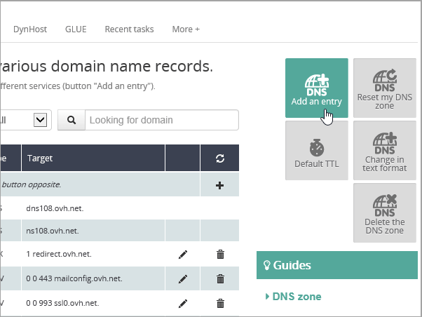

# Skapa DNS-poster för Office 365 hos OVH

[Läs frågor och svar om domäner](../setup/domains-faq.md) om du inte hittar det du letar efter. 
  
Om OVH är din DNS-värd följer du stegen i den här artikeln för att verifiera din domän och konfigurera DNS-poster för e-post, Skype for Business Online och så vidare.
  
Det här är de viktigaste posterna att lägga till. 
  
- [Skapa DNS-poster på OVH för Office 365](#create-dns-records-at-ovh-for-office-365)
    
- [Lägga till en MX-post så att e-post för din domän kommer till Office 365](#add-an-mx-record-so-email-for-your-domain-will-come-to-office-365)
    
- [Lägg till CNAME-posterna som krävs för Office 365](#add-the-cname-records-that-are-required-for-office-365)
    
- [Lägga till en TXT-post för SPF för att förhindra skräppost](#add-a-txt-record-for-spf-to-help-prevent-email-spam)
    
- [Lägga till de två SRV-posterna som krävs för Office 365](#add-the-two-srv-records-that-are-required-for-office-365)
    
När du har lagt till dessa poster på OVH är din domän konfigurerad för att fungera med Office 365-tjänster.
  
Mer information om webbvärdverktyg och DNS för webbplatser med Office 365 finns i [Använda en offentlig webbplats med Office 365](https://support.office.com/article/a8178510-501d-4bd8-9921-b04f2e9517a5.aspx).
  
> [!NOTE]
>  Det brukar ta ungefär 15 minuter för DNS-ändringarna att gå igenom. Ibland kan det dock ta längre tid att uppdatera DNS-systemet på Internet för en ändring som du har gjort. Om du stöter på problem med e-postflödet eller får andra problem när du har lagt till DNS-posterna, går du till [Felsöka problem när du har ändrat domännamn eller DNS-poster](../get-help-with-domains/find-and-fix-issues.md). 
  
## Lägga till en TXT-post för verifiering

Innan du använder din domän med Office 365, vill vi vara säkra på att det är du som äger den. Att du kan logga in på ditt konto hos domänregistratorn och skapa DNS-posten bevisar för Office 365 att du äger domänen.
  
> [!NOTE]
> Den här posten används endast för att verifiera att du äger domänen. Den påverkar ingenting annat. Du kan ta bort den senare om du vill. 
  
1. Kom igång genom att gå till domänsidan på OVH med [den här länken](https://www.ovh.com/manager/). Du uppmanas att logga in först.
    
    
  
2. Under **Domäner**väljer du namnet på den domän som du vill redigera.
    
    
  
3. Välj **DNS-zon**.
    
    
  
4. Välj **Lägg till en post**.
    
    
  
5. Välj **TXT**
    
    
  
6. I den nya postens rutor skriver du in, eller kopierar och klistrar in, värdena från följande tabell. Om du vill tilldela ett TTL-värde väljer du **Anpassad** i listrutan och skriver sedan värdet i textrutan. 
    
    |**Record type**|**Underdomän**|**TTL**|**Värde**|
    |:-----|:-----|:-----|:-----|
    |TXT    |(lämna tomt)    |3600 (sekunder)    |MS=msxxxxxxxx    **Obs!** Det här är ett exempel. Använd det specifika värdet för **Mål eller pekar på-adress** här, från tabellen i Office 365.           [Hur hittar jag det?](../get-help-with-domains/information-for-dns-records.md)          |
   
7. Välj **Bekräfta**. 
    
    
  
8. Vänta några minuter innan du fortsätter, så att den post som du nyss skapade kan uppdateras på Internet.
    
Nu när du har lagt till posten på domänregistratorns webbplats går du tillbaka till Office 365 och begär att Office 365 letar efter posten.
  
När Office 365 hittar rätt TXT-post är din domän verifierad.
  
1. I administrationscentret går du till **Inställningar** \> <a href="https://go.microsoft.com/fwlink/p/?linkid=834818" target="_blank">Domains</a>.
    
2. På sidan **Domains** väljer du den domän du verifierar. 
    
    
  
3. På sidan **Setup** väljer du **Start setup**.
    
    
  
4. På sidan **Verify domain** väljer du **Verify**.
    
    
  
> [!NOTE]
>  Det brukar ta ungefär 15 minuter för DNS-ändringarna att gå igenom. Ibland kan det dock ta längre tid att uppdatera DNS-systemet på Internet för en ändring som du har gjort. Om du stöter på problem med e-postflödet eller får andra problem när du har lagt till DNS-posterna, går du till [Felsöka problem när du har ändrat domännamn eller DNS-poster](../get-help-with-domains/find-and-fix-issues.md). 
  
## Lägga till en MX-post så att e-post för din domän kommer till Office 365

1. Kom igång genom att gå till domänsidan på OVH med [den här länken](https://www.ovh.com/manager/). Du uppmanas att logga in först.
    
    
  
2. Under **Domäner**väljer du namnet på den domän som du vill redigera.
    
    
  
3. Välj **DNS-zon**.
    
    
  
4. Välj **Lägg till en post**.
    
    
  
5. Välj **MX**.
    
    
  
6. I rutorna för den nya posten skriver du in, eller kopierar och klistrar in, värdena från följande tabell. Om du vill tilldela ett TTL-värde väljer du **Anpassad** i listrutan och skriver sedan värdet i textrutan. 
    
    > [!NOTE]
    > Som standard använder OVH relativ notation för målet, som lägger till domännamnet i slutet av målposten. Lägg till en punkt i målposten, som visas i tabellen nedan, om du vill använda absolut notation i stället. 
  
    |**Record type**|**Underdomän**|**TTL**|**Priority**|**Target**|
    |:-----|:-----|:-----|:-----|:-----|
    |MX    |(lämna tomt)    |3600 (sekunder)    |10    Mer information om prioritet finns i [Vad är MX-prioritet?](https://support.office.com/article/2784cc4d-95be-443d-b5f7-bb5dd867ba83.aspx)   |\<domännyckel\>.mail.protection.outlook.com.    **Anm.:** Hämta * \<domännyckeln\> * från ditt Office 365-konto.  [Hur hittar jag det här?](../get-help-with-domains/information-for-dns-records.md)  |
   
    
  
7. Välj **Nästa**.
    
    
  
8. Välj **Bekräfta**.
    
    
  
9. Om det finns andra MX-poster kan du ta bort alla i listan på sidan **DNS Zone**. Markera varje post och välj sedan ikonen Papperskorgen **Ta bort** i kolumnen **Åtgärder.** 
    
    
  
10. Välj **Bekräfta**.
    
## Lägga till CNAME-posterna som krävs för Office 365

1. Kom igång genom att gå till domänsidan på OVH med [den här länken](https://www.ovh.com/manager/). Du uppmanas att logga in först.
    
    
  
2. Under **Domäner**väljer du namnet på den domän som du vill redigera.
    
    
  
3. Välj **DNS-zon**.
    
    
  
4. Välj **Lägg till en post**.
    
    
  
5. Välj **CNAME**.
    
    
  
6. Skapa den första CNAME-posten.
    
    I rutorna för den nya posten anger du eller kopierar och klistrar in värdena från den första raden i följande tabell. Om du vill tilldela ett TTL-värde väljer du **Anpassad** i listrutan och skriver sedan värdet i textrutan. 
    
    |**Record type**|**Sub-domain (Underdomän)**|**Target (mål)**|**TTL**|
    |:-----|:-----|:-----|:-----|
    |CNAME    |autodiscover    |autodiscover.outlook.com.    |3600 sekunder    |
    |CNAME    |sip    |sipdir.online.lync.com.    |3600 sekunder    |
    |CNAME    |lyncdiscover    |webdir.online.lync.com.    |3600 sekunder    |
    |CNAME    |enterpriseregistration    |enterpriseregistration.windows.net.    |3600 sekunder    |
    |CNAME    |enterpriseenrollment    |enterpriseenrollment-s.manage.microsoft.com.    |3600 sekunder    |
   
    
  
7. Välj **Nästa**.
    
    
  
8. Välj **Bekräfta**.
    
9. Upprepa föregående steg för att skapa de andra fem CNAME-posterna.
    
    För varje post skriver du in, eller kopierar och klistrar in, värdena från nästa rad i tabellen ovan i rutorna för den posten.
    
## Lägga till en TXT-post för SPF för att förhindra skräppost

> [!IMPORTANT]
> Du kan inte ha fler än en TXT-post för SPF för en domän. Om din domän har fler än en SPF-post får du e-postfel och problem med leveranser och skräppostklassificering. Om du redan har en SPF-post för domänen ska du inte skapa en ny för Office 365. Lägg istället till de obligatoriska Office 365-värdena i den aktuella posten, så att du har en  *enda*  SPF-post som innehåller båda uppsättningarna med värden. 
  
1. Kom igång genom att gå till domänsidan på OVH med [den här länken](https://www.ovh.com/manager/). Du uppmanas att logga in först.
    
    
  
2. Under **Domäner**väljer du namnet på den domän som du vill redigera.
    
    
  
3. Välj **DNS-zon**.
    
    
  
4. Välj **Lägg till en post**.
    
    
  
5. Välj **TXT**.
    
6. I rutorna för den nya posten skriver du in eller kopierar och klistrar in följande värden.
    
    |**Record type**|**Underdomän**|**TTL**|**TXT Value**|
    |:-----|:-----|:-----|:-----|
    |TXT    |(lämna tomt)    |3600 (sekunder)    |v=spf1 include:spf.protection.outlook.com -all    **Obs!** Vi rekommenderar att du kopierar och klistrar in den här posten så att alla avstånd förblir korrekta.               |
   
    
  
7. Välj **Nästa**.
    
    
  
8. Välj **Bekräfta**.
    
    
  
## Lägga till de två SRV-posterna som krävs för Office 365

1. Kom igång genom att gå till domänsidan på OVH med [den här länken](https://www.ovh.com/manager/). Du uppmanas att logga in först.
    
    
  
2. Under **Domäner**väljer du namnet på den domän som du vill redigera.
    
    
  
3. Välj **DNS-zon**.
    
    
  
4. Välj **Lägg till en post**.
    
    
  
5. Välj **SRV**.
    
    
  
6. Skapa den första SRV-posten.
    
    I rutorna för den nya posten anger du eller kopierar och klistrar in värdena från den första raden i följande tabell. Om du vill tilldela ett TTL-värde väljer du **Anpassad** i listrutan och skriver sedan värdet i textrutan. 
    
    |**Record type**|**Sub-domain (Underdomän)**|**Prioritet**|**Vikt**|**Port**|**TTL**|**Target**|
    |:-----|:-----|:-----|:-----|:-----|:-----|:-----|
    |SRV (Service)    |_sip._tls    |100    |1    |443    |3600 (sekunder)    |sipdir.online.lync.com.    |
    |SRV (Service)    |_sipfederationtls._tcp    |100    |1    |5061    |3600 (sekunder)    |sipfed.online.lync.com.    |
       
    
  
7. Välj **Nästa**.
    
    
  
8. Välj **Bekräfta**.
    
9. Upprepa stegen för att skapa den andra SRV-posten. I rutorna för den andra posten skriver du in, eller kopierar och klistrar in, värdena från den andra raden i tabellen ovan.
    
> [!NOTE]
>  Det brukar ta ungefär 15 minuter för DNS-ändringarna att gå igenom. Ibland kan det dock ta längre tid att uppdatera DNS-systemet på Internet för en ändring som du har gjort. Om du stöter på problem med e-postflödet eller får andra problem när du har lagt till DNS-posterna, går du till [Felsöka problem när du har ändrat domännamn eller DNS-poster](../get-help-with-domains/find-and-fix-issues.md). 
  
