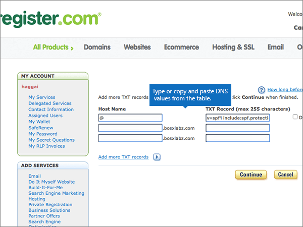

# Skapa DNS-poster på Register.com för MicrosoftCreate DNS records at Register.com for Microsoft

 **[Läs frågor och svar om domäner](../setup/domains-faq.md)** om du inte hittar det du letar efter.**[Check the Domains FAQ](../setup/domains-faq.md)** if you don't find what you're looking for. 
  
Om Register.com är din DNS-värd följer du stegen i den här artikeln för att verifiera din domän och konfigurera DNS-poster för e-post, Skype för företag - Online och så vidare.If Register.com is your DNS hosting provider, follow the steps in this article to verify your domain and set up DNS records for email, Skype for Business Online, and so on.
  
Det här är de viktigaste posterna att lägga till.These are the main records to add. Följ stegen nedan eller [titta på videon](https://support.office.com/article/Video-Create-DNS-records-at-Register-com-for-Office-365-7448dd9e-c0e7-4d5e-a7e9-f0e4715433c4?ui=en-US&amp;rs=en-US&amp;ad=US).Follow the steps below or [watch the video](https://support.office.com/article/Video-Create-DNS-records-at-Register-com-for-Office-365-7448dd9e-c0e7-4d5e-a7e9-f0e4715433c4?ui=en-US&amp;rs=en-US&amp;ad=US).
  
- [Lägga till en TXT-post på Register.com för att verifiera att det är din domänAdd a TXT record at Register.com to verify that you own the domain](#add-a-txt-record-at-registercom-to-verify-that-you-own-the-domain)
    
- [Lägg till en MX-post så att e-post för din domän kommer till MicrosoftAdd an MX record so email for your domain will come to Microsoft](#add-an-mx-record-so-email-for-your-domain-will-come-to-microsoft)
    
- [Lägga till CNAME-poster som krävs för MicrosoftAdd the CNAME records that are required for Microsoft](#add-the-cname-records-that-are-required-for-microsoft)
    
- [Lägga till en TXT-post för SPF för att förhindra skräppostAdd a TXT record for SPF to help prevent email spam](#add-a-txt-record-for-spf-to-help-prevent-email-spam)

- [Lägg till de två SRV-poster som krävs för MicrosoftAdd the two SRV records that are required for Microsoft](#add-the-two-srv-records-that-are-required-for-microsoft)
    
När du har lagt till dessa poster i Register.com konfigureras domänen så att den fungerar med Microsoft-tjänster.After you add these records at Register.com, your domain will be set up to work with Microsoft services.
  
Mer information om webbhotell och DNS för webbplatser med Microsoft finns i [Använda en offentlig webbplats med Microsoft](https://support.office.com/article/choose-a-public-website-3325d50e-d131-403c-a278-7f3296fe33a9).To learn about webhosting and DNS for websites with Microsoft, see [Use a public website with Microsoft](https://support.office.com/article/choose-a-public-website-3325d50e-d131-403c-a278-7f3296fe33a9).
  
> [!NOTE]
> Det brukar ta ungefär 15 minuter för DNS-ändringarna att gå igenom.Typically it takes about 15 minutes for DNS changes to take effect. Ibland kan det dock ta längre tid att uppdatera DNS-systemet på Internet för en ändring som du har gjort.However, it can occasionally take longer for a change you've made to update across the Internet's DNS system. Om du har problem med e-postflödet eller andra problem när du har lagt till DNS-poster läser du [Hitta och åtgärda problem när du har lagt till domänen eller DNS-posterna](../get-help-with-domains/find-and-fix-issues.md).If you're having trouble with mail flow or other issues after adding DNS records, see [Find and fix issues after adding your domain or DNS records](../get-help-with-domains/find-and-fix-issues.md). 
  
## Lägga till en TXT-post på Register.com för att verifiera att det är din domänAdd a TXT record at Register.com to verify that you own the domain

Innan du använder domänen med Microsoft måste vi se till att du äger den.Before you use your domain with Microsoft, we have to make sure that you own it. Din förmåga att logga in på ditt konto hos domänregistratorer och skapa DNS-posten bevisar för Microsoft att du äger domänen.Your ability to log in to your account at your domain registrar and create the DNS record proves to Microsoft that you own the domain.
  
> [!NOTE]
> Den här posten används endast för att verifiera att du äger domänen. Den påverkar ingenting annat. Du kan ta bort den senare om du vill.This record is used only to verify that you own your domain; it doesn't affect anything else. You can delete it later, if you like. 
  
Följ stegen nedan eller [titta på videon (börja vid 0:44)](https://support.office.com/article/Video-Create-DNS-records-at-Register-com-for-Office-365-7448dd9e-c0e7-4d5e-a7e9-f0e4715433c4?ui=en-US&amp;rs=en-US&amp;ad=US).Follow the steps below or [watch the video (start at 0:44)](https://support.office.com/article/Video-Create-DNS-records-at-Register-com-for-Office-365-7448dd9e-c0e7-4d5e-a7e9-f0e4715433c4?ui=en-US&amp;rs=en-US&amp;ad=US).
  
1. Kom igång genom att gå till domänsidan på Register.com med [den här länken](https://www.register.com/myaccount/).To get started, go to your domains page at Register.com by using [this link](https://www.register.com/myaccount/). Du uppmanas att logga in först.You'll be prompted to sign in.
    
2. Välj **Domäner**.Select **Domains**.
    
3. Välj **Hantera**.Select **Manage**.
    
4. Leta reda på raden som innehåller namnet på den domän som du vill ändra. och välj sedan **Hantera**på den raden .Find the row that contains the name of the domain that you want to modify; and then, in that row, select **Manage**.
    
5. Bläddra ned till avsnittet **Avancerade tekniska inställningar** och välj sedan Redigera **TXT Records (SPF)**.Scroll down to the **Advanced Technical Settings** section, and then select **Edit TXT Records (SPF)**.
    
6. I rutorna för den nya posten skriver du in, eller kopierar och klistrar in, värdena från följande tabell.In the boxes for the new record, type or copy and paste the values from the following table.
    
    |||
    |:-----|:-----|
    |**Värdnamn****Host Name**   |**TXT Record****TXT Record**   |
    |@    |MS=ms *XXXXXXXX*MS=ms *XXXXXXXX*    **Obs!** Det här är ett exempel.**Note:** This is an example. Använd ditt specifika **mål- eller poäng till-adress-värde** här, från bordet.Use your specific **Destination or Points to Address** value here, from the table. [Hur hittar jag det här?How do I find this?](../get-help-with-domains/information-for-dns-records.md)          |
   
7. Välj **Fortsätt**.Select **Continue**.
    
8. På nästa sida väljer du **Fortsätt** igen för att bekräfta dina ändringar.On the next page, select **Continue** again to confirm your changes. 
    
9. Vänta några minuter innan du fortsätter, så att den post som du nyss skapade kan uppdateras på Internet.Wait a few minutes before you continue, so that the record you just created can update across the Internet.
    
Nu när du har lagt till posten på domänregistratorerns webbplats går du tillbaka till Microsoft och begär posten.Now that you've added the record at your domain registrar's site, you'll go back to Microsoft and request the record.
  
När Microsoft hittar rätt TXT-post verifieras domänen.When Microsoft finds the correct TXT record, your domain is verified.
  
1. I administrationscentret går du till **Inställningar** \> <a href="https://go.microsoft.com/fwlink/p/?linkid=834818" target="_blank">Domains</a>.In the admin center, go to the **Settings** \> <a href="https://go.microsoft.com/fwlink/p/?linkid=834818" target="_blank">Domains</a> page.
    
2. På sidan **Domains** väljer du den domän du verifierar.On the **Domains** page, select the domain that you are verifying. 
    
3. På sidan **Setup** väljer du **Start setup**.On the **Setup** page, select **Start setup**.
    
4. På sidan **Verify domain** väljer du **Verify**.On the **Verify domain** page, select **Verify**.
    
> [!NOTE]
> Det brukar ta ungefär 15 minuter för DNS-ändringarna att gå igenom.Typically it takes about 15 minutes for DNS changes to take effect. Ibland kan det dock ta längre tid att uppdatera DNS-systemet på Internet för en ändring som du har gjort.However, it can occasionally take longer for a change you've made to update across the Internet's DNS system. Om du har problem med e-postflödet eller andra problem när du har lagt till DNS-poster läser du [Hitta och åtgärda problem när du har lagt till domänen eller DNS-posterna](../get-help-with-domains/find-and-fix-issues.md).If you're having trouble with mail flow or other issues after adding DNS records, see [Find and fix issues after adding your domain or DNS records](../get-help-with-domains/find-and-fix-issues.md). 
  
## Lägg till en MX-post så att e-post för din domän kommer till MicrosoftAdd an MX record so email for your domain will come to Microsoft

Följ stegen nedan eller [titta på videon (börja vid 3:32)](https://support.office.com/article/Video-Create-DNS-records-at-Register-com-for-Office-365-7448dd9e-c0e7-4d5e-a7e9-f0e4715433c4?ui=en-US&amp;rs=en-US&amp;ad=US).Follow the steps below or [watch the video (start at 3:32)](https://support.office.com/article/Video-Create-DNS-records-at-Register-com-for-Office-365-7448dd9e-c0e7-4d5e-a7e9-f0e4715433c4?ui=en-US&amp;rs=en-US&amp;ad=US).
  
1. Kom igång genom att gå till domänsidan på Register.com med [den här länken](https://www.register.com/myaccount/).To get started, go to your domains page at Register.com by using [this link](https://www.register.com/myaccount/). Du uppmanas att logga in först.You'll be prompted to sign in.
    
2. Välj **Domäner**.Select **Domains**.
    
3. Välj **Hantera**.Select **Manage**.
    
4. Leta reda på raden som innehåller namnet på den domän som du vill ändra. och välj sedan **Hantera**på den raden .Find the row that contains the name of the domain that you want to modify; and then, in that row, select **Manage**.
    
5. Bläddra till avsnittet **Avancerade tekniska inställningar** och välj sedan Redigera **e-postutväxlingsposter**.Scroll to the **Advanced Technical Settings** section, and then select **Edit Mail Exchanger Records**.
    
    
  
6. I den nya postens rutor skriver du in, eller kopierar och klistrar in, värdena från följande tabell.In the boxes for the new record, type or copy and paste the values from the following table.
    
    (Välj **prioritetsvärdet** i listrutan.)(Choose the **Priority** value from the drop-down list.) 
    
    |\*\*\*\*Host Name\*\*\*\*\*\*\*\*Host Name\*\*\*\*|\*\*\*\*Priority\*\*\*\*\*\*\*\*Priority\*\*\*\*|\*\*\*\*E-postserver\*\*\*\*\*\*\*\*Mail Server\*\*\*\*|
    |:-----|:-----|:-----|
    |@    |HighHigh    Mer information om prioritet finns i [Vad är MX-prioritet?](https://support.office.com/article/2784cc4d-95be-443d-b5f7-bb5dd867ba83.aspx)For more information about priority, see [What is MX priority?](https://support.office.com/article/2784cc4d-95be-443d-b5f7-bb5dd867ba83.aspx)   | *\<domännyckel\>*  .mail.protection.outlook.com*\<domain-key\>*  .mail.protection.outlook.com      **Anm.:** Hämta \< *domännyckeln* \> från ditt Microsoft-konto.**Note:** Get your \<*domain-key*\> from your Microsoft account.   [Hur hittar jag det här?How do I find this?](../get-help-with-domains/information-for-dns-records.md)          |
   
    
  
7. Om det redan finns andra MX-poster som visas, väljer du var och en av posterna och tar bort dem.If there were any other MX records already listed, select each of those records to be deleted.
    
    
  
8. Välj **Fortsätt**.Select **Continue**.
    
    
  
9. På nästa sida väljer du **Fortsätt** igen för att bekräfta och spara ändringarna.On the next page, select **Continue** again to confirm and save your changes. 
    
    
  
## Lägga till CNAME-poster som krävs för MicrosoftAdd the CNAME records that are required for Microsoft

Följ stegen nedan eller [titta på videon (börja vid 4:23)](https://support.office.com/article/Video-Create-DNS-records-at-Register-com-for-Office-365-7448dd9e-c0e7-4d5e-a7e9-f0e4715433c4?ui=en-US&amp;rs=en-US&amp;ad=US).Follow the steps below or [watch the video (start at 4:23)](https://support.office.com/article/Video-Create-DNS-records-at-Register-com-for-Office-365-7448dd9e-c0e7-4d5e-a7e9-f0e4715433c4?ui=en-US&amp;rs=en-US&amp;ad=US).
  
1. Kom igång genom att gå till domänsidan på Register.com med [den här länken](https://www.register.com/myaccount/).To get started, go to your domains page at Register.com by using [this link](https://www.register.com/myaccount/). Du uppmanas att logga in först.You'll be prompted to sign in.
    
2. Välj **Domäner**.Select **Domains**.
    
3. Välj **Hantera**.Select **Manage**.
    
4. Leta reda på raden som innehåller namnet på den domän som du vill ändra. och välj sedan **Hantera**på den raden .Find the row that contains the name of the domain that you want to modify; and then, in that row, select **Manage**.
    
5. Bläddra till avsnittet **Avancerade tekniska inställningar** och välj sedan Redigera **domänaliasposter**.Scroll to the **Advanced Technical Settings** section, and then select **Edit Domain Aliases Records**.
    
    
  
6. Välj **Lägg till fler domänalias**.Select **Add more domain aliases**.
    
    
  
7. Lägg till nödvändiga CNAME-poster.Add the required CNAME records.
    
    I rutorna för den nya posten anger du eller kopierar och klistrar in värdena från den första raden i följande tabell.In the boxes for the new record, type or copy and paste the values from the first row of the following table.
    
    |\*\*\*\*First field (unlabeled)\*\*\*\*\*\*\*\*First field (unlabeled)\*\*\*\*|\*\*\*\*Pekar på\*\*\*\*\*\*\*\*Points to\*\*\*\*|
    |:-----|:-----|
    |autodiscoverautodiscover    |autodiscover.outlook.comautodiscover.outlook.com       |
    |sipsip    |sipdir.online.lync.comsipdir.online.lync.com       |
    |lyncdiscoverlyncdiscover    |webdir.online.lync.comwebdir.online.lync.com      |
    |enterpriseregistrationenterpriseregistration    |enterpriseregistration.windows.netenterpriseregistration.windows.net       |
    |enterpriseenrollmententerpriseenrollment    |enterpriseenrollment-s.manage.microsoft.comenterpriseenrollment-s.manage.microsoft.com       |
   
     
  
8. När du har lagt till alla CNAME-poster som du behöver väljer du **Fortsätt**.When you have added all of the CNAME records that you need, select **Continue**.
    
    
  
9. På nästa sida väljer du **Fortsätt** igen för att bekräfta och spara ändringarna.On the next page, select **Continue** again to confirm and save your changes. 
    
    
  
## Lägga till en TXT-post för SPF för att förhindra skräppostAdd a TXT record for SPF to help prevent email spam

> [!IMPORTANT]
> Du kan inte ha fler än en TXT-post för SPF för en domän.You cannot have more than one TXT record for SPF for a domain. Om din domän har fler än en SPF-post får du e-postfel och problem med leveranser och skräppostklassificering.If your domain has more than one SPF record, you'll get email errors, as well as delivery and spam classification issues. Om du redan har en SPF-post för domänen ska du inte skapa en ny för Microsoft.If you already have an SPF record for your domain, don't create a new one for Microsoft. Lägg i stället till de nödvändiga Microsoft-värdena i den aktuella posten så att du har en enda SPF-post som innehåller båda uppsättningarna värden.Instead, add the required Microsoft values to the current record so that you have a single SPF record that includes both sets of values.  
  
Följ stegen nedan eller [titta på videon (börja vid 5:12)](https://support.office.com/article/Video-Create-DNS-records-at-Register-com-for-Office-365-7448dd9e-c0e7-4d5e-a7e9-f0e4715433c4?ui=en-US&amp;rs=en-US&amp;ad=US).Follow the steps below or [watch the video (start at 5:12)](https://support.office.com/article/Video-Create-DNS-records-at-Register-com-for-Office-365-7448dd9e-c0e7-4d5e-a7e9-f0e4715433c4?ui=en-US&amp;rs=en-US&amp;ad=US).
  
1. Kom igång genom att gå till domänsidan på Register.com med [den här länken](https://www.register.com/myaccount/).To get started, go to your domains page at Register.com by using [this link](https://www.register.com/myaccount/). Du uppmanas att logga in först.You'll be prompted to sign in.
    
2. Välj **Domäner**.Select **Domains**.
    
3. Välj **Hantera**.Select **Manage**.
    
4. Leta reda på raden som innehåller namnet på den domän som du vill ändra. och välj sedan **Hantera**på den raden .Find the row that contains the name of the domain that you want to modify; and then, in that row, select **Manage**.
    
5. Bläddra till avsnittet **Avancerade tekniska inställningar** och välj sedan Redigera **TXT Records (SPF)**.Scroll to the **Advanced Technical Settings** section, and then select **Edit TXT Records (SPF)**.
    
    
  
6. I den nya postens rutor skriver du in, eller kopierar och klistrar in, värdena från följande tabell.In the boxes for the new record, type or copy and paste the values from the following table.
    
    |\*\*\*\*Hostname\*\*\*\*\*\*\*\*Host Name\*\*\*\*|\*\*\*\*TXT-post\*\*\*\*\*\*\*\*TXT Record\*\*\*\*|
    |:-----|:-----|
    |@    |v=spf1 include:spf.protection.outlook.com -allv=spf1 include:spf.protection.outlook.com -all    **Obs!** Vi rekommenderar att du kopierar och klistrar in den här posten så att alla avstånd förblir korrekta.    **Note:** We recommend copying and pasting this entry, so that all of the spacing stays correct.  |
   
     
  
7. Välj **Fortsätt**.Select **Continue**.
    
    
  
8. På nästa sida väljer du **Fortsätt** igen för att bekräfta och spara ändringarna.On the next page, select **Continue** again to confirm and save your changes. 
    
    
  
## Lägg till de två SRV-poster som krävs för MicrosoftAdd the two SRV records that are required for Microsoft

Följ stegen nedan eller [titta på videon (börja vid 5:55)](https://support.office.com/article/Video-Create-DNS-records-at-Register-com-for-Office-365-7448dd9e-c0e7-4d5e-a7e9-f0e4715433c4?ui=en-US&amp;rs=en-US&amp;ad=US).Follow the steps below or [watch the video (start at 5:55)](https://support.office.com/article/Video-Create-DNS-records-at-Register-com-for-Office-365-7448dd9e-c0e7-4d5e-a7e9-f0e4715433c4?ui=en-US&amp;rs=en-US&amp;ad=US).
  
1. Kom igång genom att gå till domänsidan på Register.com med [den här länken](https://www.register.com/myaccount/). Du uppmanas att logga in först.To get started, go to your domains page at Register.com by using [this link](https://www.register.com/myaccount/). You'll be prompted to sign in.
    
2. Välj **Domäner**.Select **Domains**.
    
3. Välj **Hantera**.Select **Manage**.
    
4. Leta reda på raden som innehåller namnet på den domän som du vill ändra. och välj sedan **Hantera**på den raden .Find the row that contains the name of the domain that you want to modify; and then, in that row, select **Manage**.
    
5. Bläddra till avsnittet **Avancerade tekniska inställningar** och välj sedan Redigera **SRV-poster**.Scroll to the **Advanced Technical Settings** section, and then select **Edit SRV Records**.
    
    
  
6. Lägg till den första av de två SRV-posterna:Add the first of the two SRV records:
    
    I rutorna för den nya posten anger du eller kopierar och klistrar in värdena från den första raden i följande tabell.In the boxes for the new record, type or copy and paste the values from the first row of the following table.
    
    (Välj **prioritetsvärdet** i listrutan.)(Choose the **Priority** value from the drop-down list.) 
    
    |\*\*\*\*Service\*\*\*\*\*\*\*\*Service\*\*\*\*|\*\*\*\*Proto\*\*\*\*\*\*\*\*Proto\*\*\*\*|\*\*\*\*Name\*\*\*\*\*\*\*\*Name\*\*\*\*|\*\*\*\*Priority\*\*\*\*\*\*\*\*Priority\*\*\*\*|\*\*\*\*Vikt\*\*\*\*\*\*\*\*Weight\*\*\*\*|\*\*\*\*Port\*\*\*\*\*\*\*\*Port\*\*\*\*|\*\*\*\*Target\*\*\*\*\*\*\*\*Target\*\*\*\*|
    |:-----|:-----|:-----|:-----|:-----|:-----|:-----|
    |_sip_sip    |_tls_tls    |@    |HighHigh    |11    |443443    |sipdir.online.lync.comsipdir.online.lync.com       |
    |_sipfederationtls_sipfederationtls    |_tcp_tcp    |@    |HighHigh    |11    |50615061    |sipfed.online.lync.comsipfed.online.lync.com       |
   
    
  
7. Välj **Lägg till fler SRV-poster**.Select **Add more SRV records**.
    
    
  
8. Lägg till den andra SRV-posten:Add the second SRV record:
    
    I rutorna för den andra posten skriver du in, eller kopierar och klistrar in, värdena från den andra raden i tabellen ovan.Type or copy and paste the values from the second row of the table above into the boxes for the second record.
    
9. När du har lagt till båda SRV-posterna väljer du **Fortsätt**.When you have added both of the SRV records, select **Continue**.
    
    
  
10. På nästa sida väljer du **Fortsätt** igen för att bekräfta och spara ändringarna.On the next page, select **Continue** again to confirm and save your changes. 
    
    
  
> [!NOTE]
> Det brukar ta ungefär 15 minuter för DNS-ändringarna att gå igenom.Typically it takes about 15 minutes for DNS changes to take effect. Ibland kan det dock ta längre tid att uppdatera DNS-systemet på Internet för en ändring som du har gjort.However, it can occasionally take longer for a change you've made to update across the Internet's DNS system. Om du har problem med e-postflödet eller andra problem när du har lagt till DNS-poster läser du [Hitta och åtgärda problem när du har lagt till domänen eller DNS-posterna](../get-help-with-domains/find-and-fix-issues.md).If you're having trouble with mail flow or other issues after adding DNS records, see [Find and fix issues after adding your domain or DNS records](../get-help-with-domains/find-and-fix-issues.md). 
  
