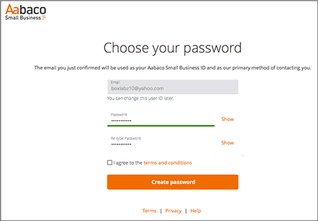

# Skapa DNS-poster på Yahoo! Small Business för Microsoft

 **[Läs frågor och svar om domäner](../setup/domains-faq.md)** om du inte hittar det du letar efter. 
  
Om Yahoo! Small Business har varit din DNS-värd bör du vara medveten om att din leverantör nu är Aabaco Small Business.
  
Följ stegen i den här artikeln för att skapa ett konto på Aabaco, där du kan göra DNS-ändringar och förnya din domän ( eller domäner).
  
Du måste skapa ditt Aabaco-konto innan du kan [Skapa DNS-poster](../get-help-with-domains/create-dns-records-at-any-dns-hosting-provider.md).

  
## Skapa ett Aabaco Small Business-konto

1. Kom igång genom att gå till sidan Domains på Aabaco med hjälp av [den här länken](https://www.luminate.com/services/)och välja **Konfigurera ditt Aabaco-konto för småföretag**.
    
    
  
2. Ange ditt Yahoo! E- **post-ID**för Small Business och välj sedan **Jag är inte en robot**.
    
    
  
3. Välj **Kom igång**.
    
    
  
4. Logga in på ditt e-postkonto för Yahoo! Small Business och öppna det nya e-postmeddelandet från Aabaco Small Business.
    
    > [!NOTE]
    > Skicka meddelandet igen om det behövs genom att välja **skicka e-postlänk igen** på sidan **Du har ny e-post**. 
  
    
  
5. I Aabaco **bekräftar du din e-postadress** och väljer **Bekräfta e-post**.
    
    
  
6. På sidan **Välj lösenord** anger du eller kopierar och klistrar in det lösenord som du vill använda för Aabaco-kontot. 
    
    > [!NOTE]
    > Du kan använda samma lösenord som du använde till ditt Yahoo! Small Business-konto. 
  
    
  
7. Välj **Jag accepterar villkoren och**Välj sedan **skapa lösen ord**.
    
    
  
8. Logga in på ditt e-postkonto för Yahoo! Small Business och öppna sedan det nya e-postmeddelandet från Aabaco Small Business.
    
    > [!NOTE]
    > Skicka meddelandet igen om det behövs genom att välja **skicka e-postlänk igen** på sidan **Du är snart klar!**. 
  
    
  
9. I Aabaco **du nästan det finns** e-postmeddelandet väljer du **aktivera mitt konto**.
    
    
  
10. Logga in på ditt Aabaco Small Business-konto.
    
    
  
Nu när du har skapat ditt Aabaco-konto kan du [Skapa DNS-poster på Aabaco Small Business för Microsoft](../get-help-with-domains/create-dns-records-at-any-dns-hosting-provider.md).
  
