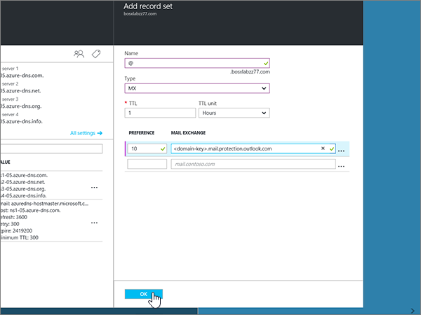
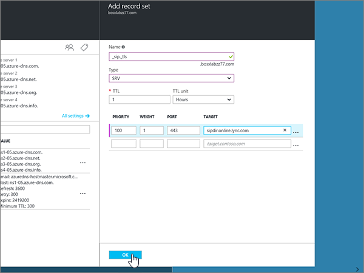

# Skapa DNS-poster för Azure DNS-zonerCreate DNS records for Azure DNS zones

 **[Läs frågor och svar om domäner](../setup/domains-faq.md)** om du inte hittar det du letar efter.**[Check the Domains FAQ](../setup/domains-faq.md)** if you don't find what you're looking for. 
  
Om Azure är din DNS-värd följer du stegen i den här artikeln för att verifiera din domän och konfigurera DNS-poster för e-post, Skype för företag – Online och så vidare.If Azure is your DNS hosting provider, follow the steps in this article to verify your domain and set up DNS records for email, Skype for Business Online, and so on.
  
Det här är de viktigaste posterna att lägga till.These are the main records to add. 
  
- [Ändra domänens namnserverposter (NS)Change your domain's nameserver (NS) records](#change-your-domains-nameserver-ns-records)
    
- [Lägga till en TXT-post för verifieringAdd a TXT record for verification](#add-a-txt-record-for-verification)

- [Lägga till en MX-post så att e-post för din domän kommer till Office 365Add an MX record so email for your domain will come to Office 365](#add-an-mx-record-so-email-for-your-domain-will-come-to-office-365)
    
- [Lägga till de fyra CNAME-poster som krävs för Office 365Add the four CNAME records that are required for Office 365](#add-the-four-cname-records-that-are-required-for-office-365)
    
- [Lägga till en TXT-post för SPF för att förhindra skräppostAdd a TXT record for SPF to help prevent email spam](#add-a-txt-record-for-spf-to-help-prevent-email-spam)
    
- [Lägga till de två SRV-posterna som krävs för Office 365Add the two SRV records that are required for Office 365](#add-the-two-srv-records-that-are-required-for-office-365)
    
När du har lagt till dessa poster i Azure konfigureras domänen så att den fungerar med Office 365-tjänster.After you add these records at Azure, your domain will be set up to work with Office 365 services.
  
> [!NOTE]
> Det brukar ta ungefär 15 minuter för DNS-ändringarna att gå igenom. Ibland kan det dock ta längre tid att uppdatera DNS-systemet på Internet för en ändring som du har gjort. Om du stöter på problem med e-postflödet eller får andra problem när du har lagt till DNS-posterna, går du till [Felsöka problem när du har ändrat domännamn eller DNS-poster](../get-help-with-domains/find-and-fix-issues.md).Typically it takes about 15 minutes for DNS changes to take effect. However, it can occasionally take longer for a change you've made to update across the Internet's DNS system. If you're having trouble with mail flow or other issues after adding DNS records, see [Troubleshoot issues after changing your domain name or DNS records](../get-help-with-domains/find-and-fix-issues.md). 
  
## Ändra domänens namnserverposter (NS)Change your domain's nameserver (NS) records

> [!IMPORTANT]
> Du måste genomföra anvisningarna hos den domänregistrator där du köpte och registrerade domänen.You must perform this procedure at the domain registrar where you purchased and registered your domain. 
  
När du registrerade dig för Azure skapade du en resursgrupp inom en DNS-zon och tilldelade sedan ditt domännamn till den resursgruppen.When you signed up for Azure, you created a resource group within a DNS zone, and then assigned your domain name to that resource group. Domännamnet är registrerat hos en extern domänregistristist. Azure erbjuder inte domänregistreringstjänster.That domain name is registered to an external domain registrar; Azure does not offer domain registration services.
  
Om du vill verifiera och skapa DNS-poster för din domän i Office 365 måste du först ändra namnservrarna på domänregistraren så att de använder de Azure-namnservrar som tilldelats din resursgrupp.To verify and create DNS records for your domain in Office 365, you first need to change the nameservers at your domain registrar so that they use the Azure nameservers assigned to your resource group.
  
Gör så här om du själv vill ändra domänens namnservrar på din domänregistrators webbplats:To change your domain's name servers at your domain registrar's website yourself, follow these steps.
  
1. Leta reda på var på domänregistratorns webbplats som du kan redigera namnservrar för din domän.Find the area on the domain registrar's website where you can edit the nameservers for your domain.
    
2. Skapa antingen två nya namnserverposter med hjälp av värdena i följande tabell eller ändra de befintliga namnserverposterna så att de matchar följande värden.Either create two nameserver records by using the values in the following table, or edit the existing nameserver records so that they match these values. Ett exempel på Azure-tilldelade namnservrar visas nedan.An example of Azure assigned nameservers is shown below.
    

**Förnamnserver:** Använd namnservervärdet som tilldelats av Azure.**First nameserver:** Use the name server value assigned by Azure.  
**Andra namnserver:** Använd namnservervärdet som tilldelats av Azure.**Second nameserver:** Use the name server value assigned by Azure.  

  
> [!TIP]
> Du bör använda minst två namnserverposter.You should use at least two name server records. Om det finns några andra namnservrar som anges på domänregistratorerns webbplats bör du ta bort dem.If there are any other name servers listed at your domain registrar's website, you should delete them. 
  
3. Spara ändringarna.Save your changes.
    
> [!NOTE]
> Det kan ta flera timmar innan ändringarna har uppdaterats genom hela DNS-systemet på Internet. Sedan är din Office 365 e-post och andra tjänster klara att fungera med din domän.Your nameserver record updates may take up to several hours to update across the Internet's DNS system. Then your Office 365 email and other services will be all set to work with your domain. 
  
## Lägga till en TXT-post för verifieringAdd a TXT record for verification

Innan du använder din domän med Office 365, vill vi vara säkra på att det är du som äger den. Att du kan logga in på ditt konto hos domänregistratorn och skapa DNS-posten bevisar för Office 365 att du äger domänen.Before you use your domain with Office 365, we have to make sure that you own it. Your ability to log in to your account at your domain registrar and create the DNS record proves to Office 365 that you own the domain.
  
> [!NOTE]
> Den här posten används endast för att verifiera att du äger domänen. Den påverkar ingenting annat. Du kan ta bort den senare om du vill.This record is used only to verify that you own your domain; it doesn't affect anything else. You can delete it later, if you like. 
  
1. Kom igång genom att gå till domänsidan på Azure med den [här länken](https://portal.azure.com ).To get started, go to your domains page at Azure by using [this link](https://portal.azure.com ). Du uppmanas att logga in först.You'll be prompted to log in first.
    
    
  
2. Skriv i **DNS-zoner**med hjälp av **sökfältet** på **sidan Instrumentpanel** .Using the **search bar** on the **Dashboard** page, type in **DNS zones**. I resultatvisningen väljer du **DNS-zoner** under delen **Tjänster.**In the results display, select **DNS zones** under the **Services** portion. När du har omdirigerats väljer du den domän som du vill uppdatera.Once you've been redirected, select the domain that you want to update.
    
    
  
3. Välj **+ Postuppsättning**i **området DNS-zon** på sidan **Inställningar** för domänen .On the **Settings** page for your domain, in the **DNS zone** area, select **+ Record set**.
    
    
  
4. I området **Lägg till postuppsättning** väljer du värdena i följande tabell i rutorna för den nya postuppsättningen.In the **Add record set** area, in the boxes for the new record set, select the values from the following table. 
    
    (Välj värdena **typ** och **TTL-enhet** i listrutorna.)(Choose the **Type** and **TTL unit** values from the drop-down lists.) 
    
    |**Name****Name**|**Type (typ)****Type**|**TTL****TTL**|**TTL-enhet****TTL unit**|**Värde****Value**|
    |:-----|:-----|:-----|:-----|:-----|
    |@    |TXTTXT    |11    |TiderHours    |MS=ms *XXXXXXXX*MS=ms *XXXXXXXX*    **Obs!** Det här är ett exempel. Använd det specifika värdet för **Mål eller pekar på-adress** här, från tabellen i Office 365.           [Hur hittar jag det?](../get-help-with-domains/information-for-dns-records.md)**Note:** This is an example. Use your specific **Destination or Points to Address** value here, from the table in Office 365.           [How do I find this?](../get-help-with-domains/information-for-dns-records.md)          |
   
    
  
5. Välj **OK**.Select **OK**.
  
6. Vänta några minuter innan du fortsätter, så att den post som du nyss skapade kan uppdateras på Internet.Wait a few minutes before you continue, so that the record you just created can update across the Internet.
    
Nu när du har lagt till posten på domänregistratorns webbplats går du tillbaka till Office 365 och begär att Office 365 letar efter posten.Now that you've added the record at your domain registrar's site, you'll go back to Office 365 and request Office 365 to look for the record.
  
När Office 365 hittar rätt TXT-post är din domän verifierad.When Office 365 finds the correct TXT record, your domain is verified.
  
1. I administrationscentret går du till **Inställningar** \> <a href="https://go.microsoft.com/fwlink/p/?linkid=834818" target="_blank">Domains</a>.In the admin center, go to the **Settings** \> <a href="https://go.microsoft.com/fwlink/p/?linkid=834818" target="_blank">Domains</a> page.
    
2. På sidan **Domains** väljer du den domän du verifierar.On the **Domains** page, select the domain that you are verifying. 
    
    
  
3. På sidan **Setup** väljer du **Start setup**.On the **Setup** page, select **Start setup**.
    
    
  
4. På sidan **Verify domain** väljer du **Verify**.On the **Verify domain** page, select **Verify**.
    
    
  
> [!NOTE]
>  Det brukar ta ungefär 15 minuter för DNS-ändringarna att gå igenom. Ibland kan det dock ta längre tid att uppdatera DNS-systemet på Internet för en ändring som du har gjort. Om du stöter på problem med e-postflödet eller får andra problem när du har lagt till DNS-posterna, går du till [Felsöka problem när du har ändrat domännamn eller DNS-poster](../get-help-with-domains/find-and-fix-issues.md).Typically it takes about 15 minutes for DNS changes to take effect. However, it can occasionally take longer for a change you've made to update across the Internet's DNS system. If you're having trouble with mail flow or other issues after adding DNS records, see [Troubleshoot issues after changing your domain name or DNS records](../get-help-with-domains/find-and-fix-issues.md). 
  
## Lägga till en MX-post så att e-post för din domän kommer till Office 365Add an MX record so email for your domain will come to Office 365

1. Kom igång genom att gå till domänsidan på Azure med den [här länken](https://portal.azure.com ).To get started, go to your domains page at Azure by using [this link](https://portal.azure.com ). Du uppmanas att logga in först.You'll be prompted to log in first.
    
    
  
2. Välj den domän som du vill uppdatera i området **Alla resurser** på sidan **Instrumentpanel.**On the **Dashboard** page, in the **All resources** area, select the domain that you want to update. 
    
    
  
3. Välj **+ Postuppsättning**i **området DNS-zon** på sidan **Inställningar** för domänen .On the **Settings** page for your domain, in the **DNS zone** area, select **+ Record set**.
    
    
  
4. I området **Lägg till postuppsättning** väljer du värdena i följande tabell i rutorna för den nya postuppsättningen.In the **Add record set** area, in the boxes for the new record set, select the values from the following table. 
    
    (Välj värdena **typ** och **TTL-enhet** i listrutorna.)(Choose the **Type** and **TTL unit** values from the drop-down lists.) 
    
    |**Name****Name**|**Type (typ)****Type**|**TTL****TTL**|**TTL-enhet****TTL unit**|**Preference****Preference**|**Utbyte av e-post****Mail Exchange**|
    |:-----|:-----|:-----|:-----|:-----|:-----|
    |@    |MXMX    |11    |TiderHours    |1010    Mer information om prioritet finns i [Vad är MX-prioritet?](https://support.office.com/article/2784cc4d-95be-443d-b5f7-bb5dd867ba83.aspx)For more information about priority, see [What is MX priority?](https://support.office.com/article/2784cc4d-95be-443d-b5f7-bb5dd867ba83.aspx)   | *\<domännyckel\>*  .mail.protection.outlook.com*\<domain-key\>*  .mail.protection.outlook.com    **Anm.:** Hämta \* \<domännyckeln\> \* från ditt Office 365-konto.**Note:** Get your  *\<domain-key\>*  from your Office 365 account.   [Hur hittar jag det här?How do I find this?](../get-help-with-domains/information-for-dns-records.md)  
   
    
  
5. Välj **OK**.Select **OK**.
    
    
  
6. Om det finns några andra MX-poster i avsnittet **MX-poster** måste du ta bort dem.If there are any other MX records listed in the **MX Records** section, you must delete them. 
    
    Välj först **MX-postuppsättningen**i **DNS-zonområdet** .First, in the **DNS zone** area, select the **MX Record set**.
    
    
  
    Välj sedan den MX-post som du vill ta bort.Next, select the MX record you want to delete.
    
    
  
7. Markera **snabbmenyn (...)** och välj sedan **Ta bort**.Select the **Context menu (…)**, and then choose **Remove**.
    
    
  
8. Välj **Spara**.Select **Save**.
    
    
  
## Lägga till de fyra CNAME-poster som krävs för Office 365Add the four CNAME records that are required for Office 365

1. Kom igång genom att gå till domänsidan på Azure med den [här länken](https://portal.azure.com ).To get started, go to your domains page at Azure by using [this link](https://portal.azure.com ). Du uppmanas att logga in först.You'll be prompted to log in first.
    
    
  
2. Välj den domän som du vill uppdatera i området **Alla resurser** på sidan **Instrumentpanel.**On the **Dashboard** page, in the **All resources** area, select the domain that you want to update. 
    
    
  
3. Välj **+ Postuppsättning**i **området DNS-zon** på sidan **Inställningar** för domänen .On the **Settings** page for your domain, in the **DNS zone** area, select **+ Record set**.
    
    
  
4. Lägg till den första av de fyra CNAME-posterna.Add the first of the four CNAME records.
    
    I området **Lägg till postuppsättning** skriver eller kopierar eller klistrar du in värdena från den första raden i följande tabell i rutorna för den nya postuppsättningen.In the **Add record set** area, in the boxes for the new record set, type or copy and paste the values from the first row in the following table. 
    
    (Välj värdena **typ** och **TTL-enhet** i listrutorna.)(Choose the **Type** and **TTL unit** values from the drop-down lists.) 
    
    |**Name****Name**|**Type (typ)****Type**|**TTL****TTL**|**TTL-enhet****TTL unit**|**Alias****Alias**|
    |:-----|:-----|:-----|:-----|:-----|
    |autodiscoverautodiscover    |CNAMECNAME    |11    |TiderHours    |autodiscover.outlook.comautodiscover.outlook.com    |
    |sipsip    |CNAMECNAME    |11    |TiderHours    |sipdir.online.lync.comsipdir.online.lync.com    |
    |lyncdiscoverlyncdiscover    |CNAMECNAME    |11    |TiderHours    |webdir.online.lync.comwebdir.online.lync.com    |
    
   
    
  
5. Välj **OK**.Select **OK**.
    
    
  
6. Lägg till var och en av de tre andra CNAME-posterna.Add each of the other three CNAME records.
    
    I **OMRÅDET DNS-zon** väljer du **+ Postuppsättning**.In the **DNS zone** area, select **+ Record set**. Skapa sedan en post i den tomma postuppsättningen med hjälp av värdena från nästa rad i tabellen och välj återigen **OK** för att slutföra posten.Then, in the empty record set, create a record by using the values from the next row in the table, and again select **OK** to complete that record. 
    
    Upprepa den här processen tills du har skapat alla fyra CNAME-poster.Repeat this process until you have created all four CNAME records.
    
7.  (Valfritt) Lägg till 2 CNAME-poster för MDM.(Optional) Add 2 CNAME records for MDM.

> [!IMPORTANT]
> Om du har MDM (Mobile Device Management) för Office 365 måste du skapa ytterligare två CNAME-poster.If you have Mobile Device Management (MDM) for Office 365, then you must create two additional CNAME records. Följ proceduren som du använde för de övriga fyra CNAME-posterna, men ange värden från följande tabell.Follow the procedure that you used for the other four CNAME records, but supply the values from the following table. (Om du inte har MDM kan du hoppa över det här steget.)(If you do not have MDM, you can skip this step.) 
  
|**Name****Name**|**Type (typ)****Type**|**TTL****TTL**|**TTL-enhet****TTL unit**|**Alias****Alias**|
|:-----|:-----|:-----|:-----|:-----|
|enterpriseregistrationenterpriseregistration    |CNAMECNAME    |11    |TiderHours    |enterpriseregistration.windows.netenterpriseregistration.windows.net    |
|enterpriseenrollmententerpriseenrollment    |CNAMECNAME    |11    |TiderHours    |enterpriseenrollment-s.manage.microsoft.comenterpriseenrollment-s.manage.microsoft.com    |
   
## Lägga till en TXT-post för SPF för att förhindra skräppostAdd a TXT record for SPF to help prevent email spam

> [!IMPORTANT]
> Du kan inte ha fler än en TXT-post för SPF för en domän.You cannot have more than one TXT record for SPF for a domain. Om din domän har fler än en SPF-post får du e-postfel och problem med leveranser och skräppostklassificering.If your domain has more than one SPF record, you'll get email errors, as well as delivery and spam classification issues. Om du redan har en SPF-post för domänen ska du inte skapa en ny för Office 365.If you already have an SPF record for your domain, don't create a new one for Office 365. Lägg istället till de obligatoriska Office 365-värdena i den aktuella posten, så att du har en  *enda*  SPF-post som innehåller båda uppsättningarna med värden.Instead, add the required Office 365 values to the current record so that you have a  *single*  SPF record that includes both sets of values. 
  
1. Kom igång genom att gå till domänsidan på Azure med den [här länken](https://portal.azure.com ).To get started, go to your domains page at Azure by using [this link](https://portal.azure.com ). Du uppmanas att logga in först.You'll be prompted to log in first.
    
    
  
2. Välj den domän som du vill uppdatera i området **Alla resurser** på sidan **Instrumentpanel.**On the **Dashboard** page, in the **All resources** area, select the domain that you want to update. 
    
    
  
3. I **DNS-zonområdet** väljer du **TXT-postuppsättningen**.In the **DNS zone** area, select the **TXT record set**.
    
    
  
4. I **egenskapsområdet Postuppsättning** väljer du värdena i följande tabell i rutorna för den nya postuppsättningen.In the **Record set properties** area, in the boxes for the new record set, select the values from the following table. 
    
    (Välj värdena **typ** och **TTL-enhet** i listrutorna.)(Choose the **Type** and **TTL unit** values from the drop-down lists.) 
    
    |**Name****Name**|**Type (typ)****Type**|**TTL****TTL**|**TTL-enhet****TTL unit**|**Värde****Value**|
    |:-----|:-----|:-----|:-----|:-----|
    |@    |TXTTXT    |11    |TiderHours    |v=spf1 include:spf.protection.outlook.com -allv=spf1 include:spf.protection.outlook.com -all    **Obs!** Vi rekommenderar att du kopierar och klistrar in den här posten så att alla avstånd förblir korrekta.    **Note:** We recommend copying and pasting this entry, so that all of the spacing stays correct.           

    
  
5. Välj **Spara**.Select **Save**.
    
    
  
## Lägga till de två SRV-posterna som krävs för Office 365Add the two SRV records that are required for Office 365

1. Kom igång genom att gå till domänsidan på Azure med den [här länken](https://portal.azure.com ).To get started, go to your domains page at Azure by using [this link](https://portal.azure.com ). Du uppmanas att logga in först.You'll be prompted to log in first.
    
    
  
2. Välj den domän som du vill uppdatera i området **Alla resurser** på sidan **Instrumentpanel.**On the **Dashboard** page, in the **All resources** area, select the domain that you want to update. 
    
    
  
3. Välj **+ Postuppsättning**i **området DNS-zon** på sidan **Inställningar** för domänen .On the **Settings** page for your domain, in the **DNS zone** area, select **+ Record set**.
    
    
  
4. Lägg till den första av de två SRV-posterna.Add the first of the two SRV records.
    
    I området **Lägg till postuppsättning** väljer du värdena från den första raden i följande tabell i rutorna för den nya postuppsättningen.In the **Add record set** area, in the boxes for the new record set, select the values from the first row in the following table. 
    
    (Välj värdena **typ** och **TTL-enhet** i listrutorna.)(Choose the **Type** and **TTL unit** values from the drop-down lists.) 
    
    |**Name****Name**|**Type (typ)****Type**|**TTL****TTL**|**TTL-enhet****TTL unit**|**Prioritet****Priority**|**Vikt****Weight**|**Port****Port**|**Target****Target**|
    |:-----|:-----|:-----|:-----|:-----|:-----|:-----|:-----|
    |_sip._tls_sip._tls    |SRVSRV    |11    |TiderHours    |100100    |11    |443443    |sipdir.online.lync.comsipdir.online.lync.com    |
    |_sipfederationtls._tcp_sipfederationtls._tcp    |SRVSRV    |11    |TiderHours    |100100    |11    |50615061    |sipfed.online.lync.comsipfed.online.lync.com    

    
  
5. Välj **OK**.Select **OK**.
    
    
  
6. Lägg till den andra SRV-posten.Add the other SRV record.
    
    I rutorna för den nya posten skriver du eller kopierar och klistrar in värdena från den andra raden i tabellen.In the boxes for the new record, type or copy and paste the values from the second row of the table.
    
> [!NOTE]
> Det brukar ta ungefär 15 minuter för DNS-ändringarna att gå igenom. Ibland kan det dock ta längre tid att uppdatera DNS-systemet på Internet för en ändring som du har gjort. Om du stöter på problem med e-postflödet eller får andra problem när du har lagt till DNS-posterna, går du till [Felsöka problem när du har ändrat domännamn eller DNS-poster](../get-help-with-domains/find-and-fix-issues.md).Typically it takes about 15 minutes for DNS changes to take effect. However, it can occasionally take longer for a change you've made to update across the Internet's DNS system. If you're having trouble with mail flow or other issues after adding DNS records, see [Troubleshoot issues after changing your domain name or DNS records](../get-help-with-domains/find-and-fix-issues.md). 
  
