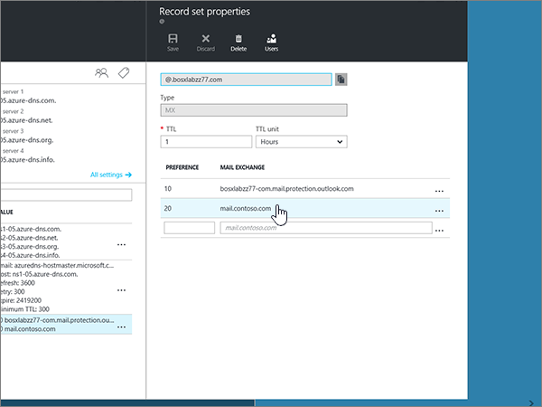

# Skapa DNS-poster för Azure DNS-zoner

 **[Läs frågor och svar om domäner](../setup/domains-faq.yml)** om du inte hittar det du letar efter. 
  
Om Azure är din DNS-värd följer du stegen i den här artikeln för att verifiera din domän och konfigurera DNS-poster för e-post, Skype för företag – Online och så vidare.
  
Det här är de viktigaste posterna att lägga till. 
  
- [Ändra domänens namnserverposter (NS)](#change-your-domains-nameserver-ns-records)
    
- [Lägga till en TXT-post för verifiering](#add-a-txt-record-for-verification)

- [Lägga till en MX-post så att e-post för din domän kommer till Microsoft.](#add-an-mx-record-so-email-for-your-domain-will-come-to-microsoft)
    
- [Lägga till de fyra CNAME-posterna som krävs för Microsoft](#add-the-four-cname-records-that-are-required-for-microsoft)
    
- [Lägga till en TXT-post för SPF för att förhindra skräppost](#add-a-txt-record-for-spf-to-help-prevent-email-spam)
    
- [Lägga till de två SRV-posterna som krävs för Microsoft](#add-the-two-srv-records-that-are-required-for-microsoft)
    
När du har lagt till dessa poster på Azure är din domän konfigurerad för att fungera med Microsoft-tjänster.
  
> [!NOTE]
> Det brukar ta ungefär 15 minuter för DNS-ändringarna att gå igenom. Ibland kan det dock ta längre tid att uppdatera DNS-systemet på Internet för en ändring som du har gjort. Om du stöter på problem med e-postflödet eller får andra problem när du har lagt till DNS-posterna, går du till [Felsöka problem när du har ändrat domännamn eller DNS-poster](../get-help-with-domains/find-and-fix-issues.md). 
  
## Ändra domänens namnserverposter (NS)

> [!IMPORTANT]
> Du måste genomföra anvisningarna hos den domänregistrator där du köpte och registrerade domänen. 
  
När du registrerade dig för Azure skapade du en resurs grupp i en DNS-zon och kopplade sedan domän namnet till den resurs gruppen. Domän namnet är registrerat i en extern domän registrator; Azure erbjuder inte tjänster för domän registrering.
  
Om du vill verifiera och skapa DNS-poster för din domän i Microsoft måste du först ändra namnservrar hos din domän registrator så att de använder Azure-namnservrar som är tilldelad till din resurs grupp.
  
Gör så här om du själv vill ändra domänens namnservrar på din domänregistrators webbplats:
  
1. Leta reda på var på domänregistratorns webbplats som du kan redigera namnservrar för din domän.
    
2. Skapa antingen två nya namnserverposter med hjälp av värdena i följande tabell eller ändra de befintliga namnserverposterna så att de matchar följande värden. Ett exempel på en Azure-tilldelad namnservrar visas nedan.
    

**Första Namnserver:** Använd värdet Name Server som tilldelats av Azure.  
**Andra Namnserver:** Använd värdet Name Server som tilldelats av Azure.  

  
> [!TIP]
> Du bör använda minst två namnserver poster. Om det finns fler namnservrar på din domän registrators webbplats ska du ta bort dem. 
  
3. Spara ändringarna.
    
> [!NOTE]
> Det kan ta flera timmar innan ändringarna har uppdaterats genom hela DNS-systemet på Internet. Sedan är din Microsoft-e-post och andra tjänster inställda för att fungera med din domän. 
  
## Lägga till en TXT-post för verifiering

Innan du använder din domän med Microsoft, vill vi vara säkra på att det är du som äger den. Att du kan logga in på ditt konto hos domänregistratorn och skapa DNS-posten bevisar för Microsoft att du äger domänen.
  
> [!NOTE]
> Den här posten används endast för att verifiera att du äger domänen. Den påverkar ingenting annat. Du kan ta bort den senare om du vill. 
  
1. Kom igång genom att gå till domän sidan på Azure med [den här länken](https://portal.azure.com ). Du uppmanas att logga in först.
    
    
  
2. I **Sök fältet** på sidan **instrument panel** skriver du in **DNS Zones**. I resultat visningen väljer du **DNS Zones** under **tjänste** delen. När du har omdirigerats väljer du den domän som du vill uppdatera.
    
    
  
3. Välj **+ Record set** i området **DNS Zone** på sidan **Inställningar** för din domän.
    
    
  
4. I rutan **Lägg till post uppsättning** väljer du värden från följande tabell i rutorna för den nya posten. 
    
    (Välj värdena **Type** och **TTL** i list rutan.) 
    
    |**Name**|**Type (typ)**|**TTL**|**TTL-enhet**|**Värde**|
    |:-----|:-----|:-----|:-----|:-----|
    |@    |TXT    |9.1    |Tider    |MS=ms *XXXXXXXX*    **Obs!** Det här är ett exempel. Använd ditt specifika **Mål eller pekar på adress** värde här, från tabellen.           [Hur hittar jag det här?](../get-help-with-domains/information-for-dns-records.md)          |
   
    
  
5. Välj **OK**.
  
6. Vänta några minuter innan du fortsätter, så att den post som du nyss skapade kan uppdateras på Internet.
    
Nu när du har lagt till posten på domänregistratorns webbplats kan du gå tillbaka till Microsoft och begär posten.
  
När Microsoft hittar rätt TXT-post är din domän verifierad.
  
1. I administrationscentret går du till **Inställningar** \> <a href="https://go.microsoft.com/fwlink/p/?linkid=834818" target="_blank">Domains</a>.
    
2. På sidan **Domains** väljer du den domän du verifierar. 
    
    
  
3. På sidan **Setup** väljer du **Start setup**.
    
    
  
4. På sidan **Verify domain** väljer du **Verify**.
    
    
  
> [!NOTE]
>  Det brukar ta ungefär 15 minuter för DNS-ändringarna att gå igenom. Ibland kan det dock ta längre tid att uppdatera DNS-systemet på Internet för en ändring som du har gjort. Om du stöter på problem med e-postflödet eller får andra problem när du har lagt till DNS-posterna, går du till [Felsöka problem när du har ändrat domännamn eller DNS-poster](../get-help-with-domains/find-and-fix-issues.md). 
  
## Lägga till en MX-post så att e-post för din domän kommer till Microsoft.

1. Kom igång genom att gå till domän sidan på Azure med [den här länken](https://portal.azure.com ). Du uppmanas att logga in först.
    
    
  
2. På sidan **instrument panel** i området **alla resurser** väljer du den domän som du vill uppdatera. 
    
    
  
3. Välj **+ Record set** i området **DNS Zone** på sidan **Inställningar** för din domän.
    
    
  
4. I rutan **Lägg till post uppsättning** väljer du värden från följande tabell i rutorna för den nya posten. 
    
    (Välj värdena **Type** och **TTL** i list rutan.) 
    
    |**Name**|**Type (typ)**|**TTL**|**TTL-enhet**|**Preference**|**E-postutbyte**|
    |:-----|:-----|:-----|:-----|:-----|:-----|
    |@    |MX    |9.1    |Tider    |10.3    Mer information om prioritet finns i [Vad är MX-prioritet?](https://docs.microsoft.com/microsoft-365/admin/setup/domains-faq)   | *\<domain-key\>*  .mail.protection.outlook.com    **Obs!** Hämta ditt  *\<domain-key\>*  från ditt Microsoft-konto.   [Hur hittar jag det här?](../get-help-with-domains/information-for-dns-records.md)  
   
    
  
5. Välj **OK**.
    
    
  
6. Om det finns andra MX-poster i avsnittet **MX Records** måste du ta bort dem. 
    
    I området **DNS Zone** väljer du först **MX-postuppsättningen**.
    
    
  
    Välj sedan den MX-post som du vill ta bort.
    
    
  
7. Välj **snabb menyn (...)** och välj sedan **ta bort**.
    
    
  
8. Välj **Spara**.
    
    
  
## Lägga till de fyra CNAME-posterna som krävs för Microsoft

1. Kom igång genom att gå till domän sidan på Azure med [den här länken](https://portal.azure.com ). Du uppmanas att logga in först.
    
    
  
2. På sidan **instrument panel** i området **alla resurser** väljer du den domän som du vill uppdatera. 
    
    
  
3. Välj **+ Record set** i området **DNS Zone** på sidan **Inställningar** för din domän.
    
    
  
4. Lägg till den första av de fyra CNAME-posterna.
    
    I rutan **Lägg till post uppsättning** skriver du in, eller kopierar och klistrar in, värdena från den första raden i följande tabell i rutorna för den nya posten. 
    
    (Välj värdena **Type** och **TTL** i list rutan.) 
    
    |**Name**|**Type (typ)**|**TTL**|**TTL-enhet**|**Alias**|
    |:-----|:-----|:-----|:-----|:-----|
    |autodiscover    |CNAME    |9.1    |Tider    |autodiscover.outlook.com    |
    |sip    |CNAME    |9.1    |Tider    |sipdir.online.lync.com    |
    |lyncdiscover    |CNAME    |9.1    |Tider    |webdir.online.lync.com    |
    
   
    
  
5. Välj **OK**.
    
    
  
6. Lägg till de andra tre CNAME-posterna.
    
    Välj **+ Record set** i området **DNS Zone** . I den tomma post uppsättningen skapar du en post med värdena från nästa rad i tabellen och väljer sedan **OK** för att slutföra den posten. 
    
    Upprepa proceduren tills du har skapat alla fyra CNAME-posterna.
    
7.  Skriver Lägga till 2 CNAME-poster för MDM.

> [!IMPORTANT]
> Om du har Mobile Device Management (MDM) för Microsoft måste du skapa ytterligare två CNAME-poster. Följ proceduren som du använde för de övriga fyra CNAME-posterna, men ange värden från följande tabell. (Om du inte har MDM kan du hoppa över det här steget.) 
  
|**Name**|**Type (typ)**|**TTL**|**TTL-enhet**|**Alias**|
|:-----|:-----|:-----|:-----|:-----|
|enterpriseregistration    |CNAME    |9.1    |Tider    |enterpriseregistration.windows.net    |
|enterpriseenrollment    |CNAME    |9.1    |Tider    |enterpriseenrollment-s.manage.microsoft.com    |
   
## Lägga till en TXT-post för SPF för att förhindra skräppost

> [!IMPORTANT]
> Du kan inte ha fler än en TXT-post för SPF för en domän. Om din domän har fler än en SPF-post får du e-postfel och problem med leveranser och skräppostklassificering. Om du redan har en SPF-post för domänen ska du inte skapa en ny för Microsoft. I stället kan du lägga till de Microsoft-värden som krävs i den aktuella posten så att du har en  *enda*  SPF-post som innehåller båda uppsättningar med värden. 
  
1. Kom igång genom att gå till domän sidan på Azure med [den här länken](https://portal.azure.com ). Du uppmanas att logga in först.
    
    
  
2. På sidan **instrument panel** i området **alla resurser** väljer du den domän som du vill uppdatera. 
    
    
  
3. I området **DNS Zone** väljer du txt- **postuppsättningen**.
    
    
  
4. I rutorna för den nya post uppsättningen i området **Egenskaper för post uppsättning** väljer du värdena från följande tabell. 
    
    (Välj värdena **Type** och **TTL** i list rutan.) 
    
    |**Name**|**Type (typ)**|**TTL**|**TTL-enhet**|**Värde**|
    |:-----|:-----|:-----|:-----|:-----|
    |@    |TXT    |9.1    |Tider    |v=spf1 include:spf.protection.outlook.com -all    **Obs!** Vi rekommenderar att du kopierar och klistrar in den här posten så att alla avstånd förblir korrekta.               

    
  
5. Välj **Spara**.
    
    
  
## Lägga till de två SRV-posterna som krävs för Microsoft

1. Kom igång genom att gå till domän sidan på Azure med [den här länken](https://portal.azure.com ). Du uppmanas att logga in först.
    
    
  
2. På sidan **instrument panel** i området **alla resurser** väljer du den domän som du vill uppdatera. 
    
    
  
3. Välj **+ Record set** i området **DNS Zone** på sidan **Inställningar** för din domän.
    
    
  
4. Lägg till den första av de två SRV-posterna.
    
    Markera värdena från den första raden i följande tabell i rutorna för den nya posten i avsnittet **Lägg till post uppsättning** . 
    
    (Välj värdena **Type** och **TTL** i list rutan.) 
    
    |**Name**|**Type (typ)**|**TTL**|**TTL-enhet**|**Prioritet**|**Vikt**|**Port**|**Target**|
    |:-----|:-----|:-----|:-----|:-----|:-----|:-----|:-----|
    |_sip _sip._tls    |SRV    |9.1    |Tider    |100    |9.1    |443    |sipdir.online.lync.com    |
    |_sipfederationtls _sipfederationtls._tcp    |SRV    |9.1    |Tider    |100    |9.1    |5061    |sipfed.online.lync.com    

    
  
5. Välj **OK**.
    
    
  
6. Lägg till den andra SRV-posten.
    
    I rutorna för den nya posten anger du eller kopierar och klistrar in värdena från den andra raden i tabellen.
    
> [!NOTE]
> Det brukar ta ungefär 15 minuter för DNS-ändringarna att gå igenom. Ibland kan det dock ta längre tid att uppdatera DNS-systemet på Internet för en ändring som du har gjort. Om du stöter på problem med e-postflödet eller får andra problem när du har lagt till DNS-posterna, går du till [Felsöka problem när du har ändrat domännamn eller DNS-poster](../get-help-with-domains/find-and-fix-issues.md). 
  
