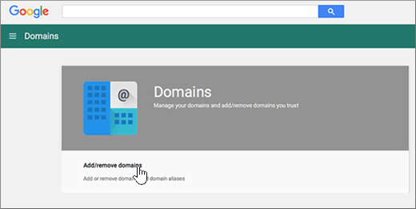

# Skapa DNS-poster när din domän hanteras av Google (eNom)Create DNS records when your domain is managed by Google (eNom)

 **[Läs frågor och svar om domäner](../setup/domains-faq.yml)** om du inte hittar det du letar efter.**[Check the Domains FAQ](../setup/domains-faq.yml)** if you don't find what you're looking for. 
  
För att migrera dina e-postkonton till Microsoft måste du skapa en DNS-post hos din domän registrator.To migrate your mail accounts to Microsoft, you need to create a DNS record at your domain registrar.
  
Om du har köpt din domän via Google när du registrerade dina **Google Apps för arbets** konton hanteras dina DNS-poster av Google men vara registrerad hos eNom.If you purchased your domain through Google while signing up for your **Google Apps for Work** account, your DNS records are managed by Google but registered with eNom. 
  
Du kan komma åt eNom och skapa DNS via sidan Google **Domains** .You can access eNom, and create DNS, through the Google **Domains** page. Följ bara anvisningarna i den här artikeln.Just follow the steps in this article. 
  
## Skapa DNS-postenCreate the DNS record

1. I [Google Admin Console](https://www.google.com/work/apps/business)väljer du **Logga** in.At the [Google Admin console](https://www.google.com/work/apps/business), select **Sign In**.
    
    
  
2. Ange ditt domän namn och välj sedan **Sök**.Enter your domain name, and then select **Go**.
    
    
  
3. Välj **fler kontroller** längst ned på sidan.At the bottom of the page, select **More controls**.
    
    
  
4. Välj **Domäner**.Select **Domains**.
    
    
  
5. På sidan **domäner** väljer du **Lägg till/ta bort domäner**.On the **Domains** page, select **Add/remove domains**.
    
    
  
6. Välj **Advanced DNS Settings** på sidan **Domains** .On the **Domains** page, select **Advanced DNS settings**.
    
    > [!NOTE]
    > Om du inte köpte ett domännamn via Google när du registrerade ditt **Google Apps for Work** -konto visas inte **Advanced DNS settings** på sidan **Domains**.If you didn't purchase a domain name through Google while signing up for your **Google Apps for Work** account, you won't have **Advanced DNS settings** on your **Domains** page. Då måste du i stället gå direkt till domänvärdens webbplats för att komma åt DNS-inställningarna och följa de här anvisningarna.Instead, you must go directly to your domain host's web site to access your DNS settings and to perform this and the following steps. Se [komma åt dina domän inställningar för G Suite](https://support.google.com/a/answer/54693?hl=en) för mer information.See [Access your G Suite domain settings](https://support.google.com/a/answer/54693?hl=en) for more information. 
  
    
  
7. På sidan **Advanced DNS Settings** väljer **du logga in på DNS Console**.On the **Advanced DNS settings** page, select **Sign in to DNS Console**. Skriv ned **inloggningsnamnet** och **lösenord** sinformationen.Note the **Sign-in name** and **Password** information. Du behöver det i nästa steg.You'll need it in the next step. 
    
    
  
8. Logga in på Google **Domain Manager** med **inloggningsnamnet** och **lösenordet** fån sidan **Advanced DNS settings**.Log in to the Google **Domain Manager** using the **Sign-in name** and **Password** from the **Advanced DNS settings** page. 
    
    
  
9. På sidan **_domain_name_*_, i avsnittet _\* Host Records*\* väljer du **Edit**.On the **_domain_name_*_ page, in the _\* Host Records*\* section, select **Edit**.
    
    
  
10. Välj **Add New** i avsnittet **Host Records** .In the **Host Records** section, select **Add New**.
    
    
  
11. I den nya postens rutor skriver du in, eller kopierar och klistrar in, värdena från följande tabell.In the boxes for the new record, type or copy and paste the values from the following table.
    
    |**HOST (värd)****HOST**|**TXT VALUE****TXT VALUE**|**POSTTYP****RECORD TYPE**|
    |:-----|:-----|:-----|
    |@    ||TXTTXT    |

    > [!NOTE]
    > Det här är ett exempel.This is an example. Använd ditt specifika **Mål eller pekar på adress** värde här, från tabellen.Use your specific **Destination or Points to Address** value here, from the table. 
  
    [Hur hittar jag det här?How do I find this?](../get-help-with-domains/information-for-dns-records.md)
  
12. Välj **Spara**.Select **Save**.
    
    
  
13. Välj **Spara ändringar**.Select **Save Changes**.
    
    
  
> [!NOTE]
>  Det brukar ta ungefär 15 minuter för DNS-ändringarna att gå igenom. Ibland kan det dock ta längre tid att uppdatera DNS-systemet på Internet för en ändring som du har gjort. Om du stöter på problem med e-postflödet eller får andra problem när du har lagt till DNS-posterna, går du till [Felsöka problem när du har ändrat domännamn eller DNS-poster](../get-help-with-domains/find-and-fix-issues.md).Typically it takes about 15 minutes for DNS changes to take effect. However, it can occasionally take longer for a change you've made to update across the Internet's DNS system. If you're having trouble with mail flow or other issues after adding DNS records, see [Troubleshoot issues after changing your domain name or DNS records](../get-help-with-domains/find-and-fix-issues.md). 
  
