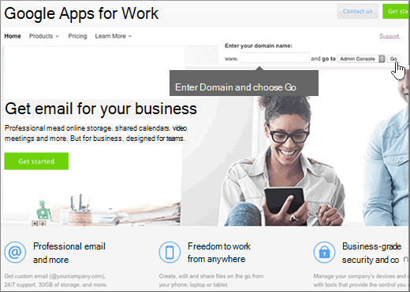

# Skapa DNS-poster när din domän hanteras av Google (eNom)

 **[Läs frågor och svar om domäner](../setup/domains-faq.md)** om du inte hittar det du letar efter. 
  
För att kunna migrera e-postkonton till Office 365 måste du skapa en DNS-post hos din domänregistrator.
  
Om du köpte domänen via Google när du registrerade dig för ditt **Google Apps for Work-konto** hanteras dina DNS-poster av Google men registreras hos eNom. 
  
Du kan komma åt eNom och skapa DNS via sidan Google **Domäner.** Följ bara anvisningarna i den här artikeln. 
  
## Skapa DNS-posten

1. På [Google Admin-konsolen](https://www.google.com/work/apps/business)väljer du **Logga in**.
    
    
  
2. Ange ditt domännamn och välj sedan **Gå**.
    
    
  
3. Längst ned på sidan väljer du **Fler kontroller**.
    
    
  
4. Välj **Domäner**.
    
    
  
5. På sidan **Domäner** väljer du **Lägg till/ta bort domäner**.
    
    
  
6. Välj **Avancerade DNS-inställningar på**sidan **Domäner** .
    
    > [!NOTE]
    > Om du inte köpte ett domännamn via Google när du registrerade ditt **Google Apps for Work** -konto visas inte **Advanced DNS settings** på sidan **Domains**. Då måste du i stället gå direkt till domänvärdens webbplats för att komma åt DNS-inställningarna och följa de här anvisningarna. Mer information finns i [Komma åt domäninställningarna](https://support.google.com/a/answer/54693?hl=en) för G Suite. 
  
    
  
7. På sidan **Avancerade DNS-inställningar** väljer du **Logga in på DNS-konsolen**. Skriv ned **inloggningsnamnet** och **lösenord**sinformationen. Du behöver det i nästa steg. 
    
    
  
8. Logga in på Google **Domain Manager** med **inloggningsnamnet** och **lösenordet** fån sidan **Advanced DNS settings**. 
    
    
  
9. Välj **Redigera**i avsnittet **Värdposter** på sidan ***domain_name*** .
    
    
  
10. Välj **Lägg till ny**i avsnittet **Värdposter** .
    
    
  
11. I den nya postens rutor skriver du in, eller kopierar och klistrar in, värdena från följande tabell.
    
    |**HOST (värd)**|**TXT VALUE**|**POSTTYP**|
    |:-----|:-----|:-----|
    |@    ||TXT    |

    > [!NOTE]
    > Detta är ett exempel. Använd det specifika värdet för **Mål eller pekar på-adress** här, från tabellen i Office 365. 
  
    [Hur hittar jag det här?](../get-help-with-domains/information-for-dns-records.md)
  
12. Välj **Spara**.
    
    
  
13. Välj **Spara ändringar**.
    
    
  
> [!NOTE]
>  Det brukar ta ungefär 15 minuter för DNS-ändringarna att gå igenom. Ibland kan det dock ta längre tid att uppdatera DNS-systemet på Internet för en ändring som du har gjort. Om du stöter på problem med e-postflödet eller får andra problem när du har lagt till DNS-posterna, går du till [Felsöka problem när du har ändrat domännamn eller DNS-poster](../get-help-with-domains/find-and-fix-issues.md). 
  
