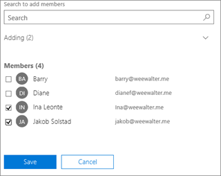

# Skapa en delad postlådaCreate a shared mailbox 

> [!NOTE]
> Om din organisation använder en Exchange-hybridmiljö, använder du det lokala administrationscentret för Exchange när du skapar och hanterar delade postlådor.If your organization uses a hybrid Exchange environment, you should use the on-premises Exchange admin center (EAC) to create and manage shared mailboxes. Se [Så här skapar du en delad postlåda i administrationscentret för Exchange](https://docs.microsoft.com/Exchange/collaboration/shared-mailboxes/create-shared-mailboxes?view=exchserver-2019.)See [Create shared mailboxes in the Exchange admin center](https://docs.microsoft.com/Exchange/collaboration/shared-mailboxes/create-shared-mailboxes?view=exchserver-2019.)  
> Om du inte är säker på ifall du ska skapa en delad postlåda eller en Microsoft 365-grupp för Outlook, kan du läsa mer i [Jämföra grupper](../create-groups/compare-groups.md). If you're not sure if you should create a shared mailbox or a Microsoft 365 group for Outlook, see [Compare groups](../create-groups/compare-groups.md) for some guidance. Observera att det för närvarande inte är möjligt att migrera en delad postlåda till en Microsoft 365-grupp.Note that currently, it's not possible to migrate a shared mailbox to a Microsoft 365 group. Om det är något som du vill kunna göra, kan du låta oss veta detta genom att [rösta här](https://go.microsoft.com/fwlink/?linkid=871518).If this is something you want, let us know by [voting here](https://go.microsoft.com/fwlink/?linkid=871518).

Det är enkelt att skapa en delad postlåda så att en grupp användare kan övervaka och skicka e-post från en gemensam e-postadress, exempelvis info@contoso.com. När en person i gruppen svarar på ett meddelande till den delade postlådan ser svarsmeddelandet ut att komma från den delade postlådan, inte från den enskilda användaren.It's easy to create shared mailboxes so a group of people can monitor and send email from a common email addresses, like info@contoso.com. When a person in the group replies to a message sent to the shared mailbox, the email appears to be from the shared mailbox, not from the individual user.

I delade postlådor finns det en delad kalender.Shared mailboxes include a shared calendar. Många små företag tycker att det är praktiskt att ha en delad kalender där alla lägger in sina avtalade tider.A lot of small businesses like to use the shared calendar as a place for everyone to enter their appointments. Om det till exempel finns tre personer som utför kundbesök kan de alla skriva in sina avtalade tider i kalendern.For example, if you have 3 people who do customer visits, all can use the shared calendar to enter the appointments. Det är ett bra sätt att hålla alla informerade om var alla befinner sig.This is an easy way to keep everyone informed where people are.

Innan du skapar en delad postlåda bör du läsa [Om delade postlådor](about-shared-mailboxes.md) för att få mer information.Before creating a shared mailbox, be sure to read [About shared mailboxes](about-shared-mailboxes.md) for more information.

## Skapa en delad postlåda och lägg till medlemmarCreate a shared mailbox and add members
  
1. Logga in med ett globalt administratörskonto eller Exchange-administratörskonto.Sign in with a global admin account or Exchange admin account. Om du får meddelandet ”**Du har inte behörighet att komma åt den här sidan eller utföra den här åtgärden**”, är du inte någon administratör.If you get the message "**You don't have permission to access this page or perform this action**," then you aren't an admin. 

::: moniker range="o365-worldwide"

2. Gå till sidan **Grupper** \> <a href="https://go.microsoft.com/fwlink/p/?linkid=2066847" target="_blank">Delade postlådor</a> i administrationscentret.In the admin center, go to the **Groups** \> <a href="https://go.microsoft.com/fwlink/p/?linkid=2066847" target="_blank">Shared mailboxes</a> page.

::: moniker-end

::: moniker range="o365-germany"

2. I [administrationscentret](https://go.microsoft.com/fwlink/p/?linkid=848041) går du till sidan **Grupper** \> **Delade postlådor**.In the [admin center](https://go.microsoft.com/fwlink/p/?linkid=848041), go to the **Groups** \> **Shared mailboxes** page.

::: moniker-end

::: moniker range="o365-21vianet"

2. I [administrationscentret](https://go.microsoft.com/fwlink/p/?linkid=850627) går du till sidan **Grupper** \> **Delade postlådor**.In the [admin center](https://go.microsoft.com/fwlink/p/?linkid=850627), go to the **Groups** \> **Shared mailboxes** page.

::: moniker-end
    
3. På sidan **Delade postlådor** väljer du **+ Lägg till en postlåda**.On the **Shared mailboxes** page, select **+ Add a mailbox**. Ange ett namn på den delade postlådan.Enter a name for the shared mailbox. Guiden väljer sedan e-postadress, men du kan redigera den.Then the wizard chooses the email address, but you can edit it.
    
    
  
4. Välj **Lägg till**.Select **Add**. Det kan ta några minuter innan du kan lägga till medlemmar.It may take a few minutes before you can add members.

5. Under **Nästa steg** väljer du **Lägg till medlemmar i den här postlådan**.Under **Next steps**, select **Add members to this mailbox**. Medlemmarna är de personer som kan se inkommande e-post till den delade postlådan och utgående svar.Members are the people who will be able to view the incoming mail to this shared mailbox, and the outgoing replies.

   

6. Välj knappen **+Lägg till medlemmar**.Select the **+Add members** button. Markera de personer som ska använda den delade postlådan och välj **Spara**.Put a check mark next to the people who you want to use this shared mailbox, and select **Save**.

   

7. Välj **Stäng**.Select **Close**.

Du har en delad postlåda och den innehåller en delad kalender.You have a shared mailbox and it includes a shared calendar. Gå vidare till nästa steg: Blockera inloggning för den delade postlådans konto.Now go on to the next step: block sign-in for the shared mailbox account.

## Blockera inloggning för den delade postlådans kontoBlock sign-in for the shared mailbox account

Alla delade postlådor har ett motsvarande användarkonto.Every shared mailbox has a corresponding user account. Lade du märke till att du inte behövde ange något lösenord när du skapade den delade postlådan?Notice how you weren't asked to provide a password when you created the shared mailbox? Kontot har ett lösenord, men det genereras av systemet (okänt).The account has a password, but it's system-generated (unknown). Du ska inte använda kontot för att logga in på den delade postlådan.You aren't supposed to use the account to log in to the shared mailbox.

Men vad händer om en administratör återställer lösenordet för den delade postlådans användarkonto?But what if an admin simply resets the password of the shared mailbox user account? Eller om en angripare får åtkomst till kontoautentiseringsuppgifterna för den delade postlådan?Or what if an attacker gains access to the shared mailbox account credentials? Det skulle innebära att användarkontot kan logga in på den delade postlådan och skicka e-post.This would allow the user account to log in to the shared mailbox and send email. För att förhindra detta måste du blockera inloggningen för det konto som är kopplat till den delade postlådan.To prevent this, you need to block sign-in for the account that's associated with the shared mailbox.

::: moniker range="o365-worldwide"

> [!NOTE]
> Om du inte använder det nya administrationscentret för Microsoft 365 kan du aktivera det genom att välja **Prova det nya administrationscentret** längst upp på startsidan.If you're not using the new Microsoft 365 admin center, you can turn it on by selecting the **Try the new admin center** toggle located at the top of the Home page.

1. I administrationscentret går du till sidan **Användare** \> <a href="https://go.microsoft.com/fwlink/p/?linkid=834822" target="_blank">Aktiva användare</a>.In the admin center, go to the **Users** \> <a href="https://go.microsoft.com/fwlink/p/?linkid=834822" target="_blank">Active users</a> page.

2. Leta reda på kontot för den delade postlådan i listan med användarkonton (ändra t.ex. filtret till **Användare utan licens**).In the list of user accounts, find the account for the shared mailbox (for example, change the filter to **Unlicensed users**).

3. Välj användaren för att öppna fönstret Egenskaper och välj sedan ikonen **Blockera den här användaren** .Select the user to open their properties pane, and then select the **Block this user** icon .

   **Obs**! Om kontot redan är blockerat visas **Inloggning blockerad** längst upp och ikonen är **Avblockera den här användaren**.**Note**: If the account is already blocked, **Sign in blocked** will appear at the top and the icon will read **Unblock this user**.

4. I fönstret **Blockera den här användaren?** väljer du **Blockera användaren från att logga in** och sedan **Spara ändringarna**.In the **Block this user?** pane, select **Block the user from signing in**, and then select **Save changes**.

::: moniker-end

::: moniker range="o365-germany"

1. I administrationscentret går du till sidan **Användare** \> <a href="https://go.microsoft.com/fwlink/p/?linkid=847686" target="_blank">Aktiva användare</a>.In the admin center, go to the **Users** \> <a href="https://go.microsoft.com/fwlink/p/?linkid=847686" target="_blank">Active users</a> page.

2. Leta reda på kontot för den delade postlådan i listan med användarkonton (ändra t.ex. vyn till **Användare utan licens**) och markera sedan kontot.In the list of user accounts, find the account for the shared mailbox (for example, change the view to **Unlicensed users**) and then select the account.

3. Välj **Blockera inloggning** i den utfällbara menyn för egenskaper.In the properties flyout, select **Block sign-in**.

    **Obs!** Om kontot redan har blockerats visar knappen **Tillåt inloggning**.**Note:** If the account was already blocked, the button would say **Unblock sign-in**.

4. Kontrollera att Blockera användaren från att logga in är markerad i den utfällbara menyn **Redigera inloggningsstatus**. Välj **Spara** och sedan **Stäng**.In the **Edit sign-in status** flyout, verify that Block the user from signing in is selected, select **Save** and then **Close**.

::: moniker-end

::: moniker range="o365-21vianet"

1. I administrationscentret går du till sidan **Användare** \> <a href="https://go.microsoft.com/fwlink/p/?linkid=850628" target="_blank">Aktiva användare</a>.In the admin center, go to the **Users** \> <a href="https://go.microsoft.com/fwlink/p/?linkid=850628" target="_blank">Active users</a> page.

2. Leta reda på kontot för den delade postlådan i listan med användarkonton (ändra t.ex. vyn till **Användare utan licens**) och markera sedan kontot.In the list of user accounts, find the account for the shared mailbox (for example, change the view to **Unlicensed users**) and then select the account.

3. Välj **Blockera inloggning** i den utfällbara menyn för egenskaper.In the properties flyout, select **Block sign-in**.

    **Obs!** Om kontot redan har blockerats visar knappen **Tillåt inloggning**.**Note:** If the account was already blocked, the button would say **Unblock sign-in**.

4. Kontrollera att Blockera användaren från att logga in är markerad i den utfällbara menyn **Redigera inloggningsstatus**. Välj **Spara** och sedan **Stäng**.In the **Edit sign-in status** flyout, verify that Block the user from signing in is selected, select **Save** and then **Close**.
::: moniker-end

Om du vill ha anvisningar om hur du blockerar inloggning för konton som använder Azure AD PowerShell (med flera konton samtidigt), kan du läsa [Blockera användarkonton med Office 365 PowerShell](https://docs.microsoft.com/office365/enterprise/powershell/block-user-accounts-with-office-365-powershell).For instructions on how to block sign-in for accounts using Azure AD PowerShell (including many accounts at the same time), see [Block user accounts with Office 365 PowerShell](https://docs.microsoft.com/office365/enterprise/powershell/block-user-accounts-with-office-365-powershell).

## Lägga till den delade postlådan i OutlookAdd the shared mailbox to Outlook

Om ditt företag har aktiverat automatisk mappning (det har de flesta som standard), visas den delade postlådan i användarnas Outlook-app automatiskt när de har stängt och startat om Outlook.If you have automapping enabled in your business (by default, most people do), the shared mailbox will appear in your user's Outlook app automatically after they close and restart Outlook. 

Automatisk mappning är inställt på användarens postlåda, inte på den delade postlådan.  Automapping is set on the user's mailbox, not the shared mailbox. Det här innebär att automatisk mappning inte fungerar om du försöker använda säkerhetsgruppen för att hantera vem som har åtkomst till den delade postlådan.This means if you try to use a security group to manage who has access to the shared mailbox, automapping won't work. Om du vill använda automatisk mappning måste du uttryckligen tilldela behörigheter.So, if you want automapping, you have to assign permissions explicitly. Automatisk mappning är aktiverat som standard.Automapping is on by default. Mer information om hur du inaktiverar funktionen finns i [Ta bort automatisk mappning för en delad postlåda](https://docs.microsoft.com/office365/troubleshoot/administration/remove-automapping-for-shared-mailbox).To learn how to turn it off, see [Remove automapping for a shared mailbox](https://docs.microsoft.com/office365/troubleshoot/administration/remove-automapping-for-shared-mailbox).

Mer information om delade postlådor i Outlook finns i:To learn more about shared mailboxes in Outlook, see:

- <a href="https://support.office.com/article/d94a8e9e-21f1-4240-808b-de9c9c088afd.aspx" target="_blank">Öppna och använda en delad postlåda i Outlook</a><a href="https://support.office.com/article/d94a8e9e-21f1-4240-808b-de9c9c088afd.aspx" target="_blank">Open and use a shared mailbox in Outlook</a>

- <a href="https://support.office.com/article/98b5a90d-4e38-415d-a030-f09a4cd28207.aspx" target="_blank">Lägga till en delad postlåda i Outlook på webben</a><a href="https://support.office.com/article/98b5a90d-4e38-415d-a030-f09a4cd28207.aspx" target="_blank">Add a shared mailbox to Outlook on the web</a>

- <a href="https://support.office.com/article/f866242c-81b2-472e-8776-6c49c5473c9f" target="_blank">Lägga till en delad postlåda i Outlook Mobile</a><a href="https://support.office.com/article/f866242c-81b2-472e-8776-6c49c5473c9f" target="_blank">Add a shared mailbox to Outlook mobile</a>

- <a href="https://support.office.com/article/6ecc39c5-5577-4a1d-b18c-bbdc92972cb2.aspx" target="_blank">Öppna en delad mapp eller postlåda i Outlook för Mac</a><a href="https://support.office.com/article/6ecc39c5-5577-4a1d-b18c-bbdc92972cb2.aspx" target="_blank">Open a shared folder or mailbox in Outlook for Mac</a>

- <a href="https://support.office.com/article/b0963400-2a51-4c64-afc7-b816d737d164.aspx" target="_blank">Lägga till regler i en delad postlåda</a><a href="https://support.office.com/article/b0963400-2a51-4c64-afc7-b816d737d164.aspx" target="_blank">Add rules to a shared mailbox</a>

## Använda en delad postlåda på en mobil enhet (mobiltelefon eller surfplatta)Use a shared mailbox on a mobile device (phone or tablet)

Du kan komma åt en delad postlåda på en mobil enhet på två sätt:You can access a shared mailbox on a mobile device in two ways:
- Lägg till den delade postlådan i <a href="https://apps.apple.com/us/app/microsoft-outlook/id951937596" target="_blank">Outlook för iOS-appen</a> eller <a href="https://play.google.com/store/apps/details?id=com.microsoft.office.outlook&hl=en_US" target="_blank">Outlook för Android-mobilappen</a>.Add the shared mailbox in the <a href="https://apps.apple.com/us/app/microsoft-outlook/id951937596" target="_blank">Outlook for iOS app</a> or the <a href="https://play.google.com/store/apps/details?id=com.microsoft.office.outlook&hl=en_US" target="_blank">Outlook for Android mobile app</a>. 
    
    Anvisningar finns i <a href="https://support.office.com/article/f866242c-81b2-472e-8776-6c49c5473c9f" target="_blank">Lägga till en delad postlåda i Outlook Mobile</a>.For instructions, see <a href="https://support.office.com/article/f866242c-81b2-472e-8776-6c49c5473c9f" target="_blank">Add a shared mailbox to Outlook mobile</a>.

- Öppna webbläsaren, logga in och gå sedan till Outlook på webben.Open your browser, sign in, and then go to Outlook on the web. Från Outlook på webben har du tillgång till den delade postlådan.From Outlook on the web you'll be able to access the shared mailbox.

    Anvisningar finns i <a href="https://support.office.com/article/98b5a90d-4e38-415d-a030-f09a4cd28207.aspx" target="_blank">Lägga till en delad postlåda i Outlook på webben</a>.For instructions, see <a href="https://support.office.com/article/98b5a90d-4e38-415d-a030-f09a4cd28207.aspx" target="_blank">Add a shared mailbox to Outlook on the web</a>.

## Använda den delade kalendernUse the shared calendar

När du skapade den delade postlådan, skapade du automatiskt en delad kalender.When you created the shared mailbox, you automatically created a shared calendar. Vi föredrar den delade postlådekalendern framför en SharePoint-kalender när det handlar om att hålla koll på avtalade tider och var personer befinner sig.We like the shared mailbox calendar rather than a SharePoint calendar for keeping track of appointments and where people are. En delad kalender är integrerad med Outlook och är mycket enklare att använda än en SharePoint-kalender.A shared calendar is integrated with Outlook and it's much easier to use than a SharePoint calendar.

1. Öppna kalendervyn i Outlook-appen och välj den delade postlådan.In the Outlook app, go to calendar view, and select the shared mailbox.

2. Alla medlemmar i den delade postlådan ser avtalade tider som du lägger in. When you enter appointments, everyone who is a member of the shared mailbox will be able to see them.

3. Alla medlemmar i den delade postlådan kan skapa, visa och hantera avtalade tider i kalendern på samma sätt som med privata avtalade tider.Any member of the shared mailbox can create, view, and manage appointments on the calendar, just like they would their personal appointments. Alla som är medlemmar i en delad postlåda kan se sina ändringar i den delade kalendern.Everyone who is a member of shared mailbox can see their changes to the shared calendar.

## Relaterade artiklarRelated articles

[Om delade postlådorAbout shared mailboxes](about-shared-mailboxes.md)

[Konfigurera en delad postlådaConfigure a shared mailbox](configure-a-shared-mailbox.md)

[Konvertera en användarpostlåda till en delad postlådaConvert a user mailbox to a shared mailbox](convert-user-mailbox-to-shared-mailbox.md)

[Ta bort en licens från en delad postlådaRemove a license from a shared mailbox](remove-license-from-shared-mailbox.md)

[Lösa problem med delade postlådorResolve issues with shared mailboxes](resolve-issues-with-shared-mailboxes.md)

