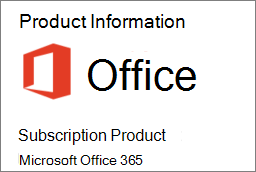

# <a name="determine-if-centralized-deployment-of-add-ins-works-for-your-organization"></a><span data-ttu-id="62d0e-103">Ta reda på om centraliserad distribution av tillägg fungerar för din organisation</span><span class="sxs-lookup"><span data-stu-id="62d0e-103">Determine if Centralized Deployment of add-ins works for your organization</span></span>

<span data-ttu-id="62d0e-104">Centraliserad distribution är det rekommenderade och mest funktionsrika sättet för de flesta kunder att distribuera Office-tillägg till användare och grupper inom organisationen.</span><span class="sxs-lookup"><span data-stu-id="62d0e-104">Centralized Deployment is the recommended and most feature-rich way for most customers to deploy Office add-ins to users and groups within your organization.</span></span> <span data-ttu-id="62d0e-105">Om du är administratör kan du använda den här vägledningen för att avgöra om din klient och dina användare uppfyller kraven så att du kan använda centraliserad distribution.</span><span class="sxs-lookup"><span data-stu-id="62d0e-105">If you're an admin, use this guidance to determine if your tenant and users meet the requirements so that you can use Centralized Deployment.</span></span>
<span data-ttu-id="62d0e-106">Centraliserad distribution stöder Windows-, Mac-, iOS-, Android- och Online Office-appar.</span><span class="sxs-lookup"><span data-stu-id="62d0e-106">Centralized Deployment supports Windows, Mac, iOS, Android and Online Office apps.</span></span>
<span data-ttu-id="62d0e-107">Det kan ta upp till 12 timmar innan ett tillägg visas för klienten för alla användare.</span><span class="sxs-lookup"><span data-stu-id="62d0e-107">It can take up to 12 hours for an add-in to show up for client for all users.</span></span>
  
## <a name="requirements"></a><span data-ttu-id="62d0e-108">Krav</span><span class="sxs-lookup"><span data-stu-id="62d0e-108">Requirements</span></span>

<span data-ttu-id="62d0e-109">Centraliserad distribution av tillägg kräver att användarna använder Microsoft 365 Apps for Enterprise (och är inloggade på Office med sitt organisations-ID) och har Exchange Online- och aktiva Exchange Online-postlådor.</span><span class="sxs-lookup"><span data-stu-id="62d0e-109">Centralized deployment of add-ins requires that the users are using Microsoft 365 Apps for enterprise (and are signed into Office using their organizational ID), and have Exchange Online and active Exchange Online mailboxes.</span></span> <span data-ttu-id="62d0e-110">Din prenumerationskatalog måste antingen vara i eller federeras med Azure Active Directory.</span><span class="sxs-lookup"><span data-stu-id="62d0e-110">Your subscription directory must either be in, or federated to Azure Active Directory.</span></span>
<span data-ttu-id="62d0e-111">Du kan visa specifika krav för Office och Exchange nedan eller använda den [centraliserade kompatibilitetskontrollen för distribution](https://docs.microsoft.com/office365/admin/manage/centralized-deployment-of-add-ins?view=o365-worldwide#office-365-centralized-deployment-compatibility-checker).</span><span class="sxs-lookup"><span data-stu-id="62d0e-111">You can view specific requirements for Office and Exchange below, or use the [Centralized Deployment Compatibility Checker](https://docs.microsoft.com/office365/admin/manage/centralized-deployment-of-add-ins?view=o365-worldwide#office-365-centralized-deployment-compatibility-checker).</span></span>

<span data-ttu-id="62d0e-112">Centraliserad distribution stöder inte följande:</span><span class="sxs-lookup"><span data-stu-id="62d0e-112">Centralized Deployment doesn't support the following:</span></span>
  
- <span data-ttu-id="62d0e-113">Tillägg som är inriktade på Word, Excel eller PowerPoint i Office 2013</span><span class="sxs-lookup"><span data-stu-id="62d0e-113">Add-ins that target Word, Excel, or PowerPoint in Office 2013</span></span>
    
- <span data-ttu-id="62d0e-114">En lokal katalogtjänst</span><span class="sxs-lookup"><span data-stu-id="62d0e-114">An on-premises directory service</span></span>
    
- <span data-ttu-id="62d0e-115">Tilläggsdistribution till SharePoint</span><span class="sxs-lookup"><span data-stu-id="62d0e-115">Add-in deployment to SharePoint</span></span>  

- <span data-ttu-id="62d0e-116">Team-appar</span><span class="sxs-lookup"><span data-stu-id="62d0e-116">Teams apps</span></span>
   
- <span data-ttu-id="62d0e-117">Distribution av COM- (Component Object Model) och VSTO-tilläggen (Visual Studio Tools for Office)</span><span class="sxs-lookup"><span data-stu-id="62d0e-117">Deployment of Component Object Model (COM) or Visual Studio Tools for Office (VSTO) add-ins</span></span>
    
- <span data-ttu-id="62d0e-118">Distributioner av Microsoft 365 som inte inkluderar Exchange, till exempel Microsoft 365 Apps for business</span><span class="sxs-lookup"><span data-stu-id="62d0e-118">Deployments of Microsoft 365 that do not include Exchange such as Microsoft 365 Apps for business</span></span>

### <a name="office-requirements"></a><span data-ttu-id="62d0e-119">Office-krav</span><span class="sxs-lookup"><span data-stu-id="62d0e-119">Office Requirements</span></span>

- <span data-ttu-id="62d0e-120">För Word-, Excel- och PowerPoint-tillägg måste användarna använda något av följande:</span><span class="sxs-lookup"><span data-stu-id="62d0e-120">For Word, Excel, and PowerPoint add-ins, your users must be using one of the following:</span></span>
  - <span data-ttu-id="62d0e-121">På en Windows-enhet, version 1704 eller senare av Microsoft 365 Apps för företag.</span><span class="sxs-lookup"><span data-stu-id="62d0e-121">On a Windows device, Version 1704 or later of Microsoft 365 Apps for enterprise.</span></span>
  - <span data-ttu-id="62d0e-122">På en Mac, version 15.34 eller senare.</span><span class="sxs-lookup"><span data-stu-id="62d0e-122">On a Mac, Version 15.34 or later.</span></span>

- <span data-ttu-id="62d0e-123">För Outlook måste användarna använda något av följande:</span><span class="sxs-lookup"><span data-stu-id="62d0e-123">For Outlook, your users must be using one of the following:</span></span> 
  - <span data-ttu-id="62d0e-124">Version 1701 eller senare av Microsoft 365 Apps för företag.</span><span class="sxs-lookup"><span data-stu-id="62d0e-124">Version 1701 or later of Microsoft 365 Apps for enterprise.</span></span>
  - <span data-ttu-id="62d0e-125">Version 1808 eller senare av Office Professional Plus 2019 eller Office Standard 2019.</span><span class="sxs-lookup"><span data-stu-id="62d0e-125">Version 1808 or later of Office Professional Plus 2019 or Office Standard 2019.</span></span>
  - <span data-ttu-id="62d0e-126">Version 16.0.4494.1000 eller senare av Office Professional Plus 2016 (MSI) eller Office Standard 2016 (MSI)\*</span><span class="sxs-lookup"><span data-stu-id="62d0e-126">Version 16.0.4494.1000 or later of Office Professional Plus 2016 (MSI) or Office Standard 2016 (MSI)\*</span></span>
  - <span data-ttu-id="62d0e-127">Version 15.0.4937.1000 eller senare av Office Professional Plus 2013 (MSI) eller Office Standard 2013 (MSI)\*</span><span class="sxs-lookup"><span data-stu-id="62d0e-127">Version 15.0.4937.1000 or later of Office Professional Plus 2013 (MSI) or Office Standard 2013 (MSI)\*</span></span>
  - <span data-ttu-id="62d0e-128">Version 16.0.9318.1000 eller senare av Office 2016 för Mac</span><span class="sxs-lookup"><span data-stu-id="62d0e-128">Version 16.0.9318.1000 or later of Office 2016 for Mac</span></span> 
- <span data-ttu-id="62d0e-129">Version 2.75.0 eller senare av Outlook Mobile för iOS</span><span class="sxs-lookup"><span data-stu-id="62d0e-129">Version 2.75.0 or later of Outlook mobile for iOS</span></span> 
- <span data-ttu-id="62d0e-130">Version 2.2.145 eller senare av Outlook Mobile för Android</span><span class="sxs-lookup"><span data-stu-id="62d0e-130">Version 2.2.145 or later of Outlook mobile for Android</span></span> 
    
    <span data-ttu-id="62d0e-131">\*MSI-versioner av Outlook visar administratörsinstallerade tillägg i lämpligt menyfliksområdet i Outlook, inte avsnittet "Mina tillägg".</span><span class="sxs-lookup"><span data-stu-id="62d0e-131">\*MSI versions of Outlook show admin-installed add-ins in the appropriate Outlook ribbon, not the "My add-ins" section.</span></span>
    

#### <a name="find-out-if-microsoft-365-apps-for-enterprise-is-installed"></a><span data-ttu-id="62d0e-132">Ta reda på om Microsoft 365 Apps for Enterprise är installerat</span><span class="sxs-lookup"><span data-stu-id="62d0e-132">Find out if Microsoft 365 Apps for enterprise is installed</span></span>

<span data-ttu-id="62d0e-133">Om du vill använda Microsoft 365 Apps för företag måste en användare ha ett Microsoft 365-konto och ha tilldelats en licens.</span><span class="sxs-lookup"><span data-stu-id="62d0e-133">To use Microsoft 365 Apps for enterprise, a user must have an Microsoft 365 account and must have been assigned a license.</span></span> <span data-ttu-id="62d0e-134">Mer information finns i [Översikt över Microsoft 365 Apps för företag](https://go.microsoft.com/fwlink/p/?linkid=846328).</span><span class="sxs-lookup"><span data-stu-id="62d0e-134">For more information, see [Overview of Microsoft 365 Apps for enterprise](https://go.microsoft.com/fwlink/p/?linkid=846328).</span></span>

<span data-ttu-id="62d0e-135">Det enklaste sättet att upptäcka om en användare har Microsoft 365 ProPlus installerat och har använt det nyligen är att använda Microsoft Office Aktiveringsrapporten, som finns i Microsoft 365 admin center.</span><span class="sxs-lookup"><span data-stu-id="62d0e-135">The simplest way to detect if a user has Microsoft 365 ProPlus installed and has been using it recently is to use the Microsoft Office Activations report, which is available in the Microsoft 365 admin center.</span></span> <span data-ttu-id="62d0e-136">Rapporten innehåller en lista över alla användare som har aktiverat Microsoft 365 Apps för företag under de senaste 7 dagarna, 30 dagarna, 90 dagarna eller 180 dagarna.</span><span class="sxs-lookup"><span data-stu-id="62d0e-136">The report provides a list of all users who have activated Microsoft 365 Apps for enterprise within the last 7 days, 30 days, 90 days, or 180 days.</span></span> <span data-ttu-id="62d0e-137">De kolumner i rapporten som är viktiga för centraliserad distribution är de för datoraktiveringar för Windows och Mac.</span><span class="sxs-lookup"><span data-stu-id="62d0e-137">For centralized deployment purposes, the desktop activations for Windows or Mac are the important columns in the report.</span></span> <span data-ttu-id="62d0e-138">Du kan exportera rapporten till Excel.</span><span class="sxs-lookup"><span data-stu-id="62d0e-138">You can export the report to Excel.</span></span> <span data-ttu-id="62d0e-139">Mer information om rapporten finns [i Microsoft 365 Reports i Administrationscenter – Microsoft Office-aktiveringar](../activity-reports/microsoft-office-activations.md).</span><span class="sxs-lookup"><span data-stu-id="62d0e-139">For more information about the report, see [Microsoft 365 Reports in the Admin Center - Microsoft Office activations](../activity-reports/microsoft-office-activations.md).</span></span>
  
<span data-ttu-id="62d0e-140">Om du inte vill använda rapporten Aktiveringar kan du be en användare att öppna ett Office-program som Word på datorn och sedan välja \> **Arkivkonto**. **File**</span><span class="sxs-lookup"><span data-stu-id="62d0e-140">If you don't want to use the Activations report, you can ask a user to open an Office application such as Word on their machine, and then choose **File** \> **Account**.</span></span> <span data-ttu-id="62d0e-141">Under **Produktinformation**bör du se **Prenumerationsprodukt** och **Microsoft Microsoft 365 Apps för företag**, vilket visas i följande bild.</span><span class="sxs-lookup"><span data-stu-id="62d0e-141">Under **Product Information**, you should see **Subscription Product** and **Microsoft Microsoft 365 Apps for enterprise**, as shown in the following image.</span></span>


  
<span data-ttu-id="62d0e-143">Mer information om Microsoft 365 Apps for enterprise finns i [Felsökningstips för Microsoft 365 Apps for enterprise](https://go.microsoft.com/fwlink/p/?linkid=846339).</span><span class="sxs-lookup"><span data-stu-id="62d0e-143">For help with Microsoft 365 Apps for enterprise, see [Troubleshooting tips for Microsoft 365 Apps for enterprise](https://go.microsoft.com/fwlink/p/?linkid=846339).</span></span>


### <a name="exchange-online-requirements"></a><span data-ttu-id="62d0e-144">Exchange Online-krav</span><span class="sxs-lookup"><span data-stu-id="62d0e-144">Exchange Online requirements</span></span>

<span data-ttu-id="62d0e-145">Microsoft Exchange lagrar tilläggsmanifesten i organisationens klientorganisation.</span><span class="sxs-lookup"><span data-stu-id="62d0e-145">Microsoft Exchange stores the add-in manifests within your organization's tenant.</span></span> <span data-ttu-id="62d0e-146">Administratören som distribuerar tillägg och de användare som tar emot dessa tillägg måste finnas på en version av Exchange Online som stöder OAuth-autentisering.</span><span class="sxs-lookup"><span data-stu-id="62d0e-146">The admin deploying add-ins and the users receiving those add-ins must be on a version of Exchange Online that supports OAuth authentication.</span></span>
  
<span data-ttu-id="62d0e-p107">Fråga organisationens Exchange-administratör om vilken konfiguration som används. OAuth-anslutning per användare kan verifieras med hjälp av PowerShell-cmdleten [Test-OAuthConnectivity](https://go.microsoft.com/fwlink/p/?linkid=846351).</span><span class="sxs-lookup"><span data-stu-id="62d0e-p107">Check with your organization's Exchange admin to find out which configuration is in use. OAuth connectivity per user can be verified by using the [Test-OAuthConnectivity](https://go.microsoft.com/fwlink/p/?linkid=846351) PowerShell cmdlet.</span></span> 


### <a name="centralized-deployment-compatibility-checker"></a><span data-ttu-id="62d0e-149">Centraliserad kompatibilitetskontroll för distribution</span><span class="sxs-lookup"><span data-stu-id="62d0e-149">Centralized Deployment Compatibility Checker</span></span>

<span data-ttu-id="62d0e-150">Med hjälp av den centraliserade kompatibilitetskontrollen för distribution kan du kontrollera om användarna på klienten är konfigurerade för att använda centraliserad distribution för Word, Excel och PowerPoint.</span><span class="sxs-lookup"><span data-stu-id="62d0e-150">Using the Centralized Deployment Compatibility Checker, you can verify whether the users on your tenant are set up to use Centralized Deployment for Word, Excel and PowerPoint.</span></span> <span data-ttu-id="62d0e-151">Kompatibilitetskontrollen krävs inte för Outlook-stöd.</span><span class="sxs-lookup"><span data-stu-id="62d0e-151">The Compatibility Checker is not required for Outlook support.</span></span> <span data-ttu-id="62d0e-152">Ladda ned kompatibilitetskontrollen [här](https://aka.ms/officeaddindeploymentorgcompatibilitychecker).</span><span class="sxs-lookup"><span data-stu-id="62d0e-152">Download the compatibility checker [here](https://aka.ms/officeaddindeploymentorgcompatibilitychecker).</span></span>
  
#### <a name="run-the-compatibility-checker"></a><span data-ttu-id="62d0e-153">Kör kompatibilitetskontrollen</span><span class="sxs-lookup"><span data-stu-id="62d0e-153">Run the compatibility checker</span></span>
  
1. <span data-ttu-id="62d0e-154">Öppna ett PowerShell.exe-fönster med förhöjd rättighet.</span><span class="sxs-lookup"><span data-stu-id="62d0e-154">Start an elevated PowerShell.exe window.</span></span>
    
2. <span data-ttu-id="62d0e-155">Kör följande kommando:</span><span class="sxs-lookup"><span data-stu-id="62d0e-155">Run the following command:</span></span>

```powershell
Import-Module O365CompatibilityChecker
```
    
3. <span data-ttu-id="62d0e-156">Kör kommandot **Anropa-CompatabilityCheck:**</span><span class="sxs-lookup"><span data-stu-id="62d0e-156">Run the **Invoke-CompatabilityCheck** command:</span></span>

```powershell
Invoke-CompatibilityCheck
```
   <span data-ttu-id="62d0e-157">som uppmanar dig för *_TenantDomain_* (till exempel *TailspinToysIncorporated.onmicrosoft.</span> com*) och *_TenantAdmin-autentiseringsuppgifter_* (använd dina globala administratörsautentiseringsuppgifter) och begär sedan samtycke.</span><span class="sxs-lookup"><span data-stu-id="62d0e-157">which prompts you for  *_TenantDomain_* (for example, *TailspinToysIncorporated.onmicrosoft.</span>com*) and  *_TenantAdmin_* credentials (use your global admin credentials), and then requests consent.</span></span>
    
> [!NOTE]
> <span data-ttu-id="62d0e-158">Beroende på antalet användare i klientorganisationen kan det ta några minuter eller några timmar att slutföra åtgärden.</span><span class="sxs-lookup"><span data-stu-id="62d0e-158">Depending on the number of users in your tenant, the checker could complete in minutes or hours.</span></span> 
  
<span data-ttu-id="62d0e-159">När verktyget körts klart har en utdatafil i kommaavgränsat format (.csv) genererats.</span><span class="sxs-lookup"><span data-stu-id="62d0e-159">When the tool finishes running, it produces an output file in comma-separated (.csv) format.</span></span> <span data-ttu-id="62d0e-160">Filen sparas i **C:\windows\system32** som standard.</span><span class="sxs-lookup"><span data-stu-id="62d0e-160">The file is saved to **C:\windows\system32** by default.</span></span> <span data-ttu-id="62d0e-161">Utdatafilen innehåller följande information:</span><span class="sxs-lookup"><span data-stu-id="62d0e-161">The output file contains the following information:</span></span>
  
- <span data-ttu-id="62d0e-162">Användarnamn</span><span class="sxs-lookup"><span data-stu-id="62d0e-162">User Name</span></span>
    
- <span data-ttu-id="62d0e-163">Användar-ID (användarens e-postadress)</span><span class="sxs-lookup"><span data-stu-id="62d0e-163">User ID (User's email address)</span></span>
    
- <span data-ttu-id="62d0e-164">Centraliserad distribution är klar - om de återstående objekten har värdet sant</span><span class="sxs-lookup"><span data-stu-id="62d0e-164">Centralized Deployment ready - If the remaining items are true</span></span>
    
- <span data-ttu-id="62d0e-165">Office-plan - Planen för Office de är licensierade för</span><span class="sxs-lookup"><span data-stu-id="62d0e-165">Office plan - The plan of Office they are licensed for</span></span>
    
- <span data-ttu-id="62d0e-166">Office aktiverat - om de har aktiverat Office</span><span class="sxs-lookup"><span data-stu-id="62d0e-166">Office Activated - If they have activated Office</span></span>
    
- <span data-ttu-id="62d0e-167">Postlåda som stöds - om de finns på en OAuth-aktiverad postlåda</span><span class="sxs-lookup"><span data-stu-id="62d0e-167">Supported Mailbox - If they are on an OAuth-enabled mailbox</span></span>


  
## <a name="user-and-group-assignments"></a><span data-ttu-id="62d0e-168">Användar- och grupptilldelningar</span><span class="sxs-lookup"><span data-stu-id="62d0e-168">User and group assignments</span></span>

<span data-ttu-id="62d0e-169">Funktionen Centraliserad distribution stöder för närvarande de flesta grupper som stöds av Azure Active Directory, inklusive Microsoft 365-grupper, distributionslistor och säkerhetsgrupper.</span><span class="sxs-lookup"><span data-stu-id="62d0e-169">The Centralized Deployment feature currently supports the majority of groups supported by Azure Active Directory, including Microsoft 365 groups, distribution lists, and security groups.</span></span>
  
> [!NOTE]
> <span data-ttu-id="62d0e-170">Säkerhetsgrupper utan e-postaktivering stöds inte för närvarande.</span><span class="sxs-lookup"><span data-stu-id="62d0e-170">Non-mail enabled security groups are not currently supported.</span></span> 
  
<span data-ttu-id="62d0e-171">Centraliserad distribution stöder tilldelningar till enskilda användare, grupper och alla i klienten.</span><span class="sxs-lookup"><span data-stu-id="62d0e-171">Centralized Deployment supports assignments to individual users, groups, and everyone in the tenant.</span></span> <span data-ttu-id="62d0e-172">Centraliserad distribution har stöd för användare i grupper på översta nivå och grupper utan överordnade grupper, men inte för användare i kapslade grupper och grupper som har överordnade grupper.</span><span class="sxs-lookup"><span data-stu-id="62d0e-172">Centralized Deployment supports users in top-level groups or groups without parent groups, but not users in nested groups or groups that have parent groups.</span></span>
   
<span data-ttu-id="62d0e-p111">Ta en titt på följande exempel där Sandra, Sheila och gruppen Sales Department har tilldelats till ett tillägg. Eftersom West Coast Sales Department är en kapslad grupp, tilldelas Jens och Erik inte till ett tillägg.</span><span class="sxs-lookup"><span data-stu-id="62d0e-p111">Take a look at the following example where Sandra, Sheila, and the Sales Department group are assigned to an add-in. Because the West Coast Sales Department is a nested group, Bert and Fred aren't assigned to an add-in.</span></span>
  


   
### <a name="find-out-if-a-group-contains-nested-groups"></a><span data-ttu-id="62d0e-176">Ta reda på om en grupp innehåller kapslade grupper</span><span class="sxs-lookup"><span data-stu-id="62d0e-176">Find out if a group contains nested groups</span></span>

<span data-ttu-id="62d0e-177">Det enklaste sättet att upptäcka om en grupp innehåller kapslade grupper är att visa gruppens kontaktkort i Outlook.</span><span class="sxs-lookup"><span data-stu-id="62d0e-177">The easiest way to detect if a group contains nested groups is to view the group contact card within Outlook.</span></span> <span data-ttu-id="62d0e-178">Om du anger gruppnamnet i fältet **Till** i ett e-postmeddelande och sedan väljer gruppnamnet när det lösers visas om det innehåller användare eller kapslade grupper.</span><span class="sxs-lookup"><span data-stu-id="62d0e-178">If you enter the group name within the **To** field of an email and then select the group name when it resolves, it will show you if it contains users or nested groups.</span></span> <span data-ttu-id="62d0e-179">I exemplet nedan visas inga användare och bara två undergrupper på fliken **Medlemmar** för Outlook-kontaktkortet för Test Group.</span><span class="sxs-lookup"><span data-stu-id="62d0e-179">In the example below, the **Members** tab of the Outlook contact card for the Test Group shows no users and only two sub groups.</span></span> 
  

  
<span data-ttu-id="62d0e-p113">Du kan göra motsatt fråga genom att matcha gruppen och ta reda på om den är medlem i en grupp. I exemplet nedan kan du se att Sub Group 1 är medlem i Test Group under fliken **medlemskap** för Outlook-kontaktkortet.</span><span class="sxs-lookup"><span data-stu-id="62d0e-p113">You can do the opposite query by resolving the group to see if it's a member of any group. In the example below, you can see under the **Membership** tab of the Outlook contact card that Sub Group 1 is a member of the Test Group.</span></span> 
  

  
<span data-ttu-id="62d0e-p114">Du kan också använda Azure Active Directory Graph API till att köra frågor för att hitta listan med grupper inom en grupp. Mer information finns i [Åtgärder för grupper | Referens för Graph API](https://go.microsoft.com/fwlink/p/?linkid=846342).</span><span class="sxs-lookup"><span data-stu-id="62d0e-p114">Alternately, you can use the Azure Active Directory Graph API to run queries to find the list of groups within a group. For more information, see [Operations on groups | Graph API reference](https://go.microsoft.com/fwlink/p/?linkid=846342).</span></span>
  
### <a name="contacting-microsoft-for-support"></a><span data-ttu-id="62d0e-186">Kontakta Microsoft om du behöver support</span><span class="sxs-lookup"><span data-stu-id="62d0e-186">Contacting Microsoft for support</span></span>

<span data-ttu-id="62d0e-187">Om du eller dina användare stöter på problem med att läsa in tillägget när du använder Office-appar för webben (Word, Excel osv.), som har distribuerats centralt, kan du behöva kontakta Microsoft-supporten ([läs mer](../contact-support-for-business-products.md)).</span><span class="sxs-lookup"><span data-stu-id="62d0e-187">If you or your users encounter problems loading the add-in while using Office apps for the web (Word, Excel, etc.), which were centrally deployed, you may need to contact Microsoft support ([learn how](../contact-support-for-business-products.md)).</span></span> <span data-ttu-id="62d0e-188">Ange följande information om din Microsoft 365-miljö i supportbiljetten.</span><span class="sxs-lookup"><span data-stu-id="62d0e-188">Provide the following information about your Microsoft 365 environment in the support ticket.</span></span>
  
|<span data-ttu-id="62d0e-189">**Plattform**</span><span class="sxs-lookup"><span data-stu-id="62d0e-189">**Platform**</span></span>|<span data-ttu-id="62d0e-190">**Felsökningsinformation**</span><span class="sxs-lookup"><span data-stu-id="62d0e-190">**Debug information**</span></span>|
|:-----|:-----|
|<span data-ttu-id="62d0e-191">Office</span><span class="sxs-lookup"><span data-stu-id="62d0e-191">Office</span></span>  <br/> | <span data-ttu-id="62d0e-192">Charles-/Fiddler-loggar</span><span class="sxs-lookup"><span data-stu-id="62d0e-192">Charles/Fiddler logs</span></span>  <br/>  <span data-ttu-id="62d0e-193">Klientorganisationens id ( [så här gör du](https://support.office.com/article/6891b561-a52d-4ade-9f39-b492285e2c9b.aspx))</span><span class="sxs-lookup"><span data-stu-id="62d0e-193">Tenant ID ( [learn how](https://support.office.com/article/6891b561-a52d-4ade-9f39-b492285e2c9b.aspx))</span></span>  <br/>  <span data-ttu-id="62d0e-194">CorrelationID.</span><span class="sxs-lookup"><span data-stu-id="62d0e-194">CorrelationID.</span></span> <span data-ttu-id="62d0e-195">Visa källan till en av kontorssidorna och leta efter värdet för korrelations-ID och skicka det till stöd:</span><span class="sxs-lookup"><span data-stu-id="62d0e-195">View the source of one of the office pages and look for the Correlation ID value and send it to support:</span></span>  <br/>`<input name=" **wdCorrelationId**" type="hidden" value=" **{BC17079E-505F-3000-C177-26A8E27EB623}**">`  <br/>  `<input name="user_id" type="hidden" value="1003bffd96933623"></form>`  <br/> |
|<span data-ttu-id="62d0e-196">RTF-klienter (Windows, Mac)</span><span class="sxs-lookup"><span data-stu-id="62d0e-196">Rich clients (Windows, Mac)</span></span>  <br/> | <span data-ttu-id="62d0e-197">Charles-/Fiddler-loggar</span><span class="sxs-lookup"><span data-stu-id="62d0e-197">Charles/Fiddler logs</span></span>  <br/>  <span data-ttu-id="62d0e-198">Bygg nummer på klientappen (helst som en skärmdump från **Arkiv/Konto)**</span><span class="sxs-lookup"><span data-stu-id="62d0e-198">Build numbers of the client app (preferably as a screenshot from **File/Account**)</span></span>  <br/> |
   

