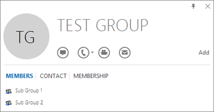

# <a name="determine-if-centralized-deployment-of-add-ins-works-for-your-organization"></a>Ta reda på om centraliserad distribution av tillägg fungerar för din organisation

Centraliserad distribution är den rekommenderade och mest funktionsrika metoden för de flesta kunder att distribuera Office-tillägg till användare och grupper inom Office 365-organisationen. Om du är administratör kan du använda den här vägledningen för att avgöra om din klient och dina användare uppfyller kraven så att du kan använda centraliserad distribution.
Centraliserad distribution stöder Windows-, Mac-, iOS-, Android- och Online Office-appar.
Det kan ta upp till 24 timmar för ett tillägg att visas för klienten och alla användare.
  
## <a name="requirements"></a>Krav

Centraliserad distribution av tillägg kräver att användarna använder Office 365 ProPlus (och är inloggade på Office med sitt organisations-ID) och har Exchange Online- och active Exchange Online-postlådor. Din subscription'd-katalog måste antingen vara i eller federeras med Azure Active Directory.
Du kan visa specifika krav för Office och Exchange nedan eller använda [kompatibilitetskontrollen för centraliserad distribution i Office 365](https://docs.microsoft.com/office365/admin/manage/centralized-deployment-of-add-ins?view=o365-worldwide#office-365-centralized-deployment-compatibility-checker).

Centraliserad distribution stöder inte följande:
  
- Tillägg som är inriktade på Word, Excel eller PowerPoint i Office 2013
    
- En lokal katalogtjänst
    
- Tilläggsdistribution till SharePoint  

- Team-appar
   
- Distribution av COM- (Component Object Model) och VSTO-tilläggen (Visual Studio Tools for Office)
    
- Distributioner av Office 365 som inte inkluderar Exchange, till exempel Office 365 Business

### <a name="office-requirements"></a>Office-krav

- För Word-, Excel- och PowerPoint-tillägg måste användarna använda något av följande:
  - På en Windows-enhet, version 1704 eller senare av Office 365 ProPlus.
  - På en Mac, version 15.34 eller senare.

- För Outlook måste användarna använda något av följande: 
  - Version 1701 eller senare av Office 365 ProPlus.
  - Version 1808 eller senare av Office Professional Plus 2019 eller Office Standard 2019.
  - Version 16.0.4494.1000 eller senare av Office Professional Plus 2016 (MSI) eller Office Standard 2016 (MSI)\*
  - Version 15.0.4937.1000 eller senare av Office Professional Plus 2013 (MSI) eller Office Standard 2013 (MSI)\*
  - Version 16.0.9318.1000 eller senare av Office 2016 för Mac 
- Version 2.75.0 eller senare av Outlook Mobile för iOS 
- Version 2.2.145 eller senare av Outlook Mobile för Android 
    
    *MSI-versioner av Outlook visar administratörsinstallerade tillägg i lämpligt menyfliksområdet i Outlook, inte avsnittet "Mina tillägg".
    

#### <a name="find-out-if-office-365-proplus-is-installed"></a>Ta reda på om Office 365 ProPlus är installerat

Om du vill använda Office 365 ProPlus måste en användare ha ett Office 365-konto och ha tilldelats en licens. Mer information finns i [Översikt över Office 365 ProPlus](https://go.microsoft.com/fwlink/p/?linkid=846328).

Det enklaste sättet att identifiera om en användare har Office 365 ProPlus installerat och har använt det nyligen är att använda Microsoft Office Aktiveringsrapporten, som finns i Microsoft 365 admin center. Rapporten innehåller en lista med alla användare som har aktiverat Office 365 ProPlus inom de senaste 7 dagarna, 30 dagarna, 90 dagarna eller 180 dagarna. De kolumner i rapporten som är viktiga för centraliserad distribution är de för datoraktiveringar för Windows och Mac. Du kan exportera rapporten till Excel. Mer information om rapporten finns i [Office 365-rapporter i administrationscenter - Microsoft Office-aktiveringar](../activity-reports/microsoft-office-activations.md).
  
Om du inte vill använda rapporten Aktiveringar kan du be en användare att öppna ett Office-program som Word på datorn och sedan välja \> **Arkivkonto**. **File** Under **Produktinformation** bör du se **Prenumerationsprodukt** och **Microsoft Office 365 ProPlus** som på bilden nedan.


  
Om du behöver hjälp med Office 365 ProPlus kan du läsa [Felsökningstips för Office 365 ProPlus](https://go.microsoft.com/fwlink/p/?linkid=846339).


### <a name="exchange-online-requirements"></a>Exchange Online-krav

Microsoft Exchange lagrar tilläggsmanifesten i organisationens klientorganisation. Administratören som distribuerar tillägg och de användare som tar emot dessa tillägg måste finnas på en version av Exchange Online som stöder OAuth-autentisering.
  
Fråga organisationens Exchange-administratör om vilken konfiguration som används. OAuth-anslutning per användare kan verifieras med hjälp av PowerShell-cmdleten [Test-OAuthConnectivity](https://go.microsoft.com/fwlink/p/?linkid=846351). 


### <a name="office-365-centralized-deployment-compatibility-checker"></a>Kompatibilitetskontroll för centraliserad distribution av Office 365

Med hjälp av kompatibilitetskontrollen för centraliserad distribution av Office 365 kan du kontrollera om användarna i klientorganisationen har konfigurerats för användning av centraliserad distribution för Word, Excel och PowerPoint. Kompatibilitetskontrollen krävs inte för Outlook-stöd. Ladda ned kompatibilitetskontrollen [här](https://aka.ms/officeaddindeploymentorgcompatibilitychecker).
  
#### <a name="run-the-compatibility-checker"></a>Kör kompatibilitetskontrollen
  
1. Öppna ett PowerShell.exe-fönster med förhöjd rättighet.
    
2. Kör följande kommando:

```powershell
Import-Module O365CompatibilityChecker
```
    
3. Kör kommandot **Anropa-CompatabilityCheck:**

```powershell
Invoke-CompatibilityCheck
```
   som uppmanar dig för *_TenantDomain_* (till exempel *TailspinToysIncorporated.onmicrosoft.</span> com*) och *_TenantAdmin-autentiseringsuppgifter_* (använd dina globala administratörsautentiseringsuppgifter) och begär sedan samtycke.
    
> [!NOTE]
> Beroende på antalet användare i klientorganisationen kan det ta några minuter eller några timmar att slutföra åtgärden. 
  
När verktyget körts klart har en utdatafil i kommaavgränsat format (.csv) genererats. Filen sparas i **C:\windows\system32** som standard. Utdatafilen innehåller följande information:
  
- Användarnamn
    
- Användar-ID (användarens e-postadress)
    
- Centraliserad distribution är klar - om de återstående objekten har värdet sant
    
- Office-plan - Planen för Office de är licensierade för
    
- Office aktiverat - om de har aktiverat Office
    
- Postlåda som stöds - om de finns på en OAuth-aktiverad postlåda


  
## <a name="user-and-group-assignments"></a>Användar- och grupptilldelningar

Funktionen för centraliserad distribution har för närvarande stöd för de flesta grupper som stöds av Azure Active Directory, inklusive grupper, distributionslistor och säkerhetsgrupper för Office 365.
  
> [!NOTE]
> Säkerhetsgrupper utan e-postaktivering stöds inte för närvarande. 
  
Centraliserad distribution stöder tilldelningar till enskilda användare, grupper och alla i klienten. Centraliserad distribution har stöd för användare i grupper på översta nivå och grupper utan överordnade grupper, men inte för användare i kapslade grupper och grupper som har överordnade grupper.
   
Ta en titt på följande exempel där Sandra, Sheila och gruppen Sales Department har tilldelats till ett tillägg. Eftersom West Coast Sales Department är en kapslad grupp, tilldelas Jens och Erik inte till ett tillägg.
  


   
### <a name="find-out-if-a-group-contains-nested-groups"></a>Ta reda på om en grupp innehåller kapslade grupper

Det enklaste sättet att upptäcka om en grupp innehåller kapslade grupper är att visa gruppens kontaktkort i Outlook. Om du anger gruppnamnet i fältet **Till** i ett e-postmeddelande och sedan väljer gruppnamnet när det lösers visas om det innehåller användare eller kapslade grupper. I exemplet nedan visas inga användare och bara två undergrupper på fliken **Medlemmar** för Outlook-kontaktkortet för Test Group. 
  

  
Du kan göra motsatt fråga genom att matcha gruppen och ta reda på om den är medlem i en grupp. I exemplet nedan kan du se att Sub Group 1 är medlem i Test Group under fliken **medlemskap** för Outlook-kontaktkortet. 
  

  
Du kan också använda Azure Active Directory Graph API till att köra frågor för att hitta listan med grupper inom en grupp. Mer information finns i [Åtgärder för grupper | Referens för Graph API](https://go.microsoft.com/fwlink/p/?linkid=846342).
  
### <a name="contacting-microsoft-for-support"></a>Kontakta Microsoft om du behöver support

Om du eller dina användare stöter på problem med att läsa in tillägget när du använder Office-appar för webben (Word, Excel osv.), som har distribuerats centralt, kan du behöva kontakta Microsoft-supporten ([läs mer](../contact-support-for-business-products.md)). Ange följande information om din Office 365-miljö i supportärendet.
  
|**Plattform**|**Felsökningsinformation**|
|:-----|:-----|
|Office  <br/> | Charles-/Fiddler-loggar  <br/>  Klientorganisationens id ( [så här gör du](https://support.office.com/article/6891b561-a52d-4ade-9f39-b492285e2c9b.aspx))  <br/>  CorrelationID. Visa källan till en av kontorssidorna och leta efter värdet för korrelations-ID och skicka det till stöd:  <br/>`<input name=" **wdCorrelationId**" type="hidden" value=" **{BC17079E-505F-3000-C177-26A8E27EB623}**">`  <br/>  `<input name="user_id" type="hidden" value="1003bffd96933623"></form>`  <br/> |
|RTF-klienter (Windows, Mac)  <br/> | Charles-/Fiddler-loggar  <br/>  Bygg nummer på klientappen (helst som en skärmdump från **Arkiv/Konto)**  <br/> |
   

